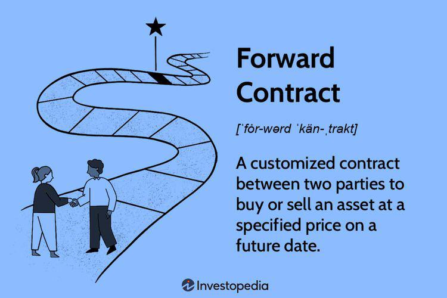

Financial risk management is a fundamental aspect of contemporary investment strategies, especially when dealing with derivatives such as forward contracts. In financial markets, forward contracts are pivotal tools that allow investors and traders to mitigate risks associated with price volatility in various assets. By agreeing to buy or sell an asset at a predetermined price on a specified future date, parties can hedge against unfavorable price movements, thereby safeguarding their investments from potential losses.

This article examines the significance of forward contracts in the context of financial risk management, highlighting their crucial role in automated algorithmic trading. With the rise of technology in financial markets, algorithmic trading has become a dominant force, utilizing complex computer algorithms to execute trades with speed and precision far beyond human capability. Incorporating forward contracts within such automated systems enables traders to hedge against uncertainties, optimize trading strategies, and potentially increase returns.



Forward contracts offer flexibility and customization, distinguishing them from their standardized counterparts, futures contracts. However, they also introduce specific risks, such as counterparty and liquidity risks, which necessitate robust risk management practices. By understanding the mechanics of forward contracts, their strategic application in algorithmic trading, and the associated risks, traders and investors can refine their strategies to better navigate the complex dynamics of financial markets.

## Table of Contents

## Understanding Forward Contracts

A forward contract is a customizable financial tool used by two parties to reach an agreement to transact an asset at a predetermined price on a specified future date. Unlike standardized futures contracts, forward contracts offer significant flexibility, allowing parties to tailor the terms to their specific needs. This includes terms such as the delivery date, asset specification, quantity, and price. Such flexibility allows entities to create a contract that perfectly matches their hedging or investment requirements, making them valuable in volatile market conditions. 

In volatile markets, forward contracts are primarily utilized for hedging purposes. They offer a means to lock in prices and manage the risk posed by adverse price movements, thereby offering protection against fluctuations in asset prices. For example, a grain producer might enter into a forward contract to sell a specific quantity of grain at a set price, insulating itself from potential price drops at the time of harvest.

However, the bespoke nature of forward contracts also introduces higher default risk. Unlike futures contracts—which are standardized and traded on regulated exchanges with guarantees by clearinghouses—forward contracts are private agreements, typically negotiated over-the-counter (OTC). This lack of standardization means parties take on credit risk since there is no intermediary to ensure the fulfillment of the contract if one party defaults. Consequently, effective risk management becomes crucial when dealing with forward contracts to mitigate the inherent counterparty risk. 

Risk management strategies might involve assessing the creditworthiness of the counterparties, requiring collateral, or negotiating terms that include provisions for mitigating potential losses in case of default. Through careful management of these risks, forward contracts can be effectively utilized for precise asset management and strategic planning in uncertain financial environments.

## Algorithmic Trading and Forward Contracts

Algorithmic trading utilizes sophisticated computer algorithms to automate the execution of trades, thereby enhancing operational efficiency and minimizing human error. These algorithms are capable of processing vast amounts of market data at speeds unattainable by humans, swiftly identifying and exploiting market opportunities. The incorporation of forward contracts into [algorithmic trading](/wiki/algorithmic-trading) systems offers traders a robust mechanism to hedge against market uncertainties and optimize trading strategies.

Forward contracts, characterized by their tailored and non-standardized nature, provide traders with the flexibility to customize terms based on specific hedging needs. In algorithmic trading, these contracts play a pivotal role by enabling automated strategies to effectively manage risks associated with price [volatility](/wiki/volatility-trading-strategies). For instance, traders can program algorithms to lock in favorable prices for future transactions, thereby safeguarding against adverse market movements.

High-frequency trading ([HFT](/wiki/high-frequency-trading-strategies)) is a specialized form of algorithmic trading that benefits significantly from forward contracts. Algorithms in HFT can execute trades at extremely high speeds, capitalizing on minute price discrepancies for [arbitrage](/wiki/arbitrage) opportunities or speculative purposes. This rapid execution is crucial in markets where asset prices are subject to swift fluctuations, allowing traders to secure optimal entry and [exit](/wiki/exit-strategy) points efficiently.

Recent technological advancements, particularly in [machine learning](/wiki/machine-learning) and predictive analytics, have further elevated the strategic application of forward contracts in algorithmic trading. Machine learning algorithms can analyze historical and real-time data to identify patterns and predict future market conditions with greater accuracy. Consequently, traders can better anticipate movements, dynamically adjusting their forward contracts to align with predicted market trends.

Predictive analytics also enhances algorithmic trading by facilitating the development of more refined risk management frameworks. These frameworks assess the potential impacts of market changes on forward contract positions, enabling the dynamic adjustment of strategies to mitigate potential risks. By leveraging technological innovations, traders can harness the full potential of forward contracts, optimizing their trading strategies to maximize returns and minimize risks in increasingly complex market landscapes.

## Financial Risk Management in Algo Trading

Effective risk management is a crucial component of algorithmic trading, particularly when dealing with volatile financial markets and the use of forward contracts. By predicting and mitigating potential downsides associated with unforeseen market changes and technical failures, traders are better equipped to protect their investments. A dynamic risk management framework is fundamental to adapting swiftly to market shifts. Such frameworks often employ protective measures like stop-loss strategies, which automatically sell an asset when it reaches a particular price threshold, thereby limiting potential losses.

The intricacies of forward contracts necessitate a comprehensive understanding of various risks, including market, counterparty, and [liquidity](/wiki/liquidity-risk-premium) risks. Market risks involve potential losses due to adverse price movements. Counterparty risk refers to the possibility that one party involved in the contract may default on its obligations, while liquidity risk arises from the difficulty of executing trades without causing significant price changes.

Advanced software tools and real-time data feeds play a pivotal role in effectively managing these risks. Real-time analytics allow traders to monitor and analyze market conditions continuously, facilitating timely decision-making. For instance, machine learning algorithms can be utilized to predict price trends, enabling traders to adjust their strategies proactively. Here is a simple implementation in Python to illustrate a basic machine learning model for predicting price trends:

```python
from sklearn.model_selection import train_test_split
from sklearn.ensemble import RandomForestRegressor
import numpy as np

# Sample data containing price information
data = np.array([[10, 1], [9, 2], [8, 3], [11, 4], [13, 5]])
X = data[:, 1].reshape(-1, 1)  # Time as feature
y = data[:, 0]  # Price as target

# Train-test split
X_train, X_test, y_train, y_test = train_test_split(X, y, test_size=0.2)

# Define and train a Random Forest model
model = RandomForestRegressor(n_estimators=100)
model.fit(X_train, y_train)

# Predictions
predictions = model.predict(X_test)
print("Predicted prices:", predictions)
```

In the above code, the `RandomForestRegressor` model from the `sklearn` library is used to anticipate future price movements based on historical data trends. This predictive capability is vital for making informed trading decisions and adjusting risk management strategies promptly.

Robust risk management in algorithmic trading is not just about anticipating potential losses, but also about employing cutting-edge technologies to mitigate them. Advanced analytical tools help capture nuances in market behavior, providing insights that can refine trading algorithms. Additionally, continual monitoring and adjustment of trading strategies are essential to maintaining resilience in the face of volatility, ensuring the overall robustness of trading operations.

## Example of Forward Contracts in Algorithmic Trading

In the world of financial markets, traders frequently employ algorithmic trading strategies to manage forward contracts, particularly in the commodities market. This strategic approach is characterized by the use of sophisticated algorithms to automate the execution of high-frequency trades. By doing so, traders can lock in prices for future deliveries and effectively hedge against potential price declines, thereby reducing exposure to unfavorable market shifts.

Utilizing advanced predictive models forms the core of these algorithmic trading systems. These models are essential for forecasting market movements, allowing traders to optimize entry and exit points. By accurately predicting future price trends, the risk of adverse market conditions can be minimized. For instance, a trader might develop a machine learning model trained on historical commodity prices, market indicators, and economic news data to predict future price movements. This model could be implemented in Python as follows:

```python
import pandas as pd
from sklearn.model_selection import train_test_split
from sklearn.ensemble import RandomForestRegressor

# Load historical commodity data
data = pd.read_csv('commodity_prices.csv')

# Prepare features and target variable
X = data[['market_indicators', 'economic_news']]
y = data['future_price']

# Split data into training and testing sets
X_train, X_test, y_train, y_test = train_test_split(X, y, test_size=0.2, random_state=42)

# Train a predictive model
model = RandomForestRegressor(n_estimators=100, random_state=42)
model.fit(X_train, y_train)

# Predict future prices
predictions = model.predict(X_test)
```

Furthermore, dynamic risk assessment and continuous monitoring play crucial roles in enhancing trading strategies. These elements ensure that traders can make real-time adjustments to their strategies, thus increasing resilience against market volatility. The ability to rapidly respond to changing market conditions is vital for maintaining a competitive edge in fast-paced market environments.

In practice, traders might use a continuous monitoring system to track their portfolio's performance and the real-time market data. Should a significant price movement or market event occur, algorithms can automatically adjust the trading strategy—whether by altering position sizes, adjusting hedge ratios, or closing positions to mitigate risk. This adaptive approach ensures that traders can effectively navigate periods of heightened volatility while capitalizing on profitable opportunities.

By integrating forward contracts within algorithmic trading frameworks, traders can achieve a high level of precision and customization. This allows them to not only optimize returns but also to safeguard their investments against the uncertainties inherent in financial markets.

## Conclusion

Forward contracts, when integrated into algorithmic trading, offer traders and investors advantages such as flexibility, customization, and precision in executing trades. These contracts allow for the tailoring of terms to meet specific strategies and objectives, providing a level of control not afforded by standardized instruments. The adaptability of forward contracts means they can be used to hedge against market volatility or to speculate on future price movements, offering a strategic edge in dynamic trading environments.

However, the use of forward contracts within algorithmic trading frameworks also brings the necessity for robust risk management strategies. The inherent risks associated with forward contracts, including counterparty risk and market risk, require careful monitoring and mitigation. In addition, algorithmic trading introduces technological risks such as system failures, latency issues, and algorithmic errors, which can compound financial risks significantly. A successful strategy must integrate comprehensive risk assessments and real-time monitoring to safeguard investments against potential adverse events.

Traders implementing algorithmic strategies with forward contracts must remain vigilant and proactive in managing an array of risks. Technological issues, such as software malfunctions and connectivity problems, need regular oversight and contingency planning. Market risks, including sudden price changes and liquidity constraints, require dynamic risk evaluation to ensure effective responses. Operational risks, encompassing execution errors and compliance breaches, necessitate rigorous checks and balances within trading systems.

By continuously evaluating and adapting their strategies, traders can effectively leverage the potential of forward contracts to optimize returns. Strategic risk adjustments and the application of predictive models can enhance trading precision and efficiency, offering resilience against market fluctuations. By aligning forward contract usage with an overarching risk management framework, traders can enhance their strategic positioning and achieve greater profitability in complex financial markets.

## References & Further Reading

[1]: Hull, J. C. (2012). ["Options, Futures, and Other Derivatives"](https://www.semanticscholar.org/paper/Options%2C-Futures%2C-and-Other-Derivatives-Hull/89bdee500c8623864fc9eb7a471546aa713acc44). Pearson Education.

[2]: Kolb, R. W., & Overdahl, J. A. (2006). ["Financial Derivatives: Pricing and Risk Management"](https://books.google.com/books/about/Financial_Derivatives.html?id=NJ5mBgAAQBAJ). Wiley.

[3]: Treleaven, P., Galas, M., & Lalchand, V. (2013). ["Algorithmic trading review."](https://dl.acm.org/doi/10.1145/2500117) *Communications of the ACM*, 56(11), 76–85.

[4]: Gloss, B. (2008). ["Introduction to Algo Trading: How Retail Traders Can Successfully Compete with Professional Traders."](https://kjtradingsystems.com/IntroAlgoTrading.pdf) Wealthtech Publishing.

[5]: Li, X., Wang, C., & Wang, J. (2017). ["A survey of machine learning for big data processing."](https://journalofbigdata.springeropen.com/articles/10.1186/s40537-016-0043-6) *EURASIP Journal on Advances in Signal Processing*, 67.