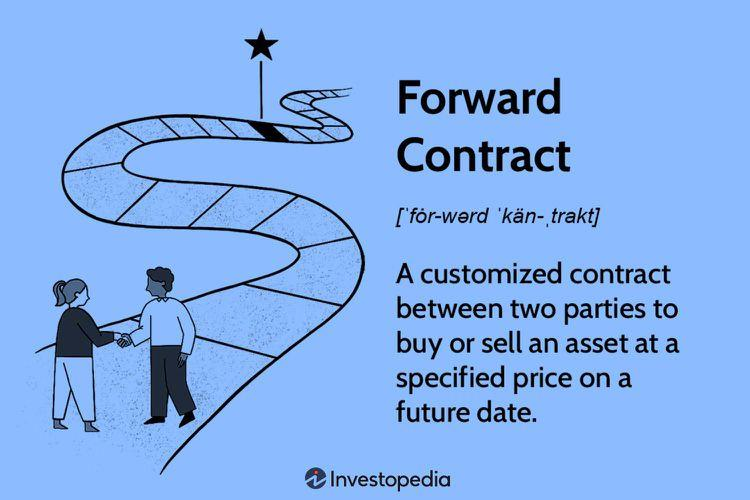

## Table of Contents

## What is a forward contract?

A forward contract is an agreement between two parties to buy or sell an asset at a specific future date for a price they agree on today. This type of contract is commonly used in financial markets to hedge against price risks. For example, a farmer might use a forward contract to lock in a price for their crops, ensuring they get a certain amount of money even if market prices drop.

These contracts are customized and traded over-the-counter, meaning they are not standardized and are negotiated directly between the parties involved. This customization allows the contract to meet the specific needs of the buyer and seller. However, because forward contracts are not traded on public exchanges, they carry a higher risk of one party not fulfilling their part of the deal, known as counterparty risk.

## How does a forward contract work?

A forward contract is like a promise between two people to buy or sell something at a set price on a future date. Imagine you're a farmer and you want to sell your wheat. You can make a forward contract with a buyer today, agreeing that they will buy your wheat for $5 per bushel in six months. This way, you know exactly how much money you'll get, even if the price of wheat changes.

When the agreed date comes, both the buyer and the seller must do what they promised. If you're the farmer, you give the wheat to the buyer, and they pay you $5 per bushel, no matter what the current market price is. But, because these contracts are made directly between the two parties and not through a big market, there's a risk that one person might not keep their promise. This is called counterparty risk.

## What are the key components of a forward contract?

A forward contract has a few important parts that both the buyer and seller agree on. First, there's the asset. This is the thing being bought or sold, like wheat or gold. Then, there's the price. This is how much the buyer will pay the seller for the asset. It's set today but paid in the future. The delivery date is also key. This is the specific day when the buyer gets the asset and the seller gets the money.

Another part of a forward contract is the quantity. This tells how much of the asset will be traded. For example, how many bushels of wheat or ounces of gold. Finally, there's the settlement method. This decides if the asset will actually be given to the buyer, or if they'll just pay the difference between the contract price and the market price on the delivery date. All these parts make sure both people know exactly what they're agreeing to.

## What are the main differences between a forward contract and a futures contract?

A forward contract and a futures contract are both agreements to buy or sell something at a set price in the future, but they have some important differences. A forward contract is made directly between two people and is not traded on a big market. This means it can be customized to fit what both people want. But because it's private, there's a bigger risk that one person might not keep their promise. On the other hand, a futures contract is traded on a public exchange, like a stock market. This makes it standardized, so everyone knows exactly what they're getting. The exchange also helps make sure both people do what they promised, which lowers the risk that someone won't follow through.

Another difference is how they're settled. With a forward contract, the asset, like wheat or gold, is usually given to the buyer on the delivery date. Sometimes, they might just pay the difference between the contract price and the market price, but this is agreed upon in the contract. Futures contracts, however, are usually settled by paying the difference between the contract price and the market price on the delivery date. This means the actual asset often doesn't change hands. This difference in settlement makes futures contracts easier to trade and manage, but forward contracts can be more flexible for specific needs.

## What are the common uses of forward contracts?

Forward contracts are often used by businesses to protect themselves from price changes. For example, a farmer might use a forward contract to sell their crops at a set price before they even grow them. This way, if the price of crops goes down, the farmer still gets the money they agreed on. Companies that need to buy raw materials, like a bakery buying wheat, can also use forward contracts to lock in prices. This helps them know their costs ahead of time and plan their budgets better.

Another common use of forward contracts is for currency exchange. If a business needs to pay for something in a different country, they can use a forward contract to set the exchange rate now for a payment they'll make later. This can be really helpful for companies that do business all over the world, because it stops them from losing money if the exchange rate changes. By using forward contracts, businesses can make sure they know exactly how much they'll need to pay, no matter what happens to currency values.

## What are the risks associated with forward contracts?

One big risk with forward contracts is called counterparty risk. This means that one of the people involved might not do what they promised. Since forward contracts are made directly between two people and not on a big market, there's no one to make sure both people follow through. If the person selling the asset can't give it to the buyer on the delivery date, or if the buyer can't pay the agreed price, the other person can lose money.

Another risk is that forward contracts can't be changed or canceled easily. Once you agree on a forward contract, you're stuck with it. If the market price changes a lot, you might end up paying more or getting less than you would if you could change the contract. This can be a problem if the price of the asset goes way up or down after you make the deal. Also, because forward contracts are customized, they might not be as easy to trade or get out of as other types of contracts, which can make them riskier.

## How can forward contracts be used for hedging?

Forward contracts are a great tool for hedging, which means protecting against price changes. Imagine you're a farmer who grows wheat. You can use a forward contract to sell your wheat at today's price, even if you won't harvest it for months. This way, if the price of wheat goes down by the time you're ready to sell, you still get the higher price you agreed on. This helps you plan your finances better because you know how much money you'll make, no matter what happens to the market.

Companies that need to buy things, like a bakery that uses wheat, can also use forward contracts to hedge. The bakery can agree to buy wheat at a set price now, even if they won't need it until later. If the price of wheat goes up, the bakery doesn't have to pay more. This helps them keep their costs steady and avoid surprises. By using forward contracts, both farmers and businesses can protect themselves from the ups and downs of the market.

## What are the pricing mechanisms of forward contracts?

The price of a forward contract is set when the two people make the deal. This price is called the forward price. It's based on what the asset, like wheat or gold, is worth today, plus what people think it might be worth in the future. They also think about how much it costs to keep the asset until the delivery date, like storage costs for wheat or interest costs for gold. If the price of the asset goes up a lot before the delivery date, the person buying the asset might get a good deal, but if it goes down, they might end up paying more than it's worth.

Sometimes, the price of a forward contract can be changed to make it fair for both people. This is called adjusting for the cost of [carry](/wiki/carry-trading). The cost of carry includes things like storage, insurance, and interest. If these costs are high, the forward price might be higher than the current price of the asset. If they're low, the forward price might be closer to the current price. By figuring out these costs and what might happen to the price of the asset, people can agree on a forward price that makes sense for both of them.

## How are forward contracts settled?

Forward contracts are usually settled in one of two ways: by delivering the actual asset or by paying the difference in price. When the delivery date comes, if the contract says the asset needs to be given to the buyer, the seller hands over the asset, like wheat or gold, and the buyer pays the agreed price. This is called physical settlement. It's common when the buyer actually needs the asset for their business, like a bakery needing wheat to make bread.

The other way to settle a forward contract is called cash settlement. Instead of giving the actual asset, the two people just pay the difference between the forward price they agreed on and the market price on the delivery date. If the market price is higher than the forward price, the buyer pays the seller the difference. If it's lower, the seller pays the buyer. This way, nobody has to move the actual asset, which can be easier and cheaper. Both ways of settling forward contracts help people manage their risks and plan their finances.

## What are the legal and regulatory considerations for forward contracts?

Forward contracts are private agreements, so they don't have as many rules as things traded on big markets. But, they still have to follow some laws. For example, if the forward contract is about something that can be bought and sold easily, like gold or wheat, it might be seen as a type of investment. This means it might need to follow rules about telling people about risks and making sure the deal is fair. Also, since forward contracts are made directly between two people, they need to make sure their agreement is clear and legal, so if there's a problem, they can go to court.

Another thing to think about is taxes. Depending on where you live, making money from a forward contract might mean you have to pay taxes. The rules can be different in different places, so it's important to check with a tax expert. Also, because forward contracts can be risky if one person doesn't do what they promised, some places have rules to help protect people. These rules might say that certain kinds of forward contracts need to be reported to the government or that people need to have enough money to cover their deals.

## How do forward contracts impact financial statements?

Forward contracts can affect a company's financial statements in a few ways. If a company uses a forward contract to buy or sell something in the future, they need to show it on their balance sheet. This is usually done by writing down the value of the contract as an asset or a liability. If the price of the thing they're buying or selling changes a lot before the delivery date, the company might need to change the value of the contract on their financial statements. This can make their profits or losses look different, even though they haven't actually bought or sold anything yet.

The impact on the income statement can be tricky too. If the forward contract is used to protect against price changes, any changes in the contract's value might be shown as part of the company's other income or expenses. This means that if the price goes up or down, it can make the company's profits or losses look bigger or smaller. But, if the company is using the forward contract to actually buy or sell something they need for their business, the effect on the income statement might be spread out over time, matching when they actually use the thing they bought or sold.

## What advanced strategies can be employed using forward contracts?

Forward contracts can be used in some smart ways to help businesses do better. One way is called a forward rate agreement. This is when a company wants to borrow money in the future and they want to know what the [interest rate](/wiki/interest-rate-trading-strategies) will be. They can use a forward contract to set the interest rate now, so they don't have to worry about it going up later. This can save them money and help them plan their budgets better. Another strategy is called a synthetic position. This is when a company combines a forward contract with other types of contracts, like options, to create a new kind of investment. This can help them make money if the price of something goes up or down, depending on what they want.

Another advanced strategy is called a forward spread. This is when a company makes two forward contracts at the same time but with different delivery dates. They might do this if they think the price of something will change a lot between the two dates. By doing this, they can make money from the difference in prices without actually having to buy or sell the thing. This can be a good way to make money from price changes without taking too much risk. These strategies show how forward contracts can be used in different ways to help companies manage their money and make smart decisions.

## What is the understanding of Financial Derivatives and Forward Contracts?

Financial derivatives are complex financial instruments whose value is derived from underlying assets such as stocks, bonds, commodities, indices, or currencies. These contracts are contingent on the performance of their underlying assets, making them essential tools for risk management and investment strategies. Derivatives are often used for hedging purposes, enabling investors to mitigate risks associated with market fluctuations. They also facilitate speculation, allowing traders to profit from price movements without direct ownership of the underlying assets.

Forward contracts, a principal type of financial derivative, play a pivotal role in the marketplace. These contracts are bespoke agreements in which two parties commit to buying or selling a particular asset at a predetermined price on a specified future date. Unlike standardized futures contracts traded on organized exchanges, forward contracts are inherently custom and executed over-the-counter (OTC), providing substantial flexibility in terms and conditions. This bespoke nature makes forward contracts particularly attractive for businesses and investors with unique risk profiles or specific hedging requirements, as they can tailor the contract to suit their needs precisely.

Additionally, forward contracts are a fundamental component of commodity and foreign exchange ([forex](/wiki/forex-system)) markets. Their capacity to hedge against potential price [volatility](/wiki/volatility-trading-strategies) makes them indispensable for market participants seeking stability amidst uncertain economic conditions. For instance, a corporation anticipating currency exposure due to a forthcoming international transaction might enter a forward contract to lock in the current exchange rate, thus safeguarding against adverse currency fluctuations.

Mathematically, a forward contract's value at a given time prior to expiration can be described by the formula:

$$
V_t = S_t - K e^{-r(T-t)}
$$

where:
- $V_t$ is the value of the forward contract at time $t$,
- $S_t$ is the spot price of the underlying asset at time $t$,
- $K$ is the agreed-upon delivery price,
- $r$ is the risk-free interest rate,
- $T$ is the time to maturity,
- $e$ is the base of the natural logarithm.

This equation accounts for the difference between the spot price and the present value of the agreed-upon delivery price discounted back at the risk-free rate. Understanding these variables and how they interact is crucial for assessing the contract's current valuation relative to the agreed future delivery terms.

In conclusion, forward contracts, with their customizable nature, offer numerous advantages in terms of flexibility and specificity, making them a critical tool for managing financial risks in various market conditions. By comprehending how these contracts function, traders, economists, and businesses can better navigate the complexities and potential volatilities of global financial markets.

## References & Further Reading

[1]: Hull, J. C. (2017). ["Options, Futures, and Other Derivatives"](https://www.semanticscholar.org/paper/Options%2C-Futures%2C-and-Other-Derivatives-Hull/89bdee500c8623864fc9eb7a471546aa713acc44). Pearson Education.

[2]: Aldridge, I. (2013). ["High-Frequency Trading: A Practical Guide to Algorithmic Strategies and Trading Systems"](https://www.wiley.com/en-us/High+Frequency+Trading%3A+A+Practical+Guide+to+Algorithmic+Strategies+and+Trading+Systems%2C+2nd+Edition-p-9781118343500). Wiley.

[3]: Tsay, R. S. (2005). ["Analysis of Financial Time Series"](https://onlinelibrary.wiley.com/doi/book/10.1002/9780470644560). Wiley-Interscience.

[4]: Cartea, Á., Jaimungal, S., & Penalva, J. (2015). ["Algorithmic and High-Frequency Trading"](https://assets.cambridge.org/97811070/91146/frontmatter/9781107091146_frontmatter.pdf). Cambridge University Press.

[5]: Lewis, M. (2014). ["Flash Boys: A Wall Street Revolt"](https://en.wikipedia.org/wiki/Flash_Boys). W. W. Norton & Company. 

[6]: Hasbrouck, J. (2007). ["Empirical Market Microstructure: The Institutions, Economics, and Econometrics of Securities Trading"](https://books.google.com/books/about/Empirical_Market_Microstructure.html?id=7U3Oo4ldKgYC). Oxford University Press.

[7]: Hull, J. C., & Basu, S. (2019). ["Risk Management and Financial Institutions"](https://books.google.com/books/about/Risk_Management_and_Financial_Institutio.html?id=1J1QDwAAQBAJ). Wiley.