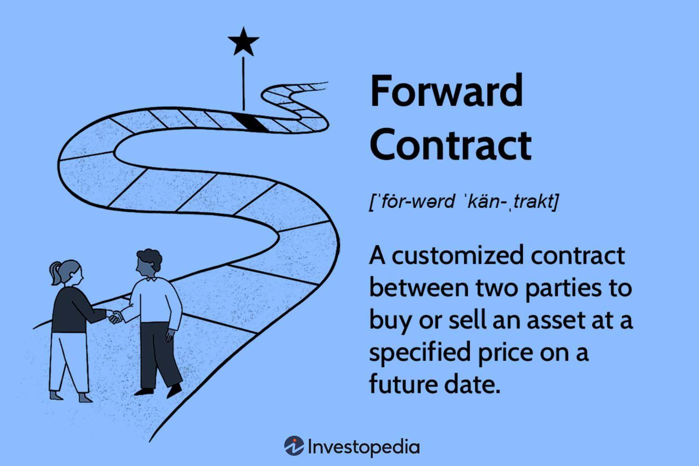

## Table of Contents

## What is a forward contract?

A forward contract is a private agreement between two parties to buy or sell an asset at a specific price on a future date. It's like making a deal today for something you will get or give later. For example, a farmer might agree to sell his wheat at a set price in six months, protecting him from price changes.

These contracts are used to manage risk. If you think the price of an asset will go up, you can lock in a lower price now. If you think it will go down, you can lock in a higher price. However, forward contracts are not traded on public exchanges, so they can be riskier because there's no guarantee the other party will keep their promise.

## How does a forward contract differ from a spot contract?

A forward contract and a spot contract are both ways to buy or sell things, but they work differently. A spot contract is like buying something right away. You agree on a price and get the item almost immediately, usually within a couple of days. It's simple and straightforward, like going to the store and taking your purchase home with you.

On the other hand, a forward contract is like making a deal for the future. You agree today to buy or sell something at a set price, but you won't actually get or give the item until a later date, which could be months away. This is useful if you want to lock in a price now to avoid future price changes, but it's riskier because you have to trust the other person to follow through when the time comes.

## What are the basic components of a forward contract?

A forward contract has a few key parts that make it work. First, there are the two parties involved: the buyer and the seller. The buyer agrees to buy something, like wheat or currency, and the seller agrees to sell it. They both agree on what they're trading, which is called the underlying asset. This could be anything from commodities to financial instruments.

The second important part is the price. The buyer and seller agree on a specific price for the asset, which is called the forward price. They also decide on a future date when the trade will happen, known as the delivery date or maturity date. On this date, the seller gives the asset to the buyer, and the buyer pays the agreed-upon price. This agreement helps both parties plan for the future and manage risks related to price changes.

## Can you explain the process of entering into a forward contract?

When you want to enter into a forward contract, you first need to find someone who wants to make the opposite deal. For example, if you want to buy wheat in the future, you need to find a farmer who wants to sell wheat at that time. You both agree on what you're trading, which is called the underlying asset. This could be anything from wheat to currency. Once you've found the right person, you sit down and talk about the details.

The main things you need to agree on are the price and the date. The price you agree on is called the forward price, and the date when the trade will happen is called the delivery date or maturity date. For instance, you might agree to buy wheat at $5 per bushel six months from now. Once you've settled on these details, you write them down in a contract. Both you and the other person sign it, making it official. Now, you just wait until the delivery date, when the seller gives you the wheat, and you pay them the agreed-upon price.

## What are the risks associated with forward contracts?

Forward contracts can be risky because they are private deals between two people. If one person decides not to follow through with the deal, the other person can lose money. This is called counterparty risk. Imagine you agreed to buy wheat from a farmer in six months, but when the time comes, the farmer doesn't have the wheat. You might have to buy it from someone else at a higher price, which means you lose money.

Another risk is that the price of the thing you're buying or selling might change a lot before the delivery date. If you're buying something and its price goes down, you might end up paying more than it's worth. If you're selling something and its price goes up, you could miss out on making more money. This is called price risk. Both types of risk can make forward contracts tricky to use, but they can also be useful for planning and managing future costs.

## How are forward contracts used in hedging?

Forward contracts are often used in hedging to protect against price changes. Imagine you're a farmer who grows wheat. You know that in six months, you'll have wheat to sell, but you're worried that the price might drop by then. To protect yourself, you can enter into a forward contract with a buyer who agrees to buy your wheat at today's price in six months. This way, no matter what happens to the wheat price, you're guaranteed to get the price you agreed on, which helps you plan your finances better.

On the other hand, if you're a company that needs to buy wheat in the future, you can use a forward contract to lock in a price now. Let's say you run a bakery and you need wheat to make bread. You're worried that the price of wheat might go up in six months, which would make your bread more expensive to produce. By entering into a forward contract, you can agree to buy wheat at today's price in six months. This way, even if the price of wheat goes up, you'll still pay the lower price you agreed on, helping you keep your costs stable and predictable.

## What role do forward contracts play in the derivatives market?

Forward contracts are a big part of the derivatives market, which is all about making deals for things in the future. In the derivatives market, people trade things like options, futures, and swaps, but forward contracts are special because they are private deals between two people. They help people lock in prices for things they will buy or sell later, like wheat or currency. This is important because it lets people plan better and not worry so much about prices changing.

In the derivatives market, forward contracts are used a lot for hedging, which means protecting against price changes. For example, a farmer might use a forward contract to make sure they get a good price for their wheat even if the market price drops later. On the other side, a company that needs wheat might use a forward contract to make sure they don't have to pay more if the price goes up. This way, forward contracts help make things more stable and predictable for everyone involved.

## How do forward contracts contribute to price discovery in financial markets?

Forward contracts help with price discovery by letting people agree on prices for things they will buy or sell in the future. When people make these deals, they look at what they think the price will be later. This information about what people expect the price to be can help others understand how the market might change. For example, if a lot of people are agreeing to buy wheat at a high price in the future, it might mean they think the price of wheat will go up. This helps everyone in the market get a better idea of what prices might be like later.

Even though forward contracts are private deals and not traded on public exchanges, they still affect the overall market. When people see a lot of forward contracts being made at certain prices, they start to think those prices are important. This can influence the prices of things that are traded on public exchanges, like futures contracts. So, forward contracts play a big part in helping everyone figure out what prices might be in the future, making the whole market work better.

## What are the differences between forward contracts and futures contracts?

Forward contracts and futures contracts are both ways to agree on a price for something you will buy or sell in the future, but they work a bit differently. A forward contract is a private deal between two people. You find someone who wants to make the opposite deal, agree on a price and a future date, and then you both sign a contract. It's like making a deal with a friend to buy their bike in six months for a set price. Forward contracts are not traded on public exchanges, so they can be riskier because there's no guarantee the other person will follow through.

On the other hand, futures contracts are standardized and traded on public exchanges, like the stock market. This means they have set rules for things like the amount of the asset and the delivery date. Because they're traded on exchanges, futures contracts are less risky because the exchange helps make sure both people in the deal do what they promised. If you want to buy or sell a futures contract, you can easily find someone to trade with on the exchange. So, while forward contracts are more flexible and private, futures contracts are more standardized and safer because of the exchange.

## How are forward contracts settled, and what are the implications of different settlement methods?

Forward contracts can be settled in two main ways: physical delivery or cash settlement. In physical delivery, the seller gives the actual thing they agreed to sell, like wheat or oil, to the buyer on the delivery date. The buyer then pays the agreed-upon price. This method is common when the buyer actually needs the thing being traded. For example, a bakery might use a forward contract to make sure they get wheat to make bread. But, physical delivery can be tricky because it involves moving the actual product, which can be costly and time-consuming.

Cash settlement is another way to settle forward contracts. Instead of giving the actual thing, the seller and buyer just exchange money based on the difference between the forward price and the market price at the time of settlement. This is easier because no one has to move the actual product. It's often used for things like currencies or financial indexes, where the buyer doesn't need the actual item. The downside is that if the market price moves a lot, one side might owe a big amount of money, which can be risky. Both methods help people manage their risks, but they have different implications based on what's being traded and how easy it is to handle the settlement.

## What are some advanced strategies involving forward contracts?

One advanced strategy with forward contracts is called a forward rate agreement (FRA). This is when two people agree on an [interest rate](/wiki/interest-rate-trading-strategies) for a loan they will make in the future. For example, a company might want to borrow money in six months but is worried that interest rates will go up. They can use an FRA to lock in today's interest rate for the future loan. This way, even if rates go up, the company knows exactly how much they will have to pay. It's like making a deal to borrow money at a set price later, which helps the company plan their finances better.

Another strategy is called a synthetic forward contract. This is when someone uses a combination of other financial tools, like options, to create something that acts like a forward contract. For example, if you want to buy wheat in the future at a set price but can't find someone to make a forward contract with, you might buy a call option and sell a put option on wheat. This combination can give you the same result as a forward contract, locking in a price for the future. It's a bit more complicated, but it can be useful when you can't find someone to make a traditional forward contract with.

## How have regulatory changes affected the use of forward contracts in financial markets?

Regulatory changes have made a big difference in how people use forward contracts. After the 2008 financial crisis, governments and financial watchdogs started to pay more attention to these private deals. They made new rules to make sure that forward contracts were safer and more transparent. For example, some rules now say that big forward contracts have to be reported to regulators. This helps keep an eye on what's happening in the market and makes sure that people are not taking too many risks. These changes have made forward contracts a bit more complicated to use, but they also help make the financial system more stable.

Another big change is that some forward contracts now have to be cleared through a central clearinghouse. This means that instead of just dealing directly with the other person, you go through a middleman who makes sure both sides do what they promised. This reduces the risk that one person won't follow through with the deal. While this makes forward contracts safer, it can also make them more expensive because you have to pay the clearinghouse for their services. Overall, these regulatory changes have made forward contracts more secure but also more complex to use in financial markets.

## References & Further Reading

[1]: Hull, J. C. (2017). ["Options, Futures, and Other Derivatives,"](https://www.semanticscholar.org/paper/Options%2C-Futures%2C-and-Other-Derivatives-Hull/89bdee500c8623864fc9eb7a471546aa713acc44) 9th Edition. Pearson.

[2]: Black, F., & Scholes, M. (1973). ["The Pricing of Options and Corporate Liabilities."](https://www.cs.princeton.edu/courses/archive/fall09/cos323/papers/black_scholes73.pdf) Journal of Political Economy, 81(3), 637-654.

[3]: Chincarini, L. B., & Kim, D. (2006). ["Quantitative Equity Portfolio Management: An Active Approach to Portfolio Construction and Management."](https://www.amazon.com/Quantitative-Equity-Portfolio-Management-Construction/dp/0071459391) McGraw-Hill.

[4]: "The Economics of Derivatives." (2015). Edited by B. Mahajan. Cambridge University Press.

[5]: Aldridge, I. (2013). ["High-Frequency Trading: A Practical Guide to Algorithmic Strategies and Trading Systems."](https://www.amazon.com/High-Frequency-Trading-Practical-Algorithmic-Strategies/dp/1118343506) Wiley.