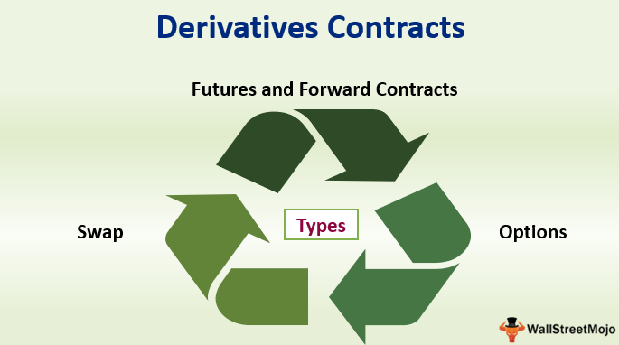

In today's fast-paced financial markets, both investors and traders rely on a wide array of tools to manage risks and optimize potential returns. Chief among these are financial instruments such as forward contracts, derivatives, and algorithmic trading strategies. These tools form the backbone of contemporary trading, providing mechanisms to hedge risk and exploit market efficiencies.

This article aims to explore the intricacies of financial instruments, with a particular focus on forward contracts and derivatives, and how algorithmic trading enhances their practical application. Forward contracts offer a means to lock in prices for commodities, currencies, or other financial assets, thus mitigating the risks associated with price volatility. Meanwhile, derivatives, including futures and options, provide additional layers of strategy for both hedging and speculation, enabling market participants to tailor their exposure to various risk factors.



Algorithmic trading stands at the frontier of these developments, utilizing advanced computational techniques to automate trading processes. This automation not only ensures swift execution of trades but also minimizes human error, providing the precision necessary for successfully navigating complex financial landscapes.

A thorough understanding of these financial tools is essential for investors who aim to thrive in the dynamic environment of global markets. By mastering these concepts, market participants can better manage their investment portfolios and seize opportunities as they arise. Join us in exploring the sophistication and advantages of these vital financial instruments, which are integral to the success of any modern investor or trader.

## Table of Contents

## Understanding Financial Instruments

Financial instruments are essential components of the global financial system, providing a framework through which financial assets and liabilities are created. These instruments are crucial for investors, companies, and governments to facilitate capital formation, manage risk, and enhance liquidity in the markets.

At their core, financial instruments can be classified into three primary categories: equity, debt, and derivatives. Equity instruments represent ownership in a company and typically include common and preferred stocks. Shareholders benefit from dividends and capital gains when the company performs well. Equity instruments are vital as they enable companies to raise capital by offering shares of ownership to investors.

Debt instruments, on the other hand, are essentially loans made by investors to corporate or public entities. They include bonds, notes, and debentures. Debt instruments oblige the issuer to pay interest over a specified period and to repay the principal upon maturity. Such instruments are crucial for companies and governments needing to finance operations and projects, offering investors a fixed return and relative safety compared to equity.

Derivatives, a complex category of financial instruments, derive their value from an underlying asset, index, or rate. Common derivatives include forward contracts, futures, options, and swaps. These instruments allow entities to hedge against potential price movements, speculate on future price changes, or gain access to otherwise hard-to-trade assets or markets.

Understanding how these instruments operate within financial markets is vital for investors. First, they facilitate capital flow by allowing funds to move from those with excess capital (investors/savers) to those who need capital (companies/borrowers). This process is fundamental for economic growth as it enables investment in various economic sectors.

Moreover, financial instruments help in price discovery, which is the process of determining the value of an asset in the marketplace through the interactions of buyers and sellers. Efficient price discovery aids investors in making informed decisions, reflecting the underlying value and risks associated with the assets.

Importantly, these instruments provide mechanisms for managing risks. For example, derivatives such as options and futures allow investors to lock in prices or hedge against adverse price movements, thereby mitigating uncertainty. This risk management is a vital capability for both individual investors and large institutions.

For investors, grasping the fundamentals of financial instruments is key to effective portfolio management. It allows them to construct diversified portfolios tailored to their risk appetite, investment timeline, and financial goals. By making informed decisions, investors can enhance their returns while minimizing risk, thus navigating the complexities of the financial markets with greater confidence.

## Forward Contracts: A Closer Look

Forward contracts represent a fundamental category of derivative instruments, serving as tailor-made agreements between two parties. The essence of these contracts lies in their specific design, allowing one party to commit to purchasing, and the other to selling, a particular asset at a pre-defined price on a future date. Unlike standardized futures contracts, forward contracts are over-the-counter (OTC) derivatives, granting them the benefit of customization in terms of contract size, maturity date, and the specific asset traded. This adaptability is particularly valuable in various markets, such as commodities, currencies, and financial instruments.

The primary advantage of forward contracts is their utility in hedging. By locking in prices for future transactions, parties can mitigate the risk of adverse price movements. For example, a farmer who anticipates a future harvest might use a forward contract to sell their crop at a guaranteed price, thus protecting against the potential decline in market prices. Similarly, import/export businesses use forward contracts to hedge against currency risk, ensuring that exchange rate fluctuations do not impact the cost of transactions.

Despite their benefits, forward contracts [carry](/wiki/carry-trading) inherent risks. The most prominent is counterparty risk—the possibility that one party may default on the contract. Unlike exchanges that clear futures contracts, the OTC nature of forward contracts means that they rely heavily on the credibility of the involved parties. As a result, due diligence and the establishment of reliable counterparties are crucial.

Real-world applications of forward contracts span various industries. In the energy sector, companies often engage in forward contracts for oil or natural gas to stabilize cash flow and budget forecasts amidst volatile market conditions. Similarly, in agriculture, producers might use forward contracts to ensure stable income regardless of unpredictable weather or supply chain disruptions. Financial institutions frequently enter into forward rate agreements (FRAs) as a hedge against [interest rate](/wiki/interest-rate-trading-strategies) changes, aligning future financial obligations with their current interest rate expectations.

To illustrate the working of a forward contract, consider an example where two parties agree on a contract involving a commodity:

1. **Define Contract Terms**:
   - Asset: 1,000 barrels of crude oil
   - Agreed Forward Price: $70 per barrel
   - Delivery Date: Six months later

2. **Settlement**:
   - If the market price rises to $80 per barrel at expiry, the party agreeing to buy benefits, acquiring oil at $70 instead of the market price of $80.
   - Conversely, if the market price falls to $60, the seller gains an advantage by selling at $70.

Forward contracts' flexibility and bespoke nature make them a strategic tool for managing market [volatility](/wiki/volatility-trading-strategies). However, the customization that offers so much utility also necessitates a careful consideration of counterparty risk and the terms of each contract. Understanding these dynamics enables investors and traders to effectively safeguard their portfolios against unforeseen changes in market conditions.

## Exploring Derivatives: Beyond Forwards

Derivatives are financial instruments whose value is contingent upon the performance of underlying assets, indices, or interest rates. These instruments have gained significant traction in modern finance due to their versatility and ability to perform complex risk management and speculative functions. Among the primary types of derivatives are futures, options, swaps, and forwards, each serving distinct yet complementary roles in financial markets.

Futures contracts are standardized agreements traded on exchanges where parties agree to buy or sell an asset at a predetermined price on a specified future date. Unlike forwards, futures are highly liquid and carry reduced counterparty defaults due to standardized exchange procedures. Options, on the other hand, provide the holder the right, but not the obligation, to buy or sell an asset at a stipulated price before a certain expiration date. This unique characteristic of options allows investors to leverage positions while limiting potential losses to the premium paid.

Swaps, another form of derivatives, involve exchanging cash flows between two parties and are commonly used to manage interest rate exposure or currency risks. One of the most widespread examples is the interest rate swap, where fixed interest payments are exchanged for floating rate payments, thereby managing interest rate fluctuations.

The use of derivatives in hedging and speculation has transformed strategies employed by investors and institutions. Hedging involves using derivatives to mitigate potential losses in other investment positions, essentially acting as an insurance policy. For instance, a wheat farmer might utilize futures contracts to lock in a specific selling price ahead of the harvest season, thereby safeguarding against adverse price shifts. Conversely, speculation involves leveraging derivatives to capitalize on anticipated market movements, which can result in high returns but equally high risks.

While derivatives offer the advantage of leverage — allowing for significant exposure with a relatively small capital outlay — they also impose substantial challenges. Leverage can magnify both profits and losses, introducing enhanced risk levels that require careful management. Additionally, trading derivatives often involves counterparty risk, the possibility that one party may default on the contract obligations, although centralized clearing in futures trading mitigates this risk to some extent.

The revolutionary impact of derivatives on financial markets is underscored by their ability to provide tailored strategies for complex financial needs. Whether managing currency fluctuations, adjusting interest rate exposure, or enhancing portfolio returns, derivatives have become indispensable tools in contemporary finance, serving to optimize risk-adjusted investment outcomes across a wide range of market conditions.

## Algorithmic Trading: Enhancing Efficiency

Algorithmic trading refers to the use of complex algorithms to execute trading strategies with high efficiency and speed, minimizing human intervention. This technology has significantly transformed financial markets by interacting seamlessly with various financial instruments—including equities, debt, and derivatives—which enables market participants to achieve optimal trade execution and capitalize on high-frequency fluctuations.

### Benefits of Algorithmic Trading

One notable advantage of [algorithmic trading](/wiki/algorithmic-trading) is its ability to reduce transaction costs. By optimizing trade execution, algorithms minimize slippage, which is the difference between the expected price of a trade and the actual price. This precision is achieved through algorithms that continuously analyze market data, identify trends, and execute trades at moments that maximize potential gains or minimize losses.

Additionally, algorithmic trading substantially reduces human bias in decision-making. Traditional trading often involves subjective judgments, which can be impacted by emotional factors. Algorithms, however, apply predefined criteria to execute trades, ensuring consistency and objectivity. This minimizes errors and potentially improves overall trading performance.

### Impact on Volume and Liquidity

Algorithmic trading has a marked impact on trading [volume](/wiki/volume-trading-strategy) and market [liquidity](/wiki/liquidity-risk-premium). High-frequency trading, a component of algorithmic trading, involves executing a large number of orders at incredibly fast speeds. This activity enhances liquidity by ensuring that buy and sell orders are continuously available, thereby narrowing bid-ask spreads. Improved liquidity benefits the market by making it easier and cheaper to execute large trades without significantly affecting the price.

However, there are challenges, such as increased market volatility during periods of stress, attributed to the rapid execution of trades by algorithms. Nevertheless, the overall increase in liquidity generally leads to more efficient markets.

### Algorithmic Trading Technologies

The technologies underpinning algorithmic trading are highly sophisticated and continually evolving. For example, [machine learning](/wiki/machine-learning) techniques enhance the ability of algorithms to predict market trends by identifying patterns in historical data. Python, a popular language in this domain, provides libraries such as NumPy and pandas that facilitate complex data manipulations and analysis, offering quick prototyping and deployment of trading strategies.

```python
import pandas as pd
import numpy as np

# Example: Simple Moving Average Strategy
def moving_average_strategy(prices, window_size):
    """
    Execute a moving average strategy.

    :param prices: A list or array of prices.
    :param window_size: The number of periods for the moving average.
    :return: Buy/Sell signals based on moving average.
    """
    signals = pd.DataFrame(index=prices.index)
    signals['price'] = prices
    signals['moving_avg'] = prices.rolling(window=window_size, min_periods=1).mean()

    signals['signal'] = 0
    signals['signal'][window_size:] = np.where(
        signals['price'][window_size:] > signals['moving_avg'][window_size:], 1, 0)

    signals['positions'] = signals['signal'].diff()
    return signals

# Example usage with mock price data
prices = pd.Series([100, 101, 102, 99, 98, 100, 103, 105, 107, 105])
window_size = 3
signals = moving_average_strategy(prices, window_size)
```

### Remaining Competitive

For modern traders, understanding and implementing algorithmic trading strategies is crucial to remain competitive. With the increasing complexity and speed of markets, manual trading methods are often insufficient. Algorithmic trading provides the tools necessary to navigate and exploit the volatile nature of financial markets dynamically. Engaging with these technologies empowers traders to set themselves apart in a rapidly evolving landscape.

## The Intersection of Forward Contracts, Derivatives, and Algo Trading

Financial markets have witnessed a significant transformation with the integration of algorithmic trading, particularly when paired with forward contracts and derivatives. Algorithmic trading facilitates the execution of trade orders at speeds and frequencies typically inaccessible to manual traders, thus optimizing trading outcomes of these financial instruments.

Algorithmic trading systems can be tailored to execute forward contracts and derivatives based on specified criteria, such as price movement thresholds, time of the day, or market conditions. These algorithms can efficiently analyze vast datasets, making decisions in real-time that align with predefined strategies to optimize portfolio returns and minimize risks. This capability is particularly beneficial in executing derivatives transactions, where speed and precision can significantly influence profitability.

One such case study involves the use of algorithmic trading in executing options strategies. Options, a type of derivative, can benefit greatly from algo-trading through strategies such as delta hedging. By leveraging algorithmic models, traders can continuously adjust the proportions of an option and its underlying asset to maintain a delta-neutral position, thereby minimizing risk from price movements in the underlying asset.

Another example is using algorithmic trading to enhance the effectiveness of hedging strategies in forward contracts. By designing algorithms that track market indicators and predictive analytics, traders can dynamically adjust their forward positions to protect against price volatility, optimizing the timing and pricing of contract initiation and closures.

Recent technological advancements in machine learning and [artificial intelligence](/wiki/ai-artificial-intelligence) have further enhanced these intersections. Machine learning models can be trained to optimize variance and portfolio beauty by predicting asset movements and recalibrating strategies accordingly. For instance, [deep learning](/wiki/deep-learning) algorithms can analyze complex financial datasets to identify patterns and correlations invisible to human analysts, providing actionable insights that inform trading strategies involving derivatives and forward contracts.

The integration of algorithmic trading also allows for the execution of complex strategies like statistical [arbitrage](/wiki/arbitrage), where algorithms exploit price differentials across related derivatives and forward contracts to generate profits. This requires rapid execution and tight risk management, achievable through sophisticated algo trading frameworks.

Understanding these synergies between forward contracts, derivatives, and algorithmic trading is crucial for traders and financial institutions aiming to maintain a competitive edge. As these technologies evolve, they enable market participants to harness the capabilities of automation and big data analytics, refining and executing strategies with unprecedented efficiency and accuracy. This not only enhances trading outcomes but also supports portfolio risk management in increasingly volatile financial markets.

## Conclusion

In conclusion, a thorough understanding of financial instruments such as forward contracts and derivatives is crucial for effective trading and investment. These instruments provide investors with tools to manage risk, hedge against market volatility, and explore speculative opportunities. The integration of algorithmic trading has significantly enhanced their utility by facilitating faster and more precise execution of trades. Algorithmic strategies minimize transaction costs and overcome human biases, thereby optimizing trading performance.

This article has explored the fundamental concepts and advantages associated with forward contracts and derivatives, highlighting their transformative role in modern finance. As financial markets continue to develop, the importance of staying informed about these tools and their evolving applications cannot be overstated. Technological advancements, such as machine learning and big data analytics, further empower traders to harness these instruments effectively.

By mastering the use of forward contracts, derivatives, and algorithmic trading, investors and traders position themselves favorably to exploit the dynamic opportunities available in global markets. Such proficiency not only enhances portfolio performance but also provides a competitive advantage in an increasingly complex financial landscape.

## References & Further Reading

[1]: Hull, J. C. (2017). ["Options, Futures, and Other Derivatives,"](https://www.semanticscholar.org/paper/Options%2C-Futures%2C-and-Other-Derivatives-Hull/89bdee500c8623864fc9eb7a471546aa713acc44) 9th Edition. Pearson.

[2]: Black, F., & Scholes, M. (1973). ["The Pricing of Options and Corporate Liabilities."](https://www.cs.princeton.edu/courses/archive/fall09/cos323/papers/black_scholes73.pdf) Journal of Political Economy, 81(3), 637-654.

[3]: Chincarini, L. B., & Kim, D. (2006). ["Quantitative Equity Portfolio Management: An Active Approach to Portfolio Construction and Management."](https://www.amazon.com/Quantitative-Equity-Portfolio-Management-Construction/dp/0071459391) McGraw-Hill.

[4]: "The Economics of Derivatives." (2015). Edited by B. Mahajan. Cambridge University Press.

[5]: Aldridge, I. (2013). ["High-Frequency Trading: A Practical Guide to Algorithmic Strategies and Trading Systems."](https://www.amazon.com/High-Frequency-Trading-Practical-Algorithmic-Strategies/dp/1118343506) Wiley.