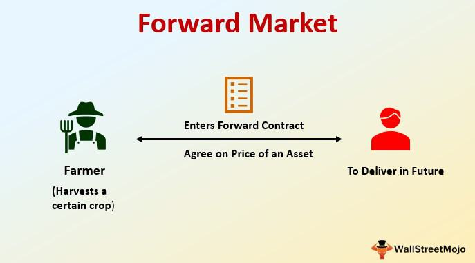

## Table of Contents

## What is forward delivery?

Forward delivery is when you buy something now but get it later. It's like ordering a new phone today, but you won't get it until next month. This is common in many industries, like farming where crops are sold before they are harvested, or in construction where materials are ordered well before they are needed.

This method helps businesses plan better. They know what they will get and when, so they can organize their work and money more easily. For example, a farmer can sell his future wheat crop to a buyer, and both can plan their activities knowing the wheat will be delivered at a set time.

## How does forward delivery differ from traditional delivery methods?

Forward delivery is different from traditional delivery because with forward delivery, you order something now but get it later. It's like making a plan for the future. For example, you might order a new sofa today, but it won't arrive until next month. This helps businesses and people plan better because they know when they will get their items.

Traditional delivery, on the other hand, is more immediate. When you order something, you expect to get it soon, usually within a few days or a week. It's like going to a store and taking your purchase home right away. This method is good for things you need quickly, but it doesn't help with long-term planning as much as forward delivery does.

## What are the key components of a forward delivery system?

A forward delivery system has a few important parts. First, there's the agreement between the buyer and the seller. They decide what will be delivered, how much it will cost, and when it will arrive. This agreement is crucial because it sets clear expectations for both sides. Second, there's the planning part. Both the buyer and the seller need to plan their activities around the delivery date. The seller needs to make sure the product is ready on time, and the buyer needs to prepare to receive it.

Another key component is the tracking and communication system. Since the delivery happens in the future, it's important to keep everyone updated on the progress. This can include regular updates on the production or any changes in the delivery schedule. Finally, there's the risk management part. Because things can change between the time of the order and the delivery, both parties need to think about what could go wrong and have plans to deal with those problems. This helps make sure the forward delivery goes smoothly.

## What industries commonly use forward delivery?

Many industries use forward delivery to plan better and manage their resources. In farming, forward delivery is very common. Farmers often sell their crops before they are even harvested. This helps them know how much money they will make and helps buyers plan for the food they will need. For example, a farmer might agree to sell wheat to a bakery in six months. This way, the bakery knows it will have wheat and can plan its bread production.

Another industry that uses forward delivery a lot is construction. Builders often order materials like steel or concrete well before they start building. This ensures that they have everything they need when it's time to begin the project. For instance, a construction company might order windows for a new building that won't be finished for a year. This helps them avoid delays and keep the project on schedule.

Forward delivery is also used in manufacturing. Companies that make things like cars or electronics often order parts in advance. This helps them keep their production lines running smoothly. For example, a car maker might order tires that will be used in cars they plan to build next year. This way, they can be sure they have all the parts they need when it's time to assemble the cars.

## What are the benefits of implementing forward delivery for businesses?

Forward delivery helps businesses plan better. When a business knows what it will get and when, it can organize its work more easily. For example, a bakery that orders wheat for next month can plan how much bread to make. This way, the bakery doesn't run out of wheat and can keep making bread without any surprises. It also helps businesses save money because they can buy things when prices are low and use them later when prices might be higher.

Another benefit is that forward delivery can make customers happier. When businesses can promise to deliver something at a certain time, customers feel more confident. They know they will get what they need when they need it. This can make customers more likely to keep doing business with the company. For example, if a construction company orders windows for a building project and knows they will arrive on time, they can tell their clients the building will be ready as planned. This makes everyone involved feel more secure and satisfied.

## What are the potential challenges or drawbacks of forward delivery?

One big challenge with forward delivery is that things can change between the time you order something and when you get it. For example, if a farmer agrees to sell wheat in six months, but then there's a drought and the wheat doesn't grow well, the farmer might not be able to deliver as much wheat as promised. This can cause problems for both the farmer and the buyer, like the bakery that was counting on that wheat to make bread. Another issue is that prices can change. If the price of wheat goes up after the agreement, the farmer might feel like they're not getting enough money. But if the price goes down, the bakery might feel like they paid too much.

Another drawback is that forward delivery can be hard to manage. It requires good planning and communication. If the seller doesn't keep the buyer updated on any changes or delays, it can lead to frustration and problems. For example, if a construction company orders windows for a building and they don't arrive on time, it can delay the whole project. This can make everyone involved unhappy and can cost extra money to fix. Also, forward delivery can tie up money. When a business pays for something now but doesn't get it until later, that money can't be used for other things in the meantime. This can be a problem if the business needs that money for something else.

## How does forward delivery impact logistics and supply chain management?

Forward delivery can make logistics and supply chain management more complicated but also more predictable. When businesses order things in advance, they need to plan carefully to make sure everything arrives on time. This means they have to think about how to store the items until they are needed and how to transport them when the time comes. It can be tricky because if something goes wrong, like a delay in production or a problem with transportation, it can mess up the whole plan. But if everything goes right, forward delivery can help businesses run smoothly because they know exactly what they will get and when.

On the other hand, forward delivery can help businesses manage their supply chains better. When a company knows what it will need in the future, it can order those things ahead of time and make sure they are ready when needed. This can prevent shortages and delays, which can be a big problem in supply chain management. For example, if a car manufacturer orders tires for next year's models, it can be sure that the tires will be there when it's time to build the cars. This way, the whole supply chain can work more efficiently, and the business can keep its customers happy by delivering products on time.

## What technologies are typically used to support forward delivery?

Technology helps a lot with forward delivery. One important tool is the computer system that keeps track of orders and delivery dates. This system makes sure everyone knows what is supposed to happen and when. It can send reminders and updates to both the buyer and the seller so they can plan their work. Another helpful technology is the internet, which lets people communicate easily. They can use emails or special software to talk about any changes or problems with the delivery. This keeps everyone on the same page and helps avoid surprises.

Another technology that supports forward delivery is inventory management software. This helps businesses keep track of what they have and what they need to order in the future. It can predict when supplies will run low and suggest when to order more, making sure everything is ready on time. Also, tracking systems like GPS can be used to follow shipments from the seller to the buyer. This helps everyone know exactly where the goods are and when they will arrive, making the whole process smoother and more reliable.

## Can you explain the process of setting up a forward delivery system?

Setting up a forward delivery system starts with making an agreement between the buyer and the seller. They need to talk about what will be delivered, how much it will cost, and when it will arrive. This agreement should be written down so both sides know exactly what to expect. After the agreement is made, the seller needs to plan how to get the product ready on time. They might need to order materials or start production early to meet the delivery date. The buyer also needs to plan, figuring out how they will use the product once it arrives and making sure they have space to store it until then.

Once the plans are in place, good communication is key. The seller should keep the buyer updated on any changes or delays. They can use technology like emails or special software to share information easily. Tracking systems can help both sides know where the product is and when it will arrive. It's also important to think about what could go wrong and have a plan to deal with those problems. This way, if something unexpected happens, like a delay in production or a problem with transportation, both the buyer and the seller can handle it without too much trouble.

## How does forward delivery affect customer satisfaction and experience?

Forward delivery can make customers happier because it gives them a clear idea of when they will get their products. When a business promises to deliver something at a certain time and then does it, customers feel more confident and satisfied. They know they can count on the business to keep its word. For example, if a customer orders a new sofa and knows it will arrive in two months, they can plan their home and their life around that. This makes the whole experience smoother and more enjoyable for the customer.

However, forward delivery can also cause problems if things don't go as planned. If there are delays or if the product doesn't arrive on time, customers can get frustrated and unhappy. They might feel let down because they were expecting the product at a certain time. For instance, if a construction company orders windows for a building and they don't arrive on time, it can delay the whole project and make the customers who are waiting for the building to be finished very unhappy. So, while forward delivery can improve customer satisfaction when it works well, it can also lead to disappointment if there are problems.

## What are the legal and regulatory considerations for forward delivery?

When businesses use forward delivery, they need to think about the rules and laws that might affect them. One important thing is making sure the agreement between the buyer and the seller is clear and legal. This means both sides need to understand what they are agreeing to, like the price, what will be delivered, and when it will arrive. If something goes wrong, like the product doesn't arrive on time, the agreement should say what happens next. This helps prevent arguments and makes sure everyone knows their rights and responsibilities.

Another thing to consider is the laws about contracts and trade in different places. Some countries or states have special rules about forward delivery, especially for certain industries like farming or construction. These rules might say how long in advance you can order something or what happens if prices change. Businesses need to know these rules to make sure they are following the law. If they don't, they could get in trouble or face fines. So, it's a good idea to check with a lawyer or someone who knows about these rules before setting up a forward delivery system.

## What future trends are expected to influence the development of forward delivery systems?

In the future, technology will play a bigger role in forward delivery systems. More businesses will use smart computer programs to plan and track their deliveries. These programs can predict when things might go wrong and suggest ways to fix problems before they happen. For example, a program might tell a farmer when to plant crops so they are ready for a future delivery. Also, the internet will make it easier for buyers and sellers to talk to each other and share information quickly. This will help them work together better and make forward delivery smoother.

Another trend that will affect forward delivery is the focus on being more sustainable. More businesses will try to use less energy and create less waste when they deliver things. They might use electric trucks or find ways to pack products more efficiently. This is important because customers are starting to care more about how their products are delivered and want to support businesses that are good for the environment. As a result, forward delivery systems will need to change to be more eco-friendly while still being reliable and on time.

## References & Further Reading

[1]: Hull, J. C. (2012). ["Options, Futures, and Other Derivatives."](https://www.semanticscholar.org/paper/Options%2C-Futures%2C-and-Other-Derivatives-Hull/89bdee500c8623864fc9eb7a471546aa713acc44) Pearson Education.

[2]: Lopez de Prado, M. (2018). ["Advances in Financial Machine Learning."](https://www.amazon.com/Advances-Financial-Machine-Learning-Marcos/dp/1119482089) Wiley.

[3]: Black, F., & Scholes, M. (1973). ["The Pricing of Options and Corporate Liabilities."](https://www.cs.princeton.edu/courses/archive/fall09/cos323/papers/black_scholes73.pdf) Journal of Political Economy, 81(3), 637-654.

[4]: Geman, H. (2005). ["Commodities and Commodity Derivatives: Modelling and Pricing for Agriculturals, Metals, and Energy."](https://download.e-bookshelf.de/download/0000/5675/90/L-G-0000567590-0015270354.pdf) Wiley.

[5]: Chan, E. P. (2009). ["Quantitative Trading: How to Build Your Own Algorithmic Trading Business."](https://github.com/ftvision/quant_trading_echan_book) Wiley.

[6]: Fabozzi, F. J., Focardi, S. M., & Kolm, P. N. (2010). ["Quantitative Equity Investing: Techniques and Strategies."](https://www.semanticscholar.org/paper/Quantitative-Equity-Investing%3A-Techniques-and-Fabozzi-Focardi/1c49a2a53919f7e65cb96f16691b8ff726fd3cd7) Wiley.

[7]: Aldridge, I. (2013). ["High-Frequency Trading: A Practical Guide to Algorithmic Strategies and Trading Systems."](https://www.ahmetbeyefendi.com/wp-content/uploads/2020/07/High-Frequency-Trading-Irene-Aldridge.pdf) Wiley.