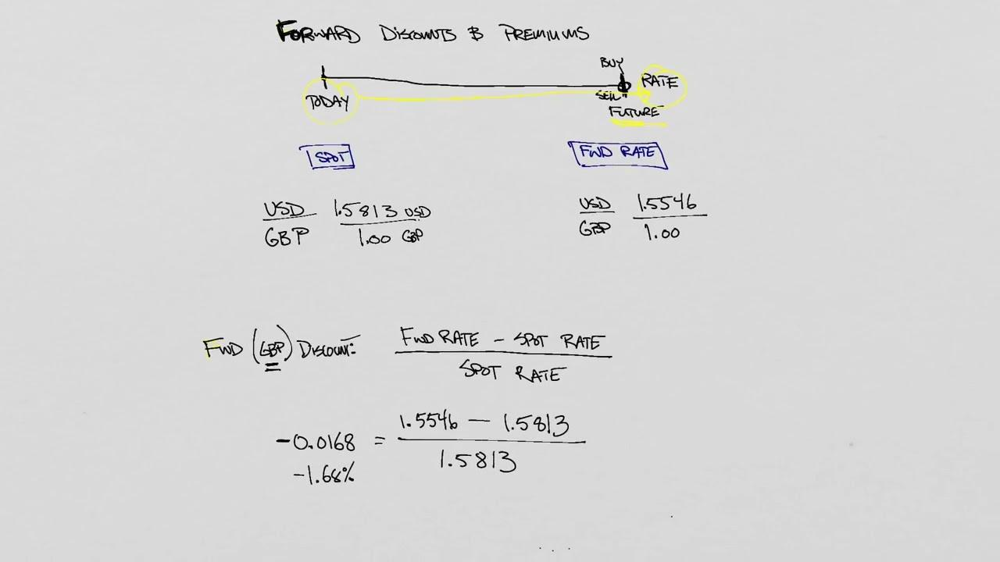

In the growing field of algorithmic trading, understanding the nuances of financial calculations in currency exchange is crucial. Algorithmic trading, which utilizes advanced mathematical models and sophisticated software to automate trading decisions, relies heavily on accurate financial computations to capitalize on market fluctuations. One such critical concept in this domain is the forward discount.

Forward discount refers to the phenomenon where the forward rate of a currency is lower than its current spot rate. This indicates an expected depreciation of the currency in the future. Forward discounts are a central aspect of currency exchange and have a significant impact on trading strategies and currency valuations. They serve as indicators of market expectations concerning future currency movements and are integral to making informed trading decisions.



This article explores the concept of forward discount, highlighting its pivotal role in currency exchange and algorithmic trading. It examines how forward discounts influence trading decisions and currency valuations, providing practical insights into the accurate calculation of forward discounts. Understanding these calculations is essential for executing well-informed trades and developing robust financial strategies in the ever-evolving forex market. As algorithmic trading continues to expand, incorporating forward discount analysis is increasingly important for traders seeking to optimize their performance and enhance their decision-making processes.

## Table of Contents

## Understanding Forward Discount in Currency Exchange

Forward discount in currency exchange is a foundational concept that signifies the expected depreciation of a currency. When the forward rate of a currency is lower than its spot rate, it indicates that market participants anticipate a decline in the value of the currency relative to another over time. This expectation is pivotal in forex trading as it helps traders and investors formulate strategies that can take advantage of perceived currency movements.

The notion of forward discount is essential in international trade and financial strategy development. Traders use this insight to manage risks associated with currency fluctuations and to make informed decisions on hedging positions. By understanding the forward discount, firms involved in cross-border transactions can protect their profit margins from adverse exchange rate movements.

To clarify the terminology: the spot rate is the current exchange rate at which a currency can be immediately exchanged for another. It reflects the market's real-time valuation of two currencies. Conversely, the forward rate is a predetermined rate for a transaction set to occur at a future date. The forward contract allows trading parties to lock in an exchange rate today for a currency swap in the future, shielding them from unexpected shifts in exchange rates.

The forward discount can be mathematically expressed using the following relationship:

$$
\text{Forward Discount} = \frac{\text{Spot Rate} - \text{Forward Rate}}{\text{Spot Rate}} \times 100\%
$$

A positive value indicates a forward discount, suggesting that the currency is expected to depreciate. Such insights are crucial for traders who rely on predictive models and technical analysis to gain a competitive edge in the [forex](/wiki/forex-system) market. Understanding forward discounts allows for the anticipation of currency trends, potentially leading to more profitable trading strategies.

## The Role of Interest Rates in Forward Discount

The interaction between forward discounts and interest rates is best explained by the [interest rate](/wiki/interest-rate-trading-strategies) parity (IRP) theory, which provides a fundamental understanding of how currencies depreciate or appreciate relative to one another. According to this theory, the difference between interest rates of two countries is equal to the difference between the forward exchange rate and the spot exchange rate.

The basic formula for IRP can be expressed as:

$$

\frac{F}{S} = \frac{1 + i_d}{1 + i_f} 
$$

where $F$ is the forward exchange rate, $S$ is the spot exchange rate, $i_d$ is the domestic interest rate, and $i_f$ is the foreign interest rate. Rearranging the formula helps understand the forward discount or premium:

$$

F = S \times \frac{1 + i_d}{1 + i_f} 
$$

If the domestic interest rate $i_d$ is higher than the foreign interest rate $i_f$, the forward rate $F$ will generally be at a discount compared to the spot rate $S$. This indicates that the domestic currency is expected to depreciate relative to the foreign currency. 

Higher interest rates generally lead to a forward discount because investors would require a higher yield to compensate for holding a currency expected to lose value. Thus, the currency with a higher interest rate will typically trade at a forward discount, reflecting the anticipated depreciation.

Interest rate differentials are crucial in trading strategies as they indicate potential currency strength or weakness. Traders might employ strategies like the [carry](/wiki/carry-trading) trade, where they borrow funds in a currency with a lower interest rate and invest in a currency with a higher interest rate. This strategy banks on the forward discount, profiting from the interest rate differential as well as any gain from currency movements, provided the actual depreciation is less than the interest rate differential.

Understanding and analyzing interest rate differentials, using econometric models or trading algorithms, offers insights into future currency value shifts and can advantageously inform trading decisions. Consequently, forward discounts, shaped largely by these interest rate differentials, remain a vital tool for informed currency trading, offering both opportunities and potential risks.

## Calculating Forward Discount

Calculating forward discounts involves using spot rates, forward rates, and interest rates to determine the expected depreciation of a currency. This calculation is essential for traders and financial planners to estimate potential gains or losses in currency exchange transactions.

The forward discount is typically expressed as a percentage and can be calculated using the following formula:

$$
\text{Forward Discount (\%)} = \left( \frac{\text{Spot Rate} - \text{Forward Rate}}{\text{Spot Rate}} \right) \times \frac{360}{\text{Days to Maturity}} \times 100
$$

In this formula, the spot rate refers to the current exchange rate at which a currency can be bought or sold, while the forward rate is the agreed-upon rate for a transaction taking place at a future date. The forward rate is usually determined based on the difference in interest rates between the two currencies involved. 

To adjust for interest rates, the interest rate parity (IRP) principle can be incorporated. The principle states that the expected changes in the exchange rate between two currencies are proportionate to the differential in their nominal interest rates. This can be reflected in the forward discount calculation by using the formula for the forward rate:

$$
\text{Forward Rate} = \text{Spot Rate} \times \left(1 + \frac{r_f \times t}{360}\right) \div \left(1 + \frac{r_d \times t}{360}\right)
$$

where:
- $r_f$ is the foreign currency interest rate,
- $r_d$ is the domestic currency interest rate,
- $t$ is the number of days until the forward contract matures.

Understanding these calculations is crucial for determining whether a forward contract reflects a forward discount and making informed decisions on trading strategies. For instance, an anticipated forward discount may lead a trader to take actions such as hedging potential risks or capitalizing on predicted currency movements. As such, mastering the forward discount calculation supports more effective risk management and profit optimization in currency exchange operations.

## Algorithmic Trading Strategies Utilizing Forward Discounts

Algorithmic trading leverages computational algorithms to exploit market inefficiencies and optimize trading decisions. In currency markets, forward discounts serve as critical indicators of expected currency movements. These discounts arise when the forward rate of a currency is lower than its spot rate, suggesting anticipated depreciation. By analyzing forward discounts, traders can gain insights into potential market trends and craft strategies that capitalize on these predictions.

One prominent strategy that benefits from forward discount analysis is the carry trade. This involves borrowing in a currency with a low-interest rate and investing in a currency with a higher interest rate. The profitability of a carry trade relies heavily on interest rate differentials, which often correlate with forward discounts. For instance, if a currency is trading at a forward discount due to lower interest rates compared to another currency, traders might expect it to weaken, making it more attractive to fund the trade in the discounted currency.

Algorithmic systems are uniquely positioned to execute such strategies effectively. These systems can continuously monitor forward rates and spot rates, calculating forward discounts in real-time. By doing so, they can automatically adjust trading positions in response to shifts in anticipated currency movements. The formula used in these calculations is straightforward:

$$
\text{Forward Discount} = \left( \frac{\text{Forward Rate} - \text{Spot Rate}}{\text{Spot Rate}} \right) \times 100
$$

This calculation informs the algorithm of the percentage by which the currency is trading at a discount. Based on this data, algorithmic models can decide when to initiate or close carry trades to maximize returns. The efficiency and speed of algorithmic systems allow for rapid execution of trades, which is crucial in dynamic forex markets.

Python, often employed in developing [algorithmic trading](/wiki/algorithmic-trading) models, facilitates the implementation of these strategies. A simple code snippet to compute forward discounts might look like this:

```python
def calculate_forward_discount(spot_rate, forward_rate):
    return ((forward_rate - spot_rate) / spot_rate) * 100

# Example usage
spot_rate = 1.25
forward_rate = 1.20
discount = calculate_forward_discount(spot_rate, forward_rate)
print(f"The forward discount is {discount:.2f}%")
```

By integrating forward discount analysis into trading algorithms, traders can enhance the accuracy of their predictions and the efficiency of their strategies. As technology advances, leveraging such quantitative analysis will continue to be indispensable in navigating the complexities of forex trading.

## Real-World Examples of Forward Discount and Trading Opportunities

Historical instances have demonstrated that forward discounts can serve as crucial indicators of significant currency movements. Forward discounts often have predictive power for traders, allowing them to better anticipate market shifts and hedge against potential risks. One prominent example is the European debt crisis, which provides critical insights into how forward discounts can influence currency valuations and impact trading strategies globally.

The European debt crisis, stemming from excessive government debt levels and fiscal instability in several Eurozone countries, notably affected the forward markets. During this period, investors anticipated that the Eurozone's financial instabilities could lead to currency depreciation. Consequently, forward rates for the euro frequently traded at a discount compared to the spot rates, reflecting market expectations of a weakening euro. This scenario presented numerous trading opportunities as forward discounts indicated potential downward pressures on the euro currency.

Traders leveraging forward discounts during the European debt crisis were able to adjust their strategies effectively. By recognizing the persistent forward discount, they could implement trading strategies such as short-selling the euro or entering into currency swaps to capitalize on anticipated currency depreciation. Moreover, by hedging their positions against expected adverse currency movements, traders were able to mitigate risks associated with fluctuating exchange rates.

Beyond historical examples like the European debt crisis, forward discounts continue to provide valuable insights for traders. Patterns similar to those observed during such crises can help traders anticipate future market movements. By analyzing forward discounts in conjunction with other economic indicators, traders can develop robust strategies that account for potential shifts in currency valuations. These opportunities underscore the significance of forward discounts in the currency trading domain, emphasizing their role in effective risk management and strategic financial planning.

## Limitations and Challenges in Forward Discount Trading

While forward discounts are a valuable tool in currency trading, they present several challenges and limitations that traders must navigate. One primary issue is the high [volatility](/wiki/volatility-trading-strategies) characteristic of foreign exchange markets. Exchange rates can fluctuate rapidly due to a myriad of factors, leading to potential discrepancies between expected and actual future currency values. This volatility can diminish the reliability of forward discounts as indicators for currency movement predictions.

Furthermore, forward discounts are profoundly influenced by interest rate changes, which are inherently unpredictable. Central banks may adjust interest rates in response to economic indicators, inflation pressures, or geopolitical events, causing sudden shifts in forward rates. The interest rate parity theory suggests that differences in interest rates between two countries dictate the expected movements in exchange rates, aligning forward rates with these expectations. However, if interest rates shift unexpectedly, previously reliable forward discount indicators can quickly become obsolete, affecting trading decisions.

Geopolitical events add another layer of complexity. Events such as elections, political instability, wars, or trade agreements can have sudden and significant impacts on currency values, sometimes overshadowing the influences indicated by forward discounts. These events are difficult to predict and quantify, which adds uncertainty to the forward discount analysis.

To effectively use forward discounts in trading, it is essential to consider them alongside other economic indicators. These indicators include economic growth rates, inflation data, and employment [statistics](/wiki/bayesian-statistics), which provide a broader context and help in understanding underlying market conditions. A multifaceted analysis approach allows traders to create a more comprehensive risk assessment and strategic plan.

Incorporating technological tools such as algorithmic trading systems can also help manage these challenges by automatically adjusting trading strategies based on the latest data. These systems can integrate various economic indicators and update positions in real-time, offering a dynamic response to the ever-changing market landscape. However, even with advanced technology, traders must remain vigilant to the limitations of forward discounts and the unpredictable nature of the global financial markets. Success in trading thus requires agility, continuous monitoring, and an adaptive strategy that balances forward discount signals with a holistic view of economic realities.

## Conclusion: Future of Forward Discount in Algo Trading

Forward discounts continue to be a vital component in currency trading and financial forecasting. Traders and financial analysts alike recognize their importance in predicting currency fluctuations and making informed decisions. The inherent value of forward discounts lies in their ability to indicate expected currency movements, which are crucial for developing strategic trading models. As global financial markets become more complex, the integration of forward discount analysis into algorithmic trading is increasingly essential, providing a sophisticated means to optimize trading outcomes.

The evolution of technology and trading platforms is poised to amplify the use of forward discounts in trading strategies. Advances in data processing and [artificial intelligence](/wiki/ai-artificial-intelligence) enable algorithmic trading systems to incorporate forward discount signals with greater accuracy and speed. These systems can rapidly assimilate vast amounts of financial data, identify patterns, and execute trades in real-time, capitalizing on the nuances of forward discount signals.

Algorithmic trading strategies that utilize forward discounts can be enhanced by leveraging advanced computational methods. For instance, [machine learning](/wiki/machine-learning) algorithms can analyze historical data to predict future currency movements, taking into account forward discount patterns. By continuously learning from market trends, these algorithms can adjust trading strategies dynamically, ensuring improved prediction accuracy and profitability.

Moreover, as trading platforms incorporate more sophisticated analytical tools, traders are empowered to better understand the mechanics of forward discounts. This leads to more informed decision-making processes, reducing the risk inherent in traditional trading methods. As a result, forward discount analysis will likely become an even more integral part of trading strategies, helping traders to anticipate market shifts and respond accordingly.

In summary, forward discounts are expected to maintain and even expand their significance in the field of algorithmic trading. With the continuous evolution of technology, the potential for enhanced decision-making and optimized trading performance is substantial, marking a promising future for forward discount analysis in active currency trading.

## References & Further Reading

[1]: Levich, R. M. (2006). ["International Financial Markets and the Firm."](https://pages.stern.nyu.edu/~rlevich/b403388/Chap16A-RML.pdf) McGraw-Hill/Irwin.

[2]: Hull, J. C. (2018). ["Options, Futures, and Other Derivatives,"](https://www.semanticscholar.org/paper/Options%2C-Futures%2C-and-Other-Derivatives-Hull/89bdee500c8623864fc9eb7a471546aa713acc44) 10th Edition. Pearson.

[3]: Shreve, S. E. (2004). ["Stochastic Calculus for Finance II: Continuous-Time Models."](https://link.springer.com/book/9780387401010) Springer.

[4]: Doran, J. & Ronn, E. (2008). ["The Forward Premium Puzzle and Latent Factors."](https://www.scirp.org/reference/referencespapers?referenceid=3193874) Journal of Banking & Finance, 32(6).

[5]: Menkhoff, L., Sarno, L., Schmeling, M., & Schrimpf, A. (2012). ["Carry Trades and Global Foreign Exchange Volatility."](https://onlinelibrary.wiley.com/doi/abs/10.1111/j.1540-6261.2012.01728.x) Review of Financial Studies, 25(2), 353-389.