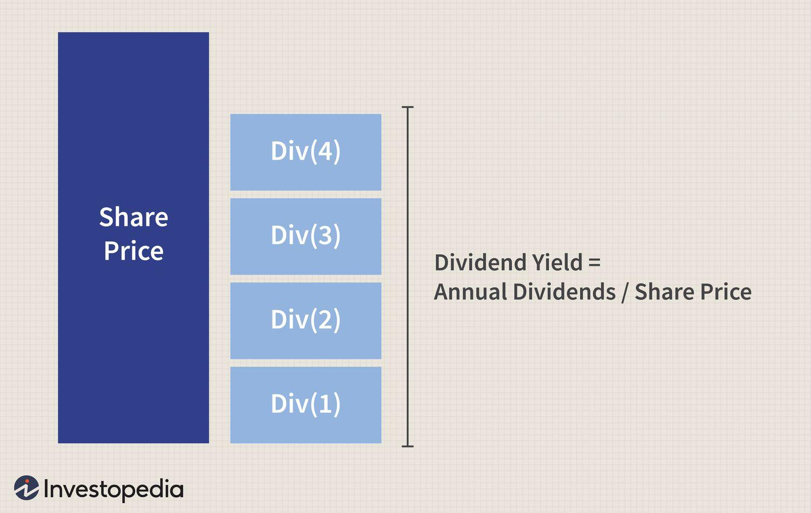

Dividend yield is a fundamental metric in investment strategies, representing the annual dividend income an investor receives relative to the price of the stock. Typically expressed as a percentage, it is calculated by dividing the annual dividends per share by the current market price per share. The dividend yield offers a direct insight into the income-generating ability of an equity investment, thus serving as a critical factor in stock analysis and investment decisions.

There are two primary types of dividend yields: trailing and forward. The trailing dividend yield is based on the dividends paid over the past 12 months, providing a historical perspective. In contrast, the forward dividend yield projects the anticipated dividends for the next 12 months, offering an outlook on potential income streams. Both types provide valuable insights but differ in their reliability and relevance depending on the market conditions and the company's performance.



Dividend yield plays an essential role in stock analysis as it helps investors assess the value and potential returns of a stock. A high dividend yield may indicate a good investment opportunity, especially for income-focused investors. However, it is vital to analyze such yields critically, as they can be influenced by declining stock prices or unsustainable payout ratios.

Algorithmic trading, the use of computer programs to execute trades based on predefined criteria, has also impacted dividend yield decisions. Algorithms can quickly assess various financial metrics, including dividend yields, to identify investment opportunities. By leveraging algorithmic trading, investors can enhance decision-making processes, ensuring they capitalize on dividend-paying stocks with sustainable yields.

The purpose of this article is to compare different types of dividend yields—specifically trailing and forward—and explore their significance within the context of trading strategies. Understanding these distinctions and their applications can assist investors in optimizing their portfolios for better returns, particularly when integrating algorithmic trading techniques.

## Table of Contents

## Understanding Dividend Yield

Dividend yield is a critical metric in investment analysis, representing a stock’s annual dividend payments as a percentage of its current market price. It serves as a measure of the income generated by a stock investment relative to its price, providing investors with a straightforward indicator of the potential cash flow from holding a particular stock.

The formula for calculating dividend yield is straightforward:

$$
\text{Dividend Yield} = \left( \frac{\text{Annual Dividends per Share}}{\text{Price per Share}} \right) \times 100 \%
$$

This formula highlights the relationship between the dividends a company pays and its stock price, making dividend yield a valuable tool for assessing the income potential of an investment.

It is important to differentiate between dividend yield and dividend rate. Dividend rate refers to the absolute amount of money paid per share as dividends, usually expressed on an annual basis. In contrast, dividend yield is a relative measure, expressing the dividend as a percentage of the stock’s current price. Therefore, while the dividend rate provides an absolute figure of income, the dividend yield offers better insight into the income's relative value against the stock price.

Evaluating stock performance using dividend yield involves understanding that a higher yield could indicate a more attractive investment from an income perspective. However, high dividend yields can also be indicative of a declining stock price or potential financial distress within a company, as the yield might be unsustainably high. Conversely, a low or moderate dividend yield may suggest stability or growth potential, particularly if the company's earnings are being reinvested into the business to drive further growth.

Investors often consider dividend yield amidst other financial metrics to make comprehensive stock performance evaluations. This approach ensures they do not overly rely on dividend yield alone, avoiding potential pitfalls associated with unsustainably high yields or rapidly fluctuating stock prices. By incorporating dividend yield into broader financial analysis, investors can better gauge a company's financial health and investment potential.

## Trailing vs. Forward Dividend Yield

Trailing dividend yield and forward dividend yield are critical concepts in dividend investing, providing different perspectives on stock income potential. Both serve as vital metrics for investors assessing dividend-paying stocks.

Trailing dividend yield is calculated based on the dividends a company has paid over the prior 12 months relative to its current stock price. The formula for calculating trailing dividend yield is:

$$
\text{Trailing Dividend Yield} = \frac{\text{Total Dividends Paid Over Past Year}}{\text{Current Stock Price}} \times 100\%
$$

This measure is straightforward as it reflects the actual dividends received by investors in the past year, offering a historical view of a company's dividend performance. Investors often regard trailing yield as a reliable indicator of a company's dividend consistency and its commitment to returning value to shareholders.

Conversely, forward dividend yield projects a company's future dividend payments relative to its present stock price. It is calculated based on expected dividends over the coming year. The formula for forward dividend yield is:

$$
\text{Forward Dividend Yield} = \frac{\text{Expected Dividends Over Next Year}}{\text{Current Stock Price}} \times 100\%
$$

Forward yield depends on estimates provided by the company or market analysts and reflects anticipated income from dividends. This prospective approach helps investors gauge potential investment returns by projecting future income streams.

When comparing these two yield types, trailing dividend yield is often seen as more reliable for its factual basis on past performance, whereas forward yield offers insight into future expectations and can be pivotal in evaluating growth prospects. Forward yields, however, [carry](/wiki/carry-trading) a level of uncertainty, as they depend on accurate forecasting of company earnings and dividend policy changes.

The predictability and reliability of forward dividend yields can be influenced by several factors, such as economic conditions, industry trends, and specific company circumstances. Analysts must consider these factors to provide realistic forward dividend estimates. Consequently, while forward dividend yields are invaluable for predicting future returns, they require careful scrutiny and should be supplemented with other financial assessments to enhance investment decisions.

## Algorithmic Trading and Dividend Yields

Algorithmic trading has become a dominant force in contemporary financial markets, leveraging technology to execute trades at speeds and frequencies that are impossible for human traders. This automated trading method utilizes pre-defined criteria and quantitative models to initiate and manage trades. Its prevalence extends across various asset classes, including equities, where dividend yields frequently influence trading decisions.

Algorithmic strategies can impact stock dividends and yields in several ways. By analyzing historical data and current market conditions, algorithms can predict the likelihood of dividend announcements and adjust positions accordingly. This proactive approach allows traders to capitalize on short-term price movements associated with dividend dates. Furthermore, the efficiency of algorithms can lead to enhanced market [liquidity](/wiki/liquidity-risk-premium) and reduced transaction costs, indirectly influencing the stability and attractiveness of dividend-yielding stocks.

The use of algorithms in evaluating and selecting stocks is particularly relevant when focusing on dividend yields. Algorithms can process vast datasets to identify stocks with favorable yield characteristics, such as consistent payout histories or attractive yield ratios relative to industry benchmarks. For instance, a filter might be designed to select stocks where the dividend yield exceeds a certain threshold, using Python as follows:

```python
import yfinance as yf

def filter_high_dividend_yield(stocks, yield_threshold):
    selected_stocks = []
    for stock in stocks:
        data = yf.Ticker(stock)
        if data.info['dividendYield'] is not None and data.info['dividendYield'] > yield_threshold:
            selected_stocks.append(stock)
    return selected_stocks

# Example: Filter stocks with dividend yield greater than 4%
stocks_to_evaluate = ['AAPL', 'MSFT', 'T', 'VZ']
high_yield_stocks = filter_high_dividend_yield(stocks_to_evaluate, 0.04)
print("High yield stocks:", high_yield_stocks)
```

Beyond selection, algorithms can also help optimize dividend yield strategies. By continuously monitoring stock performance and market conditions, algorithms can dynamically rebalance portfolios to maintain desired yield levels. This process involves real-time analysis and decision-making, ensuring that portfolios remain aligned with the investor's income and growth objectives.

Integrating [algorithmic trading](/wiki/algorithmic-trading) with dividend yield analysis offers several benefits. It enhances decision-making precision through quantitative measures, reduces emotional bias in trading, and optimizes the timing of trades to maximize yield opportunities. Additionally, the scalability of algorithmic trading systems permits the management of numerous assets simultaneously, making it particularly useful for large or complex portfolios.

Overall, the amalgamation of algorithmic trading principles with dividend yield strategies enables investors to capture yield opportunities more effectively while managing risks associated with market [volatility](/wiki/volatility-trading-strategies). As technology continues to advance, the role of algorithms in dividend investing is expected to expand, offering new avenues for achieving investment goals.

## Key Factors Influencing Dividend Yields

Dividend yield is a crucial metric for investors seeking stable returns from companies that distribute a portion of their earnings as dividends. Several factors substantially influence dividend yields, dictating a company's dividend policies and yield forecasts.

**Role of Company Earnings, Stock Prices, and Market Trends**

The primary driver of dividend yields is company earnings. A robust earnings report typically results in higher dividends, as companies distribute a portion of their profits to shareholders. The dividend yield ($DY$) can be calculated using the formula:

$$
DY = \frac{\text{Annual Dividends per Share}}{\text{Price per Share}} \times 100
$$

Hence, for a consistent dividend, an increase in earnings can either boost the absolute dividend value or stabilize the dividend payout despite share price fluctuations.

Stock prices are another vital determinant. A declining stock price, while suggesting underlying issues, can artificially inflate the dividend yield if the dividend amount remains unchanged. Conversely, a rising stock price can lower the dividend yield unless there is a proportional increase in the dividend payout.

Market trends, including investor sentiment and economic conditions, also impact dividend yields. During economic expansions, consistent growth is expected, leading to higher retained earnings and potential dividend increases. On the other hand, during downturns, companies might cut or suspend dividends to preserve cash, affecting the yield.

**Industry-Specific Influences on Expected Dividend Payouts**

Dividend policies are also influenced by the specific industry in which a company operates. Industries such as utilities and consumer staples often exhibit higher dividend yields due to stable and predictable cash flows. These sectors are typically mature, with limited growth prospects, allowing them to return more cash to shareholders.

In contrast, high-growth industries like technology often retain earnings to reinvest in business expansion, resulting in lower dividend yields. The capital-intensive nature of certain industries may also dictate lower dividends due to the need for re-investment into operations.

**Impact of Macroeconomic Conditions on Dividend Strategies**

Macroeconomic conditions greatly influence corporate dividend strategies. Interest rates are a critical [factor](/wiki/factor-investing); in a low-interest-rate environment, dividend-paying stocks become attractive for income-seeking investors, leading companies to maintain or increase dividend payouts to capitalize on this demand.

In times of inflation, companies might struggle to maintain dividend levels due to rising costs, potentially impacting dividend yields negatively. Additionally, regulatory and tax policies can either encourage or discourage dividend disbursements. For example, favorable tax treatment on dividends might prompt higher payouts.

Overall, understanding these factors enables investors to make informed decisions by assessing the sustainability and attractiveness of dividend yields. In doing so, they can better anticipate yield changes in response to internal performance metrics and external economic forces.

## Strategies to Maximize Returns from Dividend Investments

Building a portfolio centered on dividend investments requires strategic planning to maximize returns effectively. An essential component of this strategy is diversification, which helps mitigate risks associated with market volatility. By spreading investments across various sectors and industries, investors can protect their portfolios against significant losses from individual stock downturns. Diversification ensures a balanced approach, enhancing the potential for stable income streams.

Dividend Aristocrats play a crucial role in stable dividend investing. These are companies within the S&P 500 that have consistently increased their dividend payouts for at least 25 consecutive years. Investing in Dividend Aristocrats provides a level of assurance regarding reliability and growth potential in dividend income. These companies are often industry leaders with robust business models, making them attractive options for investors seeking consistent and long-term dividend returns.

Reinvestment plans, such as Dividend Reinvestment Plans (DRIPs), are another vital strategy for compounding dividend returns. DRIPs allow investors to automatically reinvest their cash dividends by purchasing additional shares or fractional shares of the dividend-paying company. This reinvestment can lead to exponential growth over time, as the accumulation of shares contributes to increased future dividend payouts. The compounding effect of reinvestment can substantially enhance the growth of an investor’s portfolio.

Selecting high-yield stocks with sustainable payouts requires careful analysis. A high dividend yield might indicate an undervalued stock or a company distributing a significant portion of its earnings as dividends. However, it's vital to assess the sustainability of these dividend payouts. Investors should analyze a company's payout ratio, earnings stability, and cash flow to ensure that the dividends are maintainable over the long term. A low payout ratio suggests that a company is not distributing all its earnings as dividends, leaving room for future dividend growth and financial flexibility.

In summary, maximizing returns from dividend investments involves a combination of strategic diversification, investing in Dividend Aristocrats, utilizing reinvestment plans, and selecting high-yield stocks with sustainable dividends. These strategies aim to provide a stable income while fostering portfolio growth, ultimately securing financial resilience in a fluctuating market environment.

## Challenges and Limitations of Using Dividend Yields

Dividend yields play a crucial role in investment decisions, offering insights into potential income streams from equity investments. However, relying solely on dividend yields presents a unique set of challenges and limitations that investors must understand to make informed decisions.

**Potential Risks of Solely Relying on Dividend Yields**

Investors focusing purely on dividend yields may overlook critical aspects of a company's financial health. A high dividend yield might appear attractive, but it can also indicate underlying issues such as declining stock prices. Since dividend yield is calculated as the annual dividends per share divided by the stock price, an unusually high yield might result from a rapidly decreasing stock price, potentially reflecting company-specific or market-wide concerns. This relationship underscores the importance of complementing dividend yield analysis with other financial metrics to ensure a holistic evaluation of an investment.

**Limitations of Forward Dividend Yield Projections**

Forward dividend yields estimate future dividend payments based on management's guidance or analysts' expectations. While useful, these projections are inherently uncertain and can be impacted by unforeseen company performance changes, economic shifts, or revisions in dividend policies. Moreover, discrepancies between projected and actual dividends can mislead investors, highlighting the need for cautious interpretation of forward yields.

**Understanding the Volatility and Risks of High Dividend Yields**

High dividend yields might attract investors seeking robust income streams. However, they are often accompanied by higher volatility and risk. Companies offering high yields may implement aggressive borrowing to fund dividend payments, which can lead to financial instability, especially if earnings decline or economic conditions worsen. Furthermore, some industries, like utilities, traditionally provide higher yields but also face unique regulatory and market challenges that might affect their ability to sustain those yields.

**Mitigating Risks through Comprehensive Analysis and Diversification**

To mitigate the risks associated with dividend yield reliance, investors should employ a comprehensive analysis incorporating various financial metrics, including earnings growth, payout ratios, and free cash flow. Additionally, diversification remains a fundamental strategy for managing investment risk. By incorporating dividend-paying stocks across different sectors and geographies, investors can reduce exposure to sector-specific downturns and enhance portfolio stability.

In practice, Python can aid in such analyses. For instance, comparing dividend yields across a portfolio can be efficiently handled using Python libraries like pandas and numpy for data manipulation and analysis. Here's a simple example of plotting dividend yields for a portfolio of stocks:

```python
import pandas as pd
import matplotlib.pyplot as plt

# Sample data for illustration
data = {'Stock': ['Stock A', 'Stock B', 'Stock C', 'Stock D'],
        'Dividend_Yield': [3.5, 4.2, 2.8, 6.0]}

# Create a DataFrame
df = pd.DataFrame(data)

# Plotting the dividend yields
plt.figure(figsize=(8, 6))
plt.bar(df['Stock'], df['Dividend_Yield'], color='skyblue')
plt.xlabel('Stocks')
plt.ylabel('Dividend Yield (%)')
plt.title('Dividend Yields of Portfolio Stocks')
plt.show()
```

This example illustrates how understanding and visualizing dividend yields within a broader investment strategy can aid in making more informed decisions. By integrating thorough analysis, diversification strategies, and technological tools, investors can better navigate the complexities associated with dividend yields and optimize their portfolios for the long term.

## Conclusion

In summary, the comparison and analysis of dividend yields—specifically trailing and forward dividend yields—reveal crucial insights for investors seeking to optimize their portfolios. Both yield types offer valuable perspectives: while trailing yields provide a historical view of a stock's performance, forward yields offer a speculative view based on expected future dividends. This dual analysis is vital as it enables investors to assess potential returns accurately.

Integrating dividend yield strategies with algorithmic trading presents significant advantages. Algorithmic trading can process vast amounts of financial data swiftly, identifying stocks with favorable yield profiles and executing trades with precision. By leveraging these algorithmic tools, investors can enhance their decision-making processes, particularly in dynamically assessing dividend yield metrics and making more informed investment choices.

Continuous learning and monitoring of market conditions are imperative in maintaining an edge in investment decisions. As market dynamics evolve, staying informed about changes in dividend policies, macroeconomic impacts, and industry trends is crucial for adjusting strategies effectively. Investors are encouraged to embrace technological advancements, such as [machine learning](/wiki/machine-learning) and big data analytics, to maintain a competitive advantage in their trading endeavors.

In closing, investors are urged to use these insights to refine their investment strategies actively. By understanding the nuances of dividend yields and leveraging algorithmic trading, they can build robust, yield-focused portfolios that aim for sustainable growth. Continuous analysis and strategic adaptability remain the cornerstones of successful dividend investing in today's ever-changing financial landscape.

## References & Further Reading

[1]: ["The Intelligent Investor: The Definitive Book on Value Investing"](https://www.amazon.com/Intelligent-Investor-Third-Definitive-Investing/dp/0063423537) by Benjamin Graham

[2]: Damodaran, A. (2012). ["Investment Valuation: Tools and Techniques for Determining the Value of Any Asset"](https://books.google.com/books/about/Investment_Valuation.html?id=5SRHAAAAQBAJ) John Wiley & Sons.

[3]: Malkiel, B. G. (2019). ["A Random Walk Down Wall Street: The Time-Tested Strategy for Successful Investing"](https://www.amazon.com/Random-Walk-Down-Wall-Street/dp/1324002182) W. W. Norton & Company.

[4]: Fabozzi, F. J., & Frank J. (2000). ["Fixed Income Analysis"](https://www.academia.edu/37142134/Fixed_Income_Analysis_by_Frank_J_Fabozzi) John Wiley & Sons.

[5]: ["Algorithmic Trading: Winning Strategies and Their Rationale"](https://www.amazon.com/Algorithmic-Trading-Winning-Strategies-Rationale-ebook/dp/B00CY5HC0U) by Ernie Chan