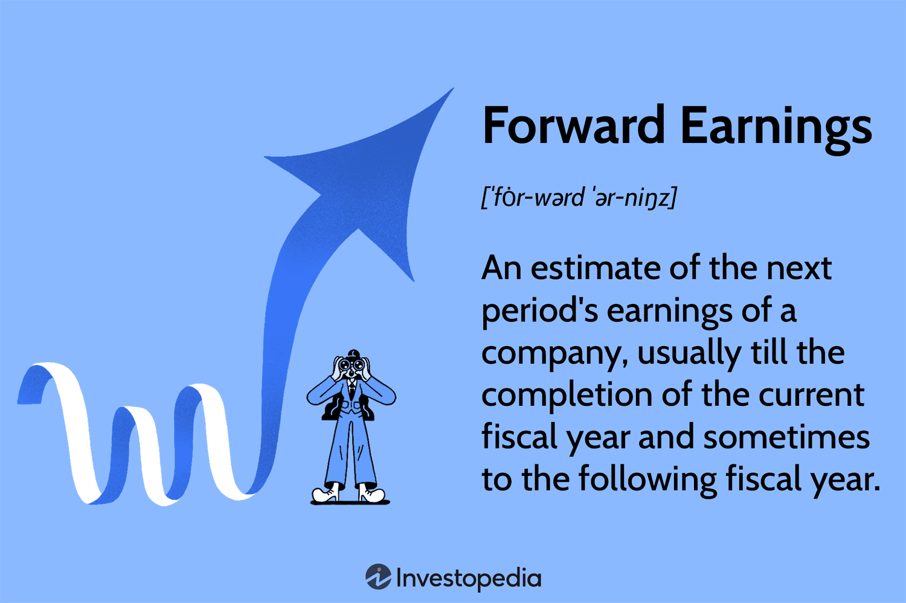

Understanding the landscape of financial markets often requires an exploration of complex concepts such as forward earnings, financial forecasting, and algorithmic trading. These components play a crucial role in shaping investment strategies and market dynamics. Forward earnings refer to the estimated future profitability of a company, providing investors and analysts a glimpse into potential financial outcomes and influencing stock valuation. Financial forecasting, utilizing both qualitative insights and quantitative analysis, projects future earnings and market conditions, serving as a foundational element of investment strategy. Algorithmic trading, which relies on pre-defined criteria for automating trades, integrates advanced analytics and artificial intelligence to enhance the precision and efficiency of trade execution based on forward earnings data.

This article aims to explore these critical elements, elucidating how they intertwine to influence investment strategies and market dynamics. By focusing on forward earnings and their impact on financial forecasting and algorithmic trading, we can gain valuable insights into how investors and analysts predict future financial outcomes. Through an in-depth analysis of each concept, the article will provide a comprehensive understanding of their significance in contemporary finance, from shaping investment decisions to optimizing trade execution.



Ultimately, this exploration will help readers grasp the tools and methodologies used to navigate the intricate world of financial forecasting. By understanding these interconnected components, investors and analysts can make informed decisions that align with market trends and economic shifts, bolstering their market standing and achieving more accurate financial analysis.

## Table of Contents

## What are Forward Earnings?

Forward earnings are the projected earnings of a company, typically estimated for the upcoming fiscal year. These projections are based on a variety of financial metrics and assumptions. Investors rely on these forecasts to assess a company’s potential profitability and forecast its future stock price performance. The forward earnings estimate acts as a vital indicator in evaluating a company’s market valuation, particularly through metrics such as the forward price-to-earnings (P/E) ratio. This metric compares the company's current share price to its projected earnings per share.

Analysts and corporate executives alike issue forward earnings estimates. Analysts base their forecasts on intricate analyses that incorporate factors like revenue growth, shifts in market demand, cost management, and broader economic trends. Earnings forecasts might rely on historical financial performance as well as qualitative information—like management guidance on strategic initiatives or anticipated market conditions.

The importance of accurate forward earnings forecasts cannot be overstated. They heavily influence investment decisions, serving as a key input for valuing stocks. A common model applied is the Gordon Growth Model, which can be expressed as:

$$
P = \frac{E_1}{r - g}
$$

Where:
- $P$ represents the stock price,
- $E_1$ is the expected earnings for the next year,
- $r$ is the required rate of return,
- $g$ is the growth rate of earnings.

Despite their utility, there are criticisms of forward earnings projections due to their inherent uncertainties. Forecasts can quickly become obsolete due to unexpected fluctuations in economic conditions, regulatory changes, or unforeseen events affecting a company’s operations. For example, abrupt geopolitical events or sudden shifts in consumer preferences can lead to significant deviations from forecasted earnings.

Analysts strive to mitigate these uncertainties by updating their models with new data and reassessing their assumptions. Still, investors must be wary of overreliance on these estimates. Diversifying investment strategies and using forward earnings as part of a broader analytical toolkit can help balance the risks associated with the predictive nature of forward earnings.

## The Role of Financial Forecasting in Investment

Financial forecasting is an essential component of investment strategy, functioning as a critical tool that allows investors and analysts to anticipate future financial performance and market conditions. By drawing on historical data and current market trends, financial forecasting helps project future earnings and market behavior, enabling stakeholders to devise informed investment strategies and manage risks effectively.

Financial forecasting employs a combination of qualitative insights and quantitative analysis. Qualitative insights may include management assessments, industry developments, and macroeconomic factors. These insights provide context and depth that purely quantitative data might not capture. Quantitative analysis, on the other hand, involves statistical and mathematical models which transform data into actionable predictions. This dual approach enhances the robustness and reliability of financial forecasts.

Several techniques are employed in financial forecasting. Simple trend analysis involves extrapolating existing data patterns into the future, offering a straightforward method of predicting future outcomes. More sophisticated methods include regression analysis, which assesses the relationship between variables to predict future trends, and time series forecasting, which models and predicts future values based on previously observed values. These techniques can be represented mathematically to offer structured and precise predictions.

```python
# A simple example of regression analysis in Python using scikit-learn
from sklearn.linear_model import LinearRegression
import numpy as np

# Sample data
X = np.array([[1], [2], [3], [4], [5]])
y = np.array([2, 4, 6, 8, 10])

# Create a linear regression model
model = LinearRegression().fit(X, y)

# Predict future value
predicted_y = model.predict(np.array([[6]]))

print(f"Predicted value for X=6 is {predicted_y[0]}")
```

The ability to produce accurate forecasts is critical, as these predictions inform investment decisions. By anticipating future earnings and market conditions, businesses can optimize their financial performance and strategic initiatives. Accurate forecasts allow investors to align their portfolios with expected market movements, enhancing returns and reducing potential losses.

The integration of financial forecasting with [algorithmic trading](/wiki/algorithmic-trading) systems further underscores its increasing utility in finance. Algorithmic systems, which employ complex algorithms to execute trades based on predefined criteria, benefit immensely from accurate financial forecasts. These systems can swiftly react to market changes, capitalizing on predicted trends and mitigating risks associated with unforeseen market fluctuations.

In conclusion, financial forecasting is indispensable in shaping effective investment strategies. It aids in creating reliable projections that are crucial for strategic financial planning and risk management. By leveraging a combination of qualitative and quantitative methodologies, along with modern algorithmic systems, financial forecasting continues to play a pivotal role in the dynamic environment of financial markets.

## Financial Forecasting Methodologies

A variety of methodologies exist to conduct financial forecasting, each catering to different analytical needs and investment strategies. Key techniques begin with [fundamental analysis](/wiki/fundamental-analysis), which scrutinizes a company's financial statements and overall market conditions to assess its intrinsic value. This approach involves analyzing balance sheets, income statements, and cash flow statements to predict future earnings. Fundamental analysts often consider economic indicators and industry trends to bolster their predictions.

Conversely, technical analysis focuses on price and [volume](/wiki/volume-trading-strategy) data, emphasizing patterns and trends identified from historical market behavior. Using charts and statistical measures, such as moving averages and oscillators, technical analysts seek to forecast future price movements without accounting for a company's intrinsic value.

Statistical methods, including time series analysis and regression models, play a significant role in forecasting future earnings based on historical data. Time series analysis allows forecasters to identify underlying patterns such as trends and seasonality by using autoregressive integrated moving average (ARIMA) models, which combine autoregressive and moving-average modeling to predict future points in the series. Regression analysis helps in understanding relationships between various financial metrics, where linear regression models might predict future earnings by correlating them with predictors like GDP growth or interest rates.

The advent of [machine learning](/wiki/machine-learning) techniques has revolutionized financial analysis, enabling sophisticated models that can process large datasets and uncover complex patterns. Algorithms such as neural networks and support vector machines have the capability to learn from and adapt to new data, offering predictions that improve over time. For instance, neural networks excel in modeling non-linear relationships, making them well-suited for capturing the complex dynamics of financial markets.

Each methodology offers distinct strengths and limitations, necessitating a blend of approaches to achieve robust and validated forecasts. For example, while fundamental analysis provides insights into a company's health, it may not capture short-term price movements effectively, calling for supplementary technical tools. Similarly, combining traditional statistical methods with machine learning can enhance prediction accuracy and resilience to changes in market conditions.

## Algorithmic Trading and Forward Earnings

Algorithmic trading has significantly transformed financial markets by enhancing the speed and accuracy of trade execution through automation based on pre-defined criteria. Within this context, the processing of vast datasets related to forward earnings enables algorithms to predict price movements and execute trades based on these forecasts. These algorithms predominantly use financial metrics such as the forward price-to-earnings (P/E) ratio, which is essential for evaluating whether a stock is overvalued or undervalued relative to its potential future earnings.

The forward P/E ratio is calculated as follows:

$$
\text{Forward P/E Ratio} = \frac{\text{Current Stock Price}}{\text{Estimated Future Earnings per Share (EPS)}}
$$

Incorporating real-time data into these calculations allows algorithmic systems to make informed and swift trading decisions. For example, if the forward P/E ratio of a stock is significantly lower compared to its historical average or industry peers, it may indicate a buying opportunity that an algorithm could capitalize on by automatically initiating a purchase order.

The integration of advanced analytics and [artificial intelligence](/wiki/ai-artificial-intelligence) in algorithmic trading further refines the accuracy of forecasts. Machine learning models, capable of handling extensive datasets, can uncover complex patterns and relationships that traditional statistical methods might miss. For instance, a machine learning model could be trained to predict stock price movements based on historical earnings announcements, economic indicators, and sentiment analysis of news articles.

Python code for a simple linear regression model predicting stock prices based on estimated earnings might look like this:

```python
from sklearn.model_selection import train_test_split
from sklearn.linear_model import LinearRegression
import numpy as np

# example data
stock_prices = np.array([100, 110, 120, 130, 140])  # historical stock prices
earnings_estimates = np.array([5, 5.5, 6, 6.5, 7])  # forward earnings estimates

# splitting data into training and test sets
X_train, X_test, y_train, y_test = train_test_split(earnings_estimates.reshape(-1, 1), stock_prices, test_size=0.2, random_state=42)

# creating and training the model
model = LinearRegression()
model.fit(X_train, y_train)

# making predictions
predicted_stock_prices = model.predict(X_test)
```

The success of these algorithms in algorithmic trading is heavily reliant on the input data's quality and timeliness. Accurate and reliable earnings estimates are crucial, as any inaccuracies or delays in obtaining this data can lead to erroneous trading decisions. Therefore, continuous data evaluation and model recalibration are essential to maintain effectiveness in forecasting and trading.

In conclusion, algorithmic trading, when used in conjunction with robust financial forecasting techniques, provides a powerful mechanism for traders to navigate earnings-related market movements and enhance their trading strategies. As these technologies evolve, their capacity to offer sophisticated insights into financial markets is expected to grow, further solidifying their role in contemporary finance.

## Challenges in Earnings Forecasting and Algo Trading

Earnings forecasting and algorithmic trading, despite their potential, must navigate a complex landscape fraught with challenges. The inherent unpredictability of financial markets poses a primary challenge. Economic indicators, company-specific events, and broader market trends can shift unexpectedly, rendering even the most robust forecasts and algorithms ineffective.

One significant issue is the reliance on data accuracy and the potential for bias in forecasts. Data sets used for forecasting are often expansive, and any inaccuracies can cascade through analytical models, leading to erroneous conclusions. Similarly, bias, whether in the data itself or introduced during analysis, can skew predictions and result in poor trading decisions. For instance, over-reliance on historical data may ignore emerging market trends or novel economic conditions, thereby producing forecasts that miss crucial future shifts.

Moreover, market [volatility](/wiki/volatility-trading-strategies), driven by geopolitical events, regulatory changes, or sudden economic shifts, adds to the complexity of forecasting. These fluctuations can impact asset prices in unpredictable ways, challenging both forecasters and algorithmic traders. The suddenness of these changes requires forecasting models to be not only accurate but also agile, capable of integrating new information swiftly to adjust predictions and strategies.

To mitigate these challenges, robust risk management strategies are essential. This involves developing adaptive algorithms that can dynamically respond to new data and market conditions. For instance, machine learning models that incorporate real-time data streams can adjust their parameters on-the-fly, improving responsiveness to market changes. These models often use strategies such as ensemble learning, which combines multiple forecasting models to enhance accuracy and reliability.

Here is a simple Python example demonstrating the use of ensemble methods for improving forecast accuracy:

```python
from sklearn.model_selection import train_test_split
from sklearn.ensemble import RandomForestRegressor, GradientBoostingRegressor
from sklearn.metrics import mean_squared_error
import numpy as np

# Sample data
X = np.random.rand(100, 5)
y = np.random.rand(100)

# Split data
X_train, X_test, y_train, y_test = train_test_split(X, y, test_size=0.2, random_state=42)

# Ensemble models
model_rf = RandomForestRegressor(n_estimators=100)
model_gb = GradientBoostingRegressor(n_estimators=100)

# Train models
model_rf.fit(X_train, y_train)
model_gb.fit(X_train, y_train)

# Predict and evaluate
preds_rf = model_rf.predict(X_test)
preds_gb = model_gb.predict(X_test)

# Combined prediction
ensemble_preds = (preds_rf + preds_gb) / 2

# Evaluate combined model
mse = mean_squared_error(y_test, ensemble_preds)
print(f'Ensemble MSE: {mse:.4f}')
```

Continuous model evaluation and refinement are crucial to maintaining the relevance and effectiveness of forecasting tools. This involves not only updating input data but also adjusting model parameters and learning algorithms in light of new information. By adopting an iterative approach, incorporating feedback loops into forecasting and trading systems, practitioners can better adapt to the shifting sands of financial markets, improving both predictive accuracy and trading performance over time. 

In conclusion, the integration of thorough data validation processes and the adoption of flexible, adaptive algorithms are key to overcoming these challenges, allowing investors to better navigate the uncertainties of financial markets.

## Conclusion

The interconnectedness of forward earnings, financial forecasting, and algorithmic trading presents both opportunities and challenges in modern investment strategies. By understanding these elements, investors and financial analysts can craft strategies that offer competitive advantages and improved investment outcomes. Forward earnings provide critical insights into potential future profitability, serving as a foundation for estimating stock valuation. This, in turn, influences financial forecasting, which utilizes past and present data to project future market conditions and company performance.

While financial forecasting can employ various methodologies like fundamental analysis and machine learning to enhance accuracy, no single method guarantees correctness. Thus, integrating multiple forecasting techniques can reflect a more comprehensive analysis, reducing uncertainty and aiding in decision-making. Similarly, algorithmic trading systems, which execute trades automatically based on pre-set rules tied to financial forecasts, can increase precision and speed in trade execution. However, their effectiveness hinges on the accuracy and timeliness of the input data, emphasizing the importance of reliable earnings forecasts.

To navigate these complexities, investors and traders must remain vigilant, continually refining their models and strategies to adapt to new information and changing market dynamics. This requires a dynamic approach to risk management and an openness to leveraging new technological advancements and analytical tools.

As technology continues to progress, the financial forecasting and algorithmic trading landscape will evolve, potentially offering more sophisticated tools and techniques for enhanced financial analysis. For investors and analysts, embracing these innovations and integrating them into traditional financial theories holds the potential to significantly elevate their strategic capabilities in predicting and responding to market fluctuations. By maintaining an adaptive and informed approach, market participants can better position themselves to capitalize on emerging opportunities and mitigate risks in an ever-evolving financial ecosystem.

## References & Further Reading

[1]: Bergstra, J., Bardenet, R., Bengio, Y., & Kégl, B. (2011). ["Algorithms for Hyper-Parameter Optimization."](https://dl.acm.org/doi/10.5555/2986459.2986743) Advances in Neural Information Processing Systems 24.

[2]: ["Advances in Financial Machine Learning"](https://www.amazon.com/Advances-Financial-Machine-Learning-Marcos/dp/1119482089) by Marcos Lopez de Prado

[3]: ["Evidence-Based Technical Analysis: Applying the Scientific Method and Statistical Inference to Trading Signals"](https://www.amazon.com/Evidence-Based-Technical-Analysis-Scientific-Statistical/dp/0470008741) by David Aronson

[4]: ["Machine Learning for Algorithmic Trading"](https://github.com/stefan-jansen/machine-learning-for-trading) by Stefan Jansen

[5]: ["Quantitative Trading: How to Build Your Own Algorithmic Trading Business"](https://www.amazon.com/Quantitative-Trading-Build-Algorithmic-Business/dp/1119800064) by Ernest P. Chan