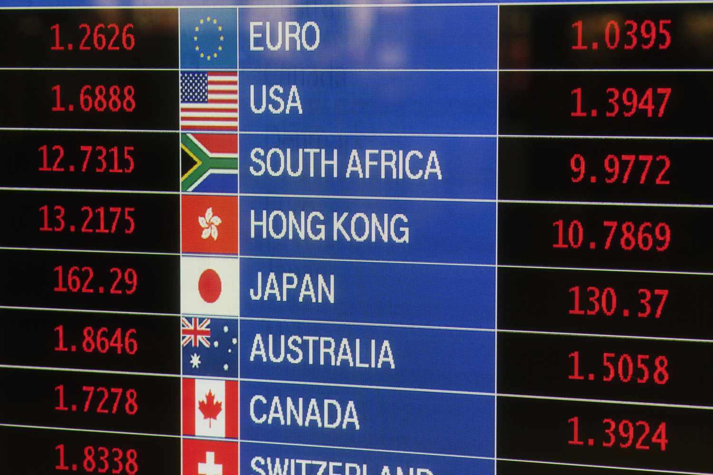

In today's globalized economy, managing currency risk has become essential for businesses that conduct operations across international borders. As companies engage in cross-border transactions, they are exposed to fluctuations in exchange rates that can significantly impact their financial outcomes. This exposure necessitates efficient strategies to manage and mitigate the inherent risks associated with currency volatility.

Forward Exchange Contracts (FECs) have emerged as a foundational tool for businesses seeking to hedge against these fluctuations. An FEC is an agreement between two parties to exchange a specified amount of one currency for another at an agreed-upon exchange rate on a future date. By locking in exchange rates, FECs protect businesses from adverse movements in currency values, facilitating more predictable and stable financial planning.



With the rise of advanced technologies, algorithmic trading has introduced new efficiencies and capabilities in managing FECs. Algorithmic trading utilizes computer programs and complex algorithms to execute trades at speeds and efficiencies beyond human capacity. This advancement allows for the precise and timely management of forward contracts, optimizing currency hedging strategies to align with market conditions.

This article explores the interconnectedness of Forward Exchange Contracts, currency hedging strategies, and algorithmic trading, highlighting how they collectively enhance a business's ability to navigate the challenges of currency risk in the global marketplace.

## Table of Contents

## Understanding Forward Exchange Contracts (FECs)

Forward Exchange Contracts (FECs) are pivotal instruments in international finance, designed to provide businesses with a mechanism to manage currency risk in a volatile global market. These contracts are over-the-counter (OTC) agreements, meaning they are privately negotiated between two parties, typically a business and a financial institution, rather than being traded on an exchange.

The fundamental purpose of an FEC is to lock in a specific exchange rate for a currency transaction that will occur at a future date. This predetermined rate provides a hedge against the adverse effects of currency fluctuations, ensuring price stability in future transactions. By securing an agreed-upon rate, companies can mitigate the uncertainty associated with foreign exchange movements, which could otherwise impact their financial outcomes significantly.

Key components of Forward Exchange Contracts include:

1. **Currency Pair**: This specifies the two currencies involved in the transaction, often presented in the format of a base currency versus a quote currency. For instance, in a USD/EUR FEC, USD is the base currency while EUR is the quote currency.

2. **Notional Amount**: This refers to the total amount of the base currency that the contract will cover. The notional amount is crucial for calculating the total cost or revenue expected from the transaction.

3. **Settlement Date**: This is the future date on which the actual currency exchange will occur. It could range from a few days to several months, depending on the terms agreed upon by the parties involved.

4. **Delivery Rate**: This is the exchange rate at which the currencies will be exchanged on the settlement date. It is determined at the inception of the contract based on current market conditions and the involved parties' expectations.

FECs are particularly beneficial for managing currency risk in non-deliverable or illiquid currencies, where typical market mechanisms might not provide sufficient [liquidity](/wiki/liquidity-risk-premium) or price transparency. By providing a custom-tailored agreement, businesses can effectively manage their financial exposures in these scenarios, ensuring that operations and investment plans are not disrupted by unforeseen currency [volatility](/wiki/volatility-trading-strategies).

In sum, Forward Exchange Contracts serve as an essential tool for businesses engaged in international trade, allowing for the strategic management of currency exposure and stabilization of cash flows.

## The Mechanics of Currency Hedging

Currency hedging is a strategic financial practice aimed at reducing the risks associated with fluctuations in exchange rates. By employing various financial instruments, businesses can protect themselves from the adverse impacts of unexpected currency movements, ensuring greater financial stability and precision in budgeting.

One of the primary hedging strategies is the use of forward exchange contracts (FECs). These over-the-counter (OTC) agreements enable firms to lock in a specific exchange rate for a future date, thereby mitigating the risk of unfavorable currency changes. The customizability of FECs allows businesses to tailor them according to their specific needs, such as the currency pair, notional amount, settlement date, and desired delivery rate. This flexibility positions FECs as a favored tool, particularly for managing transactions involving less liquid or non-deliverable currencies.

In addition to forward contracts, there are other noteworthy hedging instruments. Options offer the right, but not the obligation, to exchange currencies at an agreed-upon rate before a specified expiry date. This provides a level of protection while allowing the business to benefit from favorable market movements should they occur. Swaps, on the other hand, involve the exchange of cash flows between two parties and are typically used for longer-term exposure management. Futures contracts, although similar to forwards, are standardized and traded on exchanges, offering liquidity but less customization compared to OTC agreements.

The integration of these instruments into a comprehensive hedging strategy allows businesses to predict costs more accurately and safeguard their profit margins. By stabilizing cash flows and reducing volatility, companies can make more informed financial decisions and maintain a competitive edge even amidst changing market conditions.

Here's an example Python code snippet demonstrating how one might model the impact of currency fluctuations on a hypothetical business transaction using a simple forward contract:

```python
def calculate_hedged_exchange_rate(current_rate, forward_points):
    return current_rate + forward_points

def assess_financial_impact(transaction_amount, current_rate, forward_rate):
    unhedged_cost = transaction_amount * current_rate
    hedged_cost = transaction_amount * forward_rate
    return hedged_cost, unhedged_cost, unhedged_cost - hedged_cost

# Example variables
current_exchange_rate = 1.25  # current rate
forward_points = 0.05  # points to add or subtract based on market conditions
transaction_amount = 100000  # amount in foreign currency

forward_exchange_rate = calculate_hedged_exchange_rate(current_exchange_rate, forward_points)
hedged, unhedged, savings = assess_financial_impact(transaction_amount, current_exchange_rate, forward_exchange_rate)

print(f"Hedged Cost: {hedged}")
print(f"Unhedged Cost: {unhedged}")
print(f"Savings through Hedging: {savings}")
```

This model provides insights into the potential savings achieved through hedging, reinforcing the importance of strategic planning in international finance. Utilizing forward contracts and other hedging instruments effectively allows businesses to achieve greater predictability and resilience in their financial operations.

## Algorithmic Trading in Currency Markets

Algorithmic trading is a technologically advanced method that utilizes sophisticated computer algorithms to automate trading tasks based on predefined criteria. In the currency markets, especially where Forward Exchange Contracts (FECs) are concerned, [algorithmic trading](/wiki/algorithmic-trading) provides considerable advantages by enhancing the efficiency and precision of executing trades. These algorithms are designed to process vast amounts of data at unprecedented speeds, making it possible to respond to market changes in fractions of a second. This efficiency is crucial in currency markets, known for their high volatility and rapid fluctuations.

The integration of algorithmic trading into currency markets offers substantial improvements to traditional trading methods. Key advantages include increased speed, ensuring that trades are executed at the most favorable prices before market conditions shift. Precision is another significant benefit, as algorithms can execute trades with exact sizing and timing to achieve the desired outcomes while minimizing slippage and transaction costs.

In managing FECs, algorithms can optimize both the timing and pricing of contracts. For instance, an algorithm can analyze historical and real-time data to determine the optimal moment to enter into an FEC. This optimization may involve calculating potential future movements in currency rates based on market trends and economic indicators, thus locking in the best possible exchange rates for future transactions. The process might use mathematical models such as moving averages or more complex predictors like auto-regressive models.

Python is a popular programming language for implementing such algorithms. A simple example of a trading algorithm could involve assessing moving averages to generate buy or sell signals:

```python
def moving_average(prices, window_size):
    weights = np.repeat(1.0, window_size) / window_size
    moving_averages = np.convolve(prices, weights, 'valid')
    return moving_averages

prices = [1.3, 1.32, 1.31, 1.35, 1.37, 1.36, 1.39, 1.40, 1.38, 1.37]
short_window = moving_average(prices, 3)
long_window = moving_average(prices, 5)

buy_signals = (short_window > long_window)[:-1] & (short_window[:-1] <= long_window[1:])
sell_signals = (short_window < long_window)[:-1] & (short_window[:-1] >= long_window[1:])
```

In addition to enhancing operational efficiencies, algorithmic trading dramatically reduces human error, which can occur due to emotional decision-making or miscalculation. Algorithms execute orders based on logic and data-driven insights that are devoid of the biases that can affect human traders. Moreover, they enable real-time data analysis, allowing traders to adjust strategies dynamically as new information becomes available.

These technological advancements are transforming currency trading by making it more predictable and systematic, which can lead to improved financial outcomes for businesses engaging in international transactions. As the field progresses, [artificial intelligence](/wiki/ai-artificial-intelligence) and [machine learning](/wiki/machine-learning) are expected to further refine these capabilities, enabling algorithms to learn from past trading outcomes and enhance their predictive accuracy over time. As such, algorithmic trading continues to push the boundaries of what is possible in managing currency risks effectively.

## Integrating FECs with Algorithmic Trading

Combining Forward Exchange Contracts (FECs) with algorithmic trading can significantly enhance risk management capabilities for businesses involved in international trade. This integration allows for the automation of complex hedging strategies, leading to more precise execution and potentially superior financial outcomes.

Algorithms can identify optimal hedge ratios by analyzing historical exchange rate data and market conditions, thereby optimizing the timing and pricing of FEC contracts. This automation reduces the manual effort required and minimizes the possibility of human error. The application of quantitative techniques such as the Black-Scholes model or the use of Monte Carlo simulations can aid in determining these optimal ratios. For example, the hedge ratio $h$ can be expressed and computed using a formula involving the covariance and variance of currency returns:

$$
h = \frac{\text{Cov}(R, F)}{\text{Var}(F)}
$$

where $R$ represents spot rate returns and $F$ the forward rate returns. Such calculations can be implemented efficiently in Python using libraries like NumPy and pandas.

The utilization of Artificial Intelligence (AI) and machine learning further refines this process by predicting currency movements with high accuracy. Machine learning models, including neural networks or decision trees, can analyze and learn from large datasets to output predictions and strategies that adjust dynamically to market shifts. For instance, using Python's TensorFlow or scikit-learn libraries, one can develop predictive models that analyze patterns in exchange rate changes, enhancing the precision of FEC management strategies.

By integrating these technologies, companies achieve better financial outcomes by leveraging real-time analysis and predictive capabilities. Algorithmic solutions facilitate seamless execution across various time zones and market conditions, providing businesses with the agility to respond promptly to market volatility. These enhancements not only lead to improved financial stability but also reduce the exposure to currency risk, ultimately contributing to a competitive advantage in the global market.

In conclusion, the fusion of FECs with algorithmic trading presents a forward-thinking approach to currency risk management, combining the foresight of predictive analytics with the reliability of automated processes. This merger underscores the potential of technology to transform traditional hedging practices, encouraging businesses to adopt innovative strategies for safeguarding their international financial transactions.

## Case Studies and Examples

In the modern financial landscape, several companies have successfully integrated Forward Exchange Contracts (FECs) and algorithmic trading into their currency risk management strategies. For instance, multinational corporations like General Electric and Procter & Gamble have utilized FECs to protect their overseas revenues from unfavorable currency fluctuations. By locking in exchange rates for future transactions, these companies ensure that their financial forecasts are not disrupted by sudden changes in currency values. Furthermore, algorithmic trading has allowed these enterprises to execute transactions swiftly and accurately, minimizing the risk of human error and optimizing their hedging strategies.

Consider a hypothetical case of a US-based company, ABC Corp, which regularly imports goods from Canada and faces exposure to USD/CAD currency fluctuations. To mitigate this risk, ABC Corp enters into an FEC to purchase CAD at a predetermined rate of 1.25, six months in advance for an expected payment of CAD 1 million. By doing so, ABC Corp locks in the cost of CAD in USD terms, ensuring price stability and predictability in its cost structure for the upcoming transaction. Without such a contract, any depreciation of USD against CAD could significantly increase costs.

The integration of algorithmic trading into the management of FECs can further enhance this risk management process. Algorithms can be programmed to analyze market conditions and execute FECs at optimal times, thereby potentially securing even more favorable rates. For example, if market trends suggest an impending appreciation of USD against CAD, the algorithm might delay executing the FEC to capitalize on the strengthening dollar.

One of the primary benefits of deploying algorithmic trading in conjunction with FECs is the cost-efficiency it offers. Algorithms can reduce the need for manual intervention and enable more precise entry points for hedging transactions. This automation can lead to significant savings in transaction costs and a reduction in hedge-related expenses, thereby improving the overall financial outcome for the company.

A cost-benefit analysis reveals that the upfront investment in algorithmic trading infrastructure can be offset by the gains in efficiency and savings over time. For instance, companies may experience lower spreads, reduced slippage, and an enhanced ability to capture favorable rates, ultimately leading to a more robust and resilient currency hedging strategy. The cost-saving potential compounded over multiple transactions can substantiate the initial technology expenditure, justifying the investment in advanced algorithmic solutions for managing FECs. 

In summary, real-world applications and hypothetical scenarios alike demonstrate the substantial value-added by combining FECs with algorithmic trading. Through strategic implementation, businesses can achieve greater stability in financial outcomes and align their hedging strategies with broader corporate objectives.

## Conclusion

Forward Exchange Contracts (FECs), when paired with the capabilities of algorithmic trading, create a formidable approach to managing currency risk in international business operations. As businesses face the challenges of a globalized economy, these tools provide a strategic advantage by allowing companies to hedge against unpredictable currency fluctuations effectively.

The integration of FECs and algorithmic trading empowers companies to handle volatile currency markets with increased confidence and accuracy. FECs grant businesses the ability to lock in exchange rates for future transactions, thus safeguarding against adverse currency movements that could adversely affect the financial stability of a company. With algorithmic trading, this process is enhanced by the introduction of automated systems that can execute trades with unmatched speed and precision. These systems rely on predefined criteria and real-time data analysis to optimize the timing and pricing of FEC contracts, ensuring that the business capitalizes on the most favorable conditions available.

As technology continues to advance, the future of currency hedging will be increasingly shaped by solutions that leverage real-time, data-informed decision-making processes. Algorithmic trading systems, driven by sophisticated algorithms and machine learning capabilities, will refine the management of currency hedges, making it possible to predict currency movements with greater accuracy. This technological evolution not only reduces human error but also enables more complex and effective hedging strategies that align with a company's specific risk management objectives.

Continuous innovation and the integration of advanced trading practices are imperative for businesses aiming to maintain a competitive edge in currency management. By embracing these evolving tools, companies can not only protect their financial health but also strategically position themselves in the ever-changing currency markets. The synergy between FECs and algorithmic trading thus represents a pivotal development in the field, offering enhanced risk management capabilities that will define the future of global trade and financial transactions.

## References & Further Reading

[1]: ["Foreign Exchange and Money Markets: Managing Foreign and Commercial Risk"](https://www.newyorkfed.org/financial-services-and-infrastructure/financial-market-infrastructure-and-reform/managing-foreign-exchange/) by Reuters Limited

[2]: Chandrasekhar, C.P., & Ghosh, J. (2009). ["Managing Capital Flows: The Case of India."](https://www.jstor.org/stable/23601996) UNCTAD Discussion Paper.

[3]: Hull, J. C. (2017). ["Options, Futures, and Other Derivatives"](https://www.semanticscholar.org/paper/Options%2C-Futures%2C-and-Other-Derivatives-Hull/89bdee500c8623864fc9eb7a471546aa713acc44) (10th ed.). Pearson.

[4]: ["Algorithmic and High-Frequency Trading"](https://assets.cambridge.org/97811070/91146/frontmatter/9781107091146_frontmatter.pdf) by Álvaro Cartea, Sebastian Jaimungal, & José Penalva

[5]: Burnside, C. (2012). ["Exchange Rate Regimes: Fix or Float?"](https://m.elibrary.imf.org/downloadpdf/journals/022/0045/001/article-A011-en.pdf) International Monetary Fund Working Paper.

[6]: ["The Foreign Exchange and Money Markets Guide"](https://archive.org/details/foreignexchangem00walm) by Julian Walmsley

[7]: ["High-Frequency Trading: A Practical Guide to Algorithmic Strategies and Trading Systems"](https://www.amazon.com/High-Frequency-Trading-Practical-Algorithmic-Strategies/dp/0470563761) by Irene Aldridge