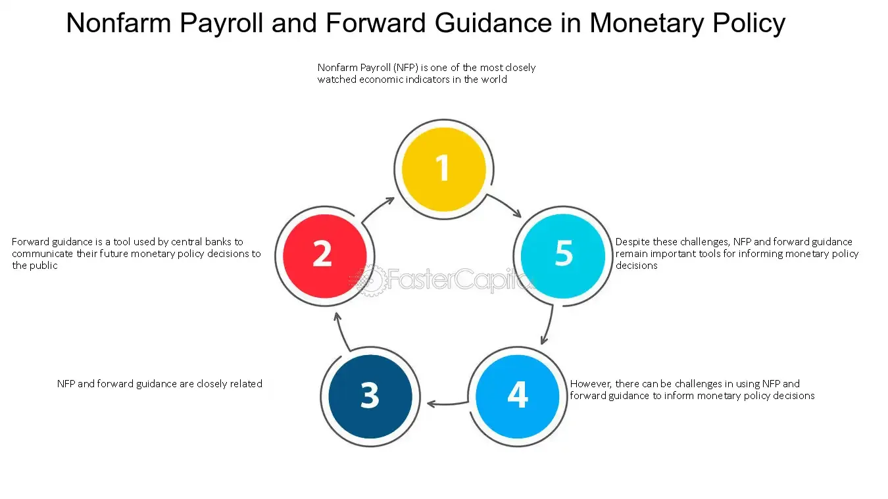

## Table of Contents

## What is forward guidance in monetary policy?

Forward guidance is a tool used by central banks to communicate their future plans for monetary policy. It helps people understand what the central bank might do with interest rates or other policies in the future. By giving this information, the central bank hopes to influence economic decisions made by businesses and households today.

For example, if a central bank says it will keep interest rates low for a long time, people might feel more confident about borrowing money to buy a house or start a business. This can help boost economic activity. Forward guidance can be given through speeches, official statements, or reports, and it's an important way for central banks to manage expectations and guide the economy.

## How does forward guidance influence economic expectations?

Forward guidance helps shape what people think will happen with the economy in the future. When a central bank tells everyone that it plans to keep interest rates low for a while, people might expect borrowing money to stay cheap. This can make businesses feel more confident about taking loans to grow or start new projects. Households might also feel more comfortable taking out mortgages or other loans because they know the cost of borrowing won't go up soon.

This change in expectations can lead to more spending and investment in the economy. If people believe that the central bank will keep rates low, they might spend more money now rather than saving it for later. This increased spending can help boost economic growth. On the other hand, if the central bank signals that it might raise rates soon, people might hold off on big purchases or investments, expecting borrowing to become more expensive. So, forward guidance is a powerful tool that central banks use to guide the economy by managing what people expect to happen.

## What are the main objectives of using forward guidance?

The main goal of using forward guidance is to help people make better economic decisions. When a central bank tells everyone what it plans to do with interest rates or other policies, it gives people a clearer picture of the future. This helps businesses decide whether to borrow money for new projects or to hold off. It also helps households know if it's a good time to take out a loan for a house or a car. By giving this information, the central bank hopes to make the economy more stable and predictable.

Another important objective of forward guidance is to manage inflation. If a central bank says it will keep interest rates low, it can encourage spending and help the economy grow. But if inflation starts to rise too quickly, the central bank can use forward guidance to signal that it might raise rates soon. This can help slow down spending and keep prices from rising too fast. So, forward guidance is a way for the central bank to guide the economy in the right direction by shaping what people expect will happen.

## Can you explain the difference between qualitative and quantitative forward guidance?

Qualitative forward guidance is when a central bank gives information about its future plans using words and descriptions instead of numbers. For example, a central bank might say that it plans to keep interest rates low for a "considerable time" or until the economy improves. This type of guidance helps people understand the central bank's goals and intentions without giving exact details. It's like saying "we'll keep rates low until things get better," which can make people feel more confident about the future.

Quantitative forward guidance, on the other hand, is when a central bank uses specific numbers and targets to explain its future plans. For example, a central bank might say that it will keep interest rates at 0.5% until unemployment falls below 5%. This type of guidance gives people a clear idea of what the central bank is aiming for and when it might change its policies. It's like saying "we'll keep rates at this level until we reach this specific goal," which can help people plan their financial decisions more accurately.

## How do central banks implement forward guidance?

Central banks implement forward guidance by talking to people about what they plan to do with interest rates and other policies. They do this through speeches, official statements, and reports. For example, the head of the central bank might give a speech saying that they plan to keep interest rates low for a long time. This helps everyone know what to expect, so businesses and households can make better decisions about borrowing and spending money.

Sometimes, central banks give very specific details about their plans, like saying they will keep interest rates at a certain level until unemployment reaches a certain number. Other times, they might use more general language, like saying they will keep rates low for a "considerable time." Both ways help guide what people think will happen with the economy, which can make things more stable and predictable.

## What are some historical examples of forward guidance?

One famous example of forward guidance happened in the United States after the 2008 financial crisis. The Federal Reserve, which is the central bank of the U.S., said it would keep interest rates near zero for a long time. They wanted to help the economy recover by making borrowing money cheap. This was a big deal because it told everyone that the Fed was going to keep rates low until things got better, which helped businesses and people feel more confident about spending and investing.

Another example comes from the Bank of England. In 2013, they said they would not raise interest rates until unemployment fell below 7%. This was a clear message that helped people understand when rates might go up. By giving this specific target, the Bank of England helped everyone plan their financial decisions better. It showed how central banks can use numbers to guide what people expect will happen with the economy.

## How effective is forward guidance in managing inflation and economic growth?

Forward guidance can be very effective in managing inflation and helping the economy grow. When a central bank tells everyone that it plans to keep interest rates low for a while, people might feel more confident about borrowing money. This can lead to more spending and investment, which helps the economy grow. If the central bank sees that inflation is getting too high, they can use forward guidance to say they might raise rates soon. This can make people spend less, which helps keep prices from rising too fast. So, by telling people what they plan to do, central banks can guide the economy in the right direction.

However, forward guidance isn't always perfect. Sometimes, people might not believe what the central bank says, especially if the economy is unpredictable. If people don't trust the central bank's plans, they might not change their spending and borrowing habits. Also, if the central bank gives too much information or changes its mind a lot, it can confuse people. This can make it harder for the central bank to manage inflation and growth. But when used well, forward guidance can be a powerful tool to help keep the economy stable and growing.

## What are the potential risks and limitations of forward guidance?

Forward guidance can be tricky because it's hard to predict the future. If a central bank says it will keep interest rates low for a long time, but then something unexpected happens, like a big economic shock, they might have to change their plans. This can make people lose trust in what the central bank says. If people don't believe the central bank, they might not change their spending and borrowing habits, which can make it harder for the central bank to manage the economy.

Another risk is that forward guidance can be confusing if it's too detailed or if the central bank changes its mind a lot. If people get mixed messages, they might not know what to expect, which can make the economy less stable. Also, if the central bank gives too much information, it might limit its own flexibility to respond to new problems. So, while forward guidance can be helpful, it needs to be used carefully to avoid these risks and limitations.

## How does forward guidance interact with other monetary policy tools?

Forward guidance works together with other tools that central banks use to manage the economy. One of these tools is setting interest rates. When a central bank uses forward guidance to say it will keep rates low for a long time, it makes the effect of low interest rates even stronger. This is because people know that borrowing money will stay cheap, so they might borrow more and spend more. This can help the economy grow. Another tool is buying and selling government bonds, which is called quantitative easing. If a central bank is doing quantitative easing and also says it will keep rates low, it sends a strong message that it wants to help the economy grow.

But forward guidance can also affect how well these other tools work. If people don't believe what the central bank says, they might not change their behavior even if interest rates are low or the central bank is buying bonds. This can make it harder for the central bank to manage inflation and economic growth. Also, if the central bank gives too much information or changes its mind a lot, it can confuse people. This might make them unsure about what to expect, which can make the economy less stable. So, forward guidance needs to be used carefully to work well with other monetary policy tools.

## Can forward guidance be used in times of economic crisis, and if so, how?

Yes, forward guidance can be used in times of economic crisis. During a crisis, like a financial crash or a big economic shock, people are often scared and unsure about the future. If a central bank uses forward guidance to say it will keep interest rates low for a long time, it can help calm people down. They might feel more confident about borrowing money to keep their businesses running or to buy things they need. This can help the economy start to recover by encouraging spending and investment.

But using forward guidance in a crisis can be tricky. If the central bank gives too much detail or changes its mind a lot, it can confuse people. They might not believe what the central bank says, which can make it harder for the economy to get better. So, during a crisis, the central bank needs to be clear and consistent with its forward guidance. This way, it can help guide the economy back to health by managing what people expect will happen.

## What are the latest research findings on the impact of forward guidance?

Recent research shows that forward guidance can have a big impact on the economy, but it depends on how people believe what the central bank says. If people trust the central bank and think it will do what it says, forward guidance can help a lot. It can make people feel more confident about borrowing money and spending, which can help the economy grow. But if people don't believe the central bank, forward guidance might not work as well. They might not change their spending and borrowing habits, which can make it harder for the central bank to manage the economy.

Another finding from recent studies is that the way forward guidance is given matters a lot. If the central bank gives clear and simple messages, people are more likely to understand and believe them. But if the messages are too complicated or if the central bank changes its mind a lot, people can get confused. This can make the economy less stable. So, the latest research suggests that forward guidance can be a powerful tool, but it needs to be used carefully to work well.

## How do different countries' central banks vary in their use of forward guidance?

Different countries' central banks use forward guidance in their own ways. In the United States, the Federal Reserve often gives clear and specific information about what it plans to do with interest rates. For example, after the 2008 financial crisis, the Fed said it would keep rates near zero for a long time to help the economy recover. This helped people feel more confident about borrowing and spending. In Europe, the European Central Bank also uses forward guidance, but it sometimes gives more general messages. They might say they will keep rates low for a "considerable time" without giving exact details. This can still help guide what people expect, but it's less specific than what the Fed might say.

In the United Kingdom, the Bank of England has used forward guidance with specific targets. For instance, in 2013, they said they would not raise interest rates until unemployment fell below 7%. This gave people a clear idea of when rates might go up, which helped them plan their financial decisions. In Japan, the Bank of Japan uses forward guidance to manage expectations about inflation. They might say they will keep rates low until inflation reaches a certain level. Each central bank adjusts its forward guidance to fit its own economic situation and goals, showing how this tool can be used differently around the world.

## References & Further Reading

[1]: Bernanke, B. S., & Reinhart, V. R. (2004). ["Conducting Monetary Policy at Very Low Short-Term Interest Rates."](https://www.aeaweb.org/articles?id=10.1257/0002828041302118) The American Economic Review, 94(2), 85-90.

[2]: Campbell, J. R., Evans, C. L., Fisher, J. D. M., & Justiniano, A. (2012). ["Macroeconomic effects of Federal Reserve forward guidance."](https://www.brookings.edu/wp-content/uploads/2012/03/2012a_Evans.pdf) Brookings Papers on Economic Activity, 1-54.

[3]: Svensson, L. E. O. (2003). ["Escaping from a Liquidity Trap and Deflation: The Foolproof Way and Others."](https://pubs.aeaweb.org/doi/10.1257/089533003772034934) Journal of Economic Perspectives, 17(4), 145-166.

[4]: English, W. B., J. D. López-Salido, and R. J. Tetlow. (2015). ["The Federal Reserve’s Framework for Monetary Policy: Recent Changes and New Questions."](https://www.jstor.org/stable/pdf/24738075.pdf) IMF Economic Review, 63(1), 22-70.

[5]: Hannoun, H. (2015). ["Ultra-low or negative interest rates: what they mean for financial stability and growth."](https://www.bis.org/speeches/sp150424.pdf) Bank for International Settlements.