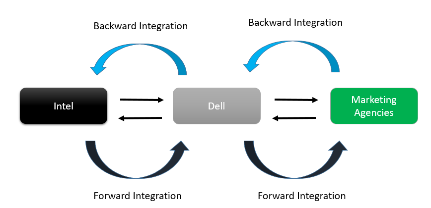

The world of finance is dynamic and continually reshaped by technological advancements, profoundly affecting both monetary policy and trading mechanisms. Central banks, responsible for overseeing monetary stability, wield tools like forward guidance to significantly influence economic expectations and the broader financial markets. This article provides an exploration of how forward guidance affects monetary policy and algorithmic trading, focusing on the interaction between central banks and technology-driven financial strategies. Understanding these dynamics is crucial for investors, policymakers, and traders who must navigate the complex and ever-changing financial environment. Forward guidance, as a communication strategy, serves as a cornerstone for shaping market expectations about future interest rates and economic conditions, making it indispensable in today's global financial system. This exploration underlines the importance of staying informed about the evolving interaction between central bank policies and technological advancements in trading, equipping market participants to better manage risks and opportunities in the contemporary financial landscape.

## Table of Contents



## Understanding Forward Guidance

Forward guidance is a strategic tool utilized by central banks to communicate anticipated directions of monetary policy and interest rates, thereby influencing the economic behavior of households, businesses, and investors. This method aims to reduce uncertainty in the financial markets by offering clarity on future policy moves, helping to stabilize economic expectations and mitigate potential market disruptions.

Central banks such as the Federal Reserve (Fed), the European Central Bank (ECB), and the Bank of Japan (BOJ) employ forward guidance to align market expectations with future monetary policy stances effectively. By signaling intentions regarding interest rates or other monetary measures, these institutions provide valuable insights into the economic landscape, which can influence investment and consumption decisions. For instance, if a central bank indicates that it intends to keep interest rates low for an extended period, businesses might be encouraged to invest in new projects, and consumers might be more inclined to make significant purchases, both of which can boost economic activity.

The use of forward guidance gained prominence following the Global Financial Crisis of 2008 when traditional monetary policy tools, such as interest rate adjustments, reached their limits. At that time, many central banks had already lowered interest rates to near zero, leaving limited room for further cuts. Forward guidance emerged as a vital tool to manage market expectations and provide additional monetary policy accommodation without altering interest rates directly.

In essence, forward guidance serves to enhance the transparency and predictability of monetary policy, enabling more informed decision-making across the economy. By offering explicit guidance on future policy actions, central banks can influence market participants' expectations and behaviors, thereby achieving desired economic outcomes more effectively.

## Central Banks and Monetary Policy

Central banks play a critical role in shaping economic stability through their dual mandate of ensuring full employment and maintaining price stability. This is achieved by utilizing a range of monetary policy tools designed to influence economic activity and inflation rates.

One of the primary tools at the disposal of central banks is the manipulation of the federal funds rate. By adjusting this benchmark [interest rate](/wiki/interest-rate-trading-strategies), central banks can influence borrowing costs and, consequently, consumer spending and business investment. A lower federal funds rate typically stimulates economic activity by making borrowing cheaper, while a higher rate can help rein in inflation by encouraging saving and reducing spending.

Reserve requirements are another tool utilized by central banks to manage economic conditions. By setting the minimum reserves a bank must hold against deposits, central banks can control the amount of money that banks can lend. Decreasing reserve requirements allows banks to lend more, thereby increasing the money supply and stimulating economic activity. Conversely, increasing these requirements can restrict lending and slow down the economy.

Quantitative easing (QE) is a more unconventional monetary policy tool employed when traditional mechanisms, like interest rate adjustments, approach their limits. In a QE program, central banks purchase large amounts of securities, such as government bonds, to inject [liquidity](/wiki/liquidity-risk-premium) into the financial system. This increase in the money supply lowers interest rates further along the yield curve, encouraging spending and investment when economic growth is sluggish.

Forward guidance has emerged as a key element of modern monetary policy, offering transparency and influencing expectations about the future path of monetary policy. For example, by committing to keeping interest rates low until certain economic conditions are met, central banks can reassure markets and encourage economic activity even when traditional tools are maxed out. In the wake of the 2008 financial crisis, the Federal Reserve, along with other major central banks such as the European Central Bank (ECB) and the Bank of Japan (BOJ), leaned heavily on forward guidance to stabilize expectations and manage market reactions effectively. This shift towards increased communication signifies a broader trend in central banking emphasizing transparency and predictability.

Overall, the strategic interplay of these tools allows central banks to navigate the complexities of their mandates while adapting to the ever-changing economic landscape.

## Impact on Algorithmic Trading

Algorithmic trading (algo trading) is a dominant force in modern financial markets, characterized by the use of sophisticated computer algorithms to execute trades at speeds and frequencies that are beyond human capability. Central bank communications, particularly forward guidance, serve as critical inputs these algorithms rely upon to inform trading decisions. 

Forward guidance provides insight into the future trajectory of monetary policy, including expected changes in interest rates, which are pivotal to financial market dynamics. Algorithms are designed to parse this information, quickly identifying shifts in central bank rhetoric that may signal future policy adjustments. For instance, a signal suggesting an increase in interest rates might lead an algorithm to predict a rise in bond yields, prompting it to adjust its strategy accordingly, by either selling or buying certain financial assets to capitalize on anticipated market movements.

The ability of algorithms to process complex natural language data from central bank communications requires advanced Natural Language Processing (NLP) techniques. Here is a simplified Python code snippet demonstrating how an algorithm might use sentiment analysis, a key NLP technique, to interpret central bank communications and adjust trading strategies:

```python
from textblob import TextBlob

def analyze_sentiment(statement):
    # Using TextBlob for basic sentiment analysis
    sentiment = TextBlob(statement).sentiment
    return sentiment.polarity

central_bank_statement = "The central bank is optimistic about the economy and may consider tightening the policy."

sentiment_score = analyze_sentiment(central_bank_statement)

if sentiment_score > 0:
    print("Positive sentiment detected: Consider strategy for potential interest rate increase.")
elif sentiment_score < 0:
    print("Negative sentiment detected: Consider strategy for potential interest rate decrease.")
else:
    print("Neutral sentiment: No immediate action.")
```

This example reflects a foundational approach towards determining the sentiment of central bank communications. While real-world applications involve more complex algorithms and larger datasets, the core mechanism involves detecting sentiment shifts that could imply policy changes.

The automated execution of trades based on forward guidance can lead to significant market movements. When many algorithms interpret a communication in a similar way, they may execute high volumes of trades simultaneously, leading to large-scale adjustments in asset prices. This can result in increased [volatility](/wiki/volatility-trading-strategies), particularly when there is ambiguity or misinterpretation of the guidance.

Moreover, the rapid nature of algo trading means that markets can react almost instantaneously to changes in forward guidance. This necessitates that traders and institutions remain vigilant in monitoring central bank communications and updating their algorithmic models to refine their predictive accuracy.

As [algorithmic trading](/wiki/algorithmic-trading) continues to evolve, the interaction between forward guidance and automated trading systems will remain a crucial aspect of financial markets. Understanding and improving the interpretation of central bank signals will be pivotal for maintaining stability and capitalizing on trading opportunities in this dynamic environment.

## Case Studies and Examples

During the Great Recession, the Federal Reserve employed forward guidance as a strategic tool to influence economic recovery. This period, marked by severe economic downturn and financial instability, presented significant challenges to monetary policy. In response, the Fed decided to provide more explicit guidance on the likely future path of short-term interest rates to stabilize expectations and promote recovery.

### Forward Guidance in the Great Recession

The initial use of forward guidance came in December 2008 when the Federal Open Market Committee (FOMC) announced that it anticipated that economic conditions were likely to warrant exceptionally low levels of the federal funds rate for some time. This communication was intended to reassure markets and provide households and businesses with a clearer picture of future economic conditions, encouraging spending and investment.

As the crisis persisted, the Fed enhanced its forward guidance, first in August 2011 by specifying a date until which low rates would be maintained, and subsequently evolving to a threshold-based approach in December 2012. The Fed indicated that rates would remain low at least as long as the unemployment rate was above 6.5%, inflation was projected to be no more than half a percentage point above the Committee’s 2 percent longer-run goal, and longer-term inflation expectations continued to be well anchored.

### Effectiveness of the Fed's Forward Guidance

Forward guidance during the Great Recession was pivotal in shaping market expectations and contributing to economic recovery. By providing clarity and reducing uncertainty about future monetary policy, it helped lower long-term interest rates and improve financial conditions. Empirical studies have demonstrated that forward guidance effectively lowered yields on Treasury securities and mortgage rates, stimulating economic activity.

### Algorithmic Trading and Forward Guidance

Algorithmic trading, which utilizes computer-generated algorithms to execute trades at high speeds and volumes, interprets central bank communications as critical input signals. During the era of enhanced forward guidance, algo traders responded quickly to Fed announcements, adjusting their trading strategies based on anticipated movements in interest rates and asset prices.

For example, quantitative models within algorithmic systems would [factor](/wiki/factor-investing) in the Fed’s guidance to predict shifts in bond yields and equity prices. Traders program algorithms to quickly analyze the language used by the Fed, often using natural language processing techniques to assess the tone and content of the guidance. This rapid interpretation and action can lead to significant market movements, illustrating how algorithmic trading operationalizes central bank communications in real-time.

Moreover, with their capacity to process large volumes of data swiftly, these algorithms can identify trends and anomalies, enabling traders to react with precision to changes signaled in forward guidance. As a result, markets have become increasingly sensitive and responsive to the minutiae of central bank communication.

### Historical Context and Outcomes

Looking back at the Fed's use of forward guidance from the Great Recession and onwards, it's evident that such policies have played a crucial role in steering economic expectations during crises. The practice of forward guidance continues to be essential, especially given the complexities of modern financial markets heavily influenced by technology and automation.

In subsequent years, as the global economic landscape evolved with technological advancement, the relevance and effectiveness of forward guidance underscored the need for central banks to adapt their communication strategies continuously. This reflects an ongoing dynamic where monetary policy and technological trading are interlinked, shaping how economic events unfold and are managed.

## Challenges and Future Prospects

Forward guidance, while beneficial for stabilizing market expectations and providing clarity on monetary policy, also poses several challenges. Maintaining credibility is at the forefront of these concerns. Central banks must ensure that their forward guidance is consistent with subsequent policy actions to retain market trust. If a central bank frequently deviates from its communicated intentions, it risks losing credibility, which can lead to increased market volatility and diminished policy effectiveness (Lavigne, 2020).

Another challenge lies in adapting to unforeseen economic changes. The global financial ecosystem is subject to a myriad of unpredictable factors, including geopolitical tensions, natural disasters, and rapid technological advances. These events can necessitate a shift in monetary policy that may contradict existing guidance, complicating the communication efforts of central banks. 

The rapid advancement of technology, particularly in financial markets, significantly influences how forward guidance is interpreted and utilized. Algorithmic trading systems, which dominate contemporary markets, constantly process information, including central bank communications, to optimize trading strategies. This high-speed interpretation means that any misalignment between forward guidance and subsequent policy actions can quickly lead to vast market corrections.

Looking ahead, future developments in policy communication are likely to be influenced by both technological advancements and the increasing complexity of global financial markets. Central banks might adopt more granular and flexible forms of guidance, potentially using [artificial intelligence](/wiki/ai-artificial-intelligence) to tailor communications to diverse market segments. Furthermore, the integration of [machine learning](/wiki/machine-learning) algorithms could enable traders to more accurately predict policy shifts, enhancing the alignment between market actions and central bank intentions.

In this evolving landscape, adaptability remains crucial. Both central banks and market participants must remain agile, continually reassessing strategies to align with technological advancements and shifting economic conditions. This dynamic interplay underscores the importance of forward guidance as a tool that must evolve alongside the mechanisms it seeks to influence.

## Conclusion

Forward guidance remains a pivotal tool in the arsenal of central banks, influencing not only monetary policy but also the world of algorithmic trading. This strategic communication has proved indispensable for central banks as they aim to steer economies by shaping expectations regarding future policy actions. The significance of forward guidance lies in its ability to provide transparency and predictability, which are crucial for maintaining market stability and avoiding abrupt financial disruptions.

Understanding the impact of forward guidance is essential for market participants and policymakers alike. For investors and traders, keen insights into central bank communications can facilitate more informed decision-making processes. Forward guidance allows for better anticipation of interest rate trajectories and economic conditions, key factors that influence investment strategies. Algorithmic trading systems, which rely on high-frequency data analysis, are particularly sensitive to these communications as they can substantially influence trading volumes and market dynamics.

As technology and financial strategies evolve, the interplay between central banks and algo trading will continue to shape economic landscapes. Advances in machine learning and artificial intelligence can enhance the ability of algorithmic systems to parse and react to forward guidance, potentially leading to more efficient and swift market responses. Meanwhile, central banks may refine their communication strategies to adapt to an increasingly data-driven trading environment. The potential for real-time adjustments and automated adaptations to policy signals suggests future innovations in both monetary policy communication and financial market operations. Thus, a comprehensive understanding of forward guidance's role and future prospects will be vital for anyone engaged in today's complex economic arenas.

## References & Further Reading

[1]: Bernanke, B. S., & Reinhart, V. R. (2004). ["Conducting Monetary Policy at Very Low Short-Term Interest Rates."](https://www.aeaweb.org/articles?id=10.1257/0002828041302118) The American Economic Review, 94(2), 85-90.

[2]: Campbell, J. R., Evans, C. L., Fisher, J. D. M., & Justiniano, A. (2012). ["Macroeconomic effects of Federal Reserve forward guidance."](https://www.brookings.edu/wp-content/uploads/2012/03/2012a_Evans.pdf) Brookings Papers on Economic Activity, 1-54.

[3]: Svensson, L. E. O. (2003). ["Escaping from a Liquidity Trap and Deflation: The Foolproof Way and Others."](https://pubs.aeaweb.org/doi/10.1257/089533003772034934) Journal of Economic Perspectives, 17(4), 145-166.

[4]: English, W. B., J. D. López-Salido, and R. J. Tetlow. (2015). ["The Federal Reserve’s Framework for Monetary Policy: Recent Changes and New Questions."](https://www.jstor.org/stable/pdf/24738075.pdf) IMF Economic Review, 63(1), 22-70.

[5]: Hannoun, H. (2015). ["Ultra-low or negative interest rates: what they mean for financial stability and growth."](https://www.bis.org/speeches/sp150424.pdf) Bank for International Settlements.