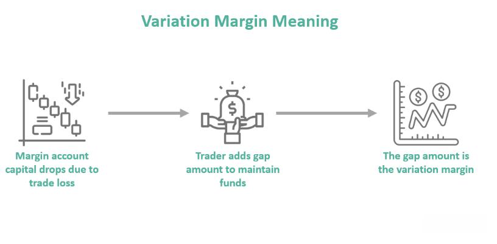

Algorithmic trading, often referred to as algo trading, has transformed the financial markets with its unprecedented ability to execute trades at lightning speed. Unlike traditional trading methods, which are heavily reliant on human decision-making, algorithmic trading utilizes pre-programmed instructions to analyze market data and make trading decisions autonomously. The success of these systems, however, is intricately tied to a thorough understanding of complex financial terms, such as forward margin, and the application of rigorous testing methodologies.

Forward margin, or forward spread, is a pivotal financial term that traders must grasp to illuminate the nuances of forward markets. It involves the difference between the forward rate and the spot rate of a financial asset, such as a currency or a commodity. This differential aids in determining the future price of an asset, offering essential insights for market participants. Additionally, the forward margin reflects market expectations and potential future asset valuations, which are crucial for making informed trading decisions.



In algo trading, testing methodologies such as backtesting and forward testing play a critical role in strategy development. Backtesting leverages historical data to evaluate how a trading strategy would have performed under past market conditions. This process helps identify potential weaknesses and refine strategies before deployment in live environments. Forward testing, meanwhile, examines how strategies perform in current market scenarios without actual financial risk, thus ensuring the adaptability and reliability of these strategies.

Moreover, the effective management of risk is a central concern for traders engaged in algorithmic trading. Margin calculators are vital tools in this regard, assisting traders in determining the appropriate levels of collateral and managing leveraged positions. These calculators integrate various factors such as asset type, leverage levels, and prevailing market conditions to provide traders with a comprehensive risk assessment framework.

An understanding of these concepts is essential for both novice and seasoned traders to successfully navigate the increasingly complex and volatile waters of today's financial markets. As we explore the interconnectedness of these elements, we uncover how they collectively enhance the efficacy and safety of automated trading strategies. These insights enable traders to achieve better trading outcomes and maintain a competitive edge in the evolving landscape of algorithmic trading.

## Table of Contents

## Understanding Forward Margin

The forward margin, commonly referred to as the forward spread, is a critical concept in financial markets, representing the difference between the forward rate and the spot rate of a currency or commodity. This difference is influenced by factors such as interest rates, market expectations, and geopolitical conditions, serving as a fundamental component in the pricing of future asset deliveries.

In the context of forward markets, the forward margin is used to set prices for assets that will be delivered at a later date. This is particularly essential in currency exchange and commodity trading, where businesses and investors seek to hedge against future price [volatility](/wiki/volatility-trading-strategies). The forward margin can manifest as either a premium or a discount. A premium indicates that the forward rate is higher than the spot rate, suggesting market anticipation of an asset's appreciation. Conversely, a discount implies a lower forward rate compared to the spot rate, signaling expectations of depreciation.

The magnitude of the forward margin reflects the market's expectations regarding future price movements. Factors such as projected economic indicators, historical price trends, and anticipated demand/supply dynamics can influence these expectations. Traders must analyze the forward margin to make informed decisions, as it provides insights into potential asset price trajectories.

For instance, a significant forward premium on a currency might suggest that investors anticipate a rise in interest rates or economic growth in the issuing country. Similarly, a large discount on a commodity could indicate an expected increase in supply or a decrease in demand, possibly driven by new production technologies or shifts in consumer preferences.

To calculate the forward margin, one might use the following formula:

$$
\text{Forward Margin} = \text{Forward Rate} - \text{Spot Rate}
$$

Understanding forward margins requires proficiency in assessing various market indicators and models that predict future economic conditions. Market participants who successfully interpret these metrics can optimize their hedging strategies and investment decisions, thereby reducing exposure to unwanted risks. Proficiency in these aspects is indispensable for navigating the complexities of modern financial markets and leveraging potential opportunities for profitability.

## The Role of Forward Margin in Financial Markets

Forward margins are pivotal in various financial markets, particularly in foreign exchange and commodities. They provide crucial insights into future supply and demand dynamics, serving as valuable indicators for market participants. By assessing forward margins, traders and investors can make informed predictions about the future pricing of assets, which is essential for strategic decision-making. 

A forward margin is the difference between the forward price and the spot price of an asset. This differential can reveal market expectations about future movements, whether it involves currencies, commodities, or other assets. A positive forward margin, or premium, suggests that the market anticipates an increase in the asset's value relative to the spot price. Conversely, a negative margin, or discount, implies a potential decrease in value.

Understanding forward margins is essential for effective risk management. Traders use them to hedge against adverse price movements, reducing exposure to market volatility. For instance, in the foreign exchange market, a company expecting future payments in a foreign currency might use forward contracts to lock in a favorable exchange rate, thus mitigating the risk of currency fluctuations.

Institutional investors, including banks and hedge funds, exploit forward margins to diversify their portfolios. By incorporating forward contracts, they can gain assured access to assets at predetermined prices, enhancing their strategies with regard to asset allocation and risk [dispersion](/wiki/dispersion-trading). This practice is particularly beneficial in volatile markets, where price predictability is often elusive.

The impact of carrying costs—expenses related to holding an asset over time—significantly influences forward margins. These costs incorporate interest rates, storage costs, and insurance, among other factors, and can lead to variations in margin size. Generally, higher carrying costs result in larger positive forward margins, indicating that the future price must compensate for these additional costs. Conversely, lower carrying costs may produce smaller margins or even discounts if other market factors suggest a depreciation of the asset.

In summary, forward margins are indispensable tools in financial markets, providing insights into future market conditions and enabling traders and investors to hedge effectively. Understanding their dynamics, influenced by factors such as carrying costs, is crucial for leveraging these instruments in enhancing portfolio strategies and managing risk.

## Backtesting and its Importance in Algo Trading

Backtesting is an essential process in the development of [algorithmic trading](/wiki/algorithmic-trading) strategies. It involves the application of trading algorithms to historical market data to evaluate the performance of a given strategy against past market conditions. This process helps traders understand how a strategy would have performed historically, offering insights into its potential effectiveness and associated risks.

One of the primary advantages of [backtesting](/wiki/backtesting) is its ability to identify potential flaws in a trading strategy. By observing how a strategy behaves with past data, traders can pinpoint weaknesses or inefficiencies and make adjustments to optimize the strategy. For instance, if a trading strategy consistently underperforms during specific market conditions, traders can refine their algorithms to address these shortcomings.

Backtesting also plays a pivotal role in ensuring that trading algorithms are robust and capable of handling real-world applications. It tests the strategy across diverse market scenarios, including periods of high volatility or market stress. This comprehensive testing process ensures that the algorithm can withstand various market conditions, reducing the risk of failure once deployed in live trading environments.

Moreover, backtesting helps traders gain confidence in their strategies by validating them against historical market conditions. Knowing that a strategy has been rigorously tested and has demonstrated promising results in the past, traders can proceed to live trading with a higher degree of assurance. For example, suppose a backtested strategy shows consistent profitability across different market cycles. In that case, it suggests that the strategy could potentially perform well in the future, although past performance is not a guaranteed indicator of future results.

To conduct effective backtesting, traders often need access to high-quality historical data and robust computational tools. Python is a popular language for backtesting due to its powerful libraries and ease of use. Libraries such as Pandas for data manipulation, NumPy for numerical computation, and [backtrader](/wiki/backtrader) for backtesting can streamline the process. Here's a simple example of a backtesting setup using Python:

```python
import backtrader as bt

# Define a basic strategy
class MyStrategy(bt.Strategy):
    def __init__(self):
        self.sma = bt.indicators.SimpleMovingAverage(self.data.close, period=15)

    def next(self):
        if self.sma > self.data.close:
            self.buy()
        elif self.sma < self.data.close:
            self.sell()

# Initialize Cerebro engine
cerebro = bt.Cerebro()
cerebro.addstrategy(MyStrategy)

# Load historical data
data = bt.feeds.YahooFinanceData(dataname='AAPL', fromdate=datetime(2020, 1, 1), todate=datetime(2022, 1, 1))
cerebro.adddata(data)

# Run backtest
cerebro.run()

# Plot results
cerebro.plot()
```

In this example, a simple moving average strategy is backtested on Apple Inc. (AAPL) stock data. The strategy buys when the stock price is below the moving average and sells when it is above, demonstrating how historical data can be used to evaluate the feasibility of a trading strategy.

Effective backtesting is foundational to algorithmic trading success, ensuring that strategies are grounded in reality and have the potential for profitability when applied to live trading environments.

## Forward Testing and Real-time Strategy Validation

Forward testing, commonly referred to as paper trading, is a crucial process in validating algorithmic trading strategies. It involves using a simulated trading environment to assess the effectiveness of trading algorithms in real-time market conditions without any actual financial exposure. This simulation allows traders to gauge how their strategies perform under current market dynamics, providing insights into factors like execution speed, slippage, and real-time data availability.

The primary advantage of forward testing lies in its ability to mirror live market scenarios, thereby offering traders a realistic assessment of their strategy's adaptability and robustness. Unlike backtesting, which relies on historical data, forward testing captures the nuances of constantly evolving markets, presenting an invaluable opportunity to refine strategies before actual deployment.

Execution speed, one of the key parameters analyzed during forward testing, refers to the time taken for a trading order to be placed and executed. In algorithmic trading, where milliseconds could mean the difference between profit and loss, understanding the strategy's response time is essential. Evaluating execution speed during forward testing helps traders identify potential lags and enhances the algorithm's responsiveness.

Slippage, another critical [factor](/wiki/factor-investing), denotes the difference between the expected price of a trade and the actual price at which it is executed. Forward testing provides insights into slippage by creating scenarios wherein traders can analyze how market volatility affects their entry and [exit](/wiki/exit-strategy) points in real-time.

Moreover, real-time data availability is pivotal in forward testing. The test environment must accurately reflect live market conditions to ensure that the strategy can process and react to data flows efficiently. This involves assessing data latency and ensuring that the algorithms can handle large volumes of real-time information without performance degradation.

A successful forward testing phase is instrumental in preparing a trading strategy for live deployment. By thoroughly analyzing the above factors, traders can make informed adjustments to their algorithms, increasing confidence that the strategy will perform as anticipated once real funds are at stake. Thus, forward testing not only serves as a validation exercise but also as a fundamental step in optimizing and achieving a reliable and profitable trading strategy.

## Utilizing Margin Calculators in Algorithmic Trading

Margin calculators are essential in algorithmic trading, as they aid traders in managing leveraged positions and determining collateral requirements. These calculators are instrumental in assessing the margin necessary for trades by evaluating asset type, leverage, and prevailing market conditions. This evaluation enables traders to allocate capital more effectively, manage risk, and avoid the pitfalls of over-leveraging their portfolios.

When configuring trading strategies, a margin calculator considers several variables to compute the required margin. For example, in foreign exchange ([forex](/wiki/forex-system)) trading, the formula for calculating margin often includes factors such as the trade size (in lots) and the leverage ratio. The basic margin requirement can be calculated using:

$$
\text{Margin Requirement} = \frac{\text{Trade Size} \times \text{Market Price}}{\text{Leverage}}
$$

Margin calculators assist traders by providing precise margin requirements, facilitating the setting of appropriate stop-loss levels and determining optimal position sizes. This is crucial for effective risk management, as it helps mitigate potential losses by capping the maximum allowable deficit on each trade.

Furthermore, integrating margin calculations into the backtesting process is crucial for aligning trading strategies with a trader’s risk tolerance and capital efficiency. Backtesting involves testing trading strategies against historical data to evaluate their potential profitability and reliability. By incorporating margin calculators during this stage, traders can simulate real-world scenarios more accurately and adjust their strategies to account for margin requirements. This ensures that their trading setups remain viable under different market conditions, preventing unexpected margin calls or the need for additional capital.

Given the complexity of financial markets, traders and algorithm developers often use programming tools like Python to automate margin calculations and integrate them into algorithmic trading systems. Here is a simplified example of how a margin requirement might be calculated in Python:

```python
def calculate_margin(trade_size, market_price, leverage):
    return (trade_size * market_price) / leverage

# Example usage:
trade_size = 100000  # Number of units in the trade
market_price = 1.13  # EUR/USD exchange rate
leverage = 50        # 50:1 leverage

margin = calculate_margin(trade_size, market_price, leverage)
print(f"The margin requirement is: ${margin}")
```

In conclusion, margin calculators are critical in the architecture of algorithmic trading systems. They not only facilitate proper capital management but also enhance the effectiveness of risk assessment and strategy development processes. By utilizing these calculators wisely, traders can better navigate the complexities of leveraged trading, ensuring that their strategies are robust, adaptable, and aligned with their financial objectives.

## Conclusion

In algorithmic trading, a comprehensive understanding of forward margins, along with the application of backtesting and forward testing, forms the backbone of successful trading strategies. Forward margins, which express the difference between forward rates and spot rates, provide critical insights into market expectations and future price movements. By understanding these dynamics, traders can make informed decisions to hedge against unfavorable price shifts and optimize their trading outcomes.

Backtesting allows traders to validate their strategies using historical data, thus ensuring that their algorithms are both robust and scalable. This process enables the identification of potential flaws and areas for optimization before strategies are executed in live market conditions. In tandem with backtesting, forward testing—real-time strategy validation—provides an additional layer of adaptation by allowing traders to assess how their strategies perform in current market environments, addressing issues such as execution speed and slippage.

Margin calculators are equally crucial. They assist traders in managing leveraged positions by calculating necessary collateral requirements based on asset types, leverage, and market conditions. This tool helps traders optimize capital allocation, manage risk exposure effectively, and avoid over-leveraging their portfolios. Incorporating accurate margin calculations into the trading strategy and backtesting processes ensures alignment with the traders' risk tolerance and enhances capital efficiency.

In summary, mastering these components is essential for traders aiming to enhance their trading outcomes and achieve sustained profitability. Continuous education and adaptation to the ever-evolving market conditions are key to maintaining a competitive edge in the dynamic and challenging landscape of algorithmic trading.

## References & Further Reading

[1]: Bergstra, J., Bardenet, R., Bengio, Y., & Kégl, B. (2011). ["Algorithms for Hyper-Parameter Optimization."](https://dl.acm.org/doi/10.5555/2986459.2986743) Advances in Neural Information Processing Systems 24.

[2]: ["Advances in Financial Machine Learning"](https://www.amazon.com/Advances-Financial-Machine-Learning-Marcos/dp/1119482089) by Marcos Lopez de Prado

[3]: ["Evidence-Based Technical Analysis: Applying the Scientific Method and Statistical Inference to Trading Signals"](https://www.amazon.com/Evidence-Based-Technical-Analysis-Scientific-Statistical/dp/0470008741) by David Aronson

[4]: ["Machine Learning for Algorithmic Trading"](https://github.com/stefan-jansen/machine-learning-for-trading) by Stefan Jansen

[5]: ["Quantitative Trading: How to Build Your Own Algorithmic Trading Business"](https://www.amazon.com/Quantitative-Trading-Build-Algorithmic-Business/dp/1119800064) by Ernest P. Chan