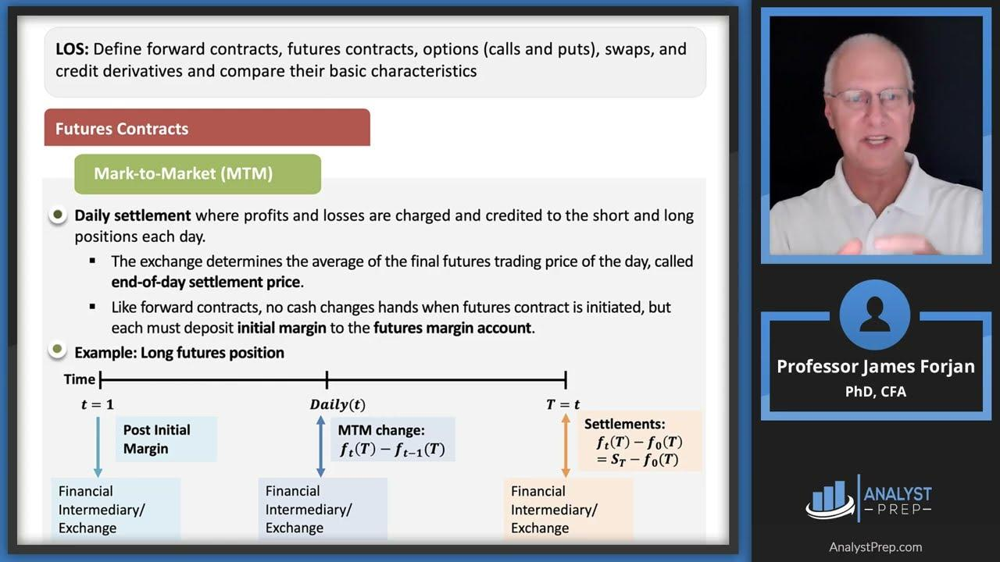

## Table of Contents

## What is forward margin?

Forward margin is a term used in trading and finance. It refers to the difference between the current price of a currency or asset and its price in a future forward contract. This difference helps traders and investors understand how much the value of the currency or asset might change over time.

For example, if you want to buy a currency in the future, you can use a forward contract. The forward margin tells you if the currency will be more expensive or cheaper in the future compared to now. This information is useful for planning and making decisions about buying or selling currencies or other assets.

## How is forward margin different from spot margin?

Forward margin and spot margin are both used in trading, but they refer to different things. Spot margin is the difference between the current buying and selling price of a currency or asset. This is what you see right now if you want to trade immediately. It's called "spot" because it's for the current moment, not for the future.

Forward margin, on the other hand, is about the future. It's the difference between the current price of a currency or asset and its price in a future forward contract. This helps traders know how much the price might change over time. So, while spot margin is about the immediate price difference, forward margin is about the expected price difference in the future.

## What are the key components of a forward margin contract?

A forward margin contract has a few main parts that help people understand and use it. The first part is the current price of the currency or asset. This is the price you see right now if you want to buy or sell. The second part is the forward price, which is the price agreed upon for the future date when the contract will be completed. The difference between these two prices is what we call the forward margin. It shows how much the price is expected to change over time.

The third part of a forward margin contract is the expiration date. This is the specific future date when the contract will end, and the buyer and seller will exchange the currency or asset at the agreed forward price. Another important part is the size of the contract, which tells you how much of the currency or asset is being traded. All these parts work together to help traders plan and make decisions about buying or selling in the future.

## How does forward margin work in financial markets?

Forward margin plays an important role in financial markets by helping traders and investors understand how the price of a currency or asset might change in the future. When someone wants to buy or sell something at a later date, they can use a forward contract. The forward margin is the difference between the price of the currency or asset right now and the price agreed upon for the future. This difference helps people plan their trades and make decisions about whether it's a good time to buy or sell.

For example, imagine you want to buy a currency in six months. You can enter into a forward contract now, agreeing on a price for that future date. The forward margin tells you if the currency will be more expensive or cheaper in the future compared to its current price. This information is very useful for businesses and investors who need to manage their money over time. By knowing the forward margin, they can make better choices about when and how to trade.

## What are the benefits of using forward margin?

Using forward margin can help people and businesses plan better. When you know how much the price of a currency or asset might change in the future, you can make smarter choices about when to buy or sell. For example, if you run a business that needs to buy materials from another country, knowing the forward margin can help you decide if it's better to buy those materials now or wait until later. This can save you money and help you avoid surprises.

Forward margin also helps reduce risk. When you agree on a price for the future, you protect yourself from big changes in the market. If the price goes up a lot, you still get to buy at the lower price you agreed on. If the price goes down, you might lose a little, but you know exactly what you're getting into. This way, you can feel more secure about your financial plans and focus on growing your business or managing your investments.

## What are the risks associated with forward margin?

Using forward margin can have some risks. One big risk is that the market might change a lot between now and the future date you agreed on. If the price of the currency or asset goes down a lot, you might end up paying more than if you had waited. This means you could lose money because you locked in a higher price.

Another risk is that you might not be able to meet your part of the deal. If you agree to buy something in the future but then don't have the money when the time comes, you could face penalties or lose your chance to buy at the agreed price. This can be stressful and might hurt your business or investments.

Overall, while forward margin can help you plan and reduce some risks, it also comes with its own set of challenges. It's important to think carefully about these risks before you decide to use a forward margin contract.

## How is the forward margin calculated?

Forward margin is calculated by finding the difference between the current price of a currency or asset and the price agreed upon for a future date in a forward contract. The current price is what you would pay right now if you wanted to buy the currency or asset. The forward price is the price you agree to pay on a specific date in the future. The difference between these two prices is the forward margin. This calculation helps traders understand how much the price might change over time.

To calculate the forward margin, you first need to know the current spot rate, which is the price of the currency or asset at the moment. Then, you need the forward rate, which is the price agreed upon for the future. Subtract the current spot rate from the forward rate, and you get the forward margin. For example, if the current price of a currency is $1.00 and the forward price agreed upon for six months from now is $1.05, the forward margin would be $0.05. This simple calculation helps traders make informed decisions about future trades.

## Can you explain the process of entering into a forward margin agreement?

Entering into a forward margin agreement starts with finding someone who wants to make the same kind of deal as you. If you want to buy a currency or asset in the future, you need to find someone who wants to sell it to you at that time. You both agree on a price for the future, called the forward price. You also decide on the exact date when the deal will happen, which is the expiration date. Once you agree on these things, you write them down in a contract. This contract says that you will buy the currency or asset at the forward price on the expiration date, and the other person will sell it to you at that price.

After the contract is made, you need to keep an eye on the current price of the currency or asset. The forward margin is the difference between the current price and the forward price you agreed on. This helps you see how much the price might change before the expiration date. If everything goes as planned, on the expiration date, you will buy the currency or asset at the forward price, even if the current price is different. This can help you plan better and avoid big surprises in the market.

## What industries commonly use forward margin and why?

Many industries use forward margin to help them plan and manage their money better. One big industry that uses forward margin a lot is the international trade industry. Companies that buy and sell things from other countries need to know how much the money they use will be worth in the future. By using forward margin, they can agree on a price for the future and avoid surprises if the value of the money changes a lot. This helps them keep their costs steady and plan their budgets better.

Another industry that often uses forward margin is the agriculture industry. Farmers and food companies use forward margin to plan for the future prices of crops and food products. They can agree on a price now for something they will buy or sell later, like wheat or corn. This helps them know how much money they will make or spend, even if the prices of these things go up or down. Using forward margin helps them manage their risks and plan their business better.

## How does forward margin impact currency exchange rates?

Forward margin can affect currency exchange rates by helping people predict how the value of a currency might change in the future. When people enter into forward contracts, they agree on a price for a currency at a future date. If many people think a currency will be worth more later, they might buy forward contracts for that currency. This demand can make the forward price higher than the current price, which shows a positive forward margin. This can signal to others that the currency might be stronger in the future, which can influence the current exchange rate.

On the other hand, if people expect a currency to be worth less in the future, they might sell forward contracts for that currency. This can lead to a lower forward price compared to the current price, showing a negative forward margin. This can make people think the currency will be weaker later, which can affect the current exchange rate as well. So, forward margin can give clues about future exchange rates, and these clues can impact how people trade currencies now.

## What are some advanced strategies for managing forward margin?

One advanced strategy for managing forward margin is to use a combination of forward contracts and options. This means you can agree on a forward price for the future but also buy an option that lets you choose whether to go through with the deal or not. If the price of the currency or asset changes a lot, you can use the option to decide if it's better to stick with the forward contract or do something else. This can help you protect yourself from big losses and take advantage of good opportunities.

Another strategy is to use hedging. This means you can enter into more than one forward contract to balance out the risks. For example, if you agree to buy a currency in the future, you can also agree to sell another currency at the same time. This way, if the value of one currency goes down, the value of the other might go up, which can help you avoid losing too much money. Hedging can be complicated, but it can help you manage the forward margin and make your financial plans more stable.

## How do regulatory frameworks affect forward margin transactions?

Regulatory frameworks can have a big impact on forward margin transactions. These rules are made by governments and financial groups to make sure that trading is fair and safe. They can decide who can trade, how much money people need to have to trade, and what information needs to be shared. For example, some countries might require traders to report their forward contracts to a central place. This helps keep track of what's happening in the market and can stop people from doing things that might hurt others.

These regulations can also change how forward margin works. If the rules are strict, it might be harder to enter into forward contracts, which can affect the forward margin. For example, if a new rule says that you need more money to trade, fewer people might want to use forward contracts. This can make the forward margin smaller because there's less demand for future trades. On the other hand, if the rules are relaxed, more people might trade, which can make the forward margin bigger. So, understanding these rules is important for anyone who wants to use forward margin to plan their trades.

## What is Understanding Forward Margin?

The forward margin, commonly referred to as the forward spread, is a critical concept in financial markets, representing the difference between the forward rate and the spot rate of a currency or commodity. This difference is influenced by factors such as interest rates, market expectations, and geopolitical conditions, serving as a fundamental component in the pricing of future asset deliveries.

In the context of forward markets, the forward margin is used to set prices for assets that will be delivered at a later date. This is particularly essential in currency exchange and commodity trading, where businesses and investors seek to hedge against future price [volatility](/wiki/volatility-trading-strategies). The forward margin can manifest as either a premium or a discount. A premium indicates that the forward rate is higher than the spot rate, suggesting market anticipation of an asset's appreciation. Conversely, a discount implies a lower forward rate compared to the spot rate, signaling expectations of depreciation.

The magnitude of the forward margin reflects the market's expectations regarding future price movements. Factors such as projected economic indicators, historical price trends, and anticipated demand/supply dynamics can influence these expectations. Traders must analyze the forward margin to make informed decisions, as it provides insights into potential asset price trajectories.

For instance, a significant forward premium on a currency might suggest that investors anticipate a rise in interest rates or economic growth in the issuing country. Similarly, a large discount on a commodity could indicate an expected increase in supply or a decrease in demand, possibly driven by new production technologies or shifts in consumer preferences.

To calculate the forward margin, one might use the following formula:

$$
\text{Forward Margin} = \text{Forward Rate} - \text{Spot Rate}
$$

Understanding forward margins requires proficiency in assessing various market indicators and models that predict future economic conditions. Market participants who successfully interpret these metrics can optimize their hedging strategies and investment decisions, thereby reducing exposure to unwanted risks. Proficiency in these aspects is indispensable for navigating the complexities of modern financial markets and leveraging potential opportunities for profitability.

## How can margin calculators be utilized in algorithmic trading?

Margin calculators are essential in [algorithmic trading](/wiki/algorithmic-trading), as they aid traders in managing leveraged positions and determining collateral requirements. These calculators are instrumental in assessing the margin necessary for trades by evaluating asset type, leverage, and prevailing market conditions. This evaluation enables traders to allocate capital more effectively, manage risk, and avoid the pitfalls of over-leveraging their portfolios.

When configuring trading strategies, a margin calculator considers several variables to compute the required margin. For example, in foreign exchange ([forex](/wiki/forex-system)) trading, the formula for calculating margin often includes factors such as the trade size (in lots) and the leverage ratio. The basic margin requirement can be calculated using:

$$
\text{Margin Requirement} = \frac{\text{Trade Size} \times \text{Market Price}}{\text{Leverage}}
$$

Margin calculators assist traders by providing precise margin requirements, facilitating the setting of appropriate stop-loss levels and determining optimal position sizes. This is crucial for effective risk management, as it helps mitigate potential losses by capping the maximum allowable deficit on each trade.

Furthermore, integrating margin calculations into the [backtesting](/wiki/backtesting) process is crucial for aligning trading strategies with a trader’s risk tolerance and capital efficiency. Backtesting involves testing trading strategies against historical data to evaluate their potential profitability and reliability. By incorporating margin calculators during this stage, traders can simulate real-world scenarios more accurately and adjust their strategies to account for margin requirements. This ensures that their trading setups remain viable under different market conditions, preventing unexpected margin calls or the need for additional capital.

Given the complexity of financial markets, traders and algorithm developers often use programming tools like Python to automate margin calculations and integrate them into algorithmic trading systems. Here is a simplified example of how a margin requirement might be calculated in Python:

```python
def calculate_margin(trade_size, market_price, leverage):
    return (trade_size * market_price) / leverage

# Example usage:
trade_size = 100000  # Number of units in the trade
market_price = 1.13  # EUR/USD exchange rate
leverage = 50        # 50:1 leverage

margin = calculate_margin(trade_size, market_price, leverage)
print(f"The margin requirement is: ${margin}")
```

In conclusion, margin calculators are critical in the architecture of algorithmic trading systems. They not only facilitate proper capital management but also enhance the effectiveness of risk assessment and strategy development processes. By utilizing these calculators wisely, traders can better navigate the complexities of leveraged trading, ensuring that their strategies are robust, adaptable, and aligned with their financial objectives.

## References & Further Reading

[1]: Bergstra, J., Bardenet, R., Bengio, Y., & Kégl, B. (2011). ["Algorithms for Hyper-Parameter Optimization."](https://dl.acm.org/doi/10.5555/2986459.2986743) Advances in Neural Information Processing Systems 24.

[2]: ["Advances in Financial Machine Learning"](https://www.amazon.com/Advances-Financial-Machine-Learning-Marcos/dp/1119482089) by Marcos Lopez de Prado

[3]: ["Evidence-Based Technical Analysis: Applying the Scientific Method and Statistical Inference to Trading Signals"](https://www.amazon.com/Evidence-Based-Technical-Analysis-Scientific-Statistical/dp/0470008741) by David Aronson

[4]: ["Machine Learning for Algorithmic Trading"](https://github.com/stefan-jansen/machine-learning-for-trading) by Stefan Jansen

[5]: ["Quantitative Trading: How to Build Your Own Algorithmic Trading Business"](https://www.amazon.com/Quantitative-Trading-Build-Algorithmic-Business/dp/1119800064) by Ernest P. Chan