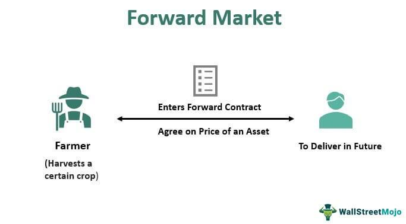

Currency trading, or foreign exchange (forex) trading, is a pivotal component of the global financial markets, facilitating the transfer of purchasing power between nations. It serves as a platform where currencies are bought and sold, enabling businesses, investors, and governments to execute international transactions and investments. The forex market is the largest financial market worldwide, with trillions of dollars traded daily, underscoring its significant impact on global economics and finance.

A specific segment of the forex market is the forward market, where forward contracts are employed. Unlike spot trading, which involves the immediate exchange of currencies at the current market price, forward market trading allows participants to lock in exchange rates for future transactions. This mechanism is particularly useful for hedging against currency fluctuations, providing stability and predictability in financial planning. Forward contracts include specific terms such as settlement dates and contract amounts, allowing multinational corporations and investors to manage currency risk effectively.

Algorithmic trading, meanwhile, represents a transformative advancement in the trading sector, utilizing computer algorithms to execute trades based on a set of predetermined criteria. In forex trading, algorithmic strategies are increasingly vital due to their efficiency and ability to process large volumes of data at a high speed. These algorithms can range from simple strategies that track market trends to complex systems that employ machine learning for predictive analytics.

This article explores the integration of forward market currency trading with algorithmic forex trading. It investigates into understanding the forward market, the foundational concepts of algorithmic trading, and how these components can be synergistically combined to enhance trading precision and effectiveness. Integrating these concepts offers benefits such as increased speed and risk management capabilities but also introduces challenges, including technological complexity and regulatory requirements.

In summary, the confluence of forward market strategies and algorithmic trading presents both opportunities and challenges for forex market participants. As these technologies continue to evolve, they promise to reshape how traders and institutions participate in the global financial markets.

## Table of Contents

## Understanding Forward Market Currency Trading

The forward market in currency trading represents a crucial segment of the forex market where parties agree to exchange currencies at a predetermined rate on a specified future date. Unlike spot trading, which involves the immediate exchange of currencies at the current market rate, forward trading allows market participants to lock in exchange rates for transactions that will occur at a future date. This ability is particularly beneficial for managing the risk associated with fluctuations in currency values over time.

### Purpose of Forward Contracts in Currency Trading

Forward contracts serve as essential tools for hedging against adverse currency movements. By securing a rate ahead of time, businesses and investors can protect themselves from potential losses due to unpredictable fluctuations in exchange rates. This is especially important for multinational companies that engage in cross-border transactions and are exposed to exchange rate [volatility](/wiki/volatility-trading-strategies). Hedging through forward contracts enables these entities to stabilize their financial outcomes and plan budgets more accurately.

### Mechanics of a Forward Contract in the Forex Market

A forward contract in [forex](/wiki/forex-system) involves two parties who agree on an exchange rate and a future settlement date for a currency transaction. The contract specifies the amount of currency to be exchanged, the agreed-upon exchange rate, and the date on which the transaction will take place. Settlement dates can vary widely, typically ranging from a few days to several years, depending on the needs of the parties involved. The exchange rate agreed upon in a forward contract is known as the forward rate, which may differ from the spot rate to account for [interest rate](/wiki/interest-rate-trading-strategies) differentials between the currencies.

Mathematically, the forward rate $F$ can be expressed as:

$$
F = S \times \left( \frac{1 + r_d \times t}{1 + r_f \times t} \right)
$$

where:
- $S$ is the spot exchange rate,
- $r_d$ is the domestic interest rate,
- $r_f$ is the foreign interest rate,
- $t$ is the time to maturity expressed as a fraction of a year.

### Role of Forward Markets in Managing Currency Risk

For multinational corporations, forward markets are vital instruments for managing currency risk. By entering into forward contracts, companies can protect their revenue streams and cost structures against unfavorable exchange rate movements. For investors, forward markets provide a mechanism to speculate on currency movements or to hedge existing currency exposure. This ability to predict and lock in future exchange rates aids in smoothing cash flows and reducing uncertainty in financial planning.

### Recent Trends and Developments in Forward Market Currency Trading

In recent years, the forward market has seen significant developments driven by technological advancements and globalization. The rise of sophisticated trading platforms has enhanced the accessibility and efficiency of forward contracts. Additionally, there is a growing trend towards customized solutions catering to specific hedging needs of diverse businesses, enabling more tailored and effective risk management strategies. Furthermore, increased regulatory scrutiny post-2008 financial crisis has led to greater transparency and reduced counterparty risks in forward markets.

Overall, forward market currency trading continues to evolve, offering innovative solutions that help manage currency risk and contribute to financial stability in an increasingly interconnected global economy.

## Basics of Algorithmic Trading in Forex

Algorithmic trading, often referred to as algo trading, involves the use of computer programs and algorithms to execute trades in financial markets. This method is particularly relevant in today's fast-paced financial environment, where it enables traders to process vast amounts of data and execute orders with speed and precision that far surpasses human capabilities. In forex trading, which involves the exchange of currencies, [algorithmic trading](/wiki/algorithmic-trading) has become increasingly vital due to the market's size, [liquidity](/wiki/liquidity-risk-premium), and 24-hour trading nature.

Algorithms can be applied to forex trading to enhance efficiency and accuracy by systematically executing pre-defined trading strategies based on quantitative models. These strategies analyze a plethora of market data, incorporating variables such as price, timing, and [volume](/wiki/volume-trading-strategy) to identify trading opportunities. When a specific criterion is met, the algorithm sends buy or sell orders instantly, reducing the likelihood of human error and boosting the precision of trading decisions.

There are several types of trading algorithms utilized in forex. Arbitrage algorithms identify price discrepancies between different markets or instruments and aim to profit from these inefficiencies before they are corrected. Trend-following algorithms capitalize on market [momentum](/wiki/momentum) by executing trades in the direction of prevailing trends, often using indicators like moving averages to guide decisions. Market-making algorithms provide liquidity to the forex market by simultaneously offering to buy and sell a currency pair, profiting from the spread between the bid and ask prices.

The key benefits of algo trading in forex include speed, consistency, and the ability to backtest strategies. The rapid execution of trades ensures that opportunities are not missed in a market where conditions can change in an instant. Algorithms also provide the consistency required to adhere to a trading strategy without being swayed by emotions. Moreover, [backtesting](/wiki/backtesting) allows traders to evaluate the performance of a trading strategy using historical data, which helps in refining the strategy before it is deployed in live markets.

Despite its advantages, algorithmic trading in forex is not without challenges and risks. Over-optimization is a significant risk, where a trading model is excessively tailored to historical data, leading to poor performance in live markets due to unforeseen variables. Additionally, market anomalies—such as unexpected geopolitical events or economic data releases—can disrupt the assumptions that an algorithm is based on, potentially leading to significant losses.

In conclusion, while algorithmic trading offers significant advantages in terms of efficiency and effectiveness in forex markets, traders must remain vigilant to avoid pitfalls such as over-optimization and be prepared to adjust their strategies in response to market anomalies.

## Integrating Forward Market Trading with Algorithmic Strategies

The integration of forward market trading with algorithmic strategies has the potential to enhance the precision and efficiency of currency trading significantly. The forward market, traditionally used for hedging against currency fluctuations and setting prices for future transactions, can benefit from algorithmic approaches through increased accuracy and reduced human intervention. Algorithmic trading strategies allow for systematic trading by executing pre-defined instructions which can be backtested and optimized based on historical data.

Algorithmic approaches in forward market trading may utilize various strategies, including statistical [arbitrage](/wiki/arbitrage), trend analysis, and [machine learning](/wiki/machine-learning) techniques, to improve decision-making. By using algorithms, traders can analyze large datasets swiftly, identifying patterns and predicting price movements with enhanced accuracy. For example, machine learning models can be employed to forecast currency rates by learning from historical price movements, economic indicators, and geopolitical events. Artificial intelligence algorithms can process complex variables in real-time, adjusting prices in forward contracts and mitigating risks associated with sudden market shifts.

Case studies demonstrate the benefits of integrating algorithmic strategies in forward market trading. For instance, some financial institutions have successfully employed algorithms to manage their currency risk by automating the pricing and execution of forward contracts. These systems analyze global economic indicators and market sentiment data to optimize the timing and strategy for entering into forward contracts. In practice, institutions have observed improved hedging effectiveness and operational efficiency, allowing them to react quickly to market changes.

Technological tools such as machine learning frameworks (e.g., TensorFlow, scikit-learn) and [artificial intelligence](/wiki/ai-artificial-intelligence) platforms (e.g., IBM Watson) are instrumental in this integration. These technologies enable the development of sophisticated trading algorithms that can adapt to emerging market patterns. Python, with its extensive libraries for data analysis and machine learning, is frequently used for developing and deploying these trading strategies. By leveraging cloud computing, firms can scale their algorithmic operations globally, thereby enhancing their market coverage and speed of execution.

The impact of integrating forward market trading with algorithmic strategies on forex market dynamics can be profound. Algorithmic trading reduces latency and errors, leading to more consistent pricing and liquidity in the forward markets. This efficiency can alter participant behavior, as traders rely less on intuition and more on data-driven insights. Moreover, the entry of sophisticated trading algorithms may increase competition, pushing firms to innovate continually to maintain their edge.

Overall, the convergence of forward market trading and algorithmic strategies presents fundamental shifts in currency trading practices, driving greater precision and potentially reshaping market landscapes. As technology continues to evolve, the strategic integration of algorithmic approaches in forward markets is likely to become an industry standard, offering traders and firms a competitive advantage in global forex markets.

## Risk Management and Regulatory Considerations

Forward market and algorithmic trading in the Forex market introduce several risks that must be carefully managed. These risks include economic and geopolitical uncertainties, which can cause significant currency rate fluctuations. Foreign exchange rates can be impacted by political events, central bank policies, economic data releases, and other macroeconomic factors. Consequently, traders involved in forward markets need to account for these variables to mitigate potential losses.

Effective risk management strategies are essential when algorithmic trading is employed in forward markets. Algorithms can process information and execute trades at speeds beyond human capability, potentially leading to large gains or losses. Traders must employ robust risk management systems to prevent overleveraging and ensure that trades align with their risk tolerance levels. Methods such as stop-loss orders, diversified trading strategies, and automated risk assessment tools are commonly used to manage exposure.

Regulatory considerations are paramount in Forex trading. Algorithmic trading and forward contracts are subject to scrutiny by regulatory bodies to ensure market integrity and protect investors. Traders must stay updated on compliance requirements, which may include reporting obligations, transaction monitoring, and adherence to market conduct rules. Non-compliance can lead to legal penalties and financial losses, making awareness and adherence to regulations crucial.

To navigate the complex regulatory landscape, traders can leverage technology and software. Up-to-date regulatory guidance and automated compliance tools can streamline adherence to rules and policies. These technologies can aid in real-time data analysis, enhance transparency, and ensure that algorithmic strategies abide by applicable laws.

Finally, staying informed about regulatory changes is critical for traders. This can be achieved through professional networks, financial news services, and engaging with industry associations. Continuing education and workshops can also provide insights into regulatory trends and compliance best practices. By maintaining a proactive approach to risk management and regulatory adherence, traders can better navigate the challenges of forward market and algorithmic Forex trading.

## Future Trends and Innovations

As the financial markets continue to evolve, several emerging trends and innovations are expected to redefine the landscape of algorithmic trading, particularly within the foreign exchange (forex) domain. The intersection of technological advancements, regulatory shifts, and market globalization suggests notable changes on the horizon.

Future advancements in algorithmic trading are likely to incorporate more sophisticated machine learning and artificial intelligence techniques, which can significantly enhance data processing and decision-making capabilities. These enhancements could improve traders' ability to predict market movements, optimize trade executions, and manage risks more efficiently. For instance, AI-based systems can be employed to analyze large datasets in real-time, identifying patterns and anomalies that may suggest profitable trading opportunities.

Technologies such as quantum computing may also play a transformative role. Quantum algorithms could enable the processing of complex calculations at unprecedented speeds, potentially leading to more accurate forecasting models and enhanced backtesting of trading strategies. In addition, blockchain technology might offer enhanced security and transparency in transaction processing, and smart contracts could automate and streamline the execution of forward contracts.

The globalization of markets, coupled with evolving regulations, will also shape the forex trading future. As more countries relax trade restrictions and embrace digital currency innovations, forex markets are poised to become increasingly interconnected. This globalization trend will require traders and institutions to adapt to diverse regulatory environments. For instance, the MiFID II regulations in Europe emphasize transparency and reporting, necessitating compliance frameworks that are robust and scalable across different jurisdictions. 

Furthermore, emerging markets and digital currencies are expected to influence the future of forward market trading. Emerging markets provide new opportunities for currency trading, offering higher growth potential compared to traditional markets. However, these markets also present unique challenges, such as currency volatility and regulatory differences. On the other hand, digital currencies, such as cryptocurrencies, have started reshaping the forex landscape by introducing new trading pairs and instruments. Their growing adoption demands innovative analytical tools and methods to handle their unique trading characteristics.

Staying updated with technological advances and industry changes is crucial for traders and financial institutions aiming to maintain a competitive edge. A proactive approach to education and adaptation can enable market participants to leverage new technologies effectively, ensuring they are well-prepared to navigate the complexities of evolving forex markets. This continuous learning process might involve attending industry conferences, engaging in online courses, or collaborating with technology experts to integrate advanced trading solutions into existing frameworks.

In conclusion, the future of algorithmic trading in forex is set to be characterized by rapid technological innovation, increased market connectivity, and the influence of emerging market dynamics and digital currencies. As these factors converge, they will reshape forward market trading practices, necessitating adaptive strategies for traders seeking to capitalize on the opportunities presented by these advancements.

## Conclusion

In summarizing the discussions on forward market currency trading and algorithmic trading, it is evident that these two approaches significantly enhance forex market efficiency and risk management. Forward market trading provides a vital mechanism for hedging against currency risks, allowing traders to lock in prices for future transactions and thus mitigate the effects of currency fluctuations. Algorithmic trading, on the other hand, brings sophistication to currency trading through automation and precision, enabling traders to execute strategies at speeds and scales unachievable by humans alone.

The integration of forward market trading with algorithmic strategies offers substantial benefits to forex traders. By leveraging algorithmic models, traders can enhance the accuracy of forward contracts and optimize their trading decisions based on comprehensive data analysis and predictive modeling. This synergy not only streamlines operations but also opens new avenues for achieving competitive advantages in volatile trading environments.

Investors and traders are encouraged to keep abreast of advancements in both currency trading technologies and algorithmic innovations. Continuous education and staying informed are crucial for capitalizing on emerging trends and technological breakthroughs.

Looking forward, currency trading technologies are poised to evolve rapidly, driven by advancements in artificial intelligence, machine learning, and big data analytics. These developments promise to further transform how currencies are traded, offering new tools for strategy formulation and risk management. As technology propels the industry forward, traders should assess their strategies and consider incorporating insights from both forward market and algorithmic trading to enhance their trading efficacy and outcomes.

## References & Further Reading

[1]: Hull, J. C. (2006). ["Options, Futures, and Other Derivatives."](https://www.semanticscholar.org/paper/Options%2C-Futures%2C-and-Other-Derivatives-Hull/89bdee500c8623864fc9eb7a471546aa713acc44) Prentice Hall.

[2]: Geman, H. (2005). ["Commodities and Commodity Derivatives: Modelling and Pricing for Agriculturals, Metals and Energy."](https://download.e-bookshelf.de/download/0000/5675/90/L-G-0000567590-0015270354.pdf) Wiley Finance.

[3]: Bank for International Settlements. (2019). ["Triennial Central Bank Survey: Foreign exchange turnover in April 2019."](https://www.bis.org/statistics/rpfx19_fx.pdf)

[4]: Narang, R. (2009). ["Inside the Black Box: A Simple Guide to Quantitative and High Frequency Trading."](https://onlinelibrary.wiley.com/doi/book/10.1002/9781118267738) Wiley Trading.

[5]: Elder, A. (2002). ["Trading for a Living: Psychology, Trading Tactics, Money Management."](https://www.amazon.com/Trading-Living-Psychology-Tactics-Management/dp/0471592242) Wiley Finance.

[6]: Geostan, R., Osipovich, A. (2018). ["Fast-Money Traders Going After Profits at the Heart of Currency Markets."](https://link.springer.com/article/10.1007/s40812-019-00138-6) The Wall Street Journal.

[7]: Harris, L. (2003). ["Trading and Exchanges: Market Microstructure for Practitioners."](https://academic.oup.com/book/52292) Oxford University Press.