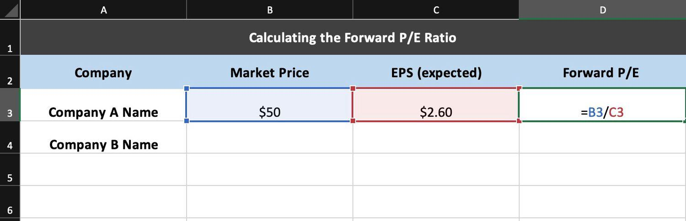

Investment valuation is a critical process in the financial world, serving as the cornerstone for analyzing and assessing the worth of companies and their stocks. It enables investors to make informed decisions, identify potential opportunities, and manage risks effectively. Valuation methods help in estimating the intrinsic value of a company, allowing investors to determine whether a stock is overvalued, undervalued, or fairly priced within the market. Key valuation techniques include intrinsic value analysis, which involves assessing the present value of expected future cash flows, and relative valuation, which compares financial metrics with industry peers.

The forward Price-to-Earnings (P/E) ratio is a pivotal tool in investment valuation, providing insight into a company's anticipated future earnings potential. Unlike the trailing P/E ratio, which is based on past earnings, the forward P/E ratio utilizes projected earnings over the next 12 months. It is calculated using the formula:



$$
\text{Forward P/E} = \frac{\text{Current Stock Price}}{\text{Estimated Future Earnings Per Share (EPS)}}
$$

This metric is instrumental in evaluating growth prospects and profitability expectations, offering a glimpse into how investors perceive a company's future performance. 

Algorithmic trading, a rapidly growing trend in modern finance, involves the use of computer algorithms to automate and optimize trading decisions. These algorithms can process vast quantities of data at speeds and accuracies beyond human capabilities, providing a significant edge in executing trades. By leveraging quantitative data, algorithmic trading enhances market efficiency, reduces transaction costs, and minimizes human error. As a result, it has become a dominant force in the financial markets, shaping the way portfolios are managed and trading strategies are developed.

In the context of efficient portfolio creation, investment valuation, the forward P/E ratio, and algorithmic trading are interconnected. Investment valuation provides the foundational understanding of a company's worth, the forward P/E ratio serves as a forward-looking indicator of growth, and algorithmic trading utilizes these insights to make precise, informed trading decisions. Integrating these elements allows investors to build robust portfolios that are adaptable to changing market dynamics.

This article will explore the intricate relationships between investment valuation, the forward P/E ratio, and algorithmic trading. We will discuss the methods and challenges of investment valuation, the significance of the forward P/E ratio, the transformative impact of algorithmic trading, and how these components can be harmonized to develop effective trading strategies. By examining these themes, we aim to provide a comprehensive understanding of how traditional valuation methods and cutting-edge technologies converge to enhance investment efficiency.

## Table of Contents

## Understanding Investment Valuation

Investment valuation is a critical aspect of company analysis that involves determining the present worth of an asset or a company. This practice is essential for investors seeking to make informed decisions by assessing the potential returns and risks associated with an investment. At its core, investment valuation serves to provide an objective measure of a company's financial health and its capacity to generate future profits.

There are various methods used in investment valuation. One key approach is intrinsic value, which refers to calculating the present value of expected future cash flows generated by an asset or a company. This method often utilizes the discounted cash flow (DCF) model, which discounts future cash flows back to their present value using a suitable discount rate. The formula for DCF is given by:

$$

DCF = \sum \frac{CF_t}{(1 + r)^t}
$$

where $CF_t$ represents the cash flow in year $t$, and $r$ is the discount rate.

Another prominent method is relative valuation, which involves comparing a company's valuation metrics with those of similar companies or industry standards. A widely used relative valuation metric is the Price-to-Earnings (P/E) ratio, which evaluates how much investors are willing to pay per dollar of earnings. By comparing the P/E ratio of a company to its peers, investors can gauge whether it is undervalued or overvalued relative to the market.

Fundamental analysis, on the other hand, focuses on evaluating a company's financial statements, management quality, market position, and broader economic conditions. This approach aims to assess a company's intrinsic value based on its underlying financial performance and growth prospects.

Valuation plays a pivotal role in investment decisions by helping investors identify undervalued stocks that have the potential for price appreciation or overvalued stocks that might be risky investments. Accurate valuation provides a foundation for constructing investment portfolios that align with an investor's risk tolerance and financial goals.

However, accurately valuing a company poses significant challenges, primarily due to the reliance on assumptions and forecasts that may not always hold true. The quality and reliability of data are crucial in valuation, as inaccurate or outdated information can lead to erroneous conclusions. Furthermore, external factors such as market [volatility](/wiki/volatility-trading-strategies), regulatory changes, and technological advancements can also impact a company's valuation, adding layers of complexity to the process. Thus, practitioners must employ robust models and remain vigilant about market developments to ensure precise and relevant valuations.

## Demystifying the Forward P/E Ratio

The Price-to-Earnings (P/E) ratio is a fundamental metric in investment analysis, providing insights into a company's valuation relative to its earnings. It is calculated as the market price per share divided by the earnings per share (EPS). Mathematically, it can be represented as:

$$
\text{P/E Ratio} = \frac{\text{Market Price per Share}}{\text{Earnings per Share (EPS)}}
$$

This ratio helps investors gauge whether a stock is overvalued or undervalued relative to the company's earnings performance.

There are two types of P/E ratios: trailing P/E and forward P/E. The trailing P/E ratio uses historical earnings data, typically from the last twelve months, providing an assessment based on past performance. In contrast, the forward P/E ratio utilizes projected earnings, offering a perspective on the company's expected profitability.

The forward P/E ratio is particularly favored for evaluating future earnings potential. It forecasts a company's future earnings, enabling investors to make informed predictions about stock performance based on expected growth. This prospective view is valuable for identifying growth opportunities and assessing if a stock is reasonably valued considering its future profitability. The forward P/E ratio is calculated as:

$$
\text{Forward P/E Ratio} = \frac{\text{Market Price per Share}}{\text{Expected Earnings per Share}}
$$

Investors often prefer the forward P/E ratio because it incorporates forward-looking earnings estimates, aligning investment decisions with future growth potential. It emphasizes expected profitability and provides a nuanced perspective on a company's potential to deliver earnings growth.

The interpretation of the forward P/E ratio in analyzing a company's future growth potential involves comparing it to industry peers, historical averages, and growth projections. A higher forward P/E may suggest expectations of higher growth, while a lower ratio might indicate undervaluation or reduced growth prospects. Nonetheless, context is critical, as variations in the ratio could be influenced by broader market conditions, industry-specific dynamics, or company-specific factors such as innovation or market expansion efforts.

In summary, the forward P/E ratio is an essential tool in investment valuation, offering a future-oriented assessment of a company's potential to generate earnings. It aids investors in identifying viable investment opportunities by focusing on projected growth and enabling comparative analysis across sectors and timeframes.

## Algorithmic Trading: Transforming the Market Landscape

Algorithmic trading, often referred to as algo trading, represents the use of computer algorithms to manage trading activities in financial markets. These algorithms are designed to execute pre-programmed instructions, such as when to buy or sell a security, the [volume](/wiki/volume-trading-strategy) of the trade, or the timing of the trade, based on a variety of inputs that might include price, timing, or mathematical models. 

**Key Components of Algorithmic Trading**

Algo trading systems consist of several key components:

1. **Data Acquisition**: This involves collecting real-time market data, such as price quotes, trading volumes, and other financial metrics. Accurate and timely data is critical to the success of algorithmic trading strategies.

2. **Signal Generation**: This process involves using quantitative models to generate signals that dictate trading decisions. Such models analyze historical and real-time data to identify trading opportunities.

3. **Execution**: This step involves executing trades based on generated signals. The execution aims to optimize the transaction in terms of timing and pricing, often breaking large orders into smaller parts to reduce market impact.

4. **Risk Management**: Algorithms incorporate risk management parameters to mitigate potential losses. This may involve setting stop-loss levels or diversifying the portfolio to spread risk.

5. **Performance Monitoring**: Continual assessment of the trading strategy’s performance is necessary to ensure the algorithm meets its objectives. This can involve back-testing against historical data, real-time analysis, and refinement of models.

**Automation of Investment Decisions**

Algorithms automate investment decisions by analyzing quantitative data to identify patterns or trends that human traders might overlook. This capability is significantly enhanced by employing technologies like [machine learning](/wiki/machine-learning), which can improve decision-making by learning from past trading data and adjusting strategies accordingly. For instance, a simple moving average crossover strategy can be implemented in Python as follows:

```python
import pandas as pd

# Load market data
data = pd.read_csv('market_data.csv')
data['SMA_50'] = data['Price'].rolling(window=50).mean()
data['SMA_200'] = data['Price'].rolling(window=200).mean()

# Generate signals
data['Signal'] = 0
data.loc[data['SMA_50'] > data['SMA_200'], 'Signal'] = 1  # Buy signal
data.loc[data['SMA_50'] < data['SMA_200'], 'Signal'] = -1  # Sell signal

# Output signals
print(data[['Date', 'Price', 'Signal']])
```

**Advantages of Algorithmic Trading**

The primary benefits of [algorithmic trading](/wiki/algorithmic-trading) include speed, precision, and efficiency. Algorithms can process data and execute trades far faster than human traders, often completing multiple transactions within milliseconds. This speed not only allows traders to capitalize on short-lived opportunities but also reduces the risks associated with manual trading errors.

Furthermore, algorithms enable efficient data analysis capabilities. They can concurrently assess a multitude of financial indicators and identify trading opportunities across various markets, which can be impossible to achieve manually.

**Potential Risks and Challenges**

Despite its advantages, algorithmic trading also presents potential risks and challenges. Significant risks include the potential for programming errors, which can lead to substantial financial losses if not quickly identified and corrected. Moreover, algo trading can exacerbate market volatility; rapid execution of trades based on predefined conditions might lead to rapid, large-scale sell-offs as observed during the 2010 Flash Crash. 

Market manipulation is another concern, wherein unscrupulous traders might use algo trading to create false impressions of market conditions. Additionally, reliance on algorithms reduces human oversight, which can result in unintended consequences when market conditions deviate significantly from historical patterns.

In conclusion, while algorithmic trading transforms the market landscape by enhancing speed and efficiency, it necessitates careful management of the inherent risks and challenges to ensure stable and fair financial markets.

## Integrating Forward P/E Ratio in Algo Trading Strategies

Integrating the forward P/E ratio into algorithmic trading strategies can enhance decision-making by providing insights into a company's prospective earnings potential. This integration requires a systematic approach that leverages data analysis and machine learning to optimize trading models.

The forward P/E ratio, representing a company's current share price relative to its forecasted earnings per share (EPS), is critical in predicting future performance. By incorporating this metric into algorithmic models, traders can automate their evaluation of stock value and generate signals for buying or selling.

For effective model integration, data analysis plays a crucial role. Algorithms can process historical and real-time market data to forecast P/E ratios, assess trends, and adjust trades dynamically. Machine learning further refines these processes by identifying patterns and correlations in large datasets that may not be apparent through traditional analysis. Machine learning techniques such as regression analysis, cluster analysis, and neural networks can enhance the predictive capabilities of these algorithms.

A practical example of an algorithmic trading strategy utilizing valuation metrics can be found in quantitative funds that use a combination of [fundamental analysis](/wiki/fundamental-analysis) and machine learning. For instance, a fund might develop a machine learning model that forecasts companies' forward P/E ratios based on financial statements and macroeconomic indicators, then executes trades when the predicted P/E deviates significantly from the market average.

Best practices in developing and testing these strategies involve several steps:

1. **Data Collection**: Gathering extensive historical data on stock prices, financial statements, and market conditions is essential. This data should be cleaned and normalized for consistency.

   ```python
   import pandas as pd

   # Example: Load financial data
   data = pd.read_csv('financial_data.csv')
   data['EPS'] = data['Earnings'] / data['Shares']
   data['Forward_PE'] = data['Price'] / data['EPS']
   ```

2. **Algorithm Selection and Training**: Choose appropriate algorithms and train them on labeled datasets. Machine learning models should be trained to recognize patterns in the P/E ratio that indicate potential stock movements.

   ```python
   from sklearn.model_selection import train_test_split
   from sklearn.ensemble import RandomForestRegressor

   X = data[['SomeFeature1', 'SomeFeature2']]
   y = data['Forward_PE']
   X_train, X_test, y_train, y_test = train_test_split(X, y, test_size=0.2)

   model = RandomForestRegressor()
   model.fit(X_train, y_train)
   ```

3. **Backtesting**: Implement backtesting on historical data to evaluate the performance of the trading strategy. This step helps identify potential improvements and validate the robustness of the strategy before applying it in real-time scenarios.

   ```python
   # Simple backtesting framework
   data['strategy'] = model.predict(X)
   data['position'] = data['strategy'].shift().apply(lambda x: 1 if x > threshold else -1)
   ```

4. **Risk Management**: Proper risk management protocols should be integrated to mitigate potential losses. This includes setting stop-loss orders and diversifying across multiple stocks to reduce exposure.

5. **Continuous Monitoring and Adaptation**: Keep the strategy updated with the latest market developments and continue to improve models by incorporating new data and refining algorithms based on performance feedback.

By effectively integrating the forward P/E ratio into algorithmic trading models, traders can capitalize on predictive valuation metrics, enhancing their ability to generate consistent returns in dynamic financial markets.

## The Future of Investment Valuation with Algorithmic Trading

Algorithmic trading continues to revolutionize the landscape of investment valuation, with emerging trends and technological advancements paving the way for more precise and efficient valuation processes. As financial markets become increasingly data-driven, algorithmic trading is gaining prominence by integrating sophisticated algorithms, machine learning, and big data analytics to execute trades and assess valuation metrics such as the forward P/E ratio with heightened accuracy.

One significant trend is the use of [artificial intelligence](/wiki/ai-artificial-intelligence) (AI) and machine learning in enhancing forward P/E ratio analysis. These technologies can process vast amounts of financial data, including historical earnings, market trends, and macroeconomic indicators, to predict future earnings more effectively. Machine learning models can adapt and refine their predictions over time, offering a dynamic approach to valuation that considers a wide range of variables and potential outcomes. For instance, supervised learning techniques can be employed to train models that forecast a company's earnings based on historical financial data and market conditions, thereby providing a more forward-looking evaluation.

Continuous innovation and adaptation are paramount in the financial markets, as they ensure traders remain competitive amidst rapidly changing market dynamics. Algorithmic trading systems that incorporate forward P/E ratios must evolve to consider emerging factors such as environmental, social, and governance ([ESG](/wiki/esg-investing)) criteria, geopolitical developments, and shifts in consumer behavior. These factors require algorithms to be not only robust and flexible but also capable of assimilating new data sources and methodologies swiftly.

The integration of traditional valuation methods with algorithmic trading offers long-term benefits that include enhanced decision-making precision, reduced biases, and optimized portfolio management. By marrying conventional financial analysis with algorithmic strategies, investors can leverage the strengths of both approaches. Traditional methods provide the foundational understanding of financial statements and intrinsic value, while algorithmic trading adds the speed and adaptability necessary to capitalize on fleeting market opportunities. This symbiotic relationship can lead to more resilient investment strategies, capable of navigating the complexities of modern financial environments.

As technology progresses, the future of investment valuation with algorithmic trading promises to become even more sophisticated, enabling investors to achieve a deeper understanding of valuation metrics and market mechanics. This evolution underscores the need for investors and financial professionals to remain informed and adaptable, embracing technological advancements while retaining the core principles of sound investment valuation.

## Conclusion

In wrapping up the discussion on investment valuation, forward P/E ratio, and algorithmic trading, it is evident that these elements play crucial roles in constructing efficient investment portfolios. Investment valuation serves as the foundational framework for assessing the worth of stocks, guiding informed decision-making by investors and analysts alike. Within this context, the forward P/E ratio is a vital metric that offers insights into a company’s future earnings potential, making it a preferred choice for analyzing growth prospects.

Algorithmic trading has revolutionized financial markets by enabling rapid, data-driven decision-making. By integrating the forward P/E ratio into these algorithmic models, traders and investors can enhance their strategies with more precise and predictive insights. The forward P/E ratio's ability to predict future performance aligns seamlessly with the objectives of algorithmic systems, helping them to capitalize on emerging trends and market conditions swiftly.

As the financial world continues to evolve, it is imperative for investors to remain informed and flexible. The fast-paced nature of modern markets demands not only a thorough understanding of traditional valuation metrics but also a keenness to adopt technological advancements, such as machine learning and data analytics, that enhance trading strategies. Staying abreast of digital and algorithmic innovations can provide a competitive edge, ensuring portfolios remain optimized in light of changing dynamics.

Ultimately, the interplay between technology and investment valuation underscores a symbiotic relationship that shapes the future of financial markets. This amalgamation promises enhanced accuracy, efficiency, and strategic foresight, highlighting the necessity for continued evolution in investment approaches. As technology continues to advance, its integration with classical valuation methods will undoubtedly offer sustainable benefits to discerning investors.

## References & Further Reading

[1]: ["The Intelligent Investor: The Definitive Book on Value Investing"](https://www.amazon.com/Intelligent-Investor-Definitive-Investing-Essentials/dp/0060555661) by Benjamin Graham

[2]: ["Security Analysis: Principles and Technique"](https://www.mheducation.com/highered/product/security-analysis-seventh-edition-principles-techniques-graham-dodd/9781264932405.html) by Benjamin Graham and David Dodd

[3]: ["Algorithmic Trading: Winning Strategies and Their Rationale"](https://www.wiley.com/en-us/Algorithmic+Trading%3A+Winning+Strategies+and+Their+Rationale-p-9781118460146) by Ernie Chan

[4]: Fama, E. F., & French, K. R. (1992). ["The Cross‐Section of Expected Stock Returns."](https://onlinelibrary.wiley.com/doi/abs/10.1111/j.1540-6261.1992.tb04398.x) The Journal of Finance, 47(2), 427-465.

[5]: Jegadeesh, N., & Titman, S. (1993). ["Returns to Buying Winners and Selling Losers: Implications for Stock Market Efficiency."](https://www.jstor.org/stable/2328882) The Journal of Finance, 48(1), 65-91.