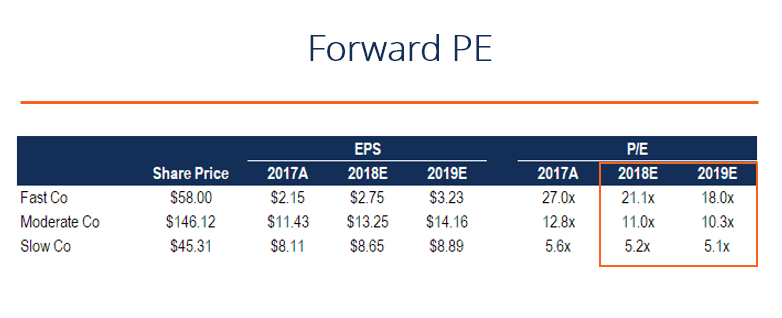

## Table of Contents

## What is the Forward P/E Ratio?

The Forward P/E Ratio, or Price to Earnings Ratio, is a way to figure out how much investors are willing to pay for a company's future earnings. It's calculated by dividing the current stock price by the estimated earnings per share for the next 12 months. This ratio helps investors see if a stock might be a good buy. A lower Forward P/E might mean the stock is undervalued, while a higher one might mean it's overvalued.

However, the Forward P/E Ratio isn't perfect. It relies on earnings estimates, which can be wrong. If a company's earnings are expected to grow a lot, the Forward P/E might look high, but that could still be a good investment. It's also important to compare the Forward P/E of a company with others in the same industry, because what's considered a "good" ratio can vary a lot from one sector to another.

## How is the Forward P/E Ratio calculated?

The Forward P/E Ratio is calculated by dividing the current stock price by the estimated earnings per share for the next 12 months. This gives investors an idea of how much they are paying for each dollar of the company's future earnings. For example, if a stock is trading at $50 and the estimated earnings per share for the next year is $5, the Forward P/E Ratio would be 10 ($50 / $5 = 10).

This ratio is useful because it uses future earnings estimates, which can be more relevant than past earnings for making investment decisions. However, the accuracy of the Forward P/E Ratio depends on the accuracy of the earnings forecasts. If the estimates are too high or too low, the Forward P/E Ratio won't give a true picture of the stock's value. It's also important to compare the Forward P/E Ratio of a company with those of other companies in the same industry to get a better sense of whether the stock is a good buy.

## Why is the Forward P/E Ratio important for investors?

The Forward P/E Ratio is important for investors because it helps them see if a stock is a good deal. It shows how much you have to pay for the company's future earnings. If the Forward P/E Ratio is low, it might mean the stock is undervalued and could be a good buy. If it's high, the stock might be overvalued, and you might want to be careful.

But, the Forward P/E Ratio isn't perfect. It depends on guesses about future earnings, and those guesses can be wrong. So, you have to be careful and not just look at this one number. It's also good to compare the Forward P/E Ratio of a company with other companies in the same industry. What's a good ratio can be different from one industry to another.

## How does the Forward P/E Ratio differ from the Trailing P/E Ratio?

The Forward P/E Ratio and the Trailing P/E Ratio are both ways to figure out how much investors are willing to pay for a company's earnings, but they look at different times. The Forward P/E Ratio uses the company's expected earnings for the next 12 months. This means it's looking into the future and can help investors guess what the stock might be worth based on what's coming up. On the other hand, the Trailing P/E Ratio uses the company's earnings from the last 12 months. It's like looking in the rearview mirror to see what the company has already done.

Because the Forward P/E Ratio is based on guesses about the future, it can be less certain than the Trailing P/E Ratio. If the guesses about future earnings are wrong, the Forward P/E Ratio might not give a good picture of the stock's value. The Trailing P/E Ratio is more solid because it's based on real numbers from the past. But, it might not be as helpful if a company's situation is changing a lot. Both ratios are useful, but they tell you different things about a company's value, and smart investors look at both to get a fuller picture.

## What does a high Forward P/E Ratio indicate about a company?

A high Forward P/E Ratio means that investors are willing to pay a lot for each dollar of the company's future earnings. This could mean that people think the company will do really well in the future. They might expect the company's earnings to grow a lot, so they're okay with paying more now for those future earnings. For example, if a company is working on a new product that could make a lot of money, investors might be excited and push the stock price up, making the Forward P/E Ratio high.

But, a high Forward P/E Ratio can also be a warning sign. It might mean that the stock is overvalued, and the price is too high compared to what the company will actually earn. If the company doesn't meet the high expectations, the stock price could drop. So, it's important to look at other things too, like how the company is doing compared to others in its industry, and not just focus on the Forward P/E Ratio alone.

## What does a low Forward P/E Ratio suggest about a company's future?

A low Forward P/E Ratio suggests that investors are not expecting the company to grow a lot in the future. They might think the company's earnings will stay the same or even go down. This could mean the stock is a good deal because it's cheaper compared to what the company might earn. Investors might see it as a chance to buy the stock at a lower price, hoping that the company does better than expected.

But, a low Forward P/E Ratio can also mean that the company is having problems. Maybe it's losing money, or people are worried about its future. If investors don't think the company will do well, they won't want to pay much for its stock. So, a low Forward P/E Ratio can be a sign to be careful and look more closely at the company's situation before deciding to invest.

## How can the Forward P/E Ratio be used in comparative company analysis?

The Forward P/E Ratio is a useful tool when you want to compare different companies. By looking at the Forward P/E Ratios of companies in the same industry, you can see which ones might be a better deal. If one company has a lower Forward P/E Ratio than others, it might mean that its stock is cheaper compared to its future earnings. This could be a good sign for investors looking for undervalued stocks. But, you have to remember that what's considered a "good" Forward P/E Ratio can be different from one industry to another, so it's important to compare companies within the same sector.

However, using the Forward P/E Ratio for comparison isn't perfect. The ratio depends on guesses about future earnings, and those guesses can be wrong. If the estimates are too high or too low, the Forward P/E Ratio might not give a true picture of which company is a better investment. So, it's smart to look at other things too, like how the company is doing right now and what experts think about its future. By using the Forward P/E Ratio along with other information, you can get a better idea of which company might be a good investment.

## What are the limitations of using the Forward P/E Ratio for company analysis?

The Forward P/E Ratio has some problems when you use it to look at companies. One big problem is that it depends on guesses about future earnings. If these guesses are wrong, the Forward P/E Ratio won't give you a good picture of the company's value. For example, if people think a company will make a lot more money than it actually does, the Forward P/E Ratio might look too low, making the stock seem like a better deal than it really is.

Another issue is that the Forward P/E Ratio doesn't tell you everything about a company. It's just one number, and it doesn't show you things like how much debt the company has, how it's doing compared to other companies, or what's happening in the world that could affect it. So, if you only look at the Forward P/E Ratio, you might miss important information that could change your mind about whether the company is a good investment.

Lastly, the Forward P/E Ratio can be hard to compare across different industries. What's a good ratio in one industry might not be good in another. For example, tech companies often have higher Forward P/E Ratios than utility companies because people expect tech companies to grow faster. So, if you're comparing companies from different industries, the Forward P/E Ratio might not be very helpful. It's better to compare companies within the same industry to get a more accurate picture.

## How does industry affect the interpretation of the Forward P/E Ratio?

The industry a company is in can really change how you should think about its Forward P/E Ratio. Different industries grow at different speeds, and this affects what people are willing to pay for future earnings. For example, tech companies often have higher Forward P/E Ratios because people expect them to grow fast. On the other hand, companies in slower-growing industries, like utilities, usually have lower Forward P/E Ratios because their future earnings aren't expected to increase as much.

Because of these differences, it's important to compare the Forward P/E Ratio of a company with other companies in the same industry. If you compare a tech company's Forward P/E Ratio to a utility company's, you might think the tech company is overvalued when it's actually normal for its industry. So, to get a good idea of whether a company's stock is a good deal, you should look at how its Forward P/E Ratio stacks up against others in its sector.

## Can the Forward P/E Ratio predict stock performance? If so, how?

The Forward P/E Ratio can give you some clues about how a stock might do in the future, but it's not a perfect way to predict it. If a company has a low Forward P/E Ratio, it might mean the stock is a good deal because it's cheap compared to what the company is expected to earn. Investors might buy the stock, hoping that the company does better than expected and the stock price goes up. On the other hand, a high Forward P/E Ratio might mean people are excited about the company's future and expect its earnings to grow a lot. But if the company doesn't meet those high expectations, the stock price could drop.

However, the Forward P/E Ratio depends on guesses about future earnings, and those guesses can be wrong. If the estimates are too high or too low, the Forward P/E Ratio won't give you a good picture of the stock's future performance. Also, the Forward P/E Ratio is just one piece of information. It doesn't tell you everything about a company, like how much debt it has or what's happening in the world that could affect it. So, while the Forward P/E Ratio can be a helpful tool, it's best to use it along with other information to make smarter guesses about how a stock might do in the future.

## How should investors adjust the Forward P/E Ratio for cyclical companies?

For cyclical companies, whose earnings go up and down with the economy, the Forward P/E Ratio can be tricky to use. These companies might have really high earnings when the economy is doing well, but their earnings can drop a lot when times are tough. So, if you look at the Forward P/E Ratio during a good time, it might seem low because the earnings are high. But, if the economy turns bad, those earnings could fall, making the stock look overvalued.

To adjust the Forward P/E Ratio for cyclical companies, investors should think about where the company is in its business cycle. They can look at the company's earnings over several years to get a better idea of what's normal for it. By using an average of past earnings, investors can get a more stable picture of the company's value. This way, they can see if the stock is really a good deal, even when the economy is changing.

## What advanced techniques can be used to refine the analysis using the Forward P/E Ratio?

To make the Forward P/E Ratio more useful, investors can use something called the PEG Ratio. The PEG Ratio takes the Forward P/E Ratio and divides it by the company's expected growth rate. This helps you see if a stock is a good deal when you think about how fast the company is growing. A lower PEG Ratio might mean the stock is undervalued, even if the Forward P/E Ratio is high because the company is growing quickly. But, like the Forward P/E Ratio, the PEG Ratio depends on guesses about the future, so it's not perfect.

Another way to refine the analysis is to look at the Forward P/E Ratio over time. By seeing how the ratio changes, you can tell if the stock is getting more or less expensive compared to its future earnings. You can also compare the Forward P/E Ratio with the Trailing P/E Ratio to see if the market's expectations for the company's future are different from what it has done in the past. This can give you a better idea of whether the stock is a good buy or not.

## What is Understanding Investment Valuation?

Investment valuation is a critical aspect of company analysis that involves determining the present worth of an asset or a company. This practice is essential for investors seeking to make informed decisions by assessing the potential returns and risks associated with an investment. At its core, investment valuation serves to provide an objective measure of a company's financial health and its capacity to generate future profits.

There are various methods used in investment valuation. One key approach is intrinsic value, which refers to calculating the present value of expected future cash flows generated by an asset or a company. This method often utilizes the discounted cash flow (DCF) model, which discounts future cash flows back to their present value using a suitable discount rate. The formula for DCF is given by:

$$

DCF = \sum \frac{CF_t}{(1 + r)^t}
$$

where $CF_t$ represents the cash flow in year $t$, and $r$ is the discount rate.

Another prominent method is relative valuation, which involves comparing a company's valuation metrics with those of similar companies or industry standards. A widely used relative valuation metric is the Price-to-Earnings (P/E) ratio, which evaluates how much investors are willing to pay per dollar of earnings. By comparing the P/E ratio of a company to its peers, investors can gauge whether it is undervalued or overvalued relative to the market.

Fundamental analysis, on the other hand, focuses on evaluating a company's financial statements, management quality, market position, and broader economic conditions. This approach aims to assess a company's intrinsic value based on its underlying financial performance and growth prospects.

Valuation plays a pivotal role in investment decisions by helping investors identify undervalued stocks that have the potential for price appreciation or overvalued stocks that might be risky investments. Accurate valuation provides a foundation for constructing investment portfolios that align with an investor's risk tolerance and financial goals.

However, accurately valuing a company poses significant challenges, primarily due to the reliance on assumptions and forecasts that may not always hold true. The quality and reliability of data are crucial in valuation, as inaccurate or outdated information can lead to erroneous conclusions. Furthermore, external factors such as market [volatility](/wiki/volatility-trading-strategies), regulatory changes, and technological advancements can also impact a company's valuation, adding layers of complexity to the process. Thus, practitioners must employ robust models and remain vigilant about market developments to ensure precise and relevant valuations.

## What is the Forward P/E Ratio and how can it be demystified?

The Price-to-Earnings (P/E) ratio is a fundamental metric in investment analysis, providing insights into a company's valuation relative to its earnings. It is calculated as the market price per share divided by the earnings per share (EPS). Mathematically, it can be represented as:

$$
\text{P/E Ratio} = \frac{\text{Market Price per Share}}{\text{Earnings per Share (EPS)}}
$$

This ratio helps investors gauge whether a stock is overvalued or undervalued relative to the company's earnings performance.

There are two types of P/E ratios: trailing P/E and forward P/E. The trailing P/E ratio uses historical earnings data, typically from the last twelve months, providing an assessment based on past performance. In contrast, the forward P/E ratio utilizes projected earnings, offering a perspective on the company's expected profitability.

The forward P/E ratio is particularly favored for evaluating future earnings potential. It forecasts a company's future earnings, enabling investors to make informed predictions about stock performance based on expected growth. This prospective view is valuable for identifying growth opportunities and assessing if a stock is reasonably valued considering its future profitability. The forward P/E ratio is calculated as:

$$
\text{Forward P/E Ratio} = \frac{\text{Market Price per Share}}{\text{Expected Earnings per Share}}
$$

Investors often prefer the forward P/E ratio because it incorporates forward-looking earnings estimates, aligning investment decisions with future growth potential. It emphasizes expected profitability and provides a nuanced perspective on a company's potential to deliver earnings growth.

The interpretation of the forward P/E ratio in analyzing a company's future growth potential involves comparing it to industry peers, historical averages, and growth projections. A higher forward P/E may suggest expectations of higher growth, while a lower ratio might indicate undervaluation or reduced growth prospects. Nonetheless, context is critical, as variations in the ratio could be influenced by broader market conditions, industry-specific dynamics, or company-specific factors such as innovation or market expansion efforts.

In summary, the forward P/E ratio is an essential tool in investment valuation, offering a future-oriented assessment of a company's potential to generate earnings. It aids investors in identifying viable investment opportunities by focusing on projected growth and enabling comparative analysis across sectors and timeframes.

## References & Further Reading

[1]: ["The Intelligent Investor: The Definitive Book on Value Investing"](https://www.amazon.com/Intelligent-Investor-Definitive-Investing-Essentials/dp/0060555661) by Benjamin Graham

[2]: ["Security Analysis: Principles and Technique"](https://www.mheducation.com/highered/product/security-analysis-seventh-edition-principles-techniques-graham-dodd/9781264932405.html) by Benjamin Graham and David Dodd

[3]: ["Algorithmic Trading: Winning Strategies and Their Rationale"](https://www.wiley.com/en-us/Algorithmic+Trading%3A+Winning+Strategies+and+Their+Rationale-p-9781118460146) by Ernie Chan

[4]: Fama, E. F., & French, K. R. (1992). ["The Cross‐Section of Expected Stock Returns."](https://onlinelibrary.wiley.com/doi/abs/10.1111/j.1540-6261.1992.tb04398.x) The Journal of Finance, 47(2), 427-465.

[5]: Jegadeesh, N., & Titman, S. (1993). ["Returns to Buying Winners and Selling Losers: Implications for Stock Market Efficiency."](https://www.jstor.org/stable/2328882) The Journal of Finance, 48(1), 65-91.