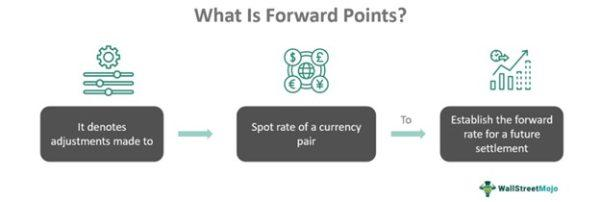

The foreign exchange (forex) market is a pivotal component of global finance, facilitating the exchange of currencies essential for international trade and investment. It is the largest and most liquid financial market in the world, with a daily trading volume exceeding $6 trillion, as reported by the Bank for International Settlements in 2019. This extensive trading activity underscores its critical role in ensuring efficient currency conversion and price discovery, which are vital for multinational corporations, governments, financial institutions, and individual investors.

Within the forex market, forward points are a fundamental concept. They represent the difference between the spot exchange rate and the forward exchange rate of a currency pair. Forward points are typically used in forward contracts, which are agreements to buy or sell a currency at a future date at a predetermined rate. These points are reflective of the interest rate differentials between the two currencies involved in the transaction, thereby allowing traders to account for potential fluctuations in currency values over time. Forward points play a crucial role in hedging strategies, where they are used to offset the risks associated with foreign exchange volatility.



The rise of technology has introduced currency exchange algorithms, revolutionizing forex trading through the use of automated systems. Algorithmic trading involves the utilization of computer programs to execute trades based on pre-defined criteria, offering advantages such as enhanced speed, efficiency, and emotionless decision-making. This approach has gained traction in the forex market, thanks to technological advancements and the increasing availability of financial data. Algorithms can be designed to capitalize on different trading strategies, including trend-following, arbitrage, and the incorporation of machine learning techniques.

The purpose of this article is to explore the intersection of forward points and algorithmic trading strategies. It aims to provide insights into how these two elements complement each other, contributing to improved trade execution and risk management in forex trading. Readers will gain an understanding of forward points and their application, the rise and functioning of algorithmic trading, and how these components can be integrated to enhance trading accuracy and efficacy.

The article will cover several key areas. First, it will define forward points and outline their role in the forex market. It will also introduce algorithmic trading, discussing its benefits and types. Subsequently, the integration of forward points into trading algorithms will be examined, highlighting potential challenges and case studies. Finally, the article will discuss the benefits and challenges of using algorithmic approaches with forward points, conclude with future trends in the sector, and encourage further research into these innovative trading strategies.

## Table of Contents

## Understanding Foreign Exchange Forward Points

Foreign exchange forward points are an essential component of the forex market, serving as a tool for traders to manage risk and speculate on currency movements. Forward points refer to the number of basis points that must be added or subtracted from the current exchange rate (spot rate) to calculate the forward rate. The forward rate is the agreed-upon exchange rate for a currency pair at a future date, allowing traders to lock in rates now for future use.

Forward points are derived from the [interest rate](/wiki/interest-rate-trading-strategies) differential between two currencies in a pair. The calculation involves two primary factors: the spot exchange rate and the interest rate differential. The formula to calculate the forward rate $(FR)$ is:

$$
FR = SR + \text{Forward Points}
$$

Where $SR$ is the spot rate. Forward points are typically calculated using the following formula:

$$
\text{Forward Points} = \left( \frac{(1 + i_d \times \frac{n}{360})}{(1 + i_f \times \frac{n}{360})} - 1 \right) \times SR \times 10,000
$$

Here, $i_d$ is the domestic currency interest rate, $i_f$ is the foreign currency interest rate, and $n$ is the number of days until the forward contract matures.

Traders use forward points to hedge against exchange rate [volatility](/wiki/volatility-trading-strategies), effectively managing the risk associated with currency fluctuations. Forward contracts lock in exchange rates for a specific future date, ensuring a predetermined rate irrespective of market conditions at maturity. This is crucial for businesses engaged in international trade or investment as it stabilizes cash flows and financial forecasting.

Market conditions significantly influence forward points. Changes in interest rates, political events, and economic indicators can impact the interest rate differential, thus altering forward points. For instance, if the domestic interest rate rises relative to the foreign rate, forward points typically increase, reflecting a stronger future domestic currency position relative to the foreign currency.

Examples of forward points in major currency pairs, such as EUR/USD, USD/JPY, or GBP/USD, demonstrate their practical application. For instance, if the spot rate for EUR/USD is 1.1000 and the calculated forward points for a six-month contract are -25, the forward rate will be 1.0975. It signifies that the trader anticipates the euro to be less valuable compared to the dollar in six months.

In hedging, forward points enable traders and businesses to guard against unfavorable currency movements. Speculative traders, on the other hand, may leverage forward points to anticipate and profit from expected shifts in exchange rates. By analyzing and predicting interest rate movements, traders can exploit forward points to inform their trading decisions.

The strategic use of forward points allows for sophisticated risk management and potential speculative gains, making them an indispensable tool in the [forex](/wiki/forex-system) trading landscape. Understanding how to calculate, interpret, and strategically utilize forward points is vital for informed currency trading and investment strategies.

 to Algorithmic Trading in Forex

Algorithmic trading in the foreign exchange (forex) market refers to the use of computer programs and algorithms to automate the trading of currencies. This approach leverages mathematical models and computational techniques to make trading decisions, often executing them without human intervention. Key features of [algorithmic trading](/wiki/algorithmic-trading) include the ability to process large volumes of data rapidly, execute trades with high speed and precision, and operate continuously across global markets.

The advantages of using algorithms in forex trading are significant. They provide speed and efficiency by executing trades in fractions of a second, reducing transaction times compared to manual trading. This speed is crucial in the forex market, where currency values can fluctuate rapidly. Additionally, algorithmic trading minimizes the influence of human emotions, such as fear and greed, which can distort judgment and lead to irrational trading decisions.

There are several popular types of forex trading algorithms. Trend following algorithms identify and capitalize on existing market trends, often using statistical techniques to discern patterns over time. Arbitrage algorithms exploit price differences between various markets or instruments to generate profits. Machine learning-based strategies have gained popularity as well, using advanced data analysis and predictive models to identify profitable trading opportunities.

Technological advancements have significantly contributed to the growth of algo trading in forex. High-frequency trading ([HFT](/wiki/high-frequency-trading-strategies)) systems, improved computational power, and advancements in programming languages and software have enhanced the capabilities and accessibility of algorithmic trading for both institutional and retail investors. Cloud computing and improved internet speeds have also supported the scalability and efficiency of these systems.

Data analysis and big data play a critical role in developing trading algorithms. The ability to analyze vast datasets enables traders to identify patterns and trends that may not be visible through traditional analysis methods. Machine learning and [artificial intelligence](/wiki/ai-artificial-intelligence) technologies further enhance the predictive accuracy of these models by continuously learning from new data and adapting to changing market conditions. As a result, algorithmic trading strategies are becoming increasingly sophisticated, employing neural networks, natural language processing, and other advanced techniques to improve decision-making in the forex market.

## The Role of Forward Points in Algorithmic Trading

Forward points are integral to algorithmic trading systems in the forex market, serving as a predictive tool that enhances decision-making and optimizes trading strategies. Their integration into algorithmic models involves utilizing forward rate data to anticipate future exchange rate movements, thereby improving the accuracy of predictions and the effectiveness of trading decisions.

### Integration into Algorithmic Models

Forward points, which represent the difference between the forward exchange rate and the spot exchange rate, can be directly incorporated into trading algorithms through various methods. These include adjusting current pricing models to [factor](/wiki/factor-investing) in expected changes and using historical forward points data to train predictive models. By embedding forward points in algorithms, traders can better anticipate currency price shifts, particularly in strategies focused on capturing [arbitrage](/wiki/arbitrage) opportunities or hedging against currency risk.

### Enhancing Predictive Accuracy

The predictive accuracy of algorithms benefits significantly from forward points data. By offering insights into anticipated currency depreciation or appreciation over a given period, forward points enable algorithms to refine forecasts of future exchange rates. This can be particularly advantageous in speculative trading strategies aimed at exploiting short-term price discrepancies. For instance, traders can utilize algorithms to calculate and analyze forward points to assess whether the future pricing of a currency pair aligns with market expectations and fundamental economic indicators.

### Examples of Incorporating Forward Points

Algorithmic trading strategies incorporating forward points can adopt various forms. One common approach is arbitrage, where traders capitalize on discrepancies between the forward points derived rates and available market prices. For example, if the forward rate predicted by forward points indicates an undervaluation, an algorithm might execute a buy order to profit from the anticipated price correction. Furthermore, trend-following strategies can integrate forward points to adjust algorithmic models dynamically, allowing them to respond swiftly to potential currency value changes based on forward-derived signals.

### Challenges in Algorithmic Systems

Despite their utility, incorporating forward points in algorithmic trading poses challenges. The primary issue is the volatility and fluctuation of forward points, which can lead to discrepancies between predicted and actual market movements. Algorithms must be designed to accommodate such uncertainties, requiring sophisticated risk management protocols and adaptive algorithmic structures that can recalibrate in response to market changes.

### Case Studies and Hypothetical Scenarios

Several real-world scenarios illustrate the influence of forward points on algorithmic trading decisions. Consider a scenario where a trading firm utilizes an algorithmic strategy that incorporates forward points to hedge against currency exposure for a multinational corporation. The algorithm evaluates forward points across various currency pairs, deciding whether to enter into forward contracts to lock in favorable rates and mitigate potential exchange rate losses. This strategic use of forward points data can enhance the firm’s risk management capabilities, showcasing the practical applications of these metrics in algorithmic systems.

In conclusion, the integration of forward points into algorithmic trading models offers profound advantages in predicting currency movements and refining trading strategies. However, it also demands careful consideration of the inherent challenges, particularly the variability and market sensitivity of forward points. Through strategic application and continuous model refinement, traders can effectively leverage forward points to improve decision-making in algorithmic forex trading.

## Benefits and Challenges of Trading Algorithms Using Forward Points

Trading algorithms that incorporate forward points in forex trading offer several benefits and face particular challenges. Understanding these dynamics is essential for optimizing algorithmic strategies and managing potential risks effectively.

**Benefits:**

1. **Predictive Insights:** Forward points provide crucial information about the anticipated future movement of currency pairs. By analyzing these points, traders can enhance the predictive accuracy of their algorithms. The incorporation of forward points helps in forecasting currency prices, as they reflect interest rate differentials and market expectations. This insight supports more informed decision-making and strategic positioning.

2. **Risk Management:** By using forward points, traders can better assess and manage risks associated with currency fluctuations. Forward contracts, which are often executed based on forward points, allow traders to lock in exchange rates for future transactions, thus hedging against adverse price movements. This application is critical for businesses involved in international trade, as it stabilizes costs and revenues affected by exchange rate volatility.

3. **Improving Trade Execution:** Algorithmic trading that employs forward points can automatically adjust trade execution strategies based on real-time market data. This capability is particularly valuable in fast-moving forex markets where swift execution can be the difference between profit and loss. Algorithms can modify orders to exploit favorable forward point shifts, optimizing entry and exit points in trades.

**Challenges:**

1. **Precision and Limitations due to Forward Point Fluctuations:** While forward points are valuable, their fluctuations pose a challenge. Changes in market conditions, interest rates, and economic indicators can lead to significant variations in forward points, impacting the predictive reliability of algorithms. This necessitates continuous updating of models to accommodate new data and adjust projections.

2. **Market Volatility and Liquidity Considerations:** In periods of high market volatility, forward points can exhibit increased variability, complicating the task of maintaining precise algorithmic responses. Liquidity issues may arise if an algorithm heavily relies on forward points from less liquid currency pairs, potentially leading to execution delays or slippage.

3. **Managing Risks Related to Algorithmic Reliance on Forward Points:** Over-reliance on forward points without considering additional market factors can introduce significant risks. Traders must ensure algorithms are robust and incorporate a diverse set of metrics to supplement forward point data. This diversification can prevent overfitting to a particular market environment, which might not hold in different market conditions.

4. **Real-world Examples of Successful and Unsuccessful Implementations:** Successful implementations, such as institutional traders who effectively use forward points to hedge large currency exposures, demonstrate the strategic advantage of these tools. Conversely, unsuccessful cases, often involving retail traders who lack comprehensive risk management frameworks, highlight the pitfalls of inadequate analysis and reliance on forward points alone without considering broader economic signals.

In conclusion, while trading algorithms leveraging forward points can enhance predictability, risk management, and execution, they also require careful calibration to manage limitations and adapt to market changes effectively. Traders need to balance the precision of forward point data with a comprehensive understanding of market dynamics to realize the full potential of these algorithmic strategies.

## Future Trends in Forex Algo Trading with Forward Points

Emerging technologies and innovations continue to transform the landscape of forex algorithmic trading, with forward points playing an increasingly strategic role. As one of the key components used in determining the profitability of a currency trade over a future period, forward points can indicate the difference between the spot exchange rate and the forward exchange rate. They are paramount in both hedging strategies and speculative trading processes.

**Predictions for the Future Role of Forward Points in Trading Algorithms**

Forward points are expected to become more integral in predictive trading models as algorithms develop more sophisticated capabilities to analyze market trends. The ability to forecast forward points accurately can enhance the performance of trading algorithms by allowing them to assess expected changes in currency values more effectively. Future trading models might include complex algorithms that factor in historical forward rate data, interest rate differentials, and economic indicators to predict future movements in forward points.

**The Impact of Artificial Intelligence and Machine Learning on Forward Points Trading Models**

Artificial intelligence (AI) and [machine learning](/wiki/machine-learning) (ML) stand at the forefront of advancements in algorithmic trading. By leveraging these technologies, trading models can process and analyze vast datasets effectively, discovering patterns and making data-driven decisions. AI-driven algorithms can dynamically adjust strategies in real time, considering changing forward points and other relevant market variables. For instance, machine learning models can be trained to recognize patterns that precede significant shifts in forward points, providing traders with timely insights.

*A simple Python example illustrating model training:*

```python
from sklearn.model_selection import train_test_split
from sklearn.ensemble import RandomForestRegressor
import pandas as pd

# Sample data loading (hypothetical dataset with features relevant to forward points)
data = pd.read_csv('forward_points_data.csv')
X = data.drop(columns=['forward_points'])
y = data['forward_points']

# Splitting data into training and testing sets
X_train, X_test, y_train, y_test = train_test_split(X, y, test_size=0.2, random_state=42)

# Model initialization and training
model = RandomForestRegressor(n_estimators=100, random_state=42)
model.fit(X_train, y_train)

# Model evaluation
predictions = model.predict(X_test)
```

**Regulatory Developments Affecting Forex Algorithmic Trading and Forward Contracts**

As algorithmic trading grows, regulatory bodies are increasingly focused on establishing frameworks to manage associated risks. Regulations aim to enhance transparency, reduce market manipulation, and ensure the stability of financial markets. This regulatory environment influences how algorithms are developed, particularly concerning the calculation and application of forward points in compliance with standardized practices. Regulations may also affect the exchange of forward contracts, emphasizing the need for algorithms capable of adapting to evolving legislative contexts.

**Potential for Growth and Evolution in Institutional and Retail Forex Markets**

The institutional market, characterized by significant transaction volumes, is poised to benefit substantially from innovations in forex algo trading. Algorithms utilizing forward points can optimize large-scale transactions, reducing costs and enhancing trade execution. Conversely, retail investors can access advanced trading tools previously limited to institutional players, leveling the playing field and inviting more participants into the forex market. 

Overall, the integration of forward points in algorithmic models promises efficiency and sophistication in future forex trading strategies. This evolution, fueled by technological advancements and regulatory developments, forecasts a dynamic future for both institutional and retail markets.

## Conclusion

The integration of forward points within algorithmic trading represents a significant evolution in forex market strategies. Forward points, which account for interest rate differentials between two currencies in a forex pair, are essential for accurately forecasting currency movements. Their incorporation into algorithmic models enhances both the predictive accuracy and efficiency of trading strategies. By utilizing forward points, traders can achieve more precise hedging and speculative positions, thereby optimizing their profitability and managing risk effectively.

One of the key takeaways from incorporating forward points into algorithmic trading is the enhanced ability to make informed and timely trading decisions. Algorithms capable of processing forward points can quickly adapt to changing market conditions, making them invaluable tools in exploiting even slight deviations in currency valuations. Additionally, forward points allow for better anticipation of currency pair movements over various time horizons, aiding in constructing more diversified and resilient portfolios.

However, challenges persist. Forward points can fluctuate due to market volatility and [liquidity](/wiki/liquidity-risk-premium) changes. Consequently, algorithms must be designed to handle these fluctuations without compromising efficiency. Moreover, the reliance on accurate data is paramount; any discrepancies in input data can lead to significant financial losses. Traders must ensure robust data validation processes and remain aware of the technological constraints inherent in algorithmic systems.

Despite these challenges, the advantages of these strategies are undeniable. As forex markets become increasingly dominated by algorithmic trading, forward points will continue to be a critical component. Traders are encouraged to integrate forward points into their algorithmic strategies diligently, assessing both the quantitative benefits and potential risks.

In conclusion, the intersection of forward points and algorithmic trading is a burgeoning field with immense potential. As technology advances and regulatory environments evolve, opportunities for growth and innovation in forex trading will expand. Traders and researchers alike should remain vigilant in exploring these innovations, driving forward new methodologies and expanding the applications of forward points in algorithmic systems. This ongoing exploration will not only enhance individual trading success but contribute to the robustness and dynamism of the global forex market.

## References & Further Reading

[1]: Bank for International Settlements. (2019). ["Triennial Central Bank Survey of Foreign Exchange and OTC Derivatives Markets."](https://www.bis.org/statistics/rpfx19.htm)

[2]: De Prado, M. L. (2018). ["Advances in Financial Machine Learning."](https://www.amazon.com/Advances-Financial-Machine-Learning-Marcos/dp/1119482089) Wiley.

[3]: Chan, E. P. (2009). ["Quantitative Trading: How to Build Your Own Algorithmic Trading Business."](https://github.com/ftvision/quant_trading_echan_book) Wiley.

[4]: Jansen, S. (2020). ["Machine Learning for Algorithmic Trading: Predictive Models to Extract Signals from Market and Alternative Data for Systematic Trading Strategies with Python."](https://github.com/stefan-jansen/machine-learning-for-trading)

[5]: Aronson, D. R. (2007). ["Evidence-Based Technical Analysis: Applying the Scientific Method and Statistical Inference to Trading Signals."](https://www.amazon.com/Evidence-Based-Technical-Analysis-Scientific-Statistical/dp/0470008741) Wiley.

[6]: Ruggiero, M. (2002). ["Cybernetic Trading Strategies: Developing a Profitable Trading System with State-of-the-Art Technologies."](https://www.wiley.com/en-us/Cybernetic+Trading+Strategies%3A+Developing+a+Profitable+Trading+System+with+State+of+the+Art+Technologies-p-9780471149200) Wiley.