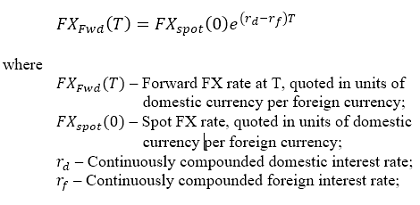

## Table of Contents

## What are forward points in foreign exchange?

Forward points in foreign exchange are the difference between the spot exchange rate and the forward exchange rate. When you want to buy or sell a currency in the future, you use a forward contract. The forward points tell you how much more or less you will pay compared to the spot rate, which is the rate for immediate exchange.

These points are usually shown as a number of pips, which are small units of currency movement. For example, if the spot rate for USD to EUR is 1.1000 and the 3-month forward rate is 1.1050, the forward points are 50 pips. They can be positive or negative, depending on whether the forward rate is higher or lower than the spot rate. Forward points help in planning and managing currency risk for businesses and investors.

## How are forward points calculated?

Forward points are calculated by comparing the spot exchange rate with the forward exchange rate. The spot rate is what you would get if you exchanged currencies right now. The forward rate is what you would get if you agreed to exchange currencies at a future date. The difference between these two rates, measured in pips, gives you the forward points. Pips are small units of currency movement, usually the fourth decimal place in most currency pairs.

To find the forward points, you need to know the interest rates of the two currencies involved. If the interest rate of the currency you are buying is higher than the currency you are selling, the forward points will be negative. This means the forward rate will be lower than the spot rate. If the interest rate of the currency you are buying is lower, the forward points will be positive, and the forward rate will be higher than the spot rate. The exact calculation involves using the interest rate differential over the time period of the forward contract.

For example, if the spot rate for USD to EUR is 1.1000 and the 3-month forward rate is 1.1050, the forward points are 50 pips. This means that if you want to buy Euros with Dollars in 3 months, you will pay 50 pips more than the current spot rate. The calculation of these points takes into account the interest rate differences between the US and the Eurozone over those 3 months.

## Why are forward points important in currency trading?

Forward points are important in currency trading because they help traders and businesses know what to expect in the future. When you want to buy or sell a currency later, you use a forward contract. The forward points tell you how much the price will change from now until then. This is useful because it helps you plan and manage your money better. If you know the forward points, you can make smarter decisions about when to buy or sell currencies.

Also, forward points are key for managing risk. Currencies can go up or down in value, and this can affect businesses that work in different countries. By using forward points, a company can lock in a price for the future. This means they won't lose money if the currency value changes a lot. For example, if a US company needs to pay for goods in Euros in six months, knowing the forward points helps them figure out how much it will cost and protect their budget.

## What is the difference between forward points and spot rates?

Forward points and spot rates are both important in the world of currency trading, but they serve different purposes. A spot rate is the price you get if you want to exchange one currency for another right now. It's like the current price tag on the currency. For example, if you want to change your dollars to euros today, you would use the spot rate to know how many euros you get for your dollars.

Forward points, on the other hand, tell you how the price might change in the future. They are the difference between the spot rate and the forward rate, which is the price you agree to exchange currencies at a later date. Forward points help you plan because they show you how much more or less you might pay compared to today's spot rate. If you want to buy euros with dollars in three months, forward points let you know if you'll pay more or less than the current spot rate.

## How do forward points affect the forward exchange rate?

Forward points directly affect the forward exchange rate by showing the difference between the spot rate and the forward rate. If you want to exchange money at a future date, the forward rate is what you will use. The forward points tell you how much more or less you will pay compared to the spot rate. For example, if the spot rate for USD to EUR is 1.1000 and the forward points are 50 pips, the forward rate would be 1.1050. This means you will pay more for euros in the future than you would today.

The forward points are calculated using the interest rate difference between the two currencies involved. If the currency you are buying has a higher interest rate than the one you are selling, the forward points will be negative, making the forward rate lower than the spot rate. If the interest rate of the currency you are buying is lower, the forward points will be positive, and the forward rate will be higher. This helps businesses and traders plan and manage their currency risks by knowing what to expect in the future.

## Can you explain the relationship between forward points and interest rate differentials?

Forward points are closely tied to the difference in interest rates between two currencies, which is called the interest rate differential. When you look at forward points, you are basically seeing how the interest rates of the two currencies will change the price of exchanging them in the future. If the interest rate for the currency you want to buy is higher than the one you are selling, the forward points will be negative. This means you will pay less for that currency in the future than you would today. On the other hand, if the interest rate for the currency you want to buy is lower, the forward points will be positive, and you will pay more in the future.

To understand this better, think about a simple example. Let's say you want to buy euros with dollars in six months. If the interest rate in the US is higher than in Europe, the forward points will be negative. This is because the higher US interest rate makes the dollar stronger over time, so you will need fewer dollars to buy the same amount of euros in the future. But if the interest rate in Europe is higher, the forward points will be positive, meaning you will need more dollars to buy the same amount of euros because the euro becomes stronger over time. This relationship helps traders and businesses predict and manage their currency exchanges better.

## What role do forward points play in hedging currency risk?

Forward points are really helpful when you want to protect yourself from changes in currency values, which is called hedging currency risk. If you know you will need to buy or sell a different currency in the future, you can use forward points to figure out what the price might be. This helps you plan and make sure you won't lose a lot of money if the currency value changes a lot. For example, if a company in the US needs to pay for goods in euros in six months, they can use forward points to lock in the price they will pay for those euros, even if the euro's value goes up or down.

By using forward points, businesses and investors can make smart decisions about their money. Forward points show how much more or less you might pay for a currency in the future compared to right now. This is important because it lets you plan and manage your money better. If you know the forward points, you can choose to buy or sell the currency at a time that will save you money or protect you from losing money. This way, you can focus on your business or investments without worrying too much about sudden changes in currency values.

## How do forward points impact the cost of currency swaps?

Forward points play a big role in figuring out the cost of currency swaps. A currency swap is when you agree to exchange one currency for another now and then swap them back later. The forward points tell you how much more or less you will need to pay when you swap the currencies back. If the forward points are positive, it means you will pay more to get your original currency back. If they are negative, you will pay less. This difference in cost is important because it helps you plan how much money you will need for the swap.

For example, if a US company wants to swap dollars for euros now and then swap them back in six months, the forward points will tell them if they will need more or fewer dollars to get their euros back. If the interest rate in the US is higher than in Europe, the forward points will be negative, and the company will need fewer dollars to get their euros back. But if the interest rate in Europe is higher, the forward points will be positive, and the company will need more dollars. Knowing this helps the company manage their money better and avoid surprises when it's time to swap the currencies back.

## What are some common strategies traders use involving forward points?

Traders often use forward points to make smart decisions about when to buy or sell currencies. One common strategy is called hedging. This means they use forward points to protect themselves from big changes in currency values. For example, if a trader knows they will need to buy euros in three months, they can look at the forward points to see if they will pay more or less than today's price. If the forward points are positive, they might decide to buy the euros now at the spot rate and then sell them forward at the higher forward rate, making a profit from the difference.

Another strategy traders use is called carry trading. This involves borrowing money in a currency with a low interest rate and then investing it in a currency with a higher interest rate. Forward points help traders figure out if this strategy will be profitable. If the forward points are negative, it means the currency they are buying will be cheaper in the future, which can make the carry trade more profitable. Traders look at the interest rate differences and the forward points to decide if the potential profit from the interest rate difference is worth the risk of currency value changes.

## How do geopolitical events influence forward points?

Geopolitical events can change forward points because they can make people think differently about a country's money. If something big happens, like a war or a new law, people might start to believe that a country's currency will go up or down in value. This can make the interest rates of that country's money change too. When interest rates change, the forward points change because they are based on the difference in interest rates between two currencies. So, if a geopolitical event makes people think a country's money will be worth less in the future, the forward points for that currency might go up, making it more expensive to buy it later.

For example, if there is a big political problem in a country, people might want to take their money out of that country and put it somewhere safer. This can make the country's currency weaker right away and also make people think it will keep getting weaker. As a result, the interest rates in that country might go up to try to keep people from taking their money out. This change in interest rates will affect the forward points. If the interest rates go up a lot, the forward points might become more negative, meaning it will be cheaper to buy that country's currency in the future. Traders and businesses watch these events closely because they can make big changes in what they will have to pay for currencies later on.

## What are the limitations and risks associated with using forward points?

Using forward points to plan for future currency exchanges can be helpful, but it also has some limitations and risks. One big limitation is that forward points are based on interest rates, which can change unexpectedly. If there's a big event, like a war or a new law, it might make interest rates go up or down a lot. This means the forward points you looked at before might not be right anymore, and you could end up paying more or less than you thought.

Another risk is that forward points don't always predict the future perfectly. Even if you know the interest rates, other things like how people feel about a country's money or big economic news can change the currency's value in ways that forward points can't predict. If the actual currency value changes a lot more than the forward points suggested, you might lose money. It's important to use forward points as a guide, but also be ready for surprises.

## How can advanced models improve the prediction of forward points?

Advanced models can help predict forward points better by using more information than just interest rates. These models can look at things like how people feel about a country's money, big economic news, and even past patterns in currency values. By taking all this into account, the models can give a more complete picture of what might happen to forward points in the future. This can make the predictions more accurate and help traders and businesses plan better.

Even though advanced models can improve predictions, they still have limits. They can't predict everything because the future is always a bit uncertain. Things like sudden political changes or unexpected economic events can still make the actual forward points different from what the models predict. But, using these models can still help because they give a more detailed and up-to-date view of what might happen, making it easier to manage risks and make smarter decisions about currency trading.

## What are Foreign Exchange Forward Points and how do they work?

Foreign exchange forward points are an essential component of the forex market, serving as a tool for traders to manage risk and speculate on currency movements. Forward points refer to the number of basis points that must be added or subtracted from the current exchange rate (spot rate) to calculate the forward rate. The forward rate is the agreed-upon exchange rate for a currency pair at a future date, allowing traders to lock in rates now for future use.

Forward points are derived from the [interest rate](/wiki/interest-rate-trading-strategies) differential between two currencies in a pair. The calculation involves two primary factors: the spot exchange rate and the interest rate differential. The formula to calculate the forward rate $(FR)$ is:

$$
FR = SR + \text{Forward Points}
$$

Where $SR$ is the spot rate. Forward points are typically calculated using the following formula:

$$
\text{Forward Points} = \left( \frac{(1 + i_d \times \frac{n}{360})}{(1 + i_f \times \frac{n}{360})} - 1 \right) \times SR \times 10,000
$$

Here, $i_d$ is the domestic currency interest rate, $i_f$ is the foreign currency interest rate, and $n$ is the number of days until the forward contract matures.

Traders use forward points to hedge against exchange rate [volatility](/wiki/volatility-trading-strategies), effectively managing the risk associated with currency fluctuations. Forward contracts lock in exchange rates for a specific future date, ensuring a predetermined rate irrespective of market conditions at maturity. This is crucial for businesses engaged in international trade or investment as it stabilizes cash flows and financial forecasting.

Market conditions significantly influence forward points. Changes in interest rates, political events, and economic indicators can impact the interest rate differential, thus altering forward points. For instance, if the domestic interest rate rises relative to the foreign rate, forward points typically increase, reflecting a stronger future domestic currency position relative to the foreign currency.

Examples of forward points in major currency pairs, such as EUR/USD, USD/JPY, or GBP/USD, demonstrate their practical application. For instance, if the spot rate for EUR/USD is 1.1000 and the calculated forward points for a six-month contract are -25, the forward rate will be 1.0975. It signifies that the trader anticipates the euro to be less valuable compared to the dollar in six months.

In hedging, forward points enable traders and businesses to guard against unfavorable currency movements. Speculative traders, on the other hand, may leverage forward points to anticipate and profit from expected shifts in exchange rates. By analyzing and predicting interest rate movements, traders can exploit forward points to inform their trading decisions.

The strategic use of forward points allows for sophisticated risk management and potential speculative gains, making them an indispensable tool in the [forex](/wiki/forex-system) trading landscape. Understanding how to calculate, interpret, and strategically utilize forward points is vital for informed currency trading and investment strategies.

 to Algorithmic Trading in Forex

Algorithmic trading in the foreign exchange (forex) market refers to the use of computer programs and algorithms to automate the trading of currencies. This approach leverages mathematical models and computational techniques to make trading decisions, often executing them without human intervention. Key features of [algorithmic trading](/wiki/algorithmic-trading) include the ability to process large volumes of data rapidly, execute trades with high speed and precision, and operate continuously across global markets.

The advantages of using algorithms in forex trading are significant. They provide speed and efficiency by executing trades in fractions of a second, reducing transaction times compared to manual trading. This speed is crucial in the forex market, where currency values can fluctuate rapidly. Additionally, algorithmic trading minimizes the influence of human emotions, such as fear and greed, which can distort judgment and lead to irrational trading decisions.

There are several popular types of forex trading algorithms. Trend following algorithms identify and capitalize on existing market trends, often using statistical techniques to discern patterns over time. Arbitrage algorithms exploit price differences between various markets or instruments to generate profits. Machine learning-based strategies have gained popularity as well, using advanced data analysis and predictive models to identify profitable trading opportunities.

Technological advancements have significantly contributed to the growth of algo trading in forex. High-frequency trading ([HFT](/wiki/high-frequency-trading-strategies)) systems, improved computational power, and advancements in programming languages and software have enhanced the capabilities and accessibility of algorithmic trading for both institutional and retail investors. Cloud computing and improved internet speeds have also supported the scalability and efficiency of these systems.

Data analysis and big data play a critical role in developing trading algorithms. The ability to analyze vast datasets enables traders to identify patterns and trends that may not be visible through traditional analysis methods. Machine learning and [artificial intelligence](/wiki/ai-artificial-intelligence) technologies further enhance the predictive accuracy of these models by continuously learning from new data and adapting to changing market conditions. As a result, algorithmic trading strategies are becoming increasingly sophisticated, employing neural networks, natural language processing, and other advanced techniques to improve decision-making in the forex market.

## References & Further Reading

[1]: Bank for International Settlements. (2019). ["Triennial Central Bank Survey of Foreign Exchange and OTC Derivatives Markets."](https://www.bis.org/statistics/rpfx19.htm)

[2]: De Prado, M. L. (2018). ["Advances in Financial Machine Learning."](https://www.amazon.com/Advances-Financial-Machine-Learning-Marcos/dp/1119482089) Wiley.

[3]: Chan, E. P. (2009). ["Quantitative Trading: How to Build Your Own Algorithmic Trading Business."](https://github.com/ftvision/quant_trading_echan_book) Wiley.

[4]: Jansen, S. (2020). ["Machine Learning for Algorithmic Trading: Predictive Models to Extract Signals from Market and Alternative Data for Systematic Trading Strategies with Python."](https://github.com/stefan-jansen/machine-learning-for-trading)

[5]: Aronson, D. R. (2007). ["Evidence-Based Technical Analysis: Applying the Scientific Method and Statistical Inference to Trading Signals."](https://www.amazon.com/Evidence-Based-Technical-Analysis-Scientific-Statistical/dp/0470008741) Wiley.

[6]: Ruggiero, M. (2002). ["Cybernetic Trading Strategies: Developing a Profitable Trading System with State-of-the-Art Technologies."](https://www.wiley.com/en-us/Cybernetic+Trading+Strategies%3A+Developing+a+Profitable+Trading+System+with+State+of+the+Art+Technologies-p-9780471149200) Wiley.