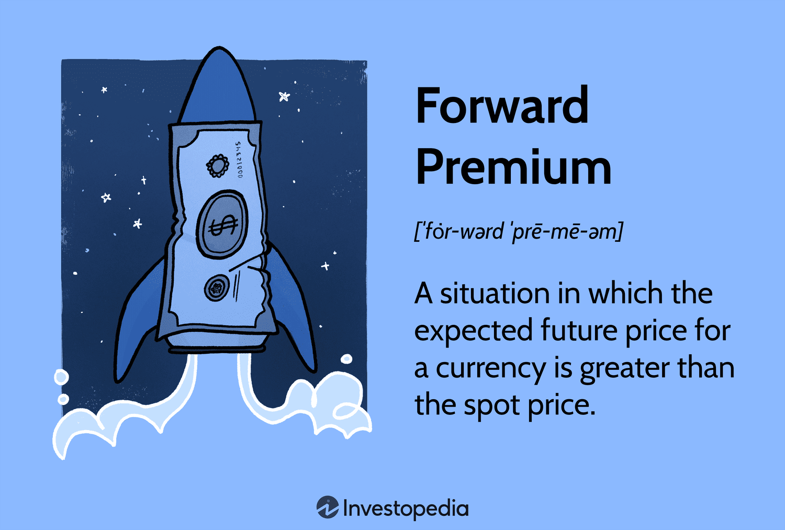

## Table of Contents

## What is a forward premium?

A forward premium is a situation in the foreign exchange market where the forward exchange rate of a currency is higher than its spot exchange rate. This means that if you want to buy a currency in the future, you will have to pay more for it than if you bought it right now. The forward premium is often expressed as an annualized percentage difference between the forward and spot rates.

The reason a forward premium happens can be because of interest rate differences between two countries. If one country has higher interest rates, investors might want to invest there. But to do that, they need to buy that country's currency. So, the demand for the currency in the future goes up, making the forward rate higher than the spot rate. Understanding forward premiums is important for businesses and investors who deal with international trade and need to plan for future currency transactions.

## How is forward premium calculated?

To calculate a forward premium, you need to know the spot exchange rate and the forward exchange rate between two currencies. The spot rate is the current price of one currency in terms of another, and the forward rate is the price agreed upon today for the exchange that will happen in the future. The forward premium is the difference between these two rates, expressed as a percentage. You find this difference by subtracting the spot rate from the forward rate, then dividing by the spot rate.

For example, if the spot rate for USD/EUR is 1.10 (meaning 1 USD equals 1.10 EUR) and the 1-year forward rate is 1.15, the forward premium would be calculated as follows: (1.15 - 1.10) / 1.10 = 0.0455 or 4.55%. This means that the euro is at a forward premium of 4.55% over the dollar. If you want to annualize this premium, you can adjust it based on the time period of the forward contract. For a 1-year forward, the annualized premium is already calculated, but for different periods, you would need to adjust the calculation accordingly.

## What does a positive forward premium indicate?

A positive forward premium means that the forward exchange rate of a currency is higher than its spot exchange rate. This tells us that if you want to buy a currency in the future, you will have to pay more for it than if you bought it right now. It's like the price of the currency is going up over time.

This situation often happens because of differences in interest rates between countries. If one country has higher interest rates, people might want to invest there. To do that, they need to buy that country's currency. So, the demand for the currency in the future goes up, making the forward rate higher than the spot rate. A positive forward premium can be important for businesses and investors who need to plan for future currency transactions.

## Can you explain the relationship between forward premium and interest rate differentials?

The forward premium is closely tied to the difference in interest rates between two countries. When one country has higher interest rates than another, it often attracts more investors who want to earn higher returns on their investments. To invest in that country, they need to buy its currency. This increased demand for the currency in the future causes its forward exchange rate to be higher than its spot rate, leading to a forward premium.

Think of it like this: if you can earn more interest in one country than another, you'll want to move your money there. But to do that, you need that country's currency. So, you agree to buy it in the future at a higher price than what it costs now. That's why a forward premium often shows up when there's a big difference in interest rates between countries. It's all about where people think they can make more money and how that affects currency prices over time.

## How does forward premium affect currency trading?

Forward premium can really change how people trade currencies. When a currency has a forward premium, it means that it will cost more to buy it in the future than it does right now. This can make traders think twice before buying that currency because they know they'll have to pay more later. Traders might decide to sell the currency now to avoid the higher price later, or they might hold off on buying it until the forward premium goes away.

This situation also affects how businesses plan for the future. If a company knows it will need to buy a currency that has a forward premium, it might decide to buy that currency now to save money. Or, if the company expects to receive payments in a currency with a forward premium, it might wait to sell that currency until later when the price is higher. Understanding forward premiums helps traders and businesses make smarter decisions about when to buy or sell currencies.

## What are the implications of a negative forward premium?

A negative forward premium means that the forward exchange rate of a currency is lower than its spot rate. This tells us that if you want to buy a currency in the future, you will pay less for it than if you bought it right now. It's like the price of the currency is going down over time. This often happens when one country's interest rates are lower than another country's. If a country has lower interest rates, fewer people want to invest there, so the demand for its currency in the future goes down, making the forward rate lower than the spot rate.

This situation can affect how traders and businesses deal with currencies. Traders might see a negative forward premium as a chance to buy a currency now and sell it later at a lower price, making a profit. Businesses that know they will need to buy a currency with a negative forward premium might wait until later to buy it, hoping to save money. On the other hand, if a business expects to receive payments in a currency with a negative forward premium, it might sell that currency now to avoid losing money later. Understanding negative forward premiums helps traders and businesses plan their currency transactions more wisely.

## How does forward premium relate to the concept of purchasing power parity?

Forward premium and purchasing power parity (PPP) are two important ideas in how we understand currency values. PPP is the idea that in the long run, exchange rates between two countries should move towards the rate that would equalize the prices of a basket of goods in both countries. If a burger costs $5 in the U.S. and 4 euros in Europe, PPP says the exchange rate should be around 1.25 dollars per euro. Forward premium, on the other hand, is about the difference between what a currency costs now and what it will cost in the future.

The link between forward premium and PPP comes from how they both look at what affects currency values. If a country's interest rates are higher, its currency might have a forward premium because people want to invest there. But over time, if that currency's value keeps going up because of the forward premium, it could make goods in that country more expensive compared to other countries. This would push the exchange rate away from the PPP level. So, while forward premium deals with short-term changes in currency prices, PPP focuses on the long-term balance that should happen if exchange rates are driven by the relative prices of goods.

## What role does forward premium play in covered interest arbitrage?

Forward premium is really important in covered interest [arbitrage](/wiki/arbitrage). This is a strategy where people take advantage of the difference in interest rates between two countries to make money, while also making sure they don't lose out because of changes in currency values. If one country has higher interest rates, you can borrow money in a country with lower rates, change it into the currency of the country with higher rates, and invest it there. But to make sure you don't lose money if the currency value changes, you use a forward contract to change the money back at a set rate in the future. The forward premium comes into play because it tells you how much more or less you'll get when you change the money back.

Let's say you borrow money in a country with low interest rates, change it to the currency of a country with high interest rates, and invest it there. At the end of your investment period, you need to change the money back to pay off your loan. If the currency you invested in has a forward premium, it means you'll get more of the original currency when you change it back than you would if you changed it at today's rate. This can help you make a profit from the [interest rate](/wiki/interest-rate-trading-strategies) difference and the forward premium. So, understanding the forward premium is key to figuring out if covered interest arbitrage will actually make you money.

## How do forward premiums impact international investment decisions?

Forward premiums can really affect how people decide to invest their money in different countries. If a country's currency has a forward premium, it means that currency will be worth more in the future than it is right now. This can make investors think twice about putting their money into that country. They might worry that if they invest now, they'll have to pay more to buy that currency later when they want to take their money out. On the other hand, if a country's currency has a negative forward premium, it might be a good time to invest because the currency will be cheaper in the future. This can make investing in that country more attractive.

Understanding forward premiums helps investors make smarter choices. For example, if an investor sees a forward premium, they might decide to invest in a country with lower interest rates instead, where the currency doesn't have a forward premium. This way, they can avoid paying more for the currency later. Or, if they still want to invest in the country with the forward premium, they might use financial tools like forward contracts to protect themselves from the higher future costs. By keeping an eye on forward premiums, investors can plan their international investments better and try to make more money.

## What are the limitations of using forward premium as a predictor of future spot rates?

Using forward premium to guess what future spot rates will be has some problems. Forward premium is the difference between what a currency costs now and what it will cost in the future. But, this difference doesn't always tell us exactly what will happen to currency prices later. Sometimes, other things like changes in a country's economy, big events around the world, or even what people think might happen can change currency prices in ways we don't expect. So, while forward premium can give us a clue about where currency prices might be headed, it's not a perfect tool for predicting the future.

Another issue is that forward premium is based on interest rates. If interest rates in one country go up or down a lot, the forward premium can change quickly. This means that what we think will happen to currency prices based on the forward premium today might not be true tomorrow if interest rates change. Also, the forward premium only looks at the difference between today's rate and a future rate, but it doesn't tell us about all the other things that could affect currency prices. So, it's important to use forward premium along with other information to make the best guesses about future spot rates.

## How have forward premiums been influenced by major economic events in the past decade?

Over the past decade, forward premiums have been affected a lot by big economic events. One major event was the global financial crisis that started in 2008 and kept affecting economies for years. During this time, many countries lowered their interest rates to help their economies recover. When interest rates are low, it can lead to smaller forward premiums or even negative forward premiums. For example, after the crisis, the U.S. Federal Reserve kept interest rates very low, which made the U.S. dollar's forward premium smaller compared to other currencies with higher interest rates.

Another big event that influenced forward premiums was the European debt crisis, especially around 2010 to 2012. Countries like Greece, Spain, and Italy had big financial problems, which made investors worried about their currencies. As a result, the forward premiums for these currencies went down because people didn't want to invest in them. More recently, events like Brexit and the COVID-19 pandemic also shook up forward premiums. Brexit made the British pound's forward premium go up and down a lot because of uncertainty. And during the COVID-19 crisis, many central banks lowered interest rates again, affecting forward premiums all over the world. These events show how forward premiums can change quickly because of big economic happenings.

## What advanced econometric models are used to analyze forward premium anomalies?

Advanced econometric models help us understand why forward premiums sometimes don't act the way we expect them to. One popular model is the Vector Autoregression (VAR) model. This model looks at how different economic factors, like interest rates and inflation, affect each other over time. By using VAR, we can see if these factors cause forward premiums to be higher or lower than we thought they would be. Another useful model is the Error Correction Model (ECM). This model helps us see how forward premiums move back to normal after they've been off track for a while. Both of these models let us dig deeper into why forward premiums can be unpredictable.

Another model that's good for studying forward premium anomalies is the GARCH model. GARCH stands for Generalized Autoregressive Conditional Heteroskedasticity, which is a fancy way of saying it helps us understand how the ups and downs in forward premiums change over time. This model is especially useful because it can show us if the unpredictability of forward premiums gets bigger or smaller. By using these advanced models, economists can get a better handle on why forward premiums sometimes don't follow the rules we expect them to, and this helps everyone from investors to policymakers make better decisions.

## How do you calculate forward premium?

The forward premium in the foreign exchange market is calculated using a straightforward mathematical formula. The formula is:

$$
\text{Forward Premium} = \left( \frac{\text{Forward Rate} - \text{Spot Rate}}{\text{Spot Rate}} \right) \times 100
$$

This calculation provides traders with the forward premium expressed as a percentage. By applying this formula, traders can determine whether a currency is trading at a premium or a discount compared to its spot rate, allowing them to assess the potential profitability of holding or shorting a currency in the future.

For instance, consider the currency pair involving the Japanese yen (JPY) and the U.S. dollar (USD). Suppose the current spot rate for USD/JPY is 110, whereas the three-month forward rate is quoted at 112. To compute the forward premium:

$$
\text{Forward Premium} = \left( \frac{112 - 110}{110} \right) \times 100 \approx 1.82\%
$$

Thus, the forward premium for the USD against the JPY is approximately 1.82%. This percentage reflects the market's expectation for the appreciation of the currency over the specified forward period.

Understanding this calculation is crucial for traders as it helps quantify market sentiment regarding future currency movements. A positive forward premium, like the one calculated above, suggests market anticipation of an appreciating USD against the JPY, potentially indicating a favorable environment for long positions on the USD. Conversely, a negative forward premium would indicate that the USD is expected to depreciate.

By integrating forward premium calculations into their trading methodologies, traders can more effectively strategize their positions, improving their ability to manage risks and optimize returns in the volatile foreign exchange market.

## References & Further Reading

[1]: Lyons, R.K. (2001). ["The Microstructure Approach to Exchange Rates."](https://direct.mit.edu/books/monograph/2004/The-Microstructure-Approach-to-Exchange-Rates) MIT Press.

[2]: Taylor, M.P. & Peel, D.A. (2000). ["International Parity Conditions."](https://onlinelibrary.wiley.com/doi/abs/10.1111/1467-9396.00394) The New Palgrave Dictionary of Economics.

[3]: Pedersen, L.H. (2015). ["Efficiently Inefficient: How Smart Money Invests and Market Prices Are Determined."](https://www.amazon.com/Efficiently-Inefficient-Invests-Market-Determined/dp/0691166196) Princeton University Press.

[4]: Acar, E. (2013). ["Understanding FX Forwards"](https://accountinginsights.org/understanding-fx-forwards-components-pricing-and-applications/) Clarus Financial Technology Blog.

[5]: Hasbrouck, J. (2007). ["Empirical Market Microstructure: The Institutions, Economics, and Econometrics of Securities Trading."](https://academic.oup.com/book/52241) Oxford University Press.