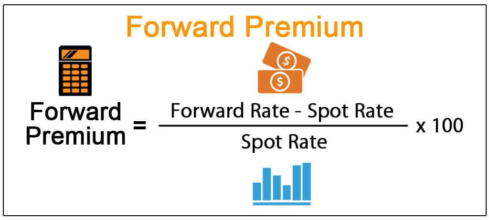

Foreign exchange (forex) currency trading is a dynamic and intricate market, heavily influenced by a variety of economic factors. Among the critical components that assist traders in navigating this volatile environment are forward premiums and algorithmic (algo) trading. Forward premiums serve as indicators, reflecting market expectations about future currency movements by comparing the forward exchange rate with the current spot rate. On the other hand, algo trading employs advanced computational techniques to execute trades based on specific criteria, optimizing for speed and precision.

The synergy between forward premiums and algorithmic trading is pivotal in predicting market trends and executing transactions efficiently. This article examines how forward premiums are derived and the roles they play in forex trading. Additionally, it discusses the integration of algorithmic strategies to exploit these market expectations, providing insights into trading opportunities and risk management.



By comprehending these concepts, traders can make informed decisions and take advantage of fluctuations in the market. Forward premiums and algo trading are instrumental in assessing market sentiment and devising strategies to harness potential profits. Exploring these aspects unravels the intricacies behind currency trading strategies, equipping traders with the knowledge to optimize their trades in an ever-evolving global financial landscape.

## Table of Contents

## What is a Forward Premium?

A forward premium occurs when the forward exchange rate for a currency surpasses its current spot rate. This situation suggests market expectations that the currency will appreciate in the future, providing traders with insights into potential future exchange rate movements. The forward premium serves as an indicator of the market sentiment and expectations for a currency's value.

The forward premium is primarily influenced by interest rate differentials between the countries involved in the currency pair. When the interest rate of one country's currency is higher than that of another, the currency with the higher rate often commands a forward premium. This premium reflects the potential benefits of holding that currency, as investors would expect to earn more interest by investing in higher-yielding assets.

To grasp the concept of forward premiums effectively, it is crucial for traders to monitor and analyze these interest rate differentials. By understanding how they affect forward exchange rates, traders can better anticipate future currency movements and manage the associated financial risks. It allows them to strategize on potential currency appreciations or depreciations and make informed decisions, aligning their trading activities with market expectations.

## Calculating Forward Premium

The forward premium in the foreign exchange market is calculated using a straightforward mathematical formula. The formula is:

$$
\text{Forward Premium} = \left( \frac{\text{Forward Rate} - \text{Spot Rate}}{\text{Spot Rate}} \right) \times 100
$$

This calculation provides traders with the forward premium expressed as a percentage. By applying this formula, traders can determine whether a currency is trading at a premium or a discount compared to its spot rate, allowing them to assess the potential profitability of holding or shorting a currency in the future.

For instance, consider the currency pair involving the Japanese yen (JPY) and the U.S. dollar (USD). Suppose the current spot rate for USD/JPY is 110, whereas the three-month forward rate is quoted at 112. To compute the forward premium:

$$
\text{Forward Premium} = \left( \frac{112 - 110}{110} \right) \times 100 \approx 1.82\%
$$

Thus, the forward premium for the USD against the JPY is approximately 1.82%. This percentage reflects the market's expectation for the appreciation of the currency over the specified forward period.

Understanding this calculation is crucial for traders as it helps quantify market sentiment regarding future currency movements. A positive forward premium, like the one calculated above, suggests market anticipation of an appreciating USD against the JPY, potentially indicating a favorable environment for long positions on the USD. Conversely, a negative forward premium would indicate that the USD is expected to depreciate.

By integrating forward premium calculations into their trading methodologies, traders can more effectively strategize their positions, improving their ability to manage risks and optimize returns in the volatile foreign exchange market.

## Factors Influencing Forward Premium

Interest rate differentials are a primary [factor](/wiki/factor-investing) influencing forward premiums in the foreign exchange market. When a country's interest rates are higher compared to another, it often attracts more investment in its national currency due to the potential for higher returns. This increased demand can lead to an appreciation of the currency, thus increasing the forward premium. The relationship between interest rates and forward premium is further explained by the [interest rate](/wiki/interest-rate-trading-strategies) parity theory. This theory posits that the difference in interest rates between two countries should be equal to the difference between the forward exchange rate and the spot exchange rate.

Inflation rates are another critical factor. Persistent inflation in a country erodes purchasing power and typically leads to depreciation of its currency. Traders anticipating rising inflation might demand a higher forward premium to compensate for the expected depreciation. Conversely, a low inflation rate can strengthen a currency, potentially lowering the forward premium.

Speculative trading activities also influence forward premiums as traders attempt to profit from anticipated currency movements based on forward rate differentials. Speculators may conduct trades that accentuate the forward premiums, considering expectations of future currency value changes.

Economic stability plays a significant role in determining forward premiums. A stable economic environment, characterized by consistent growth, balanced budgets, and predictable regulatory frameworks, can enhance confidence in a nation's currency, potentially impacting the forward premium positively.

Traders must closely monitor these factors to predict forward premiums accurately and adjust their trading strategies. Additionally, geopolitical events, such as elections, conflicts, or diplomatic agreements, can alter public perception and investor confidence, thus impacting forward premium calculations. Central bank policies, including changes to interest rates or monetary interventions, can have immediate and significant effects on currency values and hence on the forward premium.

By incorporating these multifaceted elements into their analysis, traders can improve their ability to anticipate changes in forward premiums, enabling more informed and strategic trading decisions. This comprehensive understanding allows for better risk management and optimization of [forex](/wiki/forex-system) investments.

## Algo Trading and Forward Premiums in Forex

Algorithmic trading, or algo trading, refers to the use of computer systems to execute trades based on pre-defined criteria. This approach offers traders notable advantages, including speed, precision, and the ability to process large amounts of data efficiently. In the context of forex trading, algo trading strategies can be particularly effective in detecting and exploiting forward premiums.

Algo trading systems can be programmed to monitor currency pairs and identify opportunities where forward premiums may suggest potential market trends. By analyzing the discrepancies between forward exchange rates and current spot rates, algos can anticipate appreciation or depreciation in currency values, enabling timely and informed decision-making.

Utilizing advanced algorithms, these systems can process extensive datasets to forecast forward premiums more accurately. The algorithms employ statistical models and historical data analysis to predict future movements in currency pairs. This capability is crucial in the volatile forex market, where rapid changes can occur based on economic events, interest rate shifts, and geopolitical developments.

The integration of [artificial intelligence](/wiki/ai-artificial-intelligence) (AI) further enhances the capabilities of algo trading in predicting forward premiums. AI can improve the accuracy of forecasts by learning from patterns within the data and adapting to new market conditions. This reduces human error and ensures more reliable trading outcomes. AI systems can also automate routine tasks, allowing traders to focus on more strategic decision-making.

In practice, a typical algo trading model might consist of the following basic steps:

1. **Data Acquisition**: Gather current and historical data on currency pairs, interest rates, and market indicators.

2. **Signal Generation**: Use algorithms to analyze the data and generate trading signals based on pre-determined criteria, such as when a forward premium or discount reaches a certain threshold.

3. **Execution**: Execute trades automatically at the optimal moment based on the generated signals.

4. **Risk Management**: Implement risk management protocols to ensure that trades adhere to predefined risk levels and stop-loss limits.

Here is a Python example illustrating a simple approach to setup a basic structure for an algo trading strategy focusing on forward premiums:

```python
import pandas as pd
import numpy as np

# Sample function to calculate forward premium given forward and spot rates.
def calculate_forward_premium(forward_rate, spot_rate):
    return ((forward_rate - spot_rate) / spot_rate) * 100

# Simulated data for forward and spot rates
data = pd.DataFrame({
    'Spot_Rate': [110.0, 111.0, 109.5],    # Example spot rates
    'Forward_Rate': [112.0, 112.5, 111.0]  # Example forward rates
})

# Calculate forward premiums for the data
data['Forward_Premium'] = data.apply(lambda row: calculate_forward_premium(row['Forward_Rate'], row['Spot_Rate']), axis=1)

print(data)
```

In summary, by leveraging [algorithmic trading](/wiki/algorithmic-trading), traders can systematically and efficiently capitalize on forward premiums in the forex market. The combination of advanced algorithms and artificial intelligence optimizes the execution of strategies, reduces human error, and enhances the ability to predict market movements, ultimately offering traders a competitive edge.

## Practical Applications of Forward Premiums in Trading

Forward premiums are crucial in forex trading, assisting traders in gauging market sentiment and informing their decisions on whether to adopt long or short positions. Analyzing forward premiums across various currency pairs enables traders to pinpoint promising investment opportunities by assessing expectations of currency appreciation or depreciation.

For businesses engaged in international trade, forward contracts offer a practical method for hedging against unfavorable currency fluctuations. By locking in desirable exchange rates for future transactions, companies protect themselves from adverse shifts that could affect their profit margins. This hedging strategy is vital for firms that operate with thin profit margins and are exposed to currency risk in foreign markets.

The effective use of forward premiums is integral to robust risk management strategies. By understanding and utilizing these premiums, traders and businesses can safeguard financial performance amidst volatile currency markets. The ability to predict currency movements allows entities to protect their margins and make strategic decisions about financial transactions.

Quantitative analysis, including mathematical models and computational algorithms, plays a significant role in exploiting forward premiums. This analysis often involves statistical models that forecast currency trends and help traders construct optimized trading strategies. Python, for example, can be employed to analyze currency data and compute potential forward premiums using the formula:

```python
def calculate_forward_premium(forward_rate, spot_rate):
    return (forward_rate - spot_rate) / spot_rate * 100

# Example: Calculate forward premium
forward_rate = 1.15
spot_rate = 1.10
forward_premium = calculate_forward_premium(forward_rate, spot_rate)
print(f"Forward Premium: {forward_premium}%")
```

In summary, forward premiums are indispensable tools in strategic decision-making in forex trading and business financial management. By integrating forward premiums into their trading and operational strategies, traders and firms can enhance risk management and stabilize their financial outcomes in a dynamic market environment.

## Challenges and Future Outlook

Forward premiums, while offering significant advantages in forex trading, present several challenges. One primary issue is the necessity for accurate data and real-time trading systems. Accurate data is vital for traders to make informed decisions, and real-time systems ensure timely execution of trades based on current market conditions. Delays in data acquisition or system performance can lead to suboptimal trading outcomes and increased financial risk.

Furthermore, the forex market is inherently volatile. Sudden economic events, geopolitical shifts, or unexpected policy changes can dramatically affect currency valuations, thus altering forward premium calculations. Traders must remain vigilant and adaptable, as rigid strategies may not keep pace with rapid market changes.

Looking ahead, the forex trading landscape is poised to increasingly rely on [machine learning](/wiki/machine-learning) and artificial intelligence. These technologies offer enhanced capabilities in analyzing vast data sets, identifying patterns, and predicting future trends. Machine learning algorithms, for instance, can be used to update prediction models continually as new data becomes available, improving the accuracy of forward premium forecasts.

```python
import numpy as np
from sklearn.model_selection import train_test_split
from sklearn.ensemble import RandomForestRegressor

# Simulated dataset with currency features and forward premium
data = np.random.rand(1000, 10)  # 1000 samples, 10 features
forward_premium = np.random.rand(1000)

# Splitting the data into training and testing sets
X_train, X_test, y_train, y_test = train_test_split(data, forward_premium, test_size=0.3, random_state=42)

# RandomForest model to predict forward premiums
model = RandomForestRegressor(n_estimators=100, random_state=42)
model.fit(X_train, y_train)

# Predicting forward premiums
predictions = model.predict(X_test)
```

Advancements in technology and data analysis will continue to shape the development of forward premium determination and algorithmic trading. As computational power and analytical techniques progress, traders and financial institutions can expect more sophisticated models that blend traditional economic theory with cutting-edge technology. This evolution will be instrumental in navigating the complexities of a globalized and interconnected financial system, equipping traders with robust tools to optimize their trading strategies and mitigate risks.

## Conclusion

Forward premiums serve as crucial instruments for predicting foreign exchange market trends and executing well-informed trading decisions. In the rapidly-evolving landscape of forex trading, accurately anticipating market movements provides a distinct competitive advantage. Algorithmic trading plays a significant role in enhancing this capacity by leveraging the potential of forward premiums. It accomplishes this with remarkable speed and precision, allowing traders to quickly respond to market shifts and opportunities.

The algorithmic trading approach deciphers complex market data to identify forward premiums and seamlessly integrates this information into trading strategies. By grasping the intricacies of forward premiums and effectively harnessing algorithmic trading, traders can significantly refine their strategies, thereby gaining an upper hand in the forex market. This insight is indispensable as it allows for the maximization of opportunities presented by forward premium trends.

To maintain competitiveness, adapting to technological advancements is essential. Progress in machine learning and data analytics provides powerful tools that enhance the predictability of forward premiums, reducing the margin for error and refining decision-making processes. Continuously updating and refining trading algorithms to incorporate the latest technological developments is crucial in sustaining success in an ever-changing financial environment. As forex markets continue to evolve, embracing these technological innovations will be a pivotal factor in optimizing trading outcomes and securing a sustainable edge over competitors.

## References & Further Reading

[1]: Lyons, R.K. (2001). ["The Microstructure Approach to Exchange Rates."](https://direct.mit.edu/books/monograph/2004/The-Microstructure-Approach-to-Exchange-Rates) MIT Press.

[2]: Taylor, M.P. & Peel, D.A. (2000). ["International Parity Conditions."](https://onlinelibrary.wiley.com/doi/abs/10.1111/1467-9396.00394) The New Palgrave Dictionary of Economics.

[3]: Pedersen, L.H. (2015). ["Efficiently Inefficient: How Smart Money Invests and Market Prices Are Determined."](https://www.amazon.com/Efficiently-Inefficient-Invests-Market-Determined/dp/0691166196) Princeton University Press.

[4]: Acar, E. (2013). ["Understanding FX Forwards"](https://accountinginsights.org/understanding-fx-forwards-components-pricing-and-applications/) Clarus Financial Technology Blog.

[5]: Hasbrouck, J. (2007). ["Empirical Market Microstructure: The Institutions, Economics, and Econometrics of Securities Trading."](https://academic.oup.com/book/52241) Oxford University Press.