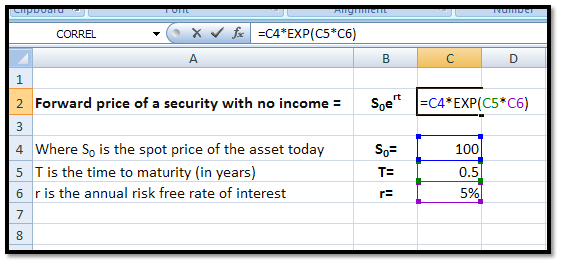

## Table of Contents

## What is forward price?

The forward price is the agreed-upon price for a transaction that will happen in the future. It's used in forward contracts, which are agreements to buy or sell an asset at a set price on a specific future date. This price is determined at the time the contract is made, not when the actual exchange happens. For example, if you want to buy wheat in six months, you and the seller agree on a forward price today, and that's the price you'll pay in six months, no matter what the market price is then.

Forward prices are important because they help both buyers and sellers manage risk. If you're a farmer growing wheat, you can lock in a forward price to protect against falling prices. If you're a bakery that needs wheat, you can use a forward price to protect against rising prices. By agreeing on a price now for a future transaction, both parties can plan better and avoid surprises. The forward price is calculated based on the current market price of the asset, plus or minus any costs or benefits of holding the asset until the delivery date.

## Why is forward price important in financial markets?

Forward prices are really important in financial markets because they help people and businesses plan for the future. Imagine you're a farmer and you grow wheat. You want to know how much money you'll get for your wheat next year, so you can plan your budget. By agreeing on a forward price with a buyer today, you can lock in a price for your wheat that you'll get in the future. This helps you avoid the risk of prices going down. It's the same for businesses that need to buy things like wheat or oil. They can use forward prices to know exactly how much they'll have to pay in the future, which helps them manage their costs better.

Another reason forward prices are important is that they give us information about what people think will happen in the market. If the forward price for oil is higher than the current price, it might mean that people expect oil prices to go up in the future. This information can be really useful for anyone making decisions about buying or selling things. Also, forward prices help make markets more stable. When people can use forward contracts to protect against price changes, it can stop big swings in prices that might happen if everyone was just buying and selling based on what's happening right now. So, forward prices not only help individual buyers and sellers but also make the whole market work better.

## How is forward price different from spot price?

The forward price and the spot price are two different things in the world of trading. The spot price is the price you pay if you want to buy something right now. For example, if you want to buy gold today, the spot price is how much you'll pay for it right away. On the other hand, the forward price is the price you agree to pay for something in the future. If you want to buy gold in six months, the forward price is what you'll pay for it then, but you agree on that price today.

The main difference between these two prices is when you pay and get the item. With the spot price, you pay and get the item immediately. With the forward price, you agree on the price now, but you don't pay or get the item until later. This difference helps people plan better because they can lock in a price for the future, which can protect them from price changes. For example, if you think the price of oil will go up, you can agree on a forward price now and buy it later at that price, even if the spot price goes up by then.

## What are the basic components needed to calculate forward price?

To calculate the forward price, you need to know the current spot price of the asset you want to buy or sell. The spot price is what you would pay if you bought the asset right now. You also need to know the cost of carrying the asset until the future date when you will actually buy or sell it. This cost of [carry](/wiki/carry-trading) can include things like storage costs if it's something like oil or wheat, or interest costs if it's a financial asset like a bond.

Another thing you need to consider is any benefits you get from holding the asset until the future date. For example, if you're holding a stock, you might get dividends, which are payments the company makes to its shareholders. If you're holding a commodity like gold, you might not get any benefits, so this part would be zero. By adding the spot price and the cost of carry, and then subtracting any benefits, you can figure out the forward price. This helps you know what you'll pay or get in the future, even if you agree on the price today.

## Can you explain the formula used to calculate forward price?

The formula to calculate the forward price is pretty simple once you know what goes into it. The forward price is the spot price of the asset today, plus the cost of carrying the asset until the future date you agree on, minus any benefits you get from holding the asset until that date. So, if you want to buy wheat in six months, you start with the current price of wheat, add the cost of storing it for six months, and subtract any benefits you might get from holding it.

Let's break it down a bit more. Imagine the spot price of wheat today is $5 per bushel. If it costs you $0.50 per bushel to store it for six months, and you don't get any benefits from holding it, the forward price would be $5 + $0.50 = $5.50 per bushel. This means you agree to buy wheat at $5.50 per bushel in six months, no matter what the spot price is then. By using this formula, you can figure out what you'll pay or get in the future, which helps you plan and manage risk.

## How does the time to delivery affect the forward price?

The time to delivery is a big deal when figuring out the forward price. The longer you have to wait before you get the thing you're buying, the more it can change how much you pay. This is because the cost of carrying the thing, like storing it or paying interest, goes up the longer you wait. So, if you're buying wheat and you have to wait a whole year instead of just six months, the forward price will be higher because you need to pay more to store it for that extra time.

But it's not just about costs. The time to delivery can also change the forward price because of what people think will happen in the future. If people think the price of something will go up a lot in the next year, they might be willing to pay more for it now, even if they have to wait a year to get it. So, the forward price can be higher if people are expecting big changes. This is why the time until you get the thing you're buying can make a big difference in what you agree to pay today.

## What role do interest rates play in determining forward price?

Interest rates are a big part of figuring out the forward price, especially when you're dealing with financial assets like bonds or currencies. When you agree to buy something in the future, you might need to borrow money to pay for it later. The interest rate is what you pay to borrow that money. So, if interest rates are high, it costs more to borrow, and that makes the forward price higher because you need to cover those extra costs. On the other hand, if interest rates are low, borrowing is cheaper, and the forward price can be lower because you don't need to add as much to cover the borrowing costs.

But it's not just about borrowing money. Interest rates also affect the value of money over time. If you're holding onto money until the future date when you'll buy something, you could be [earning](/wiki/earning-announcement) interest on that money instead. So, the forward price needs to take into account what you're giving up by not putting that money in the bank to earn interest. If interest rates are high, the forward price might be higher because you're missing out on more interest. If interest rates are low, the forward price might not need to be as high because you're not missing out on much. This is why interest rates are a key part of figuring out what you'll pay in the future.

## How are dividends or storage costs factored into the forward price calculation?

Dividends and storage costs are important parts of figuring out the forward price. If you're buying a stock, dividends are payments the company gives to its shareholders. When you agree to buy a stock in the future, you need to think about the dividends you won't get because you don't own the stock yet. So, you subtract the expected dividends from the forward price. This makes the forward price lower because you're missing out on those payments.

Storage costs work a bit differently. If you're buying something like oil or wheat, you need to store it until the future date when you'll actually get it. Storing things costs money, so you add those costs to the forward price. The longer you have to wait, the more you need to pay for storage, which makes the forward price higher. By considering both dividends and storage costs, you can figure out a fair price for buying something in the future.

## What is an example of calculating forward price for a commodity like oil?

Let's say you want to buy oil in six months, and the current price of oil, or the spot price, is $70 per barrel. You need to store the oil until you get it, and it costs $2 per barrel for six months of storage. Since you're not getting any benefits from holding oil, you don't need to subtract anything. So, you add the spot price and the storage cost to find the forward price. The forward price for oil in six months would be $70 + $2 = $72 per barrel.

This means you agree to buy oil at $72 per barrel in six months, no matter what the spot price is then. By figuring out the forward price, you can plan better and avoid surprises if the price of oil changes. It helps both buyers and sellers manage their risks and make decisions about the future.

## How does arbitrage influence forward pricing?

Arbitrage is when people buy something in one place and sell it in another to make a profit because of a price difference. In forward pricing, arbitrage helps keep the forward price fair. If the forward price is too high compared to the spot price and the costs of holding the thing until the future date, people might buy the thing now at the spot price, hold onto it, and then sell it at the forward price later. This buying and selling can push the forward price down until it's fair again.

On the other hand, if the forward price is too low, people might do the opposite. They could sell the thing now at the spot price and then agree to buy it back at the lower forward price in the future. This would push the forward price up until it's fair. By doing these trades, arbitrage helps make sure the forward price stays close to what it should be, based on the spot price and the costs and benefits of holding the thing until the future date.

## What are the limitations and assumptions in forward price models?

Forward price models are helpful, but they have some limits and make some guesses. One big guess is that the costs of holding the thing you're buying, like storage or interest, stay the same until the future date. But in real life, these costs can change. Also, these models guess that you can buy and sell the thing easily at any time, which isn't always true. If it's hard to buy or sell, it can mess up the forward price.

Another thing these models guess is that everyone knows everything about the market, which isn't true. People don't always have all the info, and they can make different guesses about what will happen in the future. This can make the forward price different from what the models say. Plus, these models don't always think about big events that can change prices a lot, like natural disasters or big news. So, while forward price models are useful, they're not perfect and can be off because of these guesses and limits.

## How can forward price calculations be adjusted for risk management purposes?

To manage risk better, people can change how they figure out forward prices. One way is by adding a little extra to the price to cover any surprises that might happen. This extra bit, called a risk premium, helps make sure they're protected if things don't go as planned. For example, if they think the price of oil might go up a lot because of a war, they might add a bit more to the forward price to be safe. By doing this, they can feel more secure about what they'll pay in the future, even if things change.

Another way to adjust forward price calculations for risk management is by using options. Options give people the right, but not the obligation, to buy or sell something at a set price in the future. By buying options, people can protect themselves from big price changes without having to agree on a forward price right away. If the price goes up a lot, they can use the option to buy at the lower price they set before. If the price goes down, they don't have to use the option and can buy at the lower market price. This flexibility helps them manage risk better and plan for different situations.

## What are the key components of forward price calculation?

Forward price calculation is a critical process in financial markets, ensuring a fair and reflective pricing structure for future delivery of various underlying assets. This calculation requires a deep understanding of several key components: spot price, risk-free rate, carrying costs, and delivery date. Each of these elements plays a vital role in determining the forward price, impacting decision-making for institutional investors and traders.

The spot price is the current market price at which an asset can be bought or sold for immediate delivery. It serves as the baseline for forward price calculations. The concept is straightforward; the forward price must start with the present value of the asset, which is inherently the spot price.

The risk-free rate is another essential component, representing the return on an investment with zero risk. Typically, government treasury yields are used as a proxy for the risk-free rate in calculations. The significance of the risk-free rate lies in its ability to account for the time value of money. It adjusts the spot price to consider the accrual of interest over the period until the asset's delivery.

Carrying costs encompass the expenses incurred over time to hold an asset or maintain a financial position. These could include storage costs for physical commodities, insurance, and financing costs related to maintaining a position. Incorporating carrying costs into the forward price calculation ensures that the resulting price accurately reflects the total anticipated expenses until the contract's delivery date.

Lastly, the delivery date is fundamental to forward price estimation. It represents the future point in time when the asset is bought or sold under the terms of the forward contract. The length of time until delivery affects the degree to which the risk-free interest and carrying costs accrue, directly influencing the forward price.

The formula for forward price $F$ typically combines these components in a straightforward mathematical expression:

$$
F = S_0 \times e^{(r \times T + c \times T)}
$$

where:
- $S_0$ = spot price of the asset
- $r$ = risk-free interest rate
- $c$ = carrying costs rate
- $T$ = time to maturity (delivery date) in years
- $e$ = base of the natural logarithm

For institutional investors and traders, understanding these components and how they interact is indispensable. A precise calculation of forward prices allows for effective hedging against unfavorable price movements and informs strategic decision-making in investment portfolios. As such, it supports a range of market activities, from risk management to speculative ventures, ensuring that forward pricing strategies are aligned with expected future market conditions.

## What is the Forward Price Calculation Formula?

The forward price calculation formula is fundamental in financial markets for determining the price at which an asset will be transacted at a future date. It takes into account various elements like the spot price, the risk-free rate of return, and any associated carrying costs. The formula is expressed mathematically as:

$$
F = S \times e^{(r \times T)}
$$

where:
- $F$ is the forward price,
- $S$ is the spot price of the asset,
- $r$ is the risk-free interest rate,
- $T$ is the time to delivery in years,
- $e$ is the base of the natural logarithm.

In cases where the underlying asset pays dividends during the life of the forward contract, adjustments are required to reflect the present value of these expected dividends. The adjusted formula for assets with dividends is:

$$
F = (S - D) \times e^{(r \times T)}
$$

where $D$ represents the present value of dividends expected to be paid before the contract's expiration. 

These calculations are essential not only for trading purposes but also for risk management and financial planning. The forward price provides a benchmark for structuring hedging strategies, assessing potential [arbitrage](/wiki/arbitrage) opportunities, and making informed investment decisions. By accurately adjusting for present dividends, traders can achieve greater precision in pricing, which is particularly beneficial in arbitrage and managing market risks effectively.

For practical applications, especially in [algorithmic trading](/wiki/algorithmic-trading), these calculations can be automated using programming languages like Python. Below is a simple Python function to compute forward prices:

```python
import math

def calculate_forward_price(spot_price, risk_free_rate, time_to_delivery, dividends=0):
    present_value_dividends = dividends * math.exp(-risk_free_rate * time_to_delivery)
    adjusted_spot_price = spot_price - present_value_dividends
    forward_price = adjusted_spot_price * math.exp(risk_free_rate * time_to_delivery)
    return forward_price

# Example usage:
spot_price = 100
risk_free_rate = 0.05
time_to_delivery = 1
dividends = 0  # If applicable, input the present value of dividends
forward_price = calculate_forward_price(spot_price, risk_free_rate, time_to_delivery, dividends)
print(forward_price)
```

This implementation can be part of more extensive algorithmic trading systems to ensure rapid and accurate calculations of forward prices, thereby enhancing an investor’s ability to execute optimized trading strategies.

## What is an Example of Forward Price Calculation in Algorithmic Trading?

Consider a security with a current price of $100, no dividends payable, an annual risk-free [interest rate](/wiki/interest-rate-trading-strategies) of 5%, and a one-year delivery period. This scenario serves as a practical example for calculating forward prices using the forward pricing formula, which is essential in algorithmic trading. The forward price $F$ can be calculated as follows:

$$
F = S_0 \times e^{(r \times T)}
$$

where:
- $S_0$ is the current spot price of the asset, in this case, $100.
- $r$ is the risk-free interest rate, 0.05 or 5% annually.
- $T$ is the time to delivery, one year.

Substituting the values:

$$
F = 100 \times e^{(0.05 \times 1)} \approx 100 \times 1.0513 = 105.13
$$

In algorithmic trading, such calculations are integral for quickly identifying potential arbitrage opportunities and making data-driven trading decisions. These systems automate the forward price calculation, allowing traders to execute trades with increased speed and precision.

Algorithmic trading systems employ forward pricing calculations to enhance trade execution, optimize trading strategies, and effectively manage risk. For instance, strategies can be crafted to exploit discrepancies between calculated forward prices and market prices, thereby generating potential profits. Additionally, such real-time calculations allow traders to adapt their strategies promptly to shifting market conditions, maintaining an edge in competitive trading environments. Python and other programming languages are often used to automate these calculations and integrate them into comprehensive trading algorithms. 

Below is an example of how one might implement this calculation in Python:

```python
import math

# Variables
spot_price = 100  # Current price of the security
risk_free_rate = 0.05  # Annual risk-free interest rate
time_to_maturity = 1  # Time to delivery (in years)

# Forward price calculation
forward_price = spot_price * math.exp(risk_free_rate * time_to_maturity)

print(f"The forward price is: ${forward_price:.2f}")
```

This code snippet seamlessly computes the forward price, demonstrating how algorithmic trading systems perform such calculations to inform and refine trading actions.

## References & Further Reading

[1]: Hull, J. C. (2018). ["Options, Futures, and Other Derivatives."](https://www.semanticscholar.org/paper/Options%2C-Futures%2C-and-Other-Derivatives-Hull/89bdee500c8623864fc9eb7a471546aa713acc44) Pearson Education.

[2]: de Prado, M. L. (2018). ["Advances in Financial Machine Learning."](https://www.amazon.com/Advances-Financial-Machine-Learning-Marcos/dp/1119482089) Wiley.

[3]: Shreve, S. E. (2004). ["Stochastic Calculus for Finance I: The Binomial Asset Pricing Model."](https://link.springer.com/book/10.1007/978-0-387-22527-2) Springer.

[4]: Chan, E. P. (2009). ["Quantitative Trading: How to Build Your Own Algorithmic Trading Business."](https://github.com/ftvision/quant_trading_echan_book) John Wiley & Sons.

[5]: Neftci, S. N. (2000). ["An Introduction to the Mathematics of Financial Derivatives."](https://archive.org/details/introductiontoma0000neft) Academic Press.

[6]: ["Financial Derivatives and Risk Management."](https://www.investopedia.com/ask/answers/052615/how-can-derivatives-be-used-risk-management.asp) (2020). Springer Nature Switzerland AG. 