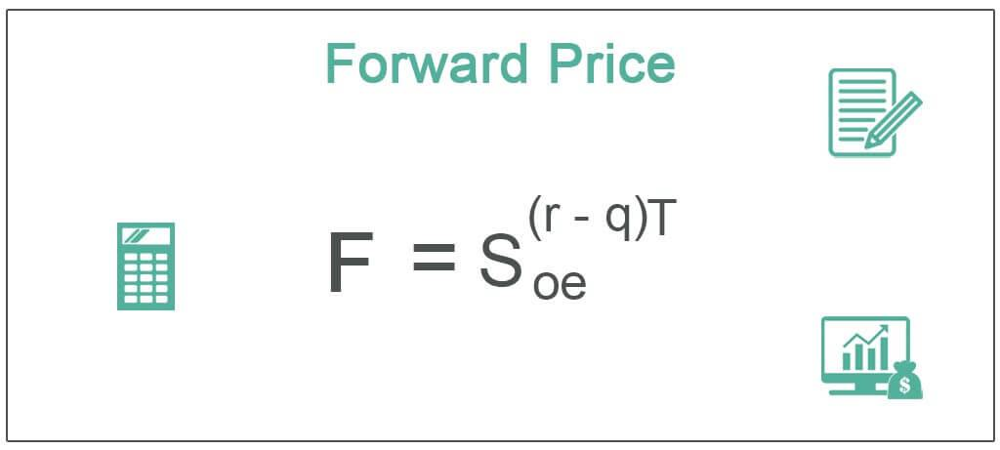

Forward pricing is a fundamental concept in financial markets, serving as a mechanism to set a predetermined delivery price for an underlying asset. This process is essential in facilitating various trading and hedging activities. By enabling market participants to secure a future price, forward pricing aids in minimizing market risk associated with fluctuations in asset prices. This assured pricing mechanism allows traders and investors to stabilize their financial planning, manage risks efficiently, and anticipate future costs accurately.

In recent years, the significance of forward pricing has expanded in the context of algorithmic trading. In this environment, the speed and precision of calculations are crucial to gaining competitive advantage. Algorithmic trading systems utilize forward pricing to execute trades swiftly, optimizing strategies and managing risks in real time. The integration of these calculations supports the identification of arbitrage opportunities and enhances the overall execution of trading strategies.



This article examines forward price calculation, illustrating its applications through financial examples and emphasizing its importance in algorithmic trading. By understanding the intricate details of forward pricing, traders can make more informed decisions, improve trading efficiency, and leverage these insights for strategic advantage in dynamic financial markets.

## Table of Contents

## Understanding Forward Price

A forward price represents the agreed-upon cost for the future delivery of a commodity, currency, or financial asset. This price is determined based on prevalent market conditions and is distinct from the spot price, which conveys the current market value of an asset. The forward price calculation encompasses several factors such as interest rates and carrying costs, which are fundamental in establishing a comprehensive estimate for future delivery.

Interest rates play a significant role in the calculation of forward prices as they impact the cost of carrying or holding an asset until the maturity date. A higher interest rate generally results in a higher forward price for assets that are bought on credit or financed over time. Similarly, carrying costs, which may include storage, insurance, and transportation expenses, also affect the forward price. These costs must be considered to ensure the forward price accurately reflects all financial implications of holding the asset until its delivery date.

The forward price serves as a vital tool in hedging and managing future market risks. By locking in a price today for future delivery, parties can protect themselves against adverse price movements in the future. This allows traders, financial managers, and companies to strategize effectively and allocate resources confidently, knowing that their exposure to market [volatility](/wiki/volatility-trading-strategies) is minimized. The calculated forward price essentially acts as a benchmark against which future market conditions and strategies are measured.

## Key Components of Forward Price Calculation

Forward price calculation is a critical process in financial markets, ensuring a fair and reflective pricing structure for future delivery of various underlying assets. This calculation requires a deep understanding of several key components: spot price, risk-free rate, carrying costs, and delivery date. Each of these elements plays a vital role in determining the forward price, impacting decision-making for institutional investors and traders.

The spot price is the current market price at which an asset can be bought or sold for immediate delivery. It serves as the baseline for forward price calculations. The concept is straightforward; the forward price must start with the present value of the asset, which is inherently the spot price.

The risk-free rate is another essential component, representing the return on an investment with zero risk. Typically, government treasury yields are used as a proxy for the risk-free rate in calculations. The significance of the risk-free rate lies in its ability to account for the time value of money. It adjusts the spot price to consider the accrual of interest over the period until the asset's delivery.

Carrying costs encompass the expenses incurred over time to hold an asset or maintain a financial position. These could include storage costs for physical commodities, insurance, and financing costs related to maintaining a position. Incorporating carrying costs into the forward price calculation ensures that the resulting price accurately reflects the total anticipated expenses until the contract's delivery date.

Lastly, the delivery date is fundamental to forward price estimation. It represents the future point in time when the asset is bought or sold under the terms of the forward contract. The length of time until delivery affects the degree to which the risk-free interest and carrying costs accrue, directly influencing the forward price.

The formula for forward price $F$ typically combines these components in a straightforward mathematical expression:

$$
F = S_0 \times e^{(r \times T + c \times T)}
$$

where:
- $S_0$ = spot price of the asset
- $r$ = risk-free interest rate
- $c$ = carrying costs rate
- $T$ = time to maturity (delivery date) in years
- $e$ = base of the natural logarithm

For institutional investors and traders, understanding these components and how they interact is indispensable. A precise calculation of forward prices allows for effective hedging against unfavorable price movements and informs strategic decision-making in investment portfolios. As such, it supports a range of market activities, from risk management to speculative ventures, ensuring that forward pricing strategies are aligned with expected future market conditions.

## Forward Price Calculation Formula

The forward price calculation formula is fundamental in financial markets for determining the price at which an asset will be transacted at a future date. It takes into account various elements like the spot price, the risk-free rate of return, and any associated carrying costs. The formula is expressed mathematically as:

$$
F = S \times e^{(r \times T)}
$$

where:
- $F$ is the forward price,
- $S$ is the spot price of the asset,
- $r$ is the risk-free interest rate,
- $T$ is the time to delivery in years,
- $e$ is the base of the natural logarithm.

In cases where the underlying asset pays dividends during the life of the forward contract, adjustments are required to reflect the present value of these expected dividends. The adjusted formula for assets with dividends is:

$$
F = (S - D) \times e^{(r \times T)}
$$

where $D$ represents the present value of dividends expected to be paid before the contract's expiration. 

These calculations are essential not only for trading purposes but also for risk management and financial planning. The forward price provides a benchmark for structuring hedging strategies, assessing potential [arbitrage](/wiki/arbitrage) opportunities, and making informed investment decisions. By accurately adjusting for present dividends, traders can achieve greater precision in pricing, which is particularly beneficial in arbitrage and managing market risks effectively.

For practical applications, especially in [algorithmic trading](/wiki/algorithmic-trading), these calculations can be automated using programming languages like Python. Below is a simple Python function to compute forward prices:

```python
import math

def calculate_forward_price(spot_price, risk_free_rate, time_to_delivery, dividends=0):
    present_value_dividends = dividends * math.exp(-risk_free_rate * time_to_delivery)
    adjusted_spot_price = spot_price - present_value_dividends
    forward_price = adjusted_spot_price * math.exp(risk_free_rate * time_to_delivery)
    return forward_price

# Example usage:
spot_price = 100
risk_free_rate = 0.05
time_to_delivery = 1
dividends = 0  # If applicable, input the present value of dividends
forward_price = calculate_forward_price(spot_price, risk_free_rate, time_to_delivery, dividends)
print(forward_price)
```

This implementation can be part of more extensive algorithmic trading systems to ensure rapid and accurate calculations of forward prices, thereby enhancing an investor’s ability to execute optimized trading strategies.

## Example of Forward Price Calculation in Algorithmic Trading

Consider a security with a current price of $100, no dividends payable, an annual risk-free [interest rate](/wiki/interest-rate-trading-strategies) of 5%, and a one-year delivery period. This scenario serves as a practical example for calculating forward prices using the forward pricing formula, which is essential in algorithmic trading. The forward price $F$ can be calculated as follows:

$$
F = S_0 \times e^{(r \times T)}
$$

where:
- $S_0$ is the current spot price of the asset, in this case, $100.
- $r$ is the risk-free interest rate, 0.05 or 5% annually.
- $T$ is the time to delivery, one year.

Substituting the values:

$$
F = 100 \times e^{(0.05 \times 1)} \approx 100 \times 1.0513 = 105.13
$$

In algorithmic trading, such calculations are integral for quickly identifying potential arbitrage opportunities and making data-driven trading decisions. These systems automate the forward price calculation, allowing traders to execute trades with increased speed and precision.

Algorithmic trading systems employ forward pricing calculations to enhance trade execution, optimize trading strategies, and effectively manage risk. For instance, strategies can be crafted to exploit discrepancies between calculated forward prices and market prices, thereby generating potential profits. Additionally, such real-time calculations allow traders to adapt their strategies promptly to shifting market conditions, maintaining an edge in competitive trading environments. Python and other programming languages are often used to automate these calculations and integrate them into comprehensive trading algorithms. 

Below is an example of how one might implement this calculation in Python:

```python
import math

# Variables
spot_price = 100  # Current price of the security
risk_free_rate = 0.05  # Annual risk-free interest rate
time_to_maturity = 1  # Time to delivery (in years)

# Forward price calculation
forward_price = spot_price * math.exp(risk_free_rate * time_to_maturity)

print(f"The forward price is: ${forward_price:.2f}")
```

This code snippet seamlessly computes the forward price, demonstrating how algorithmic trading systems perform such calculations to inform and refine trading actions.

## Benefits and Risks of Forward Contracts

Forward contracts present several advantages and risks, essential considerations in financial market operations. They allow parties to lock in prices for future delivery, which can be strategically beneficial for corporate budgeting and financial forecasting. The ability to set a price today for a transaction that will occur in the future helps businesses manage expectations regarding costs and revenues, aiding in clearer and more confident financial planning.

One of the primary advantages of forward contracts is their flexibility in terms of customization. Unlike standardized futures contracts, forwards can be tailored to the particular needs of the counterparty, including any specific terms of the deal, such as quantity, delivery period, and price. This customization is crucial for businesses needing specific terms that are not available through standard market instruments.

However, the inherent risks of forward contracts warrant careful consideration. A significant risk is counterparty risk, which arises from the possibility that one party might default on their obligation at the contract's maturity, leading to potential financial loss for the other party. Additionally, participants are exposed to market risk, which occurs if there are unfavorable price movements in the underlying asset before the delivery date. Such price shifts can result in a significant difference between the contracted forward price and the prevailing market price, potentially leading to financial loss if the market moves contrary to expectations.

Algorithmic trading systems play a critical role in managing these risks. These systems employ diverse strategies and utilize real-time market analysis tools to identify and mitigate potential risks. By automating the monitoring and assessment of market conditions, algorithms can adjust positions and hedge exposures more quickly than traditional human methodologies, reducing the risk of significant losses due to adverse movements or counterparty defaults. Furthermore, algorithmic approaches often incorporate a wide range of financial instruments to diversify exposure and harness data-driven insights to improve forecast accuracy and timing of trades. 

By combining strategic use of forward contracts with the agility and precision of algorithmic systems, market participants can enhance their ability to secure favorable outcomes while mitigating exposure to inherent risks.

## Comparison with Futures Prices

While both forward and futures contracts facilitate the future delivery of assets, their structures and trading mechanisms distinguish them significantly. Forward contracts are private agreements between two parties to buy or sell an asset at a predetermined price at a specific future date. These contracts are highly customizable, allowing parties to tailor the terms and conditions precisely to their needs. However, this customization comes at the cost of [liquidity](/wiki/liquidity-risk-premium) and market efficiency because forward contracts are typically traded over-the-counter (OTC), lacking the standardization and secondary market presence that future contracts offer.

Futures contracts, on the other hand, are standardized agreements traded on organized exchanges like the Chicago Mercantile Exchange (CME). Standardization covers contract size, expiration dates, and daily settlement procedures, ensuring liquidity and easing the transfer of contracts. As a result, futures markets provide greater transparency and lower transaction costs due to the high [volume](/wiki/volume-trading-strategy) of trades. Liquidity also reduces the bid-ask spread, allowing investors to enter and [exit](/wiki/exit-strategy) positions more easily.

The risk profile of each type of contract further differentiates them. Forward contracts [carry](/wiki/carry-trading) a higher counterparty risk because they are not subject to the strict credit checks and margining procedures of regulated futures exchanges. In contrast, futures contracts employ a clearinghouse to guarantee trade settlement, significantly mitigating counterparty risk. The mark-to-market mechanism in futures ensures daily settlement of gains and losses, thus managing credit exposure continuously.

Investors must weigh these factors when selecting between forward and futures contracts. Those needing specific terms and willing to negotiate bilateral agreements may prefer forwards, accepting the associated risks for customization. In contrast, investors favoring liquidity, lower transaction costs, and diminished counterparty risk may opt for futures. By understanding these distinctions, investors can align their derivative strategies with their risk tolerance, market objectives, and liquidity needs.

## Conclusion

Forward price calculations are a fundamental component of contemporary financial strategies, serving vital roles in both hedging and speculative activities. By fixing the future price of an asset, these calculations provide certainty and leverage, allowing participants to mitigate risk and capitalize on anticipated market movements. This predictability is invaluable in financial planning, offering an effective mechanism for managing future price risk and ensuring budgetary compliance.

In algorithmic trading, the accuracy and speed of forward price computations are paramount. Algorithmic systems can process vast amounts of data rapidly to calculate forward prices, identify arbitrage opportunities, and adjust trading strategies in real time. This high-frequency trading environment relies heavily on precise forward price calculations to optimize trade execution and enhance profit margins. The use of computational algorithms not only diminishes the manual workload but also significantly enhances decision-making processes, offering a competitive edge in fast-paced markets.

As financial markets continue to evolve, the significance of forward price calculations remains robust. The increasing complexity and interconnectedness of global markets necessitate sophisticated financial tools and methodologies. A deep understanding of forward pricing not only supports effective risk management but also fosters informed speculation, which can lead to greater financial returns. Mastery of forward pricing, therefore, is essential for sustaining a competitive advantage and achieving financial success in modern markets.

## References & Further Reading

[1]: Hull, J. C. (2018). ["Options, Futures, and Other Derivatives."](https://www.semanticscholar.org/paper/Options%2C-Futures%2C-and-Other-Derivatives-Hull/89bdee500c8623864fc9eb7a471546aa713acc44) Pearson Education.

[2]: de Prado, M. L. (2018). ["Advances in Financial Machine Learning."](https://www.amazon.com/Advances-Financial-Machine-Learning-Marcos/dp/1119482089) Wiley.

[3]: Shreve, S. E. (2004). ["Stochastic Calculus for Finance I: The Binomial Asset Pricing Model."](https://link.springer.com/book/10.1007/978-0-387-22527-2) Springer.

[4]: Chan, E. P. (2009). ["Quantitative Trading: How to Build Your Own Algorithmic Trading Business."](https://github.com/ftvision/quant_trading_echan_book) John Wiley & Sons.

[5]: Neftci, S. N. (2000). ["An Introduction to the Mathematics of Financial Derivatives."](https://archive.org/details/introductiontoma0000neft) Academic Press.

[6]: ["Financial Derivatives and Risk Management."](https://www.investopedia.com/ask/answers/052615/how-can-derivatives-be-used-risk-management.asp) (2020). Springer Nature Switzerland AG.