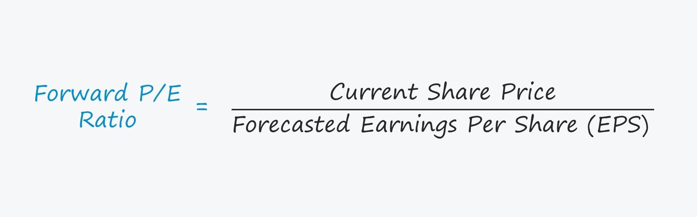

## Table of Contents

## What is the Forward Price-to-Earnings Ratio?

The Forward Price-to-Earnings (P/E) Ratio is a way to figure out how much investors are willing to pay for a company's future earnings. It's calculated by dividing the current stock price by the company's estimated earnings per share for the next year. This ratio helps investors see if a stock might be a good buy or if it's too expensive compared to its future earnings.

Using the Forward P/E Ratio can be really helpful because it looks at what's expected to happen in the future, not just what has happened in the past. However, it's important to remember that these future earnings are just estimates and can be wrong. So, while the Forward P/E Ratio is a useful tool, it should be used along with other information to make smart investment choices.

## How is the Forward Price-to-Earnings Ratio calculated?

The Forward Price-to-Earnings Ratio is calculated by dividing the current stock price by the company's estimated earnings per share for the next year. This gives investors a way to see how much they are paying for the company's future earnings. For example, if a stock is trading at $50 and the estimated earnings per share for next year is $5, the Forward P/E Ratio would be 10. This means investors are willing to pay $10 for every dollar of next year's earnings.

These estimates for future earnings come from financial analysts who study the company and make predictions based on various factors like the company's past performance, industry trends, and economic conditions. Because these are just estimates, the Forward P/E Ratio can change as new information becomes available or if the analysts revise their predictions. It's a useful tool for comparing the value of different stocks, but it's important to remember that it's based on forecasts which might not always be accurate.

## Why is the Forward Price-to-Earnings Ratio important for investors?

The Forward Price-to-Earnings Ratio is important for investors because it helps them understand how much they are paying for a company's future earnings. By looking at this ratio, investors can see if a stock is priced high or low compared to what the company is expected to earn in the next year. This can be really helpful when deciding whether to buy, sell, or hold a stock. If the Forward P/E Ratio is low, it might mean the stock is a good deal because you're paying less for each dollar of future earnings. If it's high, the stock might be expensive, and you might want to wait for a better price.

Another reason the Forward Price-to-Earnings Ratio is important is that it focuses on future expectations, not just past performance. This is different from the traditional P/E Ratio, which looks at past earnings. By using the Forward P/E Ratio, investors can make decisions based on what they think will happen in the future, which can be more relevant for making smart investment choices. However, it's important to remember that these future earnings are just guesses, so the Forward P/E Ratio should be used along with other information to get a full picture of a stock's value.

## How does the Forward P/E Ratio differ from the Trailing P/E Ratio?

The Forward P/E Ratio and the Trailing P/E Ratio are both ways to figure out how much a stock is worth, but they look at different things. The Forward P/E Ratio uses the company's expected earnings for the next year to see how much investors are willing to pay for future earnings. This means it's based on what people think will happen in the future. On the other hand, the Trailing P/E Ratio uses the company's earnings from the last year. It's a way to see how much investors are paying for earnings that have already happened.

Both ratios are useful, but they give different information. The Forward P/E Ratio can be more helpful for making decisions about the future because it's based on what's expected to happen next. But since it relies on guesses about the future, it can be less certain. The Trailing P/E Ratio is more certain because it's based on real numbers from the past, but it might not be as useful for understanding what could happen in the future. Investors often use both ratios together to get a better idea of a stock's value.

## What are the limitations of using the Forward Price-to-Earnings Ratio?

One big problem with the Forward Price-to-Earnings Ratio is that it's based on guesses about the future. Analysts try their best to predict what a company's earnings will be next year, but they can be wrong. Things like changes in the economy, new competitors, or unexpected events can make these predictions way off. So, if you rely too much on the Forward P/E Ratio, you might make decisions based on numbers that don't end up being true.

Another issue is that different analysts might have different guesses about a company's future earnings. This can lead to different Forward P/E Ratios for the same company, which can be confusing. Also, companies might try to make their future earnings look better by giving optimistic forecasts, which can trick investors into thinking a stock is a better deal than it really is. That's why it's smart to use the Forward P/E Ratio along with other information to get a full picture of a stock's value.

## Can you provide an example of how to interpret a Forward P/E Ratio?

Imagine you're looking at a stock that's currently trading at $100 per share. Analysts predict that the company will earn $10 per share next year. To find the Forward P/E Ratio, you divide the current stock price by the expected earnings per share. So, $100 divided by $10 gives you a Forward P/E Ratio of 10. This means that investors are willing to pay $10 for every dollar of next year's earnings.

Now, let's think about what this number tells you. A Forward P/E Ratio of 10 might seem high or low depending on what other companies in the same industry are showing. If most other companies in the industry have a Forward P/E Ratio around 15, then this stock might look like a good deal because you're paying less for its future earnings. But if the industry average is around 5, then the stock might seem expensive. Remember, though, that the Forward P/E Ratio is just an estimate based on what people think will happen, so it's a good idea to use it along with other information to make smart investment choices.

## How does the Forward P/E Ratio help in comparing companies within the same industry?

The Forward P/E Ratio is really helpful when you want to compare different companies in the same industry. It lets you see how much investors are willing to pay for the future earnings of each company. If one company has a lower Forward P/E Ratio than another, it might mean that company is a better deal because you're paying less for its future earnings. But if a company has a much higher Forward P/E Ratio than others in its industry, it might be seen as more expensive, and you might want to think twice before buying its stock.

It's important to remember that the Forward P/E Ratio is just one piece of the puzzle. Even within the same industry, companies can be very different. Some might be growing faster or have better chances for making more money in the future. So, while the Forward P/E Ratio can give you a quick way to compare companies, it's a good idea to look at other things too, like how the company is doing right now, what the industry is like, and what experts think will happen in the future. That way, you can make a smarter choice about where to put your money.

## What factors can affect the Forward Price-to-Earnings Ratio of a company?

The Forward Price-to-Earnings Ratio of a company can change because of many things. One big thing is how well people think the company will do in the future. If analysts think the company will make more money next year, the expected earnings per share go up, and the Forward P/E Ratio goes down. On the other hand, if they think the company will make less money, the expected earnings per share go down, and the Forward P/E Ratio goes up. Also, if the stock price changes a lot, that can affect the Forward P/E Ratio too. If the stock price goes up but the expected earnings stay the same, the Forward P/E Ratio will be higher.

Another thing that can change the Forward P/E Ratio is what's happening in the world around the company. For example, if the economy is doing well, people might be more willing to pay more for stocks, which can push up the stock price and the Forward P/E Ratio. But if there's a lot of uncertainty or bad news, like a big recession or a new law that hurts the company, people might not want to pay as much for the stock, which can make the Forward P/E Ratio go down. Also, if there are new competitors or changes in what customers want, that can affect how much money people think the company will make, which changes the Forward P/E Ratio.

## How can changes in analyst estimates impact the Forward P/E Ratio?

Changes in what analysts think about a company's future earnings can really shake up the Forward P/E Ratio. If analysts start to think the company will make more money next year, they'll raise their earnings estimates. This makes the expected earnings per share go up. When you divide the same stock price by a higher earnings number, the Forward P/E Ratio goes down. It means investors are paying less for each dollar of future earnings, which might make the stock seem like a better deal. But if analysts think the company will make less money, they'll lower their estimates. This drops the expected earnings per share, and when you divide the stock price by a smaller number, the Forward P/E Ratio goes up, making the stock look more expensive.

These changes in analyst estimates can happen for all sorts of reasons. Maybe the company just shared some good news about a new product or a big deal that could boost its earnings. Or maybe there's some bad news, like a lawsuit or a problem with a supplier that could hurt the company's profits. Also, if the whole economy is doing well or poorly, analysts might change their minds about how much money companies will make. It's important for investors to keep an eye on these changes because they can give clues about whether a stock is a good buy or if it's time to sell.

## What are some common misconceptions about the Forward Price-to-Earnings Ratio?

One common misconception about the Forward Price-to-Earnings Ratio is that it's always more accurate than the Trailing P/E Ratio because it looks at the future. But the truth is, the Forward P/E Ratio is based on guesses about what will happen next year. These guesses can be wrong because no one can predict the future perfectly. So, while the Forward P/E Ratio can be helpful, it's not always more accurate than the Trailing P/E Ratio, which uses real numbers from the past.

Another misconception is that a low Forward P/E Ratio always means a stock is a good deal. People might think that if they're paying less for future earnings, the stock must be cheap. But a low Forward P/E Ratio could also mean that analysts think the company won't do well in the future. It's important to look at why the Forward P/E Ratio is low and consider other information before deciding if a stock is really a good buy.

## How can the Forward P/E Ratio be used in conjunction with other financial metrics for investment decisions?

The Forward P/E Ratio is a great tool, but it works best when you use it with other financial metrics to make smart investment choices. One way to do this is by looking at the company's growth rate. If a company has a high Forward P/E Ratio but is also expected to grow a lot, it might still be a good investment. You can compare the Forward P/E Ratio with the company's expected growth rate to see if the stock is priced fairly. Another important metric to consider is the company's debt. A company with a lot of debt might have a lower Forward P/E Ratio, but that could be a warning sign that the company is risky.

You can also use the Forward P/E Ratio along with the Price-to-Book (P/B) Ratio to get a fuller picture of a company's value. The P/B Ratio shows how much the market values the company compared to its book value, which is what the company would be worth if it were to liquidate all its assets. If a company has a high Forward P/E Ratio but a low P/B Ratio, it might mean that investors are betting big on the company's future earnings, but the company's current assets aren't valued as highly. By looking at both ratios, you can make a more informed decision about whether the stock is a good buy.

## What advanced strategies involve using the Forward Price-to-Earnings Ratio for portfolio management?

One advanced strategy for using the Forward Price-to-Earnings Ratio in portfolio management is to look for stocks that have a lower Forward P/E Ratio than their industry average. This can help you find companies that might be undervalued and could be good buys. By comparing the Forward P/E Ratio of different companies in the same industry, you can see which ones are cheaper compared to their future earnings. This strategy works well when you also consider other factors like the company's growth potential and financial health. It's about finding a balance between a good price and a promising future.

Another strategy is to use the Forward P/E Ratio to time your investments. If you see that a stock's Forward P/E Ratio is starting to go down because analysts are raising their earnings estimates, it might be a good time to buy. On the other hand, if the Forward P/E Ratio is going up because the stock price is rising faster than earnings expectations, it could be a sign to sell or wait for a better price. This method can help you make decisions based on how the market's view of the company's future is changing. It's important to keep an eye on these changes and use them to adjust your portfolio as needed.

## What is Forward Price-to-Earnings (Forward P/E)?

Forward Price-to-Earnings (Forward P/E) is a financial metric that utilizes projected earnings to determine the P/E ratio of a stock. It serves as an indicator of how investors anticipate a company's future performance, distinct from the trailing P/E which relies on historical earnings figures. The formula for calculating Forward P/E is:

$$
\text{Forward P/E} = \frac{\text{Current Stock Price}}{\text{Estimated Future Earnings Per Share (EPS)}}
$$

This metric offers valuable insights into the expected profitability and growth potential of a company. By factoring in forecasted earnings, Forward P/E allows investors to analyze the anticipated financial health and market valuation of a company. The forward-looking nature of this metric is advantageous in identifying companies that are poised for growth, providing a basis for making investment decisions based on not just past performance but future expectations.

## What is the Forward P/E Ratio and how can it be understood?

The Forward Price-to-Earnings (Forward P/E) ratio is a financial metric fundamental to assessing stock valuation. This ratio is determined by dividing the current stock price by the projected earnings per share (EPS) over the upcoming fiscal period. Mathematically, it is expressed as:

$$
\text{Forward P/E} = \frac{\text{Current Stock Price}}{\text{Estimated Future EPS}}
$$

This metric provides investors with insights into whether a stock is potentially overvalued, undervalued, or fairly priced based on expected profitability. It is important because it sets expectations of a company's future financial performance, thereby guiding investment decisions.

Estimations of future EPS, which form the denominator in the Forward P/E calculation, are typically derived from analyst forecasts or company-provided guidance. These forecasts anticipate future earnings, considering the company's growth trajectory, industry position, and anticipated changes in market conditions.

Investors and analysts rely on the Forward P/E ratio because it offers a forward-looking perspective, enabling them to base decisions on expected performance rather than past results. However, the estimates for future EPS are inherently uncertain and subject to changes in external factors such as market trends, economic conditions, and unexpected company developments. Such factors might result in inaccurate projections, suggesting that caution is warranted when relying solely on Forward P/E.

For a more accurate interpretation of a company's valuation, investors often compare the Forward P/E of a stock with its historical averages, industry benchmarks, and the broader market. This can help assess how the market perceives the company's growth prospects relative to its peers. However, the fluid nature of external factors should always be considered, as they can substantially alter the accuracy of future EPS projections and, consequently, the Forward P/E ratio's validity as an assessment tool.

In conclusion, while the Forward P/E ratio serves as an important tool in evaluating expected profitability, it should be used in conjunction with other financial metrics for a comprehensive investment analysis.

## How do you calculate Forward P/E in Excel?

To calculate the Forward Price-to-Earnings (P/E) ratio in Excel, investors can follow a straightforward approach that leverages Excel’s calculation capabilities. This method not only streamlines the computation process but also facilitates quick comparative analysis among different stocks by using projected earnings data.

### Step-by-Step Guide

1. **Prepare the Data:**
   - Begin by organizing your data in an Excel spreadsheet. Arrange columns for each stock including the current market price and projected earnings per share (EPS).

2. **Set Up the Basic Formula:**
   - The formula for Forward P/E is defined as:
$$
     \text{Forward P/E} = \frac{\text{Market Price per Share}}{\text{Projected EPS}}

$$
   - In Excel, if `A2` contains the market price and `B2` contains the projected EPS for a stock, enter the formula `=A2/B2` in a new column to calculate the Forward P/E ratio.

3. **Extend the Formula:**
   - Drag the fill handle (a small square at the bottom-right corner of the selected cell) down to copy the formula for all other stocks in your dataset. This action replicates the calculation for each stock's data in respective rows.

4. **Automate the Calculations:**
   - Use Excel’s “Fill Series” feature to expedite applying formulas when working with larger datasets, ensuring consistent calculations across multiple entries.

5. **Include Error Handling:**
   - To manage potential issues such as division by zero or missing data, enhance your formula to include error-checking functions:
     ```excel
     =IFERROR(A2/B2, "N/A")
     ```
   - This formula prevents Excel from displaying errors by substituting them with a default value, such as "N/A".

6. **Enhance with Conditional Formatting:**
   - Apply conditional formatting to visually distinguish valuations of different stocks. For example, highlight stocks with excessively high or low Forward P/E ratios to quickly spot outliers.

### Sample Python Code

For those familiar with programming, the following Python script demonstrates how to compute and analyze Forward P/E ratios using the `pandas` library:

```python
import pandas as pd

# Sample data: list of stocks with market prices and projected EPS
data = {
    'Stock': ['Company A', 'Company B', 'Company C'],
    'Market Price': [150, 320, 90],
    'Projected EPS': [5, 8, 3]
}

# Create a DataFrame
df = pd.DataFrame(data)

# Calculate Forward P/E
df['Forward P/E'] = df['Market Price'] / df['Projected EPS']

# Display the DataFrame
print(df)
```

This script helps perform similar calculations programmatically, offering flexibility and scalability when analyzing larger datasets beyond Excel’s scope. Whether using Excel or programming tools like Python, the calculated Forward P/E provides vital insights into a company's future earnings potential.

## References & Further Reading

[1]: ["Investopedia - Forward Price-to-Earnings (P/E) Ratio"](https://www.investopedia.com/terms/f/forwardpe.asp)

[2]: ["Advances in Financial Machine Learning"](https://www.amazon.com/Advances-Financial-Machine-Learning-Marcos/dp/1119482089) by Marcos Lopez de Prado

[3]: ["Quantitative Trading: How to Build Your Own Algorithmic Trading Business"](https://www.amazon.com/Quantitative-Trading-Build-Algorithmic-Business/dp/1119800064) by Ernest P. Chan

[4]: ["Machine Learning for Algorithmic Trading"](https://github.com/PacktPublishing/Machine-Learning-for-Algorithmic-Trading-Second-Edition) by Stefan Jansen

[5]: Damodaran, A. (2002). ["Investment Valuation: Tools and Techniques for Determining the Value of Any Asset."](https://archive.org/details/investmentvaluat0000damo_n6k9) John Wiley & Sons.