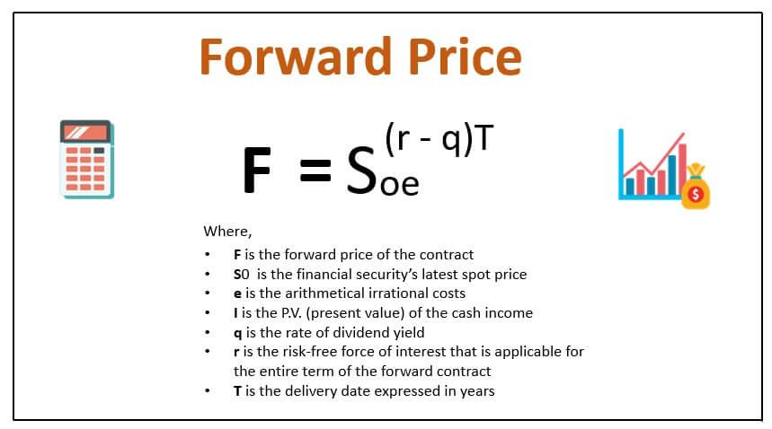

Financial markets are intricate systems where efficiency hinges on the precision and reliability of pricing mechanisms. At the heart of these systems lies a vast array of financial instruments, including stocks, bonds, commodities, and derivatives, each requiring accurate valuation to facilitate fair trading. Central to this valuation process is the concept of price discovery, a mechanism by which market prices for these instruments are determined based on supply and demand.

This article focuses on two pivotal elements in financial markets: forward pricing and algorithmic trading. Forward pricing, particularly significant in mutual funds, serves a critical function by helping establish the future value of these financial instruments, ensuring that shareholders are treated equitably. The Securities and Exchange Commission (SEC) mandates forward pricing in mutual funds to safeguard investors and maintain market integrity. It minimizes the possibility of shareholder dilution, a scenario where the value of an individual’s stake in a mutual fund diminishes due to the issuance of new shares. 

Alongside forward pricing, algorithmic trading represents a revolutionary change in modern financial markets. Over recent decades, algorithmic trading has transformed price discovery processes through increased speed, efficiency, and accuracy. This technological advancement allows for rapid execution of trades, often across multiple financial markets, leveraging complex algorithms to optimize trading strategies and respond to shifting market dynamics in real-time.

Understanding the integration of forward pricing and algorithmic trading provides valuable insights into the seamless functioning of contemporary financial markets. By examining these components, we can appreciate how financial markets adapt to technological innovations and regulatory frameworks, ultimately facilitating efficient and transparent trading environments.

## Table of Contents

## Understanding Financial Markets and Pricing Mechanisms

Financial markets encompass a wide array of instruments, each serving distinct purposes and offering various pricing mechanisms. These financial instruments primarily include stocks, bonds, commodities, and derivatives.

**Stocks** represent ownership in a company and are traded on stock exchanges. They are priced based on the supply and demand dynamics in the market for the company's shares. **Bonds** are debt securities issued by corporations or governments to raise capital and have a fixed interest rate. Their prices fluctuate based on interest rate changes, credit ratings, and economic conditions. **Commodities** are raw materials like gold, oil, or agricultural products, traded on exchanges such as the Chicago Mercantile Exchange (CME). Their prices are influenced by factors such as supply-demand imbalances, geopolitical events, and economic growth indicators.

**Derivatives** are complex financial products deriving their value from an underlying asset, such as options, futures, and swaps. They are primarily used for hedging risks or speculating on future price movements. Pricing of these instruments often involves sophisticated models, such as the Black-Scholes model for options, which calculates the option's fair price based on factors like the underlying asset's price, volatility, time to expiration, and risk-free interest rate.

Pricing mechanisms in financial markets can be categorized as traditional and modern. Traditional pricing mechanisms involve human brokers and manual processes, leading to slower transaction speeds and increased costs. Modern pricing mechanisms have evolved with the advent of electronic trading platforms, enabling automated and real-time pricing that enhances market efficiency.

**Transparency** and **liquidity** are fundamental to efficient pricing in financial markets. Transparency refers to the availability of price-related information to all market participants, which reduces information asymmetries and ensures fair pricing. Liquidity denotes the ease with which assets can be bought or sold in the market without significantly affecting the asset's price. High liquidity enables rapid execution of trades and thus, dynamically influences pricing.

One of the critical elements in pricing, particularly for mutual funds, is the Net Asset Value (NAV). The NAV represents the per-share value of a mutual fund and is calculated as:

$$
\text{NAV} = \frac{\text{Total Assets} - \text{Total Liabilities}}{\text{Number of Outstanding Shares}}
$$

NAV is crucial for investors as it reflects the fund's daily valuation and serves as the basis for buying or selling mutual fund shares. By providing a clear picture of the fund's performance, NAV plays a pivotal role in investors' decision-making processes regarding mutual fund investments.

Overall, understanding these financial instruments, pricing mechanisms, and the significance of market transparency and [liquidity](/wiki/liquidity-risk-premium) is essential for comprehending financial markets. Accurate pricing not only facilitates efficient market operations but also ensures fair and equitable treatment for all market participants.

## Forward Pricing: Key Concepts and Benefits

Forward pricing is a critical concept in the valuation and management of mutual funds, as mandated by the U.S. Securities and Exchange Commission (SEC). This pricing mechanism entails setting the price of mutual fund shares based on the next calculated net asset value (NAV) after an investor's order is received. By using forward pricing, mutual funds ensure that all investors trade based on a fair and uniform price, determined after taking into account the most recent market information.

**Mitigating Shareholder Dilution**

One of the primary benefits of forward pricing is its role in mitigating shareholder dilution. Dilution occurs when new shares are issued, or when existing shares are redeemed at a net asset value that does not reflect the current market value of the fund's portfolio. Forward pricing addresses this issue by ensuring that the NAV reflects the fund's current market value each time a transaction is processed. This prevents new or redeeming investors from unfairly benefiting at the expense of existing shareholders. By calculating the NAV after the market close, but before processing investment or redemption requests, the risk of dilution is significantly minimized.

**Standardizing Fund Operations**

Forward pricing also standardizes fund operations by offering a predictable framework for processing buy and sell orders. Investors submit orders based on the closing NAV price, ensuring that all transactions reflect the value of the underlying assets at the same point in time. This uniform approach makes operational processes smoother and reduces the potential for discrepancies or disputes over share valuation.

**Calculation of NAV and Forward Price Determination**

The net asset value is calculated by subtracting the fund's liabilities from its total assets and then dividing this result by the total number of outstanding shares:

$$
\text{NAV} = \frac{\text{Total Assets} - \text{Liabilities}}{\text{Outstanding Shares}}
$$

The forward price for transactions is based on this NAV, determined at the close of the trading day. The process involves accounting for the closing prices of all securities held within the fund's portfolio, converting currencies if necessary, and adding any income or dividends earned by the fund. This comprehensive calculation ensures that the NAV accurately represents the fund's financial standing, thereby promoting transparent and fair trading practices.

**Strategic Importance in Fund Transactions**

Forward pricing plays a strategic role in maintaining the integrity and efficiency of mutual fund transactions. It ensures that the market timing and late trading practices, which can distort the NAV and potentially harm long-term investors, are curtailed. This system provides a safeguard against exploitation by ensuring that all investors are subject to the same valuation method, thereby promoting fair market conditions. It instills confidence among investors, fostering a stable investment environment conducive to continuous growth and participation in mutual funds.

In summary, forward pricing ensures fairness and accuracy in mutual fund transactions. It protects the interests of all investors by ensuring uniform pricing, prevents dilution, and maintains operational standardization, thus facilitating efficient market activities and promoting investor confidence.

## The Role of Algorithmic Trading in Price Discovery

Algorithmic trading refers to the use of computer algorithms to automate and optimize the trading process. These algorithms systematically execute orders based upon pre-defined criteria such as timing, price, and [volume](/wiki/volume-trading-strategy), minimizing human intervention. Since its inception in the early 1970s, [algorithmic trading](/wiki/algorithmic-trading) has evolved significantly, driven by advances in computing technology and increased data availability.

Historically, algorithmic trading has greatly enhanced the speed, efficiency, and accuracy of price discovery in financial markets. By processing vast amounts of data and executing trades at lightning-fast speeds, algorithms can capitalize on minor price discrepancies that exist for mere milliseconds. According to a 2010 study, algorithmic trading accounted for over 60% of total trading volume in the U.S. equity markets, illustrating its pervasive impact on markets globally.

The advantages of using algorithmic trading in price discovery are manifold. Algorithms eliminate human biases and errors, allowing for consistent execution of trading strategies. They operate continuously without fatigue, enabling round-the-clock market surveillance and interaction. Additionally, algorithmic trading enhances liquidity by dynamically adjusting orders based on real-time market conditions, resulting in tighter bid-ask spreads.

However, potential risks accompany these advantages. The speed and automation of algorithms can amplify market [volatility](/wiki/volatility-trading-strategies), as witnessed in events like the 2010 Flash Crash, where the Dow Jones Industrial Average plunged nearly 1,000 points within minutes. High-frequency trading, a subset of algorithmic trading, is often scrutinized for contributing to such volatility. Furthermore, algorithmic trading systems are susceptible to technological failures and coding errors, which can trigger unintended market consequences.

Several market scenarios showcase the influence of algorithmic trading on pricing. In [arbitrage](/wiki/arbitrage) strategies, for instance, algorithms exploit price differences of the same asset in different markets, swiftly adjusting prices until uniformity is achieved. During earnings announcements, algorithms parse through textual data to update valuations and positions instantaneously, impacting stock prices with extreme precision. Additionally, in foreign exchange markets, algorithms analyse macroeconomic indicators and geopolitical events, adjusting currency valuations almost instantaneously in response to news.

Overall, while algorithmic trading has modernized and streamlined price discovery mechanisms within financial markets, it also necessitates robust risk management and regulatory oversight to mitigate potential adverse effects. As these systems continue to evolve, balancing innovation with stability remains crucial to ensuring healthy market operations.

## Innovations in Price Discovery Mechanisms

Technological innovations have significantly transformed traditional price discovery mechanisms, enhancing the efficiency, transparency, and accuracy of financial markets. One of the most defining advancements has been the introduction of electronic trading platforms, which have replaced traditional floor trading with faster and more accessible trading processes. These platforms facilitate increased market participation, enabling traders to execute transactions in real time with higher speed and lower transaction costs. Electronic trading platforms contribute to greater market liquidity, ensuring continuous and dynamic price adjustments based on supply and demand.

The availability of [alternative data](/wiki/best-alternative-data) sources further enriches the price discovery process. Alternative data encompasses non-traditional data sets, such as social media sentiment, satellite imagery, and internet search trends, which provide new dimensions for market analysis. Incorporating these data sources allows traders and analysts to develop more sophisticated predictive models for asset pricing. For example, [machine learning](/wiki/machine-learning) algorithms can be applied to large volumes of alternative data to identify patterns and correlations that may not be evident from traditional financial indicators alone. This enhances pricing accuracy by incorporating a broader spectrum of informational inputs.

Regulatory reforms play a crucial role in addressing market challenges and maintaining the integrity of price discovery mechanisms. Regulations such as the Markets in Financial Instruments Directive (MiFID II) in the European Union have been introduced to promote transparency and protect investors. These reforms mandate stricter reporting standards and enhance the oversight of trading activities, ensuring fair and orderly markets. By requiring detailed transaction disclosures and real-time reporting, regulatory frameworks help prevent market abuses, reduce information asymmetry, and provide a level playing field for all market participants.

In conclusion, advancements in electronic trading platforms, the integration of alternative data sources, and regulatory reforms collectively enhance the effectiveness and reliability of price discovery mechanisms in modern financial markets. These innovations support more informed decision-making and contribute to the overall stability of global financial systems.

## Challenges and Limitations in Market Pricing

Financial markets operate efficiently when there is transparency and liquidity, both of which are crucial for accurate pricing. In forward markets, where transactions involve contracts for future delivery of assets, these issues are paramount. Transparent markets allow participants to make informed decisions based on available information, yet the complex nature of forward markets can lead to opacity. This opacity can arise from the intricate terms of forward contracts and the relative lack of real-time data compared to spot markets, leading to potential inefficiencies in pricing.

Liquidity, the ease with which assets can be bought or sold without affecting their price, is another challenge. In the context of forward markets, reduced liquidity can lead to wider bid-ask spreads, increasing transaction costs for investors. This is especially problematic when market participants need to quickly adjust their positions in response to changing economic conditions but find it costly or difficult to do so.

Market participant behavior significantly influences the price signals within financial markets. Behavioral biases, including herding behavior and overreaction to news, can distort genuine supply-demand data, leading to mispriced assets. These behaviors can be exacerbated by algorithmic trading, where automated systems might amplify trends or react to false signals due to their speed and scale of operation.

Regulatory frameworks play a crucial role in shaping market environments, but they can also introduce limitations. Regulations are designed to protect investors and maintain market integrity, yet they can sometimes stifle innovation or create inefficiencies. For example, stringent reporting requirements, although intended to enhance transparency, can increase operational costs and discourage market participation. Moreover, as financial markets evolve with technology, existing regulations may lag, failing to address new risks associated with innovative trading practices or novel financial instruments.

Balancing innovation with risk is a constant challenge in market pricing mechanisms. Technological innovations promise improved efficiency and accuracy in trading and pricing but also introduce new risks. The rapid development of trading technologies, such as high-frequency trading, can lead to increased market volatility and pose systemic risks if not appropriately managed. It is vital for market participants and regulators to strike a balance between leveraging innovations for better market functioning and mitigating associated risks to ensure a stable and fair trading environment.

## Future Trends and Implications

Financial markets are on the cusp of transformative shifts driven by technological advancements and increasing globalization. These changes promise to redefine pricing mechanisms with far-reaching implications for market structures and regulatory frameworks.

### Potential Future Developments in Pricing Mechanisms

As technology continues to advance, traditional methods of price discovery are increasingly being supplanted by sophisticated systems incorporating [artificial intelligence](/wiki/ai-artificial-intelligence) (AI) and machine learning (ML). These technologies have the capability to analyze vast datasets, identifying patterns and insights that inform more accurate pricing models. For instance, algorithmic trading platforms are integrating AI algorithms to enhance predictions of asset price movements, optimizing investment strategies.

The proliferation of digital currencies and blockchain technology also offers possibilities for innovation in pricing mechanisms. Smart contracts, inherent to blockchain infrastructure, enable automatic and transparent transactions, which can facilitate new forms of price setting and verification. As decentralized finance (DeFi) grows, it could foster more transparent and resilient pricing frameworks exemplified by automated market makers (AMMs).

### Implications of Increasing Globalization and Interconnected Markets

Globalization has led to markets becoming more interconnected, resulting in a convergence of pricing across borders. This has heightened the need for standardized pricing norms and regulatory harmonization. With this increased connectivity, events in one part of the world can rapidly affect prices globally, underscoring the need for robust systems capable of near-instantaneous response.

Moreover, interconnected markets could benefit from distributed ledger technologies (DLTs) that offer enhanced transparency and security. These technologies ensure that all market participants have access to the same data, minimizing information asymmetry and enhancing the efficiency of price discovery.

### Anticipating Shifts in Regulatory Landscapes and Market Structures

As pricing mechanisms evolve, regulatory frameworks must adapt to new challenges and risks. Regulators face the tasks of monitoring technological applications in price setting, ensuring they do not compromise market integrity. For example, the integration of AI into trading requires oversight to prevent manipulative practices while encouraging innovation.

Regulatory bodies worldwide are also increasingly focusing on sustainable finance, which may lead to new pricing models incorporating environmental, social, and governance ([ESG](/wiki/esg-investing)) factors. This shift could redefine value measures, integrating not just financial outputs but also sustainable outcomes into pricing structures.

### Future Innovations and Their Impact on Price Discovery

Future innovations could significantly reshape how price discovery operates in financial markets. For example, the introduction of quantum computing could exponentially increase the speed at which data is processed, thereby enhancing algorithmic efficiency and accuracy in price predictions.

Augmented reality (AR) and virtual reality (VR) technologies may also introduce new layers of market interaction, influencing investor behavior and, consequently, pricing dynamics. These technologies could provide immersive analytical tools, offering traders more nuanced perspectives on market data.

In conclusion, as markets evolve, pricing mechanisms are set to undergo substantial transformations influenced by technology and globalization. These shifts promise enhanced efficiency, but they also require adaptive regulatory frameworks to manage the new landscape effectively. By embracing these changes, markets can better cater to the demands of a rapidly changing global financial system.

## Conclusion

The interplay between financial market mechanisms, forward pricing, and algorithmic trading underscores the complexity and dynamism inherent in modern financial markets. Forward pricing serves as a critical tool in mutual funds, ensuring that the net asset value (NAV) is calculated with precision and fairness. This mechanism is essential for standardizing fund operations and protecting shareholders from dilution, thus contributing to the overall efficiency and stability of financial transactions.

Algorithmic trading has revolutionized the process of price discovery, contributing significantly to the speed, efficiency, and accuracy of trading activities. The execution of trades through complex algorithms means that traders and investors can respond to market changes almost instantaneously, facilitating a more fluid and responsive market environment. However, this also necessitates a heightened awareness of the potential risks associated with high-frequency trading and algorithm-driven strategies, such as market volatility and systemic risks.

Given the rapid changes in market technologies and dynamics, continuous adaptation is imperative. Financial markets are not static entities; they evolve with technological advancements, shifting regulatory landscapes, and globalization's impact. Market participants must remain adept at understanding and integrating these pricing mechanisms in their decision-making processes to navigate these changes effectively.

The future of financial markets hinges on the integration of forward pricing approaches and algorithmic advancements. As globalization and interconnectivity increase, market mechanisms will inevitably become more sophisticated, requiring innovative solutions to meet emerging challenges. By encouraging informed participation through education and comprehension of these pricing mechanisms, investors can make strategic decisions that align with their financial goals while contributing to overall market health.

## References & Further Reading

[1]: SEC. (n.d.). ["Mutual Funds and Exchange-Traded Funds (ETFs) – A Guide for Investors."](https://www.sec.gov/about/reports-publications/investor-publications/introduction-mutual-funds) U.S. Securities and Exchange Commission.

[2]: Hull, J. C. (2008). ["Options, Futures, and Other Derivatives."](https://www.semanticscholar.org/paper/Options%2C-Futures%2C-and-Other-Derivatives-Hull/89bdee500c8623864fc9eb7a471546aa713acc44) Pearson Education.

[3]: Hasbrouck, J. (2007). ["Empirical Market Microstructure: The Institutions, Economics, and Econometrics of Securities Trading."](https://archive.org/details/empiricalmarketm0000hasb) Oxford University Press.

[4]: Aldridge, I. (2013). ["High-Frequency Trading: A Practical Guide to Algorithmic Strategies and Trading Systems."](https://www.amazon.com/High-Frequency-Trading-Practical-Algorithmic-Strategies/dp/1118343506) Wiley.

[5]: Barberis, N., & Thaler, R. (2003). ["A Survey of Behavioral Finance."](https://www.nber.org/papers/w9222) The Review of Financial Studies, 15(1), 1-49.

[6]: French, K. R. (2008). ["The Cost of Active Investing."](http://qed.econ.queensu.ca/faculty/milne/322/ECON322(2008)%20Kenneth%20R%20French.pdf) The Journal of Finance, 63(4), 1537-1573.

[7]: Hendershott, T., Jones, C. M., & Menkveld, A. J. (2011). ["Does Algorithmic Trading Improve Liquidity?"](https://onlinelibrary.wiley.com/doi/full/10.1111/j.1540-6261.2010.01624.x) The Review of Financial Studies, 24(8), 2915-2951.