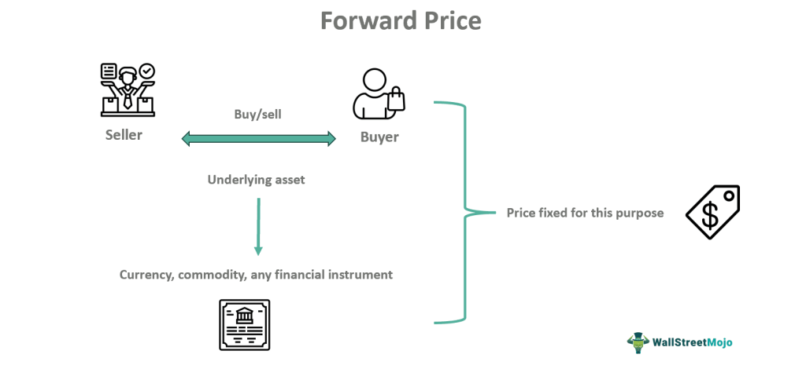

## Table of Contents

## What is forward pricing?

Forward pricing is a way for companies to set prices for their products or services in advance. Instead of setting prices based on current costs and market conditions, they predict what costs and conditions will be in the future. This can help companies plan better and make sure they can cover their costs, even if prices for materials or labor go up.

It's often used in industries where costs can change a lot, like construction or manufacturing. By using forward pricing, a company can agree on a price with a customer now, but the price will be based on what the company expects costs to be when the product or service is actually delivered. This helps both the company and the customer avoid surprises and plan their budgets more accurately.

## How does forward pricing differ from other pricing strategies?

Forward pricing is different from other pricing strategies because it looks ahead to set prices. Instead of using today's costs and market conditions, forward pricing tries to guess what costs and conditions will be in the future. This means a company might charge more now if they think their costs will go up later. Other strategies, like cost-plus pricing, just add a profit margin to what it costs to make something right now. Or, with dynamic pricing, prices might change all the time based on what's happening in the market at that moment.

Another way forward pricing is different is that it helps both the company and the customer plan better. When a company uses forward pricing, they can agree on a price with a customer now, but that price is based on what they think costs will be in the future. This can protect the company if costs go up, and it helps the customer know what they will have to pay, even if it's months or years away. Other strategies might not give this kind of certainty. For example, with competitive pricing, a company might have to keep changing prices to stay ahead of other companies, which can make it hard for customers to plan their budgets.

## What are the key components of forward pricing?

Forward pricing involves looking ahead to set prices for products or services. The main part of this strategy is figuring out what costs will be in the future. This means a company needs to guess how much it will cost to make something later on. They look at things like how much materials might cost, what labor will cost, and any other expenses they might have. By doing this, they can set a price now that will cover those future costs and still make a profit.

Another key part of forward pricing is making agreements with customers. When a company uses forward pricing, they agree on a price with a customer before they start making the product or providing the service. This price is based on what the company thinks costs will be when they actually deliver. This helps both the company and the customer. The company knows it can cover its costs even if they go up, and the customer knows exactly what they will have to pay, which helps them plan their budget.

## Can you explain the basic mechanism of forward pricing?

Forward pricing is a way for companies to set prices for their products or services before they are made or delivered. Instead of using the costs and market conditions right now, they try to guess what these will be in the future. They look at things like how much materials and labor might cost later on. By doing this, they can set a price today that will cover those future costs and still make a profit.

When a company uses forward pricing, they make a deal with a customer about the price before they start working. This price is based on what the company thinks costs will be when they finish the job. This helps the company because if costs go up, they are still covered. It also helps the customer because they know exactly what they will have to pay, even if it's a long time before the product or service is ready. This makes it easier for both the company and the customer to plan their budgets and avoid surprises.

## What are the advantages of using forward pricing for businesses?

Forward pricing helps businesses plan better. By guessing what costs will be in the future, a company can set a price now that will cover those costs and still make a profit. This is really helpful in industries where costs can change a lot, like construction or manufacturing. If the price of materials or labor goes up, the company is still okay because they already set a price that takes those changes into account.

Another advantage is that forward pricing makes things more certain for both the business and the customer. When a company uses forward pricing, they agree on a price with the customer before they start working. This means the customer knows exactly what they will have to pay, even if it's months or years before the product or service is ready. This helps the customer plan their budget and avoid surprises. For the business, it means they can be sure they will make enough money to cover their costs, no matter what happens in the future.

## What are the potential risks and challenges associated with forward pricing?

Forward pricing can be tricky because it's hard to guess what costs will be in the future. If a company guesses wrong and costs go up more than they thought, they might not make enough money to cover everything. Or, if costs go down, they might end up charging too much and lose customers to other companies that can offer lower prices. This makes it really important for a company to do a good job at predicting the future, but no one can see the future perfectly.

Another challenge is that forward pricing can make it hard to change plans. Once a company agrees on a price with a customer, it's tough to change that price later on, even if costs change a lot. This can be a problem if something unexpected happens, like a big change in the market or a new law that affects costs. It can also make it hard for a company to take advantage of new opportunities, like using a cheaper material that becomes available later on. So, while forward pricing can help with planning, it can also make a company less flexible.

## How does forward pricing impact consumer behavior?

Forward pricing can help consumers feel more certain about what they will have to pay. When a company uses forward pricing, they agree on a price with the customer before they start working. This means the customer knows exactly what they will have to pay, even if it's a long time before the product or service is ready. This can make it easier for the customer to plan their budget and avoid surprises. They might feel more comfortable making a big purchase because they know the cost won't change.

On the other hand, forward pricing can also make consumers less flexible. If a customer agrees to a price now, they might miss out on lower prices later if costs go down. This could make some customers hesitant to commit to a forward pricing agreement because they might worry about paying too much. Also, if a customer thinks the price is too high, they might look for other companies that offer more flexible pricing or lower prices based on current costs.

## What industries commonly use forward pricing and why?

Forward pricing is often used in the construction industry. Building things like houses or roads can take a long time, and the cost of materials like steel or concrete can change a lot during that time. By using forward pricing, construction companies can set a price now that will cover what they think costs will be when they finish the project. This helps them make sure they can still make a profit, even if costs go up. It also helps their customers, like people building a house, know exactly what they will have to pay, which makes it easier for them to plan their budget.

Another industry that commonly uses forward pricing is manufacturing. Making things like cars or electronics can also take a long time, and the cost of parts and labor can change. By guessing what costs will be in the future, a manufacturing company can set a price now that will cover those costs and still make money. This is important because if the price of a part goes up a lot, the company still knows they can cover it. It also helps their customers, like car buyers, know what they will have to pay, which makes it easier for them to plan their budget and avoid surprises.

In both these industries, forward pricing helps companies and customers plan better. It gives them a way to agree on a price now, based on what costs might be in the future. This can be really helpful in industries where costs can change a lot, because it makes things more certain for everyone involved.

## How can a company implement forward pricing effectively?

To implement forward pricing effectively, a company needs to be good at guessing what costs will be in the future. They should look at things like the price of materials, labor costs, and any other expenses they might have. It's important for them to use good information and maybe even talk to experts who know a lot about the market. By doing this, they can set a price now that will cover those future costs and still make a profit. It's also a good idea for the company to keep checking their guesses and update them if they need to, so they can make sure their prices are still right.

When a company starts using forward pricing, they should also talk to their customers about it. They need to explain why they are setting prices this way and how it can help both the company and the customer. It's important for the company to be clear and honest about what they think costs will be in the future and why they are charging what they are charging. This can help build trust with the customer and make them feel more comfortable agreeing to a price now, even if the product or service won't be ready for a while. By being open and keeping good communication, a company can use forward pricing to make things more certain for everyone involved.

## What are the legal and ethical considerations in forward pricing?

When a company uses forward pricing, they need to think about the legal rules they have to follow. They have to make sure their guesses about future costs are fair and honest. If they guess wrong on purpose to charge more, that could be against the law. They also need to be clear with their customers about how they are setting prices and what could happen if costs change a lot. This helps avoid legal problems and keeps everything fair.

There are also ethical things to consider with forward pricing. It's important for a company to be honest and fair when they guess what costs will be in the future. They shouldn't try to trick their customers or take advantage of them. Being open and clear about how they are setting prices can help build trust. If a company is ethical and fair, it can make their customers feel good about doing business with them, even if they are agreeing to a price now for something that will happen later.

## How does forward pricing integrate with supply chain management?

Forward pricing helps a company work better with its supply chain. When a company guesses what costs will be in the future, they can plan better with their suppliers. They can talk to them about what materials they will need and how much they might cost later on. This helps the company and the suppliers agree on prices now that will work for everyone when the product is ready. It makes things more certain for the whole supply chain because everyone knows what to expect.

Using forward pricing also means a company can manage their supply chain more smoothly. If they know what costs will be in the future, they can order materials at the right time and in the right amounts. This can help them avoid running out of things they need or having too much stuff they don't need. By planning ahead with forward pricing, a company can make sure their supply chain runs well and they can deliver their products on time and at the right price.

## What advanced techniques can be used to optimize forward pricing strategies?

To make forward pricing work even better, companies can use advanced tools like predictive analytics. This means using computers and math to guess what costs will be in the future. They look at a lot of data from the past and see patterns to help them make better guesses. This can make their forward pricing more accurate and help them set prices that really cover what costs might be later on. It's also a good idea for companies to use something called scenario planning. This means they think about different things that could happen in the future, like if costs go up a lot or if there's a new law that changes things. By planning for different situations, they can be ready for whatever happens and make sure their forward pricing still works well.

Another advanced technique is to use real-time data and adjust forward pricing as needed. Companies can keep an eye on what's happening in the market and update their guesses about future costs. This helps them stay on top of changes and make sure their prices are still right. They can also use something called hedging to protect against big changes in costs. Hedging means making deals now that will help them if costs go up later. For example, they might agree to buy materials at a set price now, even if they won't use them for a while. This can help them keep their forward pricing stable and make sure they can still make a profit, no matter what happens.

## What is the understanding of Financial Markets and Pricing Mechanisms?

Financial markets encompass a wide array of instruments, each serving distinct purposes and offering various pricing mechanisms. These financial instruments primarily include stocks, bonds, commodities, and derivatives.

**Stocks** represent ownership in a company and are traded on stock exchanges. They are priced based on the supply and demand dynamics in the market for the company's shares. **Bonds** are debt securities issued by corporations or governments to raise capital and have a fixed interest rate. Their prices fluctuate based on interest rate changes, credit ratings, and economic conditions. **Commodities** are raw materials like gold, oil, or agricultural products, traded on exchanges such as the Chicago Mercantile Exchange (CME). Their prices are influenced by factors such as supply-demand imbalances, geopolitical events, and economic growth indicators.

**Derivatives** are complex financial products deriving their value from an underlying asset, such as options, futures, and swaps. They are primarily used for hedging risks or speculating on future price movements. Pricing of these instruments often involves sophisticated models, such as the Black-Scholes model for options, which calculates the option's fair price based on factors like the underlying asset's price, volatility, time to expiration, and risk-free interest rate.

Pricing mechanisms in financial markets can be categorized as traditional and modern. Traditional pricing mechanisms involve human brokers and manual processes, leading to slower transaction speeds and increased costs. Modern pricing mechanisms have evolved with the advent of electronic trading platforms, enabling automated and real-time pricing that enhances market efficiency.

**Transparency** and **liquidity** are fundamental to efficient pricing in financial markets. Transparency refers to the availability of price-related information to all market participants, which reduces information asymmetries and ensures fair pricing. Liquidity denotes the ease with which assets can be bought or sold in the market without significantly affecting the asset's price. High liquidity enables rapid execution of trades and thus, dynamically influences pricing.

One of the critical elements in pricing, particularly for mutual funds, is the Net Asset Value (NAV). The NAV represents the per-share value of a mutual fund and is calculated as:

$$
\text{NAV} = \frac{\text{Total Assets} - \text{Total Liabilities}}{\text{Number of Outstanding Shares}}
$$

NAV is crucial for investors as it reflects the fund's daily valuation and serves as the basis for buying or selling mutual fund shares. By providing a clear picture of the fund's performance, NAV plays a pivotal role in investors' decision-making processes regarding mutual fund investments.

Overall, understanding these financial instruments, pricing mechanisms, and the significance of market transparency and [liquidity](/wiki/liquidity-risk-premium) is essential for comprehending financial markets. Accurate pricing not only facilitates efficient market operations but also ensures fair and equitable treatment for all market participants.

## What are the key concepts and benefits of forward pricing?

Forward pricing is a critical concept in the valuation and management of mutual funds, as mandated by the U.S. Securities and Exchange Commission (SEC). This pricing mechanism entails setting the price of mutual fund shares based on the next calculated net asset value (NAV) after an investor's order is received. By using forward pricing, mutual funds ensure that all investors trade based on a fair and uniform price, determined after taking into account the most recent market information.

**Mitigating Shareholder Dilution**

One of the primary benefits of forward pricing is its role in mitigating shareholder dilution. Dilution occurs when new shares are issued, or when existing shares are redeemed at a net asset value that does not reflect the current market value of the fund's portfolio. Forward pricing addresses this issue by ensuring that the NAV reflects the fund's current market value each time a transaction is processed. This prevents new or redeeming investors from unfairly benefiting at the expense of existing shareholders. By calculating the NAV after the market close, but before processing investment or redemption requests, the risk of dilution is significantly minimized.

**Standardizing Fund Operations**

Forward pricing also standardizes fund operations by offering a predictable framework for processing buy and sell orders. Investors submit orders based on the closing NAV price, ensuring that all transactions reflect the value of the underlying assets at the same point in time. This uniform approach makes operational processes smoother and reduces the potential for discrepancies or disputes over share valuation.

**Calculation of NAV and Forward Price Determination**

The net asset value is calculated by subtracting the fund's liabilities from its total assets and then dividing this result by the total number of outstanding shares:

$$
\text{NAV} = \frac{\text{Total Assets} - \text{Liabilities}}{\text{Outstanding Shares}}
$$

The forward price for transactions is based on this NAV, determined at the close of the trading day. The process involves accounting for the closing prices of all securities held within the fund's portfolio, converting currencies if necessary, and adding any income or dividends earned by the fund. This comprehensive calculation ensures that the NAV accurately represents the fund's financial standing, thereby promoting transparent and fair trading practices.

**Strategic Importance in Fund Transactions**

Forward pricing plays a strategic role in maintaining the integrity and efficiency of mutual fund transactions. It ensures that the market timing and late trading practices, which can distort the NAV and potentially harm long-term investors, are curtailed. This system provides a safeguard against exploitation by ensuring that all investors are subject to the same valuation method, thereby promoting fair market conditions. It instills confidence among investors, fostering a stable investment environment conducive to continuous growth and participation in mutual funds.

In summary, forward pricing ensures fairness and accuracy in mutual fund transactions. It protects the interests of all investors by ensuring uniform pricing, prevents dilution, and maintains operational standardization, thus facilitating efficient market activities and promoting investor confidence.

## References & Further Reading

[1]: SEC. (n.d.). ["Mutual Funds and Exchange-Traded Funds (ETFs) – A Guide for Investors."](https://www.sec.gov/about/reports-publications/investor-publications/introduction-mutual-funds) U.S. Securities and Exchange Commission.

[2]: Hull, J. C. (2008). ["Options, Futures, and Other Derivatives."](https://www.semanticscholar.org/paper/Options%2C-Futures%2C-and-Other-Derivatives-Hull/89bdee500c8623864fc9eb7a471546aa713acc44) Pearson Education.

[3]: Hasbrouck, J. (2007). ["Empirical Market Microstructure: The Institutions, Economics, and Econometrics of Securities Trading."](https://archive.org/details/empiricalmarketm0000hasb) Oxford University Press.

[4]: Aldridge, I. (2013). ["High-Frequency Trading: A Practical Guide to Algorithmic Strategies and Trading Systems."](https://www.amazon.com/High-Frequency-Trading-Practical-Algorithmic-Strategies/dp/1118343506) Wiley.

[5]: Barberis, N., & Thaler, R. (2003). ["A Survey of Behavioral Finance."](https://www.nber.org/papers/w9222) The Review of Financial Studies, 15(1), 1-49.

[6]: French, K. R. (2008). ["The Cost of Active Investing."](http://qed.econ.queensu.ca/faculty/milne/322/ECON322(2008)%20Kenneth%20R%20French.pdf) The Journal of Finance, 63(4), 1537-1573.

[7]: Hendershott, T., Jones, C. M., & Menkveld, A. J. (2011). ["Does Algorithmic Trading Improve Liquidity?"](https://onlinelibrary.wiley.com/doi/full/10.1111/j.1540-6261.2010.01624.x) The Review of Financial Studies, 24(8), 2915-2951.