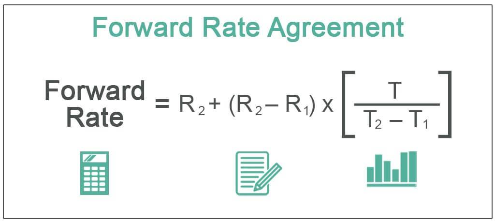

Financial derivatives are financial instruments whose value is derived from the value of an underlying asset, index, or interest rate. They play a pivotal role in the global financial market by enabling participants to hedge risks, speculate on future price movements, and gain access to otherwise inaccessible assets or markets. Derivatives such as futures, options, swaps, and Forward Rate Agreements (FRAs) are fundamental tools in the financial landscape, utilized by corporations, institutions, and individual investors to manage exposure to various financial risks.

Forward Rate Agreements (FRAs) are specific types of financial derivatives focused on interest rate risk management. An FRA is a bilateral contract between two parties to exchange interest payments on a notional amount at a future date. At its core, the agreement sets a fixed interest rate, allowing the parties to hedge against fluctuations in floating interest rates. As a means of interest rate management and speculation, FRAs are essential for financial institutions and corporations seeking to stabilize their cash flows and balance sheets in the face of fluctuating market interest rates.



The contemporary financial markets are increasingly characterized by the prevalence of algorithmic trading, which involves the use of computer algorithms to automate trading strategies and execute transactions at high speeds and volumes. This transformation has led to enhanced market liquidity, reduced transaction costs, and improved price discovery mechanisms. In the context of derivatives markets, including FRAs, algorithmic trading has become a critical component in facilitating efficient market operations, managing execution risk, and adapting to complex market dynamics.

The purpose of this article is to explore the significance of Forward Rate Agreements within the broader spectrum of financial derivatives and the role of algorithmic trading in these markets. Readers can expect to gain a comprehensive understanding of how FRAs function, their benefits, limitations, and how algorithmic strategies are shaping their futures. By analyzing these components, the article aims to provide insights into the evolving landscape of derivative trading and the essential tools and strategies employed in managing interest rate risks effectively.

## Table of Contents

## Understanding Forward Rate Agreements (FRA)

Forward Rate Agreements (FRAs) are financial derivatives that allow parties to lock in an interest rate to be applied at a future date. Structured as over-the-counter (OTC) contracts, FRAs are primarily used to hedge interest rate risks. The contract involves an agreement between two parties: one party agrees to pay a fixed interest rate, while the other agrees to pay a floating rate based on a reference rate, for a specified period in the future.

### Key Terms in FRA Contracts

- **Fixed Rate**: This is the agreed-upon interest rate that the fixed-rate payer will pay during the contract period. It is established at the initiation of the contract.

- **Reference Rate**: Commonly based on short-term interest rates like the London Interbank Offered Rate (LIBOR) or Euro Interbank Offered Rate (EURIBOR), this floating rate is what the floating-rate payer will pay. It is determined at the start of the contract period.

- **Notional Amount**: The principal amount on which the interest payments are based. Importantly, this amount is not exchanged between the parties; it merely serves to calculate the payment amounts.

### Benefits of Using FRAs for Hedging Interest Rate Risks

FRAs are instrumental in managing exposure to fluctuations in interest rates. By locking in a specific rate, entities can stabilize their future cash flows, making it easier to plan and budget finances. They are particularly beneficial for institutions with variable rate debts or investments, as they provide certainty against rising interest rates, allowing for effective risk mitigation and financial forecasting.

### Market Expectations and Sentiment Gauging Through FRAs

FRAs can act as indicators of market sentiment regarding future [interest rate](/wiki/interest-rate-trading-strategies) movements. The agreed-upon rates in FRAs reflect expectations about future short-term interest rates, offering insights into how financial markets perceive upcoming economic conditions. Participants use this information to make informed decisions and strategies, taking into account anticipated changes in economic policies or market dynamics. 

In summary, Forward Rate Agreements provide a mechanism for managing interest rate risk by allowing parties to fix interest costs or income and gauge market expectations through agreed-upon future rates. They play a vital role in ensuring financial stability and strategic planning for businesses and financial institutions.

## Algorithmic Trading in Derivative Markets

Algorithmic trading, often referred to as algo trading, involves the use of automated and pre-programmed trading instructions to execute orders in financial markets with speed and precision. This method has marked a significant evolution in how financial transactions are conducted, providing a competitive edge through increased speed, reduced transaction costs, and enhanced [liquidity](/wiki/liquidity-risk-premium) management. 

In the context of derivative markets, including Forward Rate Agreements (FRAs), [algorithmic trading](/wiki/algorithmic-trading) plays a pivotal role by improving the efficiency and execution of derivative contracts. Algo trading systems can assess multiple market factors almost instantaneously, which is crucial in the derivatives space where prices are highly sensitive to changes in underlying variables. For example, a typical algorithm can monitor interest rate movements and execute FRA trades rapidly to capitalize on favorable conditions or to hedge against potential risks. The use of algorithms thus ensures traders can maintain optimal timing and pricing for their transactions, and achieve better market entry and [exit](/wiki/exit-strategy) points.

Implementing effective algo trading strategies in derivative markets requires careful consideration of several key factors. Firstly, strategy development is critical, necessitating a robust understanding of market dynamics and participant behavior. Algorithms must be crafted to identify patterns or anomalies that signal trading opportunities. Additionally, [backtesting](/wiki/backtesting) strategies against historical data is essential to evaluate performance under various market conditions. Secondly, risk management protocols must be embedded within algorithms to mitigate potential adverse impacts, including market [volatility](/wiki/volatility-trading-strategies) and liquidity constraints.

One of the main challenges in automating FRA trading is managing the inherent complexities of these contracts. FRAs, being over-the-counter derivatives, lack the standardization found in exchange-traded instruments, which can complicate their algorithmic execution. Moreover, effective automation demands significant computational resources and sophisticated infrastructure capable of processing vast amounts of financial data in real-time. Another challenge lies in managing the high-frequency nature of algo trading, which can lead to systemic risks if not properly regulated and supervised.

Conversely, automation in FRA trading offers numerous opportunities. It allows market participants to enhance market-making capabilities and improve price discovery processes. Furthermore, advancements in technology, such as [machine learning](/wiki/machine-learning) and [artificial intelligence](/wiki/ai-artificial-intelligence), present new avenues for refining trading strategies and achieving higher alpha. The integration of big data analytics can also extract valuable market insights, offering a competitive edge in predicting future price movements and optimizing strategies accordingly. 

As the adoption of algorithmic trading in derivative markets continues to expand, market participants must balance the potential benefits with the challenges to fully leverage the technology's capabilities. This approach not only contributes to achieving superior trading outcomes but also supports the broader goal of enhancing market efficiency and stability.

## Calculating Forward Rate Agreements

Forward Rate Agreements (FRAs) are fundamental tools in interest rate risk management, offering a mechanism to lock in future interest rates today. Understanding how to calculate payments and settlements in FRAs is crucial for financial professionals involved in managing interest rate exposures. 

The settlement amount of an FRA is derived from the difference between the fixed rate agreed upon in the FRA contract and the reference rate prevailing at the settlement date. This difference is applied to a notional principal amount and adjusted for the actual number of days in the rate period.

### FRA Payment and Settlement Calculation:

The formula to calculate the settlement amount (SA) of an FRA is:

$$

\text{SA} = \left( \frac{(\text{R}_{\text{ref}} - \text{R}_{\text{fix}}) \times \text{NA} \times \frac{\text{days}}{360}}{1 + \text{R}_{\text{ref}} \times \frac{\text{days}}{360}} \right)
$$

Where:
- $\text{R}_{\text{ref}}$ = Reference rate at the settlement date (e.g., LIBOR).
- $\text{R}_{\text{fix}}$ = Fixed rate as per the FRA.
- $\text{NA}$ = Notional Amount.
- $\text{days}$ = Number of days in the FRA period.

### Step-by-step Guide:

1. **Determine the Details of the FRA**:
   - Identify the fixed rate ($\text{R}_{\text{fix}}$) as specified in the FRA contract.
   - Confirm the notional amount and the exact period covered by the FRA, usually quoted in terms of two date brackets, like 3x6 or 6x9 months.

2. **Obtain the Reference Rate**:
   - On the settlement date, ascertain the reference rate ($\text{R}_{\text{ref}}$), typically a standard benchmark like LIBOR or EURIBOR.

3. **Apply the FRA Formula**:
   - Substitute these values into the FRA formula to find the settlement amount. This will determine how much one party pays to the other, factoring in the number of days over which the rate applies.

### Real-world Example:

Consider an FRA with the following terms:
- $\text{R}_{\text{fix}} = 5\%$
- $\text{NA} = 1,000,000$
- $\text{days} = 90$
- Settlement date reference rate ($\text{R}_{\text{ref}}$) = 6%

Using the formula:

$$

\text{SA} = \left( \frac{(0.06 - 0.05) \times 1,000,000 \times \frac{90}{360}}{1 + 0.06 \times \frac{90}{360}} \right) 
$$

$$

= \left( \frac{0.01 \times 1,000,000 \times 0.25}{1 + 0.015} \right) 
$$

$$

= \left( \frac{2,500}{1.015} \right) = 2,465.53
$$

Thus, for this FRA, the payer of the fixed rate receives $2,465.53 from the payer of the floating rate, settling the contract based on the movement in interest rates. This calculation illustrates the financial dynamics of an FRA and how market rate changes can influence financial obligations and strategies.

## FRAs vs. Interest Rate Futures

Forward Rate Agreements (FRAs) and interest rate futures are both financial instruments used for managing interest rate risk, but they come with distinct characteristics and operate within different frameworks. Understanding these differences is crucial for financial practitioners aiming to implement effective strategies for hedging and risk management.

**Comparison Between FRAs and Interest Rate Futures**

FRAs are bespoke over-the-counter (OTC) contracts that lock in an interest rate to be paid or received on an agreed notional principal amount starting on a future date. Since they are privately negotiated, FRAs offer high customization with terms tailored to counterparties' specific needs, such as the contract size, duration, and reference rate. The bespoke nature of FRAs means they [carry](/wiki/carry-trading) counterparty risk, as they rely on the creditworthiness of the parties involved. 

In contrast, interest rate futures are standardized contracts traded on organized exchanges, such as the Chicago Mercantile Exchange (CME). These contracts specify the delivery of a particular financial instrument at a future date, with the interest rate implied in the futures price. The standardization of futures contracts enhances market liquidity and allows for daily mark-to-market settlements, substantially reducing counterparty risk due to the involvement of clearinghouses.

**Key Differences in Trading Venues, Customization, and Liquidity**

The trading venue is one fundamental difference. FRAs are traded OTC, allowing for flexibility but exposing traders to higher counterparty credit risk. They require both parties to have sufficient mutual credit lines or rely on contracts with collateral provisions. On the other hand, interest rate futures are traded on exchanges, promoting transparency and liquidity.

Customization is another point of divergence. FRAs offer tailored solutions to meet specific financial criteria, providing flexibility in terms. This flexibility is absent in futures, which are limited to the standardized features of contracts available on the exchange.

Regarding liquidity, futures markets usually exhibit higher liquidity compared to FRA markets. The organized and standard nature of futures trading facilitates easier entry and exit positions, which isn't always the case with bespoke FRAs due to fewer participants in the OTC market.

**Pros and Cons of Using FRAs Versus Standardized Futures Contracts**

The choice between FRAs and interest rate futures involves weighing the benefits of customization against liquidity and risk considerations. 

**Pros of FRAs:**
- Customization: FRAs can be specially tailored to the specific needs of the parties, making them suitable for bespoke hedging strategies.
- Flexibility: They allow adjustments in notional amount, terms, and settlement dates according to mutual agreements.

**Cons of FRAs:**
- Liquidity: FRAs tend to be less liquid than futures, potentially leading to wider bid-ask spreads.
- Counterparty Risk: Lack of clearinghouse intervention means increased exposure to the credit risk of the counterparty.

**Pros of Interest Rate Futures:**
- Liquidity: Futures benefit from a high level of liquidity due to standardized trading, facilitating ease of transaction.
- Low Counterparty Risk: The use of clearinghouses in futures trading significantly mitigates counterparty risk.

**Cons of Interest Rate Futures:**
- Lack of Customization: The standardized nature limits flexibility, potentially making them unsuitable for specific hedging requirements.
- Margin Requirements: Futures require daily settlement of gains and losses and margin maintenance, which could impact cash flow.

Both FRAs and interest rate futures play essential roles in the spectrum of financial derivatives for interest rate risk management, and the decision to use one over the other depends on specific needs related to customization, liquidity, and risk tolerance.

## Limitations and Risks of Forward Rate Agreements

Forward Rate Agreements (FRAs) are widely utilized as interest rate derivatives, providing tools for hedging against fluctuations in interest rates. However, they are not without inherent limitations and risks.

**Limitations and Counterparty Risks**

An FRA is essentially a bilateral contract where one party agrees to pay a fixed interest rate while the other pays a variable rate, based on an agreed notional amount. The main counterparty risk arises from the possibility that one party may default, thereby not fulfilling its contractual obligation. This risk is particularly pronounced when dealing with over-the-counter (OTC) contracts, which lack the standardized framework of an exchange and rely instead on the reputation and creditworthiness of the counterparties involved.

The underlying notional amount in an FRA is not exchanged; instead, cash settlements are made based on the interest rate differential. Consequently, the counterparty risk revolves around the creditworthiness of each party, and this risk is frequently mitigated through the use of collateral and credit support annexes.

**Implications of Market Rate Changes**

FRAs are designed to hedge against interest rate volatility. However, their effectiveness can be influenced by significant shifts in market rates. An unanticipated change in the interest rates can lead to substantial mark-to-market losses for a party, especially if the hedge does not perfectly align with the cash flows or exposures it is intended to offset. This risk is exacerbated in volatile financial environments, where interest rate predictions can deviate markedly from actual market movements.

For instance, if an entity anticipates a rate hike and enters an FRA to lock in a lower future rate, but the market rates subsequently decrease instead, the entity could incur losses on the FRA.

**Regulatory and Settlement Challenges**

FRAs, as OTC derivatives, face several regulatory challenges. Compliance with regulations such as the Dodd-Frank Act in the United States, which mandates stricter oversight and central clearing for many derivative transactions, can pose significant operational hurdles. These regulations aim to reduce systemic risk; however, they also introduce complexities in terms of reporting, collateral management, and central clearing requirements that can increase operational costs.

Settlement of FRAs, typically occurring on a bilateral basis, can also present challenges. The settlement process is generally marked by the need for precise calculation of settlement amounts, often imposing stringent accuracy requirements on the involved financial entities to avoid settlements based on flawed data leading to disputes. The following formula is often used for settlement calculations:

$$
\text{Settlement Amount} = \text{Notional Amount} \times \left(\frac{\text{Fixed Rate} - \text{Reference Rate}}{1 + \text{Reference Rate} \times \text{days/360}}\right)
$$

Such calculations require detailed attention to ensure all factors, like day count conventions and reference rate determinations, are accurately applied.

In summary, while FRAs offer substantial benefits for interest rate risk management, they also embody various risks and limitations that need careful consideration. These include the inherent counterparty risk, the impact of market rate changes, and the complexities introduced by evolving regulatory landscapes and settlement processes. Financial participants must meticulously manage these challenges to effectively utilize FRAs in their financial strategies.

## Implementing Algo Trading Strategies for FRAs

To implement algorithmic trading strategies for Forward Rate Agreements (FRAs), it is essential to consider several key components that contribute to the effectiveness and efficiency of these strategies. Algorithmic trading in the context of FRAs involves using complex algorithms and computer programs to execute trades at high speeds and with minimal human intervention. Here are some guidelines and considerations for developing successful algo trading strategies for FRAs:

### Guidelines for Developing Effective Algorithmic Trading Strategies

1. **Define Clear Objectives and Strategies**: It is crucial to establish precisely what you aim to achieve with your algorithmic trading strategies, whether it is market-making, arbitrage, or hedging. Each strategy requires different algorithms and models, so clarity on objectives guides the development process.

2. **Data Acquisition and Quality Assurance**: Accurate and high-quality data is fundamental. Ensure that you have access to reliable historical and real-time data. This includes interest rate data, economic indicators, and any other relevant financial data that could impact FRAs.

3. **Risk Management**: Implement robust risk management frameworks to mitigate potential losses. This includes setting stop-loss limits, managing exposure to different market factors, and continually assessing counterparty risks.

4. **Backtesting and Simulation**: Run extensive backtests and simulations to evaluate how the strategy would have performed historically. Use historical data to identify any weaknesses in the strategy and refine algorithms accordingly. This step is crucial for assessing the viability of the algo trading system before live deployment.

5. **Performance Monitoring**: Continuously monitor the performance of the algorithms in real-time trading environments. Employ analytics tools to track key performance indicators (KPIs) and ensure the strategy aligns with the original objectives.

### Integration of Machine Learning and Big Data Analytics

Machine learning (ML) and big data analytics play pivotal roles in enhancing algorithmic trading strategies for FRAs. By leveraging these advanced technologies, traders can gain insights and predict market movements more accurately.

- **Machine Learning Models**: Utilize supervised and unsupervised ML models to identify patterns and detect anomalies in financial data. For example, regression algorithms can help forecast interest rate movements, while clustering techniques can segment markets based on various economic factors.

- **Natural Language Processing (NLP)**: Deploy NLP to analyze unstructured data, such as news articles and financial reports, extracting sentiment and key information that could impact interest rate predictions.

- **Big Data Analytics**: Harness the power of big data to process large volumes of trading data in real-time. Tools like Apache Spark or Hadoop can be used to manage and analyze the datasets efficiently, providing traders with a competitive edge in making informed decisions.

### Best Practices and Tools for Optimizing Algorithmic FRA Trading

1. **Algorithm Design and Optimization**: Write efficient and optimized algorithms tailored to specific FRA markets. This may involve custom coding in languages such as Python or C++, which are widely used in financial modeling.

   ```python
   # Example: A simple model predicting interest rate changes using past data
   import pandas as pd
   from sklearn.linear_model import LinearRegression

   # Load data
   data = pd.read_csv('interest_rate_data.csv')
   X = data[['previous_rate', 'economic_indicator_1', 'economic_indicator_2']]
   y = data['future_rate']

   # Fit Model
   model = LinearRegression()
   model.fit(X, y)

   # Predict future rate
   predicted_rate = model.predict([[current_rate, econ_ind_1, econ_ind_2]])
   ```

2. **Continuous Learning and Adaptation**: Markets evolve, and algorithms must adapt to new patterns and anomalies. Include mechanisms for continuous learning within the algorithms, such as retraining ML models on new data to ensure they remain effective.

3. **Robust Infrastructure**: Ensure that the technological infrastructure supporting the trading systems is resilient, fault-tolerant, and capable of handling high-frequency trading. This includes secure and reliable servers, low-latency networks, and advanced trading platforms.

4. **Regulatory Compliance**: Be cognizant of the regulatory environment governing FRA trading and ensure that algorithms are designed to comply with applicable rules and standards.

By integrating these best practices, leveraging advanced technologies, and continually refining strategies, traders can optimize their algorithmic trading approaches for FRAs, thereby enhancing trading performance and managing risks effectively.

## The Future of FRA Trading with Algorithms

The automation of Forward Rate Agreements (FRA) trading through algorithms represents a significant evolution in the financial derivatives landscape. This progression is largely driven by advancements in technology and the increasing demand for efficiency and precision in financial transactions.

**Trends and Future Prospects in FRA Trading Automation**

The automation of FRA trading is part of a broader trend towards algorithmic trading, which uses computer algorithms to execute trades at speeds and frequencies unreachable by human traders. This approach is becoming increasingly prevalent in financial markets due to its ability to manage large volumes of trades, minimize transaction costs, and mitigate risks associated with human error.

Key technological advancements anticipated to influence derivative markets include artificial intelligence (AI) and machine learning (ML). These technologies offer the capability to process vast amounts of market data with superior efficiency, enabling sophisticated pattern recognition and predictive analytics. For FRA trading, AI can be employed to forecast interest rate movements by analyzing historical data, macroeconomic indicators, and market sentiment. This predictive capability enhances the ability of traders to make informed decisions, thereby potentially increasing the profitability and accuracy of FRA strategies.

High-frequency trading ([HFT](/wiki/high-frequency-trading-strategies)), powered by cutting-edge computing power and network technology, is another trend influencing FRA trading. HFT strategies exploit minor price discrepancies in the market through rapid execution of a massive number of orders, often holding positions for very short durations. While predominantly used in equity markets, the principles of HFT can be adapted for FRA markets, allowing traders to benefit from minuscule price movements in interest rate instruments.

**Case Studies of Successful Implementation**

Several financial institutions have successfully integrated algorithmic trading strategies into FRA markets, showcasing tangible benefits. 

One notable example is Goldman Sachs, which has invested substantially in developing proprietary algorithms for trading various financial derivatives, including FRAs. These algorithms assist in optimizing trade execution by calculating the best possible entry and exit points, factoring in transaction costs and market impact.

Another example can be seen in JP Morgan's use of AI-driven analytics to enhance its trading operations. By leveraging natural language processing and neural networks, JP Morgan's systems can interpret nuanced information from financial news and reports, integrating these insights into their trading algorithms to better gauge market sentiment and adjust their FRA positions accordingly.

Moreover, fintech startups such as XTX Markets have leveraged advanced algorithms and machine learning to disrupt traditional trading practices. XTX Markets focuses on using data and technology-driven approaches to provide liquidity in over-the-counter markets, including interest rate derivatives like FRAs.

**Conclusion**

The automation of FRA trading through algorithms is poised to redefine the operational dynamics of derivative markets. As technology continues to evolve, the integration of AI, machine learning, and HFT is expected to deliver enhanced precision, efficiency, and risk management capabilities in FRA trading. These advancements promise not only improved financial performance for traders but also greater market stability through more efficient price discovery and liquidity provisioning. The ongoing innovations signal a future where algorithmic trading could become the cornerstone of derivative market operations, driving significant transformation across the financial ecosystem.

## Conclusion

Forward Rate Agreements (FRAs) play a crucial role in the landscape of financial derivatives, providing an effective tool for managing and hedging against interest rate risks. These instruments allow businesses and financial institutions to secure future borrowing or lending rates, thereby enhancing financial predictability and stability. The ability to lock in interest rates regardless of fluctuations in the market makes FRAs a valuable component of strategic financial planning, enabling more precise forecasting and budgeting.

Algorithmic trading has the potential to significantly enhance the efficiency and effectiveness of FRA markets. By leveraging algorithms, traders can execute FRA contracts with increased speed and accuracy, minimizing the latency and human error often associated with manual trading processes. Such techniques enable market participants to quickly respond to fluctuations and new information, optimizing their strategies in real-time. The integration of algorithmic trading into FRA markets enhances market liquidity and can lead to more competitive pricing.

Looking ahead, the integration of advanced technologies such as artificial intelligence and machine learning will likely continue to transform derivative trading, including FRAs. These technologies can analyze vast datasets to unearth patterns and insights that human traders might overlook, leading to predictive analytics that can inform trading strategies. As technological capabilities advance, the potential for developing more sophisticated trading algorithms grows, which could further increase market efficiency and transparency. Embracing these advancements will be critical for financial institutions seeking to remain competitive and agile in a rapidly evolving financial environment. The synergy of FRAs and cutting-edge technologies underscores a future where derivative trading is not only more efficient and precise but also more accessible to a broader range of participants.

## References & Further Reading

[1]: ["Interest Rate Swaps and Other Derivatives"](https://cup.columbia.edu/book/interest-rate-swaps-and-other-derivatives/9780231159647) by Howard Corb

[2]: ["Options, Futures, and Other Derivatives"](https://www.pearson.com/en-us/subject-catalog/p/options-futures-and-other-derivatives/P200000005938/9780136939917) by John C. Hull

[3]: ["Algorithmic Trading and DMA: An introduction to direct access trading strategies"](https://archive.org/details/algorithmictradi0000john) by Barry Johnson

[4]: ["The Basics of Financial Derivatives: Markets, Instruments, and Investment Strategies"](https://www.investopedia.com/terms/d/derivative.asp) by Dexu He and Yingmei Wang

[5]: ["Trading and Exchanges: Market Microstructure for Practitioners"](https://academic.oup.com/book/52292) by Larry Harris