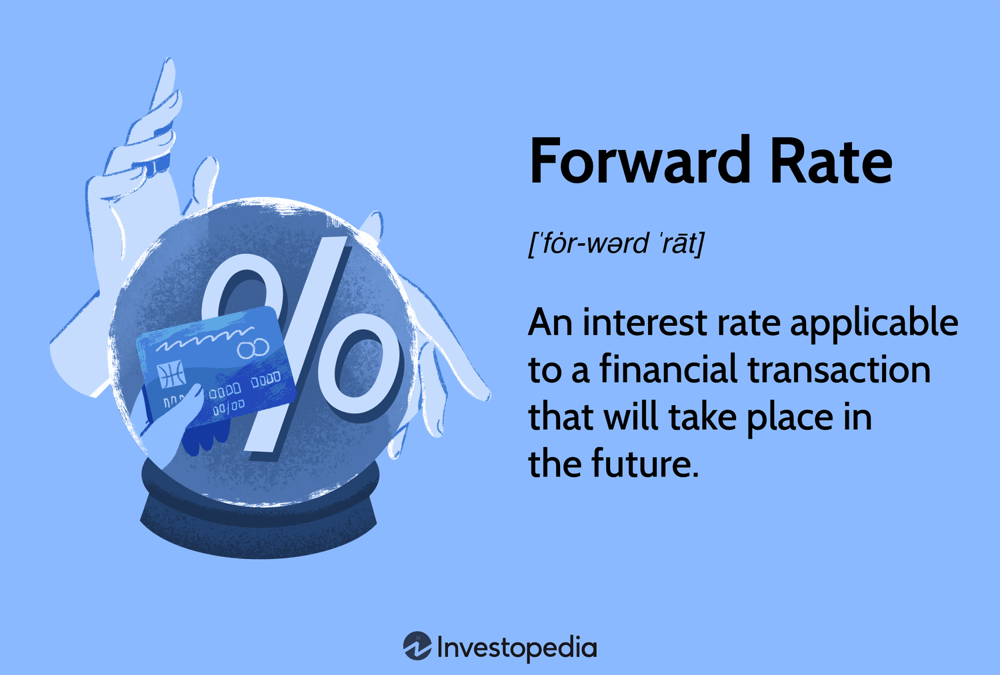

## Table of Contents

## What is a forward rate?

A forward rate is a type of interest rate that is agreed upon today but will be used in the future. It is commonly used in financial markets to help people and businesses plan for future borrowing or investing. For example, if you want to borrow money in six months, you can agree on a forward rate now, so you know exactly what interest rate you will pay when the time comes.

Forward rates are important because they help reduce uncertainty about future costs. They are often used in contracts called forward rate agreements, where two parties agree on an interest rate to be applied to a loan or deposit that will start at a future date. This can be very useful for businesses that need to manage their finances carefully and want to avoid surprises in their interest expenses.

## How is a forward rate different from a spot rate?

A forward rate and a spot rate are both types of interest rates, but they are used at different times. A spot rate is the interest rate you get right now, for money you borrow or invest today. It's like buying something at the store and paying the price that's on the tag at that moment. If you want to borrow money today, the spot rate tells you what interest rate you will pay.

On the other hand, a forward rate is an interest rate that you agree on today, but it will only apply in the future. It's like making a deal to buy something later at a price you agree on now. For example, if you know you'll need to borrow money in six months, you can lock in a forward rate now, so you know exactly what interest rate you'll pay when that time comes. This helps you plan better because you won't have to worry about what the interest rates might be in the future.

## Why are forward rates important in financial markets?

Forward rates are important in financial markets because they help people and businesses plan for the future. When you know what interest rate you will pay or receive later, it makes it easier to make decisions about borrowing or investing money. For example, a company might need to take out a loan in six months to buy new equipment. By agreeing on a forward rate now, they can be sure about the cost of that loan, which helps them budget and plan their finances better.

Another reason forward rates are important is that they help reduce uncertainty. In the world of finance, things can change quickly, and interest rates can go up or down. By using forward rates, people can protect themselves from these changes. If someone thinks interest rates might go up in the future, they can lock in a lower rate now with a forward rate agreement. This way, they won't have to pay more if rates do go up. This makes financial planning more predictable and less risky.

## What are the basic uses of forward rates in finance?

Forward rates are used in finance to help people and businesses plan for future borrowing or investing. If someone knows they will need to borrow money in the future, they can agree on a forward rate now. This means they will know exactly what interest rate they will pay later, even if the rates change. This can be very helpful for budgeting and making sure they can afford the loan when the time comes.

Another basic use of forward rates is to manage risk. Interest rates can go up or down, and this can make it hard to predict costs. By using a forward rate, someone can lock in a rate now and avoid the risk of rates going up later. For example, if a company thinks rates will go up, they can use a forward rate to keep their borrowing costs the same. This makes their financial planning more stable and less risky.

## How can forward rates be used for hedging purposes?

Forward rates can be used for hedging to protect against future changes in interest rates. Imagine a business that knows it will need to borrow money in the future. If they think interest rates might go up, they can use a forward rate agreement to lock in today's rate for a future loan. This way, even if rates do go up, the business will still pay the lower rate they agreed on earlier. This helps the business avoid paying more interest than they planned for, which can be important for their budget.

Hedging with forward rates is also useful for investors. If an investor expects to receive money in the future and wants to invest it, they might worry about interest rates going down. By agreeing on a forward rate now, they can ensure they get a higher rate on their investment later, even if rates drop. This helps them plan their investments better and avoid losing out on potential earnings due to lower rates. Using forward rates for hedging helps both borrowers and investors manage their financial risks more effectively.

## What is the formula for calculating a forward rate?

The formula for calculating a forward rate is simple but important. Imagine you want to know the forward rate for a period starting in the future. You need to know the spot rates for the time until you start your forward period and the time until you end your forward period. The forward rate formula is: Forward Rate = [(1 + Spot Rate Long)^Long Period / (1 + Spot Rate Short)^Short Period - 1] / (Long Period - Short Period).

Let's break it down with an example. Suppose the spot rate for a 1-year loan is 2% and the spot rate for a 2-year loan is 3%. You want to know the forward rate for the second year (from year 1 to year 2). Here, the Long Period is 2 years and the Short Period is 1 year. Plugging these into the formula, you get: Forward Rate = [(1 + 0.03)^2 / (1 + 0.02)^1 - 1] / (2 - 1). This works out to be [(1.03)^2 / 1.02 - 1] / 1, which is about 4%. So, the forward rate for the second year is around 4%. This means if you lock in this rate now, you'll pay 4% interest for the second year.

## Can you explain the concept of forward rate agreements (FRAs)?

A forward rate agreement (FRA) is a contract between two people or businesses where they agree on an interest rate for a loan or deposit that will start in the future. It's like making a deal now about what the interest rate will be later. This can be helpful if you think interest rates might change. For example, if you think rates will go up, you can use an FRA to lock in a lower rate now. This way, you know exactly what you'll pay when you need to borrow money later.

FRAs are used a lot in finance to help manage risk. They let you protect yourself from changes in interest rates. If you're a business and you know you'll need a loan in six months, you can use an FRA to make sure you won't have to pay more if rates go up. It's like buying insurance for your interest costs. By using FRAs, businesses and investors can plan their finances better and avoid surprises.

## How do forward rates relate to yield curves?

Forward rates and yield curves are closely related because they both help us understand what might happen with interest rates in the future. A yield curve shows the interest rates for different lengths of time, like short-term and long-term loans. It's like a graph that can tell us if interest rates are expected to go up or down. For example, if the yield curve is going up, it means longer-term rates are higher than shorter-term rates, which might mean people expect interest rates to rise.

Forward rates are the rates we agree on now for borrowing or investing in the future. They are like predictions of what the interest rate will be later. We can use the information from the yield curve to figure out these forward rates. If the yield curve is going up, the forward rates for the future will be higher than the current short-term rates. This helps people and businesses plan because they can use forward rates to lock in today's rates for future loans or investments, making their financial planning more certain.

## What role do forward rates play in interest rate swaps?

Forward rates play an important role in interest rate swaps, which are agreements between two parties to exchange interest payments over time. In an interest rate swap, one party might agree to pay a fixed interest rate while the other pays a floating rate that changes with market conditions. Forward rates help in setting these rates. When the parties agree on the swap, they use forward rates to estimate what the floating rate might be in the future. This helps them decide on the fixed rate that makes the swap fair for both sides.

For example, if someone thinks interest rates will go up, they might want to pay a fixed rate now and receive the floating rate later. They can use forward rates to guess what the floating rate will be and choose a fixed rate that seems fair. If the forward rates suggest that interest rates will rise, the fixed rate they agree on will be higher. This way, forward rates help make sure the swap is balanced and both parties are happy with the deal.

## How are forward rates used in forecasting future interest rates?

Forward rates are like guesses about what interest rates will be in the future. They help people and businesses make plans because they can use these rates to figure out what borrowing or investing might cost later. For example, if you want to borrow money in six months, you can look at forward rates to see what the interest rate might be at that time. This helps you decide if it's a good idea to borrow now or wait.

People use forward rates to predict future interest rates by looking at the yield curve, which shows interest rates for different times. If the yield curve is going up, it means people expect interest rates to go up too. So, the forward rates for the future will be higher than the rates now. This helps everyone plan better because they can see what might happen with interest rates and make smart choices about their money.

## What are the limitations and risks associated with using forward rates?

Using forward rates can be helpful, but there are some limitations and risks to think about. One big limitation is that forward rates are just predictions. They are based on what people think will happen with interest rates in the future, but no one can know for sure. If the actual interest rates turn out to be different from what was predicted, then the forward rate you locked in might not be as good a deal as you hoped. This can make it hard to plan perfectly because the future is always a bit uncertain.

There are also risks involved with forward rates. One risk is that if interest rates go down instead of up, you might end up paying more than you would have if you had waited. For example, if you lock in a forward rate of 4% for a future loan, but the actual rate drops to 3% by the time you need the loan, you'll be stuck paying the higher rate. Another risk is that using forward rates can be complex and might require you to pay fees or other costs. It's important to weigh these risks and costs against the benefits of using forward rates to see if it's the right choice for you.

## How do advanced financial models incorporate forward rates for pricing complex derivatives?

Advanced financial models use forward rates to help price complex derivatives, which are financial products whose value depends on other assets. These models often use a method called the no-[arbitrage](/wiki/arbitrage) principle, which means they try to find prices that don't allow anyone to make easy money without risk. By using forward rates, these models can predict what interest rates might be in the future and use that information to figure out what a derivative should be worth today. For example, if a derivative pays out based on future interest rates, the model will use forward rates to estimate those future rates and calculate the derivative's current price.

Some common models that use forward rates include the Black-Scholes model and the Heath-Jarrow-Morton (HJM) framework. The Black-Scholes model, often used for pricing options, takes into account the current interest rate and the expected future rates, which are derived from forward rates. The HJM framework, on the other hand, directly models the entire forward rate curve to price interest rate derivatives. Both models help investors and financial institutions understand the value of complex financial products by incorporating forward rates into their calculations, making it easier to manage risk and make informed decisions.

## What is the understanding of forward rates?

Forward rates serve as crucial financial instruments that allow parties to agree on a specific interest rate for a transaction set to occur in the future. Predominantly utilized in hedging strategies, forward rates provide a mechanism for mitigating risks associated with fluctuations in currency exchange rates and interest rates. By establishing a fixed rate for future transactions, businesses can shield themselves against the volatile nature of financial markets and avoid unexpected financial exposures.

The calculation of forward rates is fundamentally based on current spot rates but also heavily influenced by market expectations and prevailing economic conditions. The spot rate, often referred to as the current market rate for immediate transactions, provides the foundation upon which forward rates are built. To compute a forward rate, one must consider the interest rates applicable over the period in question, along with any expectations of economic shifts that could impact future rates.

Mathematically, the forward rate can be derived using a formula that incorporates these various elements. For example, when calculating the forward rate for foreign exchange ([forex](/wiki/forex-system)), the equation might involve the spot exchange rate, the domestic [interest rate](/wiki/interest-rate-trading-strategies), and the foreign interest rate for the specified time period. Conceptually, if we denote the forward rate \$F\$, the spot rate \$S\$, the domestic interest rate \$r_d\$, and the foreign interest rate \$r_f\$, the relationship can be expressed as:

$$
F = S \times \left( \frac{1 + r_d}{1 + r_f} \right)^t
$$

Here, \$t\$ represents the time until maturity, typically expressed in terms of the fraction of the year.

Aside from forex, forward rates are also instrumental in determining the future value of investments and crafting sophisticated financial contracts. They allow businesses to navigate the complexities of financial planning by securing known costs associated with future transactions, thus facilitating effective financial management and strategy.

In summary, forward rates are indispensable tools in the arsenal of financial instruments, essential for managing risk and ensuring predictability amidst the inherent uncertainties of global financial markets. Their ability to provide stability and foresight underscores their significance in contemporary financial strategy and operational planning.

## What is the difference between Forward Rate and Spot Rate?

The forward rate and spot rate represent two distinct concepts in financial markets, each serving unique purposes. The forward rate is associated with transactions set to occur at a future date, offering an agreement to exchange at a predetermined rate. This is crucial for businesses and investors who seek to hedge against future uncertainties, such as fluctuating interest rates or currency values. In contrast, the spot rate represents the current market price at which an asset can be bought or sold for immediate settlement. This rate is reflective of the present supply and demand dynamics within the market.

The relationship between forward rates and spot rates is a vital component of financial decision-making. Given the formula for calculating forward rates, which often involves using current spot rates and estimating future conditions, these calculations provide insights into market expectations. For example, the forward rate for currency might be calculated as:

$$
F = S \times \left( \frac{(1 + i_{\text{domestic}} \times n)}{(1 + i_{\text{foreign}} \times n)} \right)
$$

Where $F$ is the forward rate, $S$ is the spot rate, $i_{\text{domestic}}$ is the interest rate in the domestic currency, $i_{\text{foreign}}$ is the interest rate in the foreign currency, and $n$ is the time period until the transaction.

Understanding the distinction between the forward rate and the spot rate is essential, as it enables market participants to make informed predictions about future market conditions. For instance, if the forward rate indicates a higher future value compared to the spot rate, this suggests an expectation of future strengthening in that currency or asset. Such insights help businesses and investors form strategies to manage potential risks and seize opportunities within fluctuating markets.

In summary, while the spot rate provides a snapshot of the current market conditions, the forward rate offers a glimpse into market expectations, thereby playing a crucial role in forming financial strategies and decisions.

## How do you calculate the forward rate?

To calculate the forward rate, one must primarily consider the current spot rates along with expectations of future economic conditions. This process involves the use of a formula which captures the relationship between these spot rates, interest rates, and maturity periods.

The formula for calculating a forward rate from spot rates is crucial for determining the expected future interest rate over a specific time period. It is expressed as follows:

$$

F = \left(\frac{(1 + S_2)^{T_2}}{(1 + S_1)^{T_1}}\right)^\frac{1}{T_2 - T_1} - 1 
$$

Where:
- $F$ denotes the forward rate.
- $S_1$ is the current spot rate for the initial maturity period $T_1$.
- $S_2$ is the current spot rate for the longer maturity period $T_2$.
- $T_1$ and $T_2$ represent the time periods in years.

This equation indicates that the forward rate is a function of the relative compounding of the respective spot rates. It accounts for the periods over which these rates are applicable, allowing businesses and investors to forecast interest rates for future transactions.

For example, consider a scenario where an investor wants to calculate a one-year forward rate based on spot rates: Assume the one-year spot rate ($S_1$) is 2% and the two-year spot rate ($S_2$) is 3%. To determine the forward rate for the period between the first and second year ($T_1 = 1$, $T_2 = 2$), the forward rate can be calculated as follows:

Using the above formula, we plug in the values:

$$

F = \left(\frac{(1 + 0.03)^2}{(1 + 0.02)^1}\right)^\frac{1}{2 - 1} - 1 
$$

Calculating further:

$$

F = \left(\frac{1.0609}{1.02}\right)^1 - 1 
$$

$$

F = 1.04 - 1
$$

$$

F = 0.04 \text{ or } 4\%
$$

Thus, the one-year forward rate is 4%. This computation allows for a clear and precise prediction of future interest rates, assisting in financial planning and risk management. Calculating forward rates is essential for managing expectations in financial contracts and investments, providing a strategic basis for hedging against market volatilities.

## What are Forward Rates in Algo Trading?

Algorithmic trading leverages forward rates to optimize trading strategies by utilizing predictive analytics to anticipate future market conditions. This approach involves the integration of estimated future rates within algorithmic models, allowing for more informed and precise decision-making in financial markets. By incorporating forward rates, these trading systems can preemptively adjust positions to capitalize on expected market movements, thereby optimizing returns and minimizing risks.

Forward rates serve as a foundational input in algorithmic models, particularly in foreign exchange and interest rate trading. These rates provide critical insights into anticipated changes in market variables, enabling algorithms to execute trades that align with predicted trends. For instance, if a forward rate indicates an expectation of rising interest rates, algorithms can be designed to adjust portfolios in anticipation, such as by reducing holdings in bonds that are likely to decrease in value under higher interest rates.

To calculate forward rates, algorithms often employ mathematical formulas involving spot rates and the risk-free interest rates of the relevant currencies or assets. The basic formula used in calculating a forward rate $F$ can be defined as:

$$
F = S \times \left( \frac{1 + i_d \cdot t}{1 + i_f \cdot t} \right)
$$

where:
- $F$ is the forward rate,
- $S$ is the current spot rate,
- $i_d$ is the domestic interest rate,
- $i_f$ is the foreign interest rate,
- $t$ is the time to maturity expressed in years.

Algorithmic trading systems take these calculated forward rates to generate automated strategies, balancing potential gains against associated risks. This capacity to predict and respond swiftly to expected market fluctuations provides a competitive edge in trading operations, increasing both efficiency and profitability.

Moreover, forward rates assist in risk management by facilitating the hedging of derivative positions. For example, traders use these rates to determine the best timing for executing futures contracts, aiming to lock in favorable rates today that reflect their expectations of future conditions. The algorithmic incorporation of forward rates ensures that such strategic decisions are grounded in quantitative analysis rather than speculative intuition.

As technology continues to advance, the integration of forward rates into [algorithmic trading](/wiki/algorithmic-trading) strategies is likely to become even more sophisticated. The ongoing development of [machine learning](/wiki/machine-learning) algorithms and enhanced computing power promise to elevate the precision and effectiveness of trading predictions based on forward rates, thereby further optimizing trading outcomes and risk management in financial markets.

## What is the role of forward rates in financial decisions?

Forward rates are a critical tool in financial decision-making, specifically in the context of hedging and investment planning. By enabling the prediction of future interest rates and foreign exchange rates, forward rates provide a strategic advantage for managing financial risks, particularly those associated with interest rate and currency fluctuations.

The utilization of forward rates in hedging strategies allows businesses and investors to stabilize cash flows and protect against adverse movements in interest rates and exchange rates. For example, a company expecting to receive a foreign currency payment in the future might use a forward rate agreement to lock in the exchange rate, thereby insulating itself from potential currency depreciation.

Investment planning also benefits from the insights offered by forward rates. By forecasting future interest rates, investors can better tailor their bond portfolios to achieve desired returns, taking into consideration the expected changes in market rates. The ability to anticipate these movements is crucial for constructing portfolios that are resistant to rate shifts.

Forward rates influence financial decisions by informing strategies that aim to mitigate risk. For instance, understanding the expected forward rate can lead an investor to choose a bond with a floating interest rate over a fixed rate, should the forward rate indicate a rising interest rate environment. This kind of informed decision-making helps optimize the balance between risk and return.

Mathematically, forward rates can be calculated using the formula:

$$
F = \left( \frac{1 + r_2 \times \frac{d_2}{360}}{1 + r_1 \times \frac{d_1}{360}} \right) - 1
$$

where $F$ is the forward rate, $r_1$ and $r_2$ are the spot interest rates for periods $d_1$ and $d_2$ respectively. This formula helps in determining the future rate based on current market conditions, providing a quantitative basis for financial decisions.

In conclusion, forward rates serve as a pivotal resource for strategic financial planning and risk management. Their role in forecasting future economic conditions assists investors and businesses in achieving more favorable financial outcomes through informed decision-making and proactive strategy development. Understanding how to effectively apply forward rates is invaluable for navigating the complexities of financial markets and seizing opportunities that align with long-term financial objectives.

## References & Further Reading

[1]: ["Hull, J. (2012). Options, Futures, and Other Derivatives"](https://www.semanticscholar.org/paper/Options%2C-Futures%2C-and-Other-Derivatives-Hull/89bdee500c8623864fc9eb7a471546aa713acc44). Pearson Education. 

[2]: ["Fabozzi, F. J., & Mann, S. V. (2005). The Handbook of Fixed Income Securities"](https://www.mhebooklibrary.com/doi/book/10.1036/9781260473902?contentTab=true). McGraw-Hill.

[3]: ["Shreve, S. E. (2004). Stochastic Calculus for Finance I: The Binomial Asset Pricing Model"](https://link.springer.com/book/10.1007/978-0-387-22527-2). Springer Finance.

[4]: ["Bodie, Z., Kane, A., & Marcus, A. J. (2014). Investments"](https://www.mheducation.com/highered/product/investments-bodie-kane/M9781264412662.html). McGraw-Hill Education.

[5]: ["Lopez de Prado, M. (2018). Advances in Financial Machine Learning"](https://books.google.com/books/about/Advances_in_Financial_Machine_Learning.html?id=oU9KDwAAQBAJ). Wiley.

[6]: ["Ross, S. A., Westerfield, R. W., & Jaffe, J. F. (2012). Corporate Finance"](https://www.mheducation.com/highered/product/corporate-finance-ross-westerfield/M9781260772388.html). McGraw-Hill Irwin.