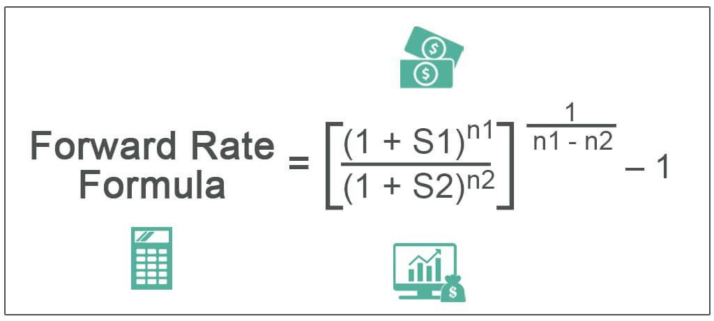

Forward rates play a crucial role in the financial markets by facilitating predictions of future interest rates for various transactions. These rates are pivotal in different financial contexts, such as the foreign exchange (forex) and interest rate markets, where they help lock in future exchange rates or interest rates, providing a hedge against volatility. This utility is particularly important for businesses and investors aiming to mitigate financial risks associated with interest rate fluctuations.

The capability to forecast future rates effectively influences investment strategies and risk management practices. Forward rates serve as agreements to fix an interest rate for a transaction that will take place in the future, thus allowing market participants to avoid the unpredictability of market conditions at a later date. For example, businesses engaging in cross-border transactions might use forward rates to lock in a specific exchange rate to neutralize potential adverse currency movements.

Algorithmic trading, an area significantly transformed by technological advancements, has revolutionized the use of forward rates. This form of trading leverages forward rates to create sophisticated trading strategies, utilizing predictive analytics to make informed decisions. With algorithmic trading, forward rates are integrated into models that assess future market conditions, enabling more precise and optimized trading outcomes.

This article explores the essence of forward rates, focusing on their definition, calculation, and application within financial calculations and algorithmic trading. By understanding these facets, investors and businesses can employ forward rates effectively, enhancing their strategic planning and cultivation of financial stability amidst fluctuating interest rates.

## Table of Contents

## Understanding Forward Rates

Forward rates serve as crucial financial instruments that allow parties to agree on a specific interest rate for a transaction set to occur in the future. Predominantly utilized in hedging strategies, forward rates provide a mechanism for mitigating risks associated with fluctuations in currency exchange rates and interest rates. By establishing a fixed rate for future transactions, businesses can shield themselves against the volatile nature of financial markets and avoid unexpected financial exposures.

The calculation of forward rates is fundamentally based on current spot rates but also heavily influenced by market expectations and prevailing economic conditions. The spot rate, often referred to as the current market rate for immediate transactions, provides the foundation upon which forward rates are built. To compute a forward rate, one must consider the interest rates applicable over the period in question, along with any expectations of economic shifts that could impact future rates.

Mathematically, the forward rate can be derived using a formula that incorporates these various elements. For example, when calculating the forward rate for foreign exchange ([forex](/wiki/forex-system)), the equation might involve the spot exchange rate, the domestic [interest rate](/wiki/interest-rate-trading-strategies), and the foreign interest rate for the specified time period. Conceptually, if we denote the forward rate \$F\$, the spot rate \$S\$, the domestic interest rate \$r_d\$, and the foreign interest rate \$r_f\$, the relationship can be expressed as:

$$
F = S \times \left( \frac{1 + r_d}{1 + r_f} \right)^t
$$

Here, \$t\$ represents the time until maturity, typically expressed in terms of the fraction of the year.

Aside from forex, forward rates are also instrumental in determining the future value of investments and crafting sophisticated financial contracts. They allow businesses to navigate the complexities of financial planning by securing known costs associated with future transactions, thus facilitating effective financial management and strategy.

In summary, forward rates are indispensable tools in the arsenal of financial instruments, essential for managing risk and ensuring predictability amidst the inherent uncertainties of global financial markets. Their ability to provide stability and foresight underscores their significance in contemporary financial strategy and operational planning.

## Forward Rates in Practice

In practice, forward rates are essential tools in managing investment portfolios and structuring financial contracts. Investors utilize them to predict and hedge against fluctuations in future interest rates and exchange rates. By employing forward rates, an organization can effectively manage the financial uncertainty that arises from volatile market conditions.

One notable application of forward rates is in currency forwards. Currency forward agreements allow two parties to exchange a specified amount of currencies at a predetermined rate on a future date. This mechanism is particularly beneficial for multinational corporations that are exposed to foreign exchange risk. By locking in the forward rate, these corporations can mitigate the impact of currency fluctuations on their overseas revenues, thus stabilizing their financial performance.

Forward rates are also instrumental in calculating the future value of investments. For instance, if an investor wishes to determine the future value of an investment that involves interest-sensitive instruments, forward rates can facilitate accurate predictions regarding interest rate movements. This helps in crafting strategies that maximize returns while managing exposure to interest rate risk.

Additionally, forward rate agreements (FRAs) offer a high degree of customization, allowing them to cater to specific financial requirements. Unlike standardized futures contracts, which are traded on exchanges with set terms and conditions, FRAs are over-the-counter (OTC) contracts. This OTC nature grants counter-parties the freedom to negotiate terms such as the notional principal, settlement date, and reference interest rate, affording them greater flexibility in tailoring agreements to match their hedging or investment needs. 

In essence, the strategic application of forward rates in practical financial scenarios not only enhances predictive accuracy but also provides a robust framework for risk management and contractual flexibility.

## Forward Rate vs. Spot Rate

The forward rate and spot rate represent two distinct concepts in financial markets, each serving unique purposes. The forward rate is associated with transactions set to occur at a future date, offering an agreement to exchange at a predetermined rate. This is crucial for businesses and investors who seek to hedge against future uncertainties, such as fluctuating interest rates or currency values. In contrast, the spot rate represents the current market price at which an asset can be bought or sold for immediate settlement. This rate is reflective of the present supply and demand dynamics within the market.

The relationship between forward rates and spot rates is a vital component of financial decision-making. Given the formula for calculating forward rates, which often involves using current spot rates and estimating future conditions, these calculations provide insights into market expectations. For example, the forward rate for currency might be calculated as:

$$
F = S \times \left( \frac{(1 + i_{\text{domestic}} \times n)}{(1 + i_{\text{foreign}} \times n)} \right)
$$

Where $F$ is the forward rate, $S$ is the spot rate, $i_{\text{domestic}}$ is the interest rate in the domestic currency, $i_{\text{foreign}}$ is the interest rate in the foreign currency, and $n$ is the time period until the transaction.

Understanding the distinction between the forward rate and the spot rate is essential, as it enables market participants to make informed predictions about future market conditions. For instance, if the forward rate indicates a higher future value compared to the spot rate, this suggests an expectation of future strengthening in that currency or asset. Such insights help businesses and investors form strategies to manage potential risks and seize opportunities within fluctuating markets.

In summary, while the spot rate provides a snapshot of the current market conditions, the forward rate offers a glimpse into market expectations, thereby playing a crucial role in forming financial strategies and decisions.

## Calculating the Forward Rate

To calculate the forward rate, one must primarily consider the current spot rates along with expectations of future economic conditions. This process involves the use of a formula which captures the relationship between these spot rates, interest rates, and maturity periods.

The formula for calculating a forward rate from spot rates is crucial for determining the expected future interest rate over a specific time period. It is expressed as follows:

$$

F = \left(\frac{(1 + S_2)^{T_2}}{(1 + S_1)^{T_1}}\right)^\frac{1}{T_2 - T_1} - 1 
$$

Where:
- $F$ denotes the forward rate.
- $S_1$ is the current spot rate for the initial maturity period $T_1$.
- $S_2$ is the current spot rate for the longer maturity period $T_2$.
- $T_1$ and $T_2$ represent the time periods in years.

This equation indicates that the forward rate is a function of the relative compounding of the respective spot rates. It accounts for the periods over which these rates are applicable, allowing businesses and investors to forecast interest rates for future transactions.

For example, consider a scenario where an investor wants to calculate a one-year forward rate based on spot rates: Assume the one-year spot rate ($S_1$) is 2% and the two-year spot rate ($S_2$) is 3%. To determine the forward rate for the period between the first and second year ($T_1 = 1$, $T_2 = 2$), the forward rate can be calculated as follows:

Using the above formula, we plug in the values:

$$

F = \left(\frac{(1 + 0.03)^2}{(1 + 0.02)^1}\right)^\frac{1}{2 - 1} - 1 
$$

Calculating further:

$$

F = \left(\frac{1.0609}{1.02}\right)^1 - 1 
$$

$$

F = 1.04 - 1
$$

$$

F = 0.04 \text{ or } 4\%
$$

Thus, the one-year forward rate is 4%. This computation allows for a clear and precise prediction of future interest rates, assisting in financial planning and risk management. Calculating forward rates is essential for managing expectations in financial contracts and investments, providing a strategic basis for hedging against market volatilities.

## Forward Rates in Algo Trading

Algorithmic trading leverages forward rates to optimize trading strategies by utilizing predictive analytics to anticipate future market conditions. This approach involves the integration of estimated future rates within algorithmic models, allowing for more informed and precise decision-making in financial markets. By incorporating forward rates, these trading systems can preemptively adjust positions to capitalize on expected market movements, thereby optimizing returns and minimizing risks.

Forward rates serve as a foundational input in algorithmic models, particularly in foreign exchange and interest rate trading. These rates provide critical insights into anticipated changes in market variables, enabling algorithms to execute trades that align with predicted trends. For instance, if a forward rate indicates an expectation of rising interest rates, algorithms can be designed to adjust portfolios in anticipation, such as by reducing holdings in bonds that are likely to decrease in value under higher interest rates.

To calculate forward rates, algorithms often employ mathematical formulas involving spot rates and the risk-free interest rates of the relevant currencies or assets. The basic formula used in calculating a forward rate $F$ can be defined as:

$$
F = S \times \left( \frac{1 + i_d \cdot t}{1 + i_f \cdot t} \right)
$$

where:
- $F$ is the forward rate,
- $S$ is the current spot rate,
- $i_d$ is the domestic interest rate,
- $i_f$ is the foreign interest rate,
- $t$ is the time to maturity expressed in years.

Algorithmic trading systems take these calculated forward rates to generate automated strategies, balancing potential gains against associated risks. This capacity to predict and respond swiftly to expected market fluctuations provides a competitive edge in trading operations, increasing both efficiency and profitability.

Moreover, forward rates assist in risk management by facilitating the hedging of derivative positions. For example, traders use these rates to determine the best timing for executing futures contracts, aiming to lock in favorable rates today that reflect their expectations of future conditions. The algorithmic incorporation of forward rates ensures that such strategic decisions are grounded in quantitative analysis rather than speculative intuition.

As technology continues to advance, the integration of forward rates into [algorithmic trading](/wiki/algorithmic-trading) strategies is likely to become even more sophisticated. The ongoing development of [machine learning](/wiki/machine-learning) algorithms and enhanced computing power promise to elevate the precision and effectiveness of trading predictions based on forward rates, thereby further optimizing trading outcomes and risk management in financial markets.

## The Role of Forward Rates in Financial Decisions

Forward rates are a critical tool in financial decision-making, specifically in the context of hedging and investment planning. By enabling the prediction of future interest rates and foreign exchange rates, forward rates provide a strategic advantage for managing financial risks, particularly those associated with interest rate and currency fluctuations.

The utilization of forward rates in hedging strategies allows businesses and investors to stabilize cash flows and protect against adverse movements in interest rates and exchange rates. For example, a company expecting to receive a foreign currency payment in the future might use a forward rate agreement to lock in the exchange rate, thereby insulating itself from potential currency depreciation.

Investment planning also benefits from the insights offered by forward rates. By forecasting future interest rates, investors can better tailor their bond portfolios to achieve desired returns, taking into consideration the expected changes in market rates. The ability to anticipate these movements is crucial for constructing portfolios that are resistant to rate shifts.

Forward rates influence financial decisions by informing strategies that aim to mitigate risk. For instance, understanding the expected forward rate can lead an investor to choose a bond with a floating interest rate over a fixed rate, should the forward rate indicate a rising interest rate environment. This kind of informed decision-making helps optimize the balance between risk and return.

Mathematically, forward rates can be calculated using the formula:

$$
F = \left( \frac{1 + r_2 \times \frac{d_2}{360}}{1 + r_1 \times \frac{d_1}{360}} \right) - 1
$$

where $F$ is the forward rate, $r_1$ and $r_2$ are the spot interest rates for periods $d_1$ and $d_2$ respectively. This formula helps in determining the future rate based on current market conditions, providing a quantitative basis for financial decisions.

In conclusion, forward rates serve as a pivotal resource for strategic financial planning and risk management. Their role in forecasting future economic conditions assists investors and businesses in achieving more favorable financial outcomes through informed decision-making and proactive strategy development. Understanding how to effectively apply forward rates is invaluable for navigating the complexities of financial markets and seizing opportunities that align with long-term financial objectives.

## Conclusion and Future Implications

Forward rates are pivotal in shaping the financial landscapes of tomorrow by allowing businesses and investors to strategically plan by providing insights into future interest rate movements. They serve as essential tools for risk management and decision-making by enabling the locking of exchange and interest rates for future transactions. This forward-thinking approach is instrumental in mitigating the financial risks associated with unforeseen market volatilities.

The ongoing evolution of algorithmic trading perpetually broadens the utilization of forward rates across diverse trading platforms. Algorithmic trading leverages forward rates to design sophisticated trading strategies driven by predictive analytics. Forward rates offer a quantifiable method to anticipate market trends, thus equipping automated trading systems with the capability to optimize trading outcomes. This synergy between forward rates and algorithmic trading enhances not only the efficiency of executing trades but also the ability to manage associated risks.

Looking ahead, future advancements in technology and analytics will likely amplify the precision and functionality of forward rate predictions. As computational power and data analytics evolve, the models that predict forward rates will become more sophisticated, integrating vast datasets and complex variables to improve forecast accuracy. This potential leap in predictive analytics promises enhanced strategic planning for investors and businesses, with more reliable tools to navigate the financial markets and manage economic exposure. As a result, forward rates will continue to be indispensable, playing a central role in both current financial operations and the strategic planning processes of tomorrow.

## References & Further Reading

[1]: ["Hull, J. (2012). Options, Futures, and Other Derivatives"](https://www.semanticscholar.org/paper/Options%2C-Futures%2C-and-Other-Derivatives-Hull/89bdee500c8623864fc9eb7a471546aa713acc44). Pearson Education. 

[2]: ["Fabozzi, F. J., & Mann, S. V. (2005). The Handbook of Fixed Income Securities"](https://www.mhebooklibrary.com/doi/book/10.1036/9781260473902?contentTab=true). McGraw-Hill.

[3]: ["Shreve, S. E. (2004). Stochastic Calculus for Finance I: The Binomial Asset Pricing Model"](https://link.springer.com/book/10.1007/978-0-387-22527-2). Springer Finance.

[4]: ["Bodie, Z., Kane, A., & Marcus, A. J. (2014). Investments"](https://www.mheducation.com/highered/product/investments-bodie-kane/M9781264412662.html). McGraw-Hill Education.

[5]: ["Lopez de Prado, M. (2018). Advances in Financial Machine Learning"](https://books.google.com/books/about/Advances_in_Financial_Machine_Learning.html?id=oU9KDwAAQBAJ). Wiley.

[6]: ["Ross, S. A., Westerfield, R. W., & Jaffe, J. F. (2012). Corporate Finance"](https://www.mheducation.com/highered/product/corporate-finance-ross-westerfield/M9781260772388.html). McGraw-Hill Irwin.