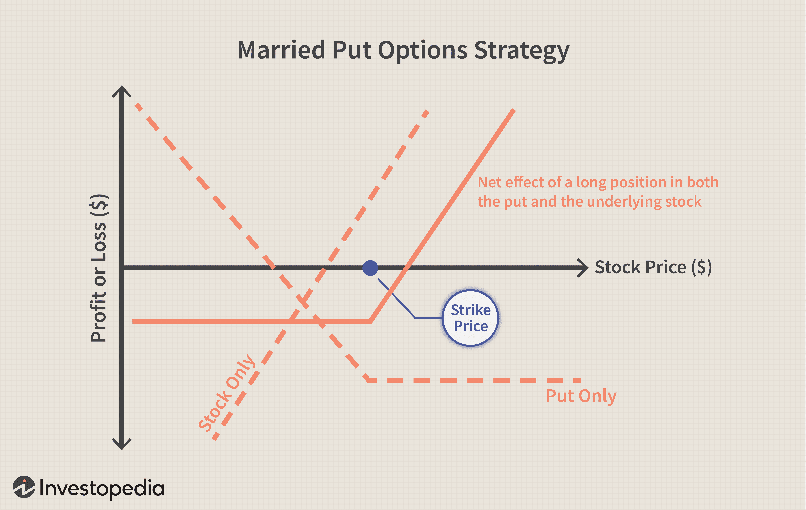

In the ever-evolving landscape of financial markets, investors and traders are constantly seeking new strategies to gain an edge. The use of financial instruments for investment has grown increasingly sophisticated, especially with the advent of algorithmic trading. This form of trading leverages advanced computational techniques to automatically execute trades, analyzing vast amounts of data to make informed decisions within milliseconds.

One such innovative strategy is forward spread algo trading. This approach combines the principles of forward spreads with algorithmic processes to enhance trading efficiency and profitability. Forward spreads, which represent the price difference between the spot price and the forward price of a security, serve as indicators of market expectations and future price changes. By incorporating algorithmic trading techniques, traders can more effectively exploit these differences to capitalize on pricing inefficiencies.



As financial instruments become more complex and the volume of data available to traders expands, the importance of algorithmic strategies in exploiting nuanced market movements increases. Forward spread algo trading exemplifies this trend, offering a method to systematically analyze and respond to market conditions.

This article provides insights into the concept of forward spread algo trading. It explores its mechanisms, the potential benefits it offers in terms of increased trading efficiency and profitability, and the risks associated with its implementation. By understanding these elements, traders can better navigate the complexities of modern financial markets and leverage the advantages of forward spread algo trading in their investment strategies.

## Table of Contents

## Understanding Financial Instruments and Forward Spread

Financial instruments are essential components of the global economy, representing tradable assets that can be bought, sold, or traded in various markets. These instruments encompass a wide range of categories, including stocks, bonds, currencies, and derivatives. Each type serves a distinct purpose in the financial ecosystem, offering opportunities for investment, hedging, and speculation.

**Stocks** are equity instruments that represent ownership in a corporation, providing shareholders with claims on a portion of the company’s assets and earnings. Investors often use stocks as a means to achieve long-term financial growth. 

**Bonds**, on the other hand, are debt instruments that involve lending money to an entity (such as a corporation or government) in exchange for periodic interest payments and the return of the bond's face value upon maturity. They are typically used for income generation and as a safer investment compared to stocks.

**Currencies** are traded in the foreign exchange (forex) market and involve the exchange of one currency for another. The forex market is the largest and most liquid financial market worldwide, where currencies are traded 24 hours a day.

**Derivatives** are complex financial instruments whose value is derived from the performance of underlying assets, indices, or rates. Common derivatives include futures, options, and swaps, which are utilized for a variety of purposes including hedging risk, leveraging positions, and speculating on market movements.

A pivotal concept within derivatives and other financial markets is the forward spread. The forward spread refers to the price difference between the spot price (the current market price) and the forward price (agreed future price) of a security or commodity. This metric plays a crucial role in [forex](/wiki/forex-system) and commodities trading, where it is commonly used to lock in future prices and manage exposure to price [volatility](/wiki/volatility-trading-strategies).

Mathematically, the forward spread ($S_f$) can be expressed as:

$$
S_f = F - S
$$

where $F$ is the forward price and $S$ is the spot price. 

The forward spread is indicative of market sentiment and expectations regarding future price changes. It can be classified as positive or negative. A **positive forward spread** occurs when the forward price is greater than the spot price, suggesting that the market expects the price to rise in the future. Conversely, a **negative forward spread** implies that the forward price is lower than the spot price, signaling expectations of a price decline.

The width of the forward spread can also vary, being described as wide or narrow. A **wide spread** often reflects high levels of uncertainty or volatility in the market, while a **narrow spread** typically indicates stability and reduced uncertainty.

Factors influencing the forward spread include supply and demand dynamics, interest rates, inflation expectations, geopolitical events, and overall market sentiment. Understanding these elements is crucial for traders and investors implementing strategies like forward spread algo trading, as it allows them to make more informed decisions about their market positions and risk management.

## Basics of Algorithmic Trading

Algorithmic trading is an advanced method of executing trades that leverages computer algorithms to make decisions at speeds and efficiencies unachievable by human traders. The primary advantage of this approach is its capability to navigate the complexities of financial markets by minimizing human error, enhancing execution speed, and allowing for the processing of vast datasets to generate precise buy and sell signals.

The algorithms used in this form of trading typically draw on a combination of specific strategies, extensive historical data, and market analysis. These algorithms are programmed to identify and exploit market trends and inefficiencies. For instance, if a certain stock historically performs better following a specific market event, the algorithm can be set to recognize these patterns and execute the requisite trades automatically.

Trading strategies implemented via algorithmic systems can include statistical [arbitrage](/wiki/arbitrage), [market making](/wiki/market-making), and [trend following](/wiki/trend-following), among others. These approaches often utilize historical price data and employ statistical models such as regression analysis to predict future price movements. The algorithms evaluate a variety of market indicators such as moving averages, [momentum](/wiki/momentum) indicators, and relative strength index (RSI) to formulate trading decisions.

A specific subset of [algorithmic trading](/wiki/algorithmic-trading) is forward spread algo trading. This strategy specifically targets forward spreads to capitalize on the potential price differences between the spot and forward prices of financial instruments. These spreads indicate market expectations for future pricing, and by deploying algorithms to monitor these spreads, traders can anticipate and act upon expected price movements.

For example, forward spread algo trading might use Python code to continuously monitor forward spread patterns and execute trades when predetermined conditions are met. Python's data analysis libraries, such as Pandas and NumPy, are often utilized for managing large datasets and performing complex calculations efficiently. Here is a simple illustration of how such an algorithm might be implemented in Python:

```python
import numpy as np
import pandas as pd

# Sample historical data for spot and forward prices
data = {'spot_price': [100, 102, 101, 103],
        'forward_price': [101, 104, 102, 105]}

df = pd.DataFrame(data)

# Calculate forward spread
df['forward_spread'] = df['forward_price'] - df['spot_price']

# Define a trading signal based on forward spread
def trading_signal(spread, threshold=1.5):
    return 'buy' if spread > threshold else 'sell'

df['signal'] = df['forward_spread'].apply(trading_signal)

print(df)
```

This script checks whether the forward spread exceeds a certain threshold and issues buy or sell signals accordingly. Such automation enables traders to promptly react to market movements, thereby safeguarding profitability while minimizing the potential for loss due to human error or delay.

In summary, algorithmic trading provides a potent tool set for modern traders, allowing for quick decision-making and execution based on complex data analysis. The subset of forward spread algo trading demonstrates how specific algorithms can exploit market expectations effectively, offering traders competitive advantages in various financial markets.

## Implementing Forward Spread Algo Trading Strategy

The successful implementation of a forward spread algo trading strategy hinges on a comprehensive understanding of financial markets and assets, alongside proficiency in programming and data analysis. This synthesis of skills allows traders to craft effective algorithms that capitalize on forward spreads between the spot and forward prices of financial instruments. 

To begin with, traders must develop algorithms capable of analyzing forward spreads, which involves programming logic that can evaluate market data to predict potential price movements. A Python script for such a task might start with data collection from financial markets using libraries like `pandas` and `numpy` for data manipulation and `matplotlib` for data visualization. Here's a simple example of how you can initiate this process:

```python
import pandas as pd
import numpy as np
import matplotlib.pyplot as plt

# Load historical market data
data = pd.read_csv('market_data.csv')
spot_prices = data['spot_price']
forward_prices = data['forward_price']

# Calculate the forward spreads
forward_spreads = forward_prices - spot_prices

# Plotting the forward spreads
plt.plot(data['date'], forward_spreads, label='Forward Spread')
plt.xlabel('Date')
plt.ylabel('Spread')
plt.title('Forward Spreads Over Time')
plt.legend()
plt.show()
```

With the spread data at hand, predictive modeling can be employed. Machine learning models such as Linear Regression or advanced [deep learning](/wiki/deep-learning) methods like Recurrent Neural Networks (RNN) can be utilized to forecast future movements. 

Moreover, these algorithms require continuous optimization, achieved through [backtesting](/wiki/backtesting) against historical data to validate their predictive accuracy and efficiency in trade execution. Backtesting assesses algorithm performance by applying it to past data and measuring profitability and risk metrics. This phase is crucial for model refinement, necessitating frequent updates based on the latest market data and trends.

Risk management forms an integral part of any robust trading algorithm to curb potential losses. This can be achieved by embedding constraints such as stop-loss orders and position sizing within the trading strategy. Stop-loss orders automatically liquidate a position when it falls below a predetermined price, thus limiting losses. Position sizing ensures no single trade excessively impacts the overall trading portfolio.

An example of implementing a stop-loss mechanism in a trading algorithm could be expressed as:

```python
def execute_trade(current_price, entry_price, stop_loss, position_size):
    if current_price <= entry_price - stop_loss:
        # Execute stop-loss logic
        print(f"Stop-loss triggered. Selling {position_size} units.")
        # Place sell order logic here
    else:
        # Continue to hold or make other trading decisions
        print("Holding position.")
```

Efficient deployment of a forward spread algo trading strategy requires these algorithms to be adaptable and resilient to market changes. Automation and [machine learning](/wiki/machine-learning) can provide these capabilities, but maintaining a competitive edge requires constant vigilance in monitoring system performance and market conditions. Traders must remain updated on new technological advancements and be prepared to integrate innovative techniques to optimize their strategies continuously.

## Benefits and Risks of Forward Spread Algo Trading

Forward spread algorithmic trading offers significant benefits due to its capability to exploit pricing inefficiencies in real-time, enhancing potential profitability. This approach leverages the speed and precision of computer algorithms to identify and capitalize on discrepancies between spot and forward prices that human traders might overlook. Consequently, traders can benefit from tighter spreads, better price execution, and optimized trade entry and [exit](/wiki/exit-strategy) points.

Another advantage of algorithmic trading is its ability to eliminate emotional biases from decision-making processes. Algorithms execute trades based on predetermined rules and data-driven insights, ensuring consistent and rational trading behavior. This consistency is crucial in maintaining disciplined trading practices, especially in volatile markets where emotions can lead to suboptimal decisions.

Despite its advantages, forward spread algo trading comes with inherent risks. Market volatility is one of the primary challenges, as rapid price movements can lead to unexpected losses if algorithms are not designed to react quickly and appropriately. Additionally, the efficacy of algorithmic trading heavily depends on data quality. Imperfect data feeds may lead to incorrect signals and erroneous trades. Ensuring data integrity through robust data management practices is essential to minimize these risks.

Execution delays pose another potential risk, particularly in high-frequency trading environments where milliseconds can dramatically affect trade outcomes. Lag in execution can result from network inefficiencies, slower-than-expected algorithmic processing, or latency in communication with trading platforms. Traders must continuously refine their algorithms and infrastructure to reduce latency and improve execution speed.

Effective risk management is paramount in forward spread algo trading. Traders should integrate strategies such as stop-loss orders and dynamic position sizing into their algorithms to mitigate potential losses. Continual backtesting and model optimization help ensure that algorithms remain responsive to changing market conditions.

In conclusion, forward spread algo trading offers a sophisticated blend of technology and market insights, providing traders with tools to enhance profitability while managing inherent risks. Continuous improvement of trading models and staying abreast of market changes are critical to navigating the challenges associated with this trading strategy.

## Conclusion

Forward spread algo trading represents a sophisticated intersection of financial theory and technology, offering numerous opportunities and challenges. By leveraging algorithmic systems to exploit forward spreads, traders can achieve gains that may not be possible through manual trading methods alone. However, as financial markets continue to evolve, those employing these strategies must be adaptable, technologically savvy, and ready to navigate both the intricacies of financial instruments and advancements in algorithmic systems. 

The dynamic nature of markets demands continuous learning and adaptation. Algorithmic traders should focus on ongoing education to keep up with new developments in financial instruments, trading platforms, and regulatory changes. Enhancing their understanding of programming languages such as Python and staying informed about advancements in data analysis and machine learning techniques will help in developing robust trading strategies.

System improvements are another critical aspect. Traders must periodically refine their algorithms, incorporating new data and optimizing parameters to maintain competitive advantage. Incorporating robust risk management tools and regularly backtesting algorithms against historical data can help mitigate potential losses and ensure reliability.

In conclusion, the confluence of financial theory and technology embodied in forward spread algo trading offers lucrative possibilities. However, success depends on the trader's ability to learn and adapt continuously, ensuring that strategies are both effective and competitive in ever-evolving market environments.

## References & Further Reading

[1]: Fox, J., & Casarez, K. (2019). ["Algorithmic and High-Frequency Trading."](https://www.cambridge.org/us/universitypress/subjects/mathematics/mathematical-finance/algorithmic-and-high-frequency-trading) Cambridge University Press.

[2]: Harris, L. (2003). ["Trading and Exchanges: Market Microstructure for Practitioners."](https://www.amazon.com/Trading-Exchanges-Market-Microstructure-Practitioners/dp/0195144708) Oxford University Press.

[3]: Narang, R. K. (2013). ["Inside the Black Box: A Simple Guide to Quantitative and High-Frequency Trading."](https://onlinelibrary.wiley.com/doi/book/10.1002/9781118662717) Wiley Finance.

[4]: Cartea, Á., Jaimungal, S., & Penalva, J. (2015). ["Algorithmic and High-Frequency Trading."](https://assets.cambridge.org/97811070/91146/frontmatter/9781107091146_frontmatter.pdf) Cambridge University Press.

[5]: Chan, E. P. (2009). ["Quantitative Trading: How to Build Your Own Algorithmic Trading Business."](https://github.com/ftvision/quant_trading_echan_book) Wiley Trading.