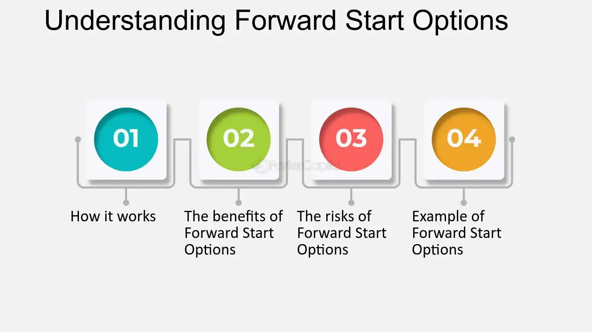

## Table of Contents

## What are Forward Start Options?

Forward Start Options are a type of financial contract that starts at a future date. They are different from regular options because they are bought now but only become active later. This means you pay for them now, but you can't use them until a certain time in the future. They are often used by companies to manage risks that they know will happen later.

These options can be useful for employees who get stock options as part of their job. For example, if an employee knows they will get stock options in a year, they can buy a Forward Start Option now. This can help protect them if the stock price goes down before they get their options. It's like buying insurance for something that will happen in the future.

## How do Forward Start Options differ from traditional options?

Forward Start Options are different from traditional options because they start at a future date, not right away. When you buy a traditional option, you can use it immediately. But with a Forward Start Option, you pay for it now, and it only becomes active later. This means you have to wait before you can use it, which can be helpful if you know you'll need it in the future.

For example, imagine you know you'll get stock options from your job in a year. With a Forward Start Option, you can buy protection now for those future stock options. If the stock price goes down before you get your options, the Forward Start Option can help you. Traditional options wouldn't work for this because they start right away, not in the future when you need them.

## What are the key features of Forward Start Options?

Forward Start Options are special because they don't start right away. You buy them now, but you can't use them until a future date. This is different from regular options, which you can use as soon as you buy them. Forward Start Options are like buying insurance for something that will happen later. You pay for it now, but it only helps you in the future.

These options are often used by people who know they will get something valuable later, like stock options from their job. For example, if you know you'll get stock options in a year, you can buy a Forward Start Option now to protect yourself if the stock price goes down before you get your options. This way, you're ready for the future, even if the value of what you're getting changes.

## What are the main types of Forward Start Options?

Forward Start Options come in different types, but the main ones are Forward Start Call Options and Forward Start Put Options. A Forward Start Call Option gives you the right to buy something at a set price in the future. This can be useful if you think the price of what you want to buy will go up. On the other hand, a Forward Start Put Option gives you the right to sell something at a set price in the future. This can be helpful if you think the price of what you have will go down.

Both types of Forward Start Options are bought now but only start working later. This means you pay for them now, but you can't use them until a certain time in the future. They are often used by people who know they will get something valuable later, like stock options from their job. For example, if you know you'll get stock options in a year, you can buy a Forward Start Option now to protect yourself if the stock price changes before you get your options.

## How are Forward Start Options priced?

Forward Start Options are priced based on several factors, including the expected future price of the underlying asset, the time until the option starts, and the [volatility](/wiki/volatility-trading-strategies) of the asset's price. Since these options don't start right away, the pricing model needs to take into account the uncertainty of the asset's price at the time the option becomes active. This means that the pricing can be more complex than for regular options because it involves predicting what will happen in the future.

To calculate the price, financial experts often use a modified version of the Black-Scholes model, which is a common method for pricing regular options. In this modified model, they adjust for the delay in the option's start date. This adjustment accounts for the fact that the option's strike price will be set based on the asset's price at the future start date, not the current price. As a result, the price of a Forward Start Option can be influenced by how much the asset's price is expected to change between now and when the option starts.

## What are the common uses of Forward Start Options in financial markets?

Forward Start Options are often used by companies and employees to manage future risks. For example, a company might know that it will need to buy a certain amount of a commodity in the future. By buying a Forward Start Option now, the company can lock in a price for that commodity, even if the price goes up before they need to buy it. This helps the company plan its budget and avoid surprises.

Employees also use Forward Start Options, especially when they know they will get stock options as part of their job. If an employee expects to receive stock options in a year, they can buy a Forward Start Option now to protect themselves if the stock price drops before they get their options. This way, they can still benefit from the stock options even if the stock's value goes down. It's like buying insurance for something valuable that they will get later.

## Can you explain the payoff structure of a Forward Start Option?

The payoff structure of a Forward Start Option depends on whether it's a call option or a put option. For a Forward Start Call Option, you get to buy the underlying asset at a price that's set when the option starts. If the price of the asset goes up after that, you can buy it at the lower set price and then sell it at the higher market price, making a profit. But if the price stays the same or goes down, you won't use the option and won't make any money from it.

For a Forward Start Put Option, you get to sell the underlying asset at a price that's set when the option starts. If the price of the asset goes down after that, you can buy it at the lower market price and then sell it at the higher set price, making a profit. But if the price stays the same or goes up, you won't use the option and won't make any money from it. In both cases, the payoff only happens after the option starts, which is different from regular options that start right away.

## What are the risks associated with trading Forward Start Options?

Trading Forward Start Options comes with several risks. One big risk is that the price of the underlying asset might not move in the way you expect. Since these options start in the future, you have to guess what the price will be then. If you guess wrong, the option might not be worth anything when it starts, and you could lose the money you paid for it.

Another risk is that Forward Start Options can be more complex than regular options. Because they start later, it's harder to predict their value. This means you might not fully understand what you're buying, which can lead to mistakes. Also, because they are less common, they might be harder to buy and sell, which can make it difficult to get out of a bad trade.

## How do Forward Start Options fit into a broader investment strategy?

Forward Start Options can be a useful part of a broader investment strategy, especially if you know you will need to buy or sell something valuable in the future. For example, if you expect to get stock options from your job in a year, you can buy a Forward Start Option now to protect yourself if the stock price goes down before you get your options. This way, you can still benefit from your stock options even if their value drops. Companies also use these options to lock in prices for things they will need to buy later, like commodities, which helps them plan their budgets better.

However, using Forward Start Options in your investment strategy also comes with risks. Since these options start in the future, you have to guess what the price of the asset will be then. If you guess wrong, the option might not be worth anything when it starts, and you could lose the money you paid for it. Also, because Forward Start Options are more complex and less common than regular options, they can be harder to understand and trade. This means you need to be careful and make sure you understand what you're buying before you add them to your investment strategy.

## What are some real-world examples of Forward Start Options?

Imagine you work for a company that gives you stock options as part of your job. You know you will get these options in a year, but you're worried the stock price might go down before then. So, you buy a Forward Start Option now. This option will start in a year, at the same time you get your stock options. If the stock price drops, the Forward Start Option can help you make up for the loss. It's like buying insurance for your future stock options, protecting you from a drop in the stock's value.

Companies also use Forward Start Options to plan for the future. Let's say a company knows it will need to buy a lot of oil in six months. The price of oil can change a lot, so the company wants to lock in a price now. They buy a Forward Start Option that will start in six months. If the price of oil goes up by then, the company can still buy it at the lower price they locked in with the option. This helps the company avoid surprises and plan its budget better.

## How do regulatory environments affect the use of Forward Start Options?

Regulatory environments can have a big impact on how Forward Start Options are used. Different countries have different rules about trading these options. Some places might have strict rules that make it harder for people and companies to buy and sell Forward Start Options. For example, some regulators might require special licenses or might limit who can trade these options. This can make it more difficult for people to use Forward Start Options as part of their investment strategy.

On the other hand, some countries might have lighter rules, making it easier for people to trade Forward Start Options. This can encourage more people to use these options to manage their risks. But even in places with lighter rules, there are still some regulations to protect people from fraud and to make sure the markets are fair. So, when thinking about using Forward Start Options, it's important to know the rules in your country and how they might affect your ability to use these options.

## What advanced strategies can be employed using Forward Start Options?

One advanced strategy using Forward Start Options is called a "straddle." Imagine you think a stock's price will move a lot in the future, but you're not sure if it will go up or down. You can buy a Forward Start Call Option and a Forward Start Put Option at the same time. Both options will start at the same future date. If the stock price moves a lot in either direction, one of your options will make money, helping you benefit from the big move. This strategy can be useful if you expect big changes but aren't sure which way they'll go.

Another strategy is using Forward Start Options for "portfolio insurance." Let's say you have a lot of stock in your portfolio and you're worried the stock price might drop in the future. You can buy Forward Start Put Options that will start at the same time you think the price might drop. If the stock price does go down, these options will help you sell your stock at a higher price than the market, reducing your losses. This way, you can protect your portfolio from big drops in value, giving you peace of mind about your investments.

## References & Further Reading

[1]: ["Exotic Options Trading"](https://www.investopedia.com/terms/e/exoticoption.asp) by Frans de Weert

[2]: Reiner, E. (1992). ["New Valuation Techniques for Exotic Options."](https://www.researchgate.net/publication/269974242_Exotic_Options_a_Chooser_Option_and_its_Pricing) Journal of Financial Engineering, 1(2), 199-217.

[3]: Bergstra, J., Bardenet, R., Bengio, Y., & Kégl, B. (2011). ["Algorithms for Hyper-Parameter Optimization."](https://papers.nips.cc/paper/4443-algorithms-for-hyper-parameter-optimization) Advances in Neural Information Processing Systems 24.

[4]: ["Advances in Financial Machine Learning"](https://www.amazon.com/Advances-Financial-Machine-Learning-Marcos/dp/1119482089) by Marcos Lopez de Prado

[5]: Haug, E. G., & Taleb, N. N. (2011). ["Option Pricing Models and Volatility Using Excel-VBA"](https://economics-files.pomona.edu/GarySmith/Econ156/Haug_Taleb_2011.pdf). Wiley.

[6]: ["Machine Learning for Algorithmic Trading"](https://github.com/stefan-jansen/machine-learning-for-trading) by Stefan Jansen