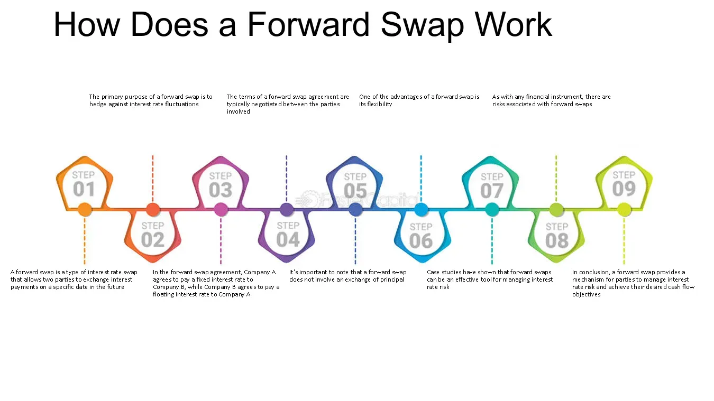

## Table of Contents

## What is a forward swap?

A forward swap is a type of financial agreement where two parties agree to exchange cash flows at a future date. It's like making a deal now, but the actual swapping of money happens later. This is useful for people or companies who want to manage risks or plan their finances better in the future.

For example, imagine a company knows it will need to borrow money in a year. They can use a forward swap to lock in today's interest rates for that future loan. This way, if interest rates go up, the company is protected because they already agreed on a rate. It's a way to plan ahead and avoid surprises.

## How does a forward swap work?

A forward swap works by letting two parties agree on swapping cash flows at a future date. It's like making a bet today about what will happen with money later. One party might agree to pay a fixed interest rate, while the other agrees to pay a floating rate that can change. They decide on this now, but they don't start swapping the money until a specific time in the future.

For example, let's say Company A thinks interest rates will go up in the next year. They can enter into a forward swap with Company B, agreeing to start swapping payments in one year. Company A might agree to pay a fixed rate of 3%, while Company B agrees to pay whatever the floating rate is at that time. If rates do go up, Company A benefits because they locked in a lower rate. If rates go down, Company B benefits. It's a way for both to plan ahead and manage the risk of changing interest rates.

## What are the key components of a forward swap?

A forward swap has several key parts that make it work. First, there's the start date, which is when the parties agree to begin swapping cash flows. This is different from when they make the deal, which can be months or years earlier. Then, there's the end date, which is when the swapping stops. The time between the start and end date is called the term of the swap. Another important part is the notional principal, which is the amount of money the swap is based on, even though this money isn't actually exchanged.

The next key part is the interest rates. In a forward swap, one party usually agrees to pay a fixed interest rate, while the other agrees to pay a floating rate that can change over time. These rates are decided when the deal is made, but the actual payments don't start until the start date. The final part is the payment frequency, which is how often the parties exchange payments, like monthly, quarterly, or yearly. All these parts together help both parties plan for the future and manage the risk of changing interest rates.

## What are the main types of forward swaps?

There are two main types of forward swaps: forward interest rate swaps and forward currency swaps. A forward interest rate swap is when two parties agree to exchange interest payments in the future. One party pays a fixed interest rate, and the other pays a floating rate that can change. This helps them manage the risk of interest rates going up or down. For example, a company might use this to lock in a good rate for a loan they know they'll need in the future.

A forward currency swap is different because it involves exchanging different currencies. Two parties agree to swap a certain amount of one currency for another at a future date. This can help companies that do business in different countries manage the risk of currency values changing. For example, a company might use a forward currency swap to make sure they can pay for something in another country at a rate they agree on now, even if the currency value changes later.

## What are the benefits of using forward swaps?

Using forward swaps can help people and companies plan for the future and avoid surprises. They let you lock in interest rates or exchange rates today for deals that happen later. This means if interest rates or currency values change, you're already protected because you made a deal at today's rates. It's like having a safety net for your future money plans.

Forward swaps are also great for managing risk. If you're worried that interest rates might go up or that the value of a currency might change, a forward swap can help. By agreeing on terms now, you can avoid the stress of not knowing what will happen later. This makes it easier to budget and plan, knowing that some of your future costs are already set.

## How do forward swaps help in managing interest rate risks?

Forward swaps help manage interest rate risks by letting you lock in an interest rate today for a loan or investment you'll make in the future. Imagine you know you'll need to borrow money in a year. If you think interest rates might go up, you can use a forward swap to agree on today's rate for that future loan. This way, even if rates do go up, you're protected because you already locked in a lower rate. It's like making a bet on what interest rates will do, and it gives you peace of mind knowing your future costs won't suddenly get more expensive.

By using forward swaps, companies can better plan their budgets and avoid the stress of not knowing what interest rates will be in the future. If a company is worried that rates might go up and make their loans more expensive, a forward swap can help them set a fixed rate now. This means they can plan their finances better, knowing exactly what their interest payments will be. It's a smart way to manage the risk of changing interest rates and make sure your money plans stay on track.

## What are the differences between forward swaps and other types of swaps?

Forward swaps are different from other types of swaps because they start in the future, not right away. When you make a deal for a forward swap, you agree on the terms now, but you don't start swapping money until a later date. This is different from a regular swap, which starts right after you make the deal. For example, if you want to lock in an interest rate for a loan you'll need in a year, you'd use a forward swap. With a regular swap, you'd start paying right away.

Another difference is that forward swaps can be used for different things, like managing interest rate risks or currency risks. A forward interest rate swap lets you lock in a rate for future interest payments, while a forward currency swap lets you lock in an exchange rate for future currency transactions. Other types of swaps, like plain vanilla swaps or basis swaps, might start right away and focus on different kinds of risks or payments. Forward swaps give you more time to plan and prepare for future financial needs.

## How are forward swaps priced?

Forward swaps are priced based on what people think interest rates or exchange rates will be in the future. When you make a deal for a forward swap, you're betting on where these rates will go. The price of the swap depends on the difference between the fixed rate you agree to pay and the expected future floating rate. If people think rates will go up, the fixed rate you have to pay will be higher. If they think rates will stay the same or go down, the fixed rate will be lower. It's like trying to guess the future and setting a price based on that guess.

To figure out the exact price, people use something called the forward rate, which is an estimate of what future interest or exchange rates will be. They look at things like current interest rates, how much they think rates will change, and how long it will be until the swap starts. All these things help them come up with a fair price for the swap. It's a bit like planning a trip: you look at the cost of gas now, guess how much it might change, and then figure out how much you'll need to spend when you actually go on your trip.

## What are the common strategies for using forward swaps?

One common strategy for using forward swaps is to lock in interest rates for future loans or investments. Imagine a company knows it will need to borrow money in a year. If they think interest rates might go up, they can use a forward swap to agree on today's rate for that future loan. This way, even if rates do go up, the company is protected because they already locked in a lower rate. It's like making a bet on what interest rates will do, and it helps the company plan their budget better, knowing exactly what their interest payments will be.

Another strategy is to manage currency risks for businesses that work in different countries. If a company knows it will need to pay for something in another currency in the future, they can use a forward currency swap to lock in today's exchange rate. This means if the value of the currency changes, the company is already protected because they agreed on a rate now. It's like making sure you can afford to buy something in another country, even if the price changes later. This helps businesses plan their finances better and avoid surprises.

## What are the potential risks associated with forward swaps?

Using forward swaps can be risky because you're making a bet on what interest rates or exchange rates will be in the future. If your guess is wrong, you might end up paying more than you expected. For example, if you think interest rates will go up and you lock in a high fixed rate, but then rates actually go down, you'll be stuck paying more than you need to. It's like betting on a sports game and picking the wrong team.

Another risk is that the other party in the swap might not be able to pay what they owe. This is called counterparty risk. If the company you're swapping with goes bankrupt or can't pay, you could lose money. It's like lending money to a friend and then finding out they can't pay you back. To manage these risks, it's important to carefully think about what might happen in the future and choose a reliable partner for the swap.

## How do regulatory requirements impact forward swap transactions?

Regulatory requirements can make forward swap transactions more complicated. Governments and financial watchdogs have rules to make sure these deals are safe and fair. For example, they might require companies to report their swaps to a central place, so everyone can see what's going on. This helps prevent big problems in the financial world. Also, there might be rules about how much money a company needs to have to do these swaps, to make sure they can pay if things go wrong. All these rules mean companies have to be careful and follow the law when they make forward swap deals.

These rules can also change how much forward swaps cost and who can use them. Sometimes, the rules might make the swaps more expensive because companies have to spend time and money to follow them. This can make it harder for smaller companies to use forward swaps, because they might not have the resources to deal with all the paperwork and costs. But, these regulations are there to protect everyone and make sure the financial system stays stable. So, while they might make things a bit harder, they're important for keeping the economy safe.

## What advanced techniques can be used to optimize forward swap agreements?

One advanced technique to optimize forward swap agreements is to use dynamic hedging. This means you keep an eye on the market and make small changes to your swap deal as things change. If you see that interest rates or exchange rates are moving in a way you didn't expect, you can adjust your swap to make sure you're still protected. It's like steering a boat in the water, making little turns to stay on course even when the waves change.

Another technique is to use a combination of different swaps. Instead of just using one forward swap, you can use several swaps with different start dates and terms. This way, you can cover different scenarios and be ready for whatever happens. It's like having a few different plans for a trip, so no matter what the weather does, you've got a way to get where you're going. By mixing and matching swaps, you can make sure you're as protected as possible from future risks.

## References & Further Reading

[1]: Hull, J. C. (2017). ["Options, Futures, and Other Derivatives"](https://www.semanticscholar.org/paper/Options%2C-Futures%2C-and-Other-Derivatives-Hull/89bdee500c8623864fc9eb7a471546aa713acc44) (9th ed.). Pearson.

[2]: Lopez de Prado, M. (2018). ["Advances in Financial Machine Learning"](https://www.amazon.com/Advances-Financial-Machine-Learning-Marcos/dp/1119482089). Wiley.

[3]: Duffy, T. J. (Ed.). (2016). ["Handbook of Quantitative Finance and Risk Management"](https://link.springer.com/book/10.1007/978-0-387-77117-5). Springer Reference.

[4]: Jarrow, R. A., & Turnbull, S. M. (1996). ["Derivative Securities"](https://archive.org/details/derivativesecuri0000jarr_r8m0). South-Western College Pub.

[5]: Chan, E. P. (2009). ["Quantitative Trading: How to Build Your Own Algorithmic Trading Business"](https://github.com/ftvision/quant_trading_echan_book). Wiley.

[6]: Aronson, D. R. (2007). ["Evidence-Based Technical Analysis: Applying the Scientific Method and Statistical Inference to Trading Signals"](https://www.amazon.com/Evidence-Based-Technical-Analysis-Scientific-Statistical/dp/0470008741). Wiley.

[7]: Black, F., & Scholes, M. (1973). ["The Pricing of Options and Corporate Liabilities."](https://www.cs.princeton.edu/courses/archive/fall09/cos323/papers/black_scholes73.pdf) Journal of Political Economy, 81(3), 637-654.