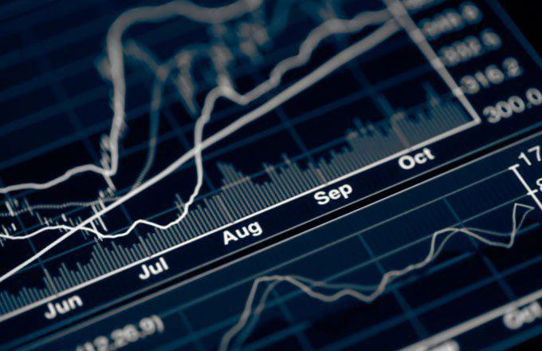

Financial derivatives are financial instruments whose value is derived from the performance of underlying assets, indices, or interest rates. These instruments play a crucial role in modern finance by providing mechanisms for hedging risk, enabling price discovery, and improving market efficiency. They serve as fundamental tools for both financial and non-financial institutions to manage fluctuations in markets, currency exchange rates, and interest rates.

The key types of financial derivatives are forwards, swaps, and options. Forwards are contracts between two parties to buy or sell an asset at a specified future date for a price agreed upon today. Swaps involve the exchange of cash flows or other financial instruments between parties, typically to manage interest rate or currency risk. Options give the buyer the right, but not the obligation, to buy or sell an asset at a predetermined price before a specified expiration date.



Algorithmic trading involves using computer programs to execute trades at high speed and frequency, based on pre-set criteria. It has become increasingly prevalent in financial markets, allowing traders to capitalize on market inefficiencies and implement sophisticated strategies. Algorithms can quickly process vast amounts of data and make decisions in real-time, contributing to increased liquidity and reduced transaction costs.

This article aims to explore the benefits of forward swaps specifically within the context of algorithmic trading. Forward swaps combine the features of forward contracts and swaps, offering a powerful tool for managing financial risk and optimizing cash flow management. By integrating forward swaps with algorithmic trading, market participants can enhance their strategy execution, improve efficiency, and potentially achieve cost savings.

The structure of this article is as follows: we will first discuss financial derivatives and how they function, focusing on forward contracts and swaps. We will then explore the key differences between these two derivative types. Next, we will delve into the benefits of forward swaps in financial strategy, particularly how they aid in hedging risks and optimizing cash flow. Following this, the article will highlight the impact of algorithmic trading on derivatives, and finally, we will explore strategies for implementing forward swaps within algorithmic trading platforms.

## Table of Contents

## Understanding Financial Derivatives

Financial derivatives are complex financial instruments whose value is derived from an underlying asset, index, or rate. These instruments serve as fundamental tools in modern finance, allowing participants to manage risk, achieve leverage, or enhance returns. The primary types of derivatives include forward contracts, futures, options, and swaps, each differing in structure, complexity, and application.

Forward contracts are bespoke agreements between two parties to buy or sell an asset at a predetermined price on a specific future date. They are customized to fit the needs of both parties, which allows for flexibility, but they also [carry](/wiki/carry-trading) counterparty risk since they are not standardized or traded on an exchange. For instance, a farmer might enter into a forward contract to sell a specific quantity of wheat at a set price, hedging against the risk of price fluctuations at harvest time.

Swaps are over-the-counter contracts wherein two parties exchange cash flows or financial instruments, commonly used to manage risks related to interest rates or currencies. The most prevalent types are [interest rate](/wiki/interest-rate-trading-strategies) swaps and currency swaps. An interest rate swap might involve exchanging fixed interest rate payments for floating rate payments, thus allowing a company to optimize its debt portfolio in line with anticipated market movements.

Derivatives like these can be employed strategically for hedging—an act designed to offset potential losses in investments by taking an opposite position in a related asset. For example, an airline company might use forward contracts to lock in fuel prices, protecting against the risk of price increases. Conversely, they can also be used for speculation, in which case an investor aims to profit from price movements of the underlying asset without necessarily having any exposure to the actual asset itself.

The significance of derivatives in risk management cannot be overstated. By allowing parties to shift or allocate risk according to their preferences, derivatives enhance the overall efficiency of financial markets. They provide [liquidity](/wiki/liquidity-risk-premium), facilitate price discovery, and improve market resilience, all of which are crucial underpinnings of a stable financial system. However, due to their inherent complexity and potential for significant leverage, derivatives also necessitate robust management practices and regulatory oversight to mitigate systemic risks.

## Forward Contracts and Swaps: Key Differences

Financial derivatives are financial instruments whose value is derived from an underlying asset, index, or interest rate. Among the most common types of derivatives are forward contracts and swaps. Each has distinct characteristics and serves unique roles in financial markets.

### Forward Contracts

A forward contract is a customized contractual agreement between two parties to buy or sell an asset at a specified price on a future date. These contracts are traded over-the-counter (OTC) rather than on organized exchanges. The main benefit of forward contracts is their flexibility; terms can be tailored to meet the specific needs of the contracting parties.

**Usage in Markets:** Forward contracts are primarily used for hedging and speculation. For businesses and investors, they provide a tool to mitigate risk associated with price fluctuations of commodities, currencies, or other financial assets. For instance, an importer expecting to pay for goods in a foreign currency may use a forward contract to lock in a favorable exchange rate, thus protecting against adverse currency movement.

### Swaps

Swaps are derivatives in which two parties exchange cash flows or other financial instruments for a set period. The most common types are interest rate swaps and currency swaps.

- **Interest Rate Swaps**: These involve the exchange of cash flows based on different interest rate indices, typically exchanging fixed-rate payments for floating-rate payments. Companies often use these to manage exposure to fluctuations in interest rates.

- **Currency Swaps**: These involve exchanging principal and interest payments in one currency for those in another currency. They are widely used to hedge against foreign exchange risk.

### Key Differences Between Forward Contracts and Swaps

**Customization vs. Standardization:** While both instruments can be tailored, forward contracts offer more customization, allowing parties to dictate specific terms, including the quantity and exact delivery date. Swaps, though also customizable, often have standardized terms based on prevailing market conventions.

**Cash Flows:** Forward contracts generally involve a single exchange of the underlying asset on the delivery date, whereas swaps often involve multiple exchanges of cash flows over the contract duration.

**Market Usage:** Forward contracts are typically used for hedging single transactions or positions. In contrast, swaps, with their recurring cash flows, are more suitable for managing ongoing financial obligations, such as interest expenses or cross-currency operations.

**Counterparty Risks:** Forward contracts are susceptible to credit risk, as they are privately negotiated and rely on the counterparty's ability to honor the contract. Swaps, while also having counterparty risk, can involve more sophisticated credit arrangements, such as periodic netting, to mitigate this concern.

### Scenarios for Preference

A forward contract might be preferred when a business seeks to hedge a specific future transaction. For example, a wheat producer expecting to harvest in six months may use a forward contract to lock in a selling price today, thereby avoiding the risk of price declines at harvest.

In contrast, a swap would be more advantageous for managing long-term financial exposures. A company with floating-rate debt might enter into an interest rate swap to exchange its variable interest payments for fixed payments, thereby stabilizing its interest expenses regardless of fluctuations in interest rates.

In summary, forward contracts and swaps are essential derivatives with distinct characteristics that cater to different financial strategies and risk management practices. Understanding their differences and applications enables market participants to choose the right instrument based on their specific needs and market conditions.

## Benefits of Forward Swaps in Financial Strategy

Forward swaps serve as vital financial instruments, providing numerous benefits in hedging against currency and interest rate risks. These agreements involve the exchange of sequences of future interest payments or currency transactions at predetermined rates and dates, allowing businesses to stabilize their financial outlook.

One of the prominent advantages of using forward swaps is their ability to protect against fluctuations in currency exchange rates and interest rates. Companies engaged in international trade often face risks due to volatile currency movements. By entering into forward swaps, these firms can lock in exchange rates, thus securing their cash flows from adverse currency shifts. Similarly, businesses with floating rate liabilities can use interest rate swaps to convert these exposures into fixed-rate obligations, thereby mitigating the impact of rising interest rates.

Forward swaps also play a crucial role in optimizing cash flow management. Organizations often grapple with mismatches in the timing and amount of cash flows. By strategically utilizing forward swaps, businesses can align their cash inflows and outflows more effectively. For instance, an exporter anticipating foreign currency receivables can synchronize their cash flow commitments by locking in the current exchange rate through a forward swap. This alignment reduces the risk of cash flow shortfalls and supports smoother financial operations.

Moreover, forward swaps contribute to financial stability by providing predictability in future financial commitments. By removing the uncertainty of fluctuating rates, companies can make informed financial decisions and avoid unexpected spikes in their costs. This stability is particularly beneficial during periods of market turbulence when price [volatility](/wiki/volatility-trading-strategies) can severely impact financial performance.

The potential cost savings and efficiency gains from utilizing forward swaps are considerable. By securing fixed rates for future transactions, companies can often negotiate more favorable terms with their counterparties. Furthermore, efficient cash flow management through forward swaps can lead to reduced financing costs as businesses are better positioned to meet their obligations without resorting to expensive short-term borrowing.

In summary, forward swaps are instrumental in providing a robust financial strategy for managing currency and interest rate risks. Their implementation can optimize cash flows, stabilize financial outcomes, and achieve significant cost efficiencies, helping businesses maintain a competitive edge in the constantly evolving financial landscape.

## Algorithmic Trading and Its Impact on Derivatives

Algorithmic trading, commonly referred to as algo trading, involves the use of computer programs and algorithms to automate and execute financial transactions at high speeds and volumes. This method of trading has transformed financial markets by allowing traders to make decisions based on complex mathematical models and vast datasets, minimizing human error and emotional biases. The prevalence of algo trading has grown substantially, accounting for a significant portion of trades executed on major stock exchanges worldwide. According to a report by the Bank for International Settlements, [algorithmic trading](/wiki/algorithmic-trading) accounted for over 60% of equity market trades in developed markets by 2020.

One of the primary advantages of algorithmic trading is its ability to enhance the efficiency of trading derivatives such as forward swaps. Forward swaps are financial contracts that involve the exchange of cash flows between two parties at a specified future date, allowing for customized hedging against interest rate or currency fluctuations. By using algorithms, traders can quickly assess market conditions and execute forward swaps at optimal prices, reducing transaction costs and improving market liquidity.

Algorithms can optimize forward swap strategies by analyzing vast amounts of historical and real-time data. This includes evaluating interest rate movements, currency exchange rate trends, and macroeconomic indicators to predict future market conditions. For instance, [machine learning](/wiki/machine-learning) models can be used to identify patterns in data that humans might overlook, providing traders with insights that inform more strategic decision-making. Python, a popular programming language in financial data analysis, offers various libraries such as NumPy and pandas to handle data manipulation and prediction tasks. A basic Python implementation to predict future swap rates could resemble:

```python
import numpy as np
import pandas as pd
from sklearn.linear_model import LinearRegression

# Sample interest rate data for training
data = pd.DataFrame({'Years': [1, 2, 3, 4, 5], 'Rates': [0.5, 0.7, 0.9, 1.2, 1.5]})

# Model training
model = LinearRegression().fit(data[['Years']], data['Rates'])

# Predicting rates for upcoming years
future_years = np.array([6, 7, 8]).reshape(-1, 1)
predicted_rates = model.predict(future_years)

print(predicted_rates)
```

Real-world case studies illustrate the successful integration of algo trading and derivatives. One notable example is the use of algorithmic strategies by large financial institutions such as Goldman Sachs and JPMorgan Chase. These institutions have developed sophisticated trading algorithms to optimize their derivatives trading. For example, during the 2008 financial crisis, the ability to quickly and accurately price and trade complex derivatives provided these firms with a competitive advantage in managing risk and maintaining liquidity.

In conclusion, the integration of algorithmic trading in derivatives markets has significantly improved trading efficiency, enabling market participants to execute complex strategies with precision and speed. As technology continues to evolve, the use of advanced algorithms and machine learning models will likely shape the future landscape of derivatives trading, offering even more refined tools for risk management and strategy optimization.

## Strategies for Implementing Forward Swaps with Algo Trading

Integrating forward swaps within algorithmic trading platforms involves a systematic approach that leverages advanced data analysis, predictive algorithms, and risk management techniques to effectively manage financial strategies. The primary goal is to enhance the decision-making process while minimizing exposure to potential market fluctuations.

### Importance of Data Analysis and Predictive Algorithms

At the core of implementing forward swaps with algorithmic trading is the utilization of data analysis and predictive algorithms. These tools allow traders to assess market conditions accurately and forecast future trends. The process involves collecting large datasets comprising historical prices, economic indicators, interest rates, and other relevant financial metrics. Machine learning models can be employed to uncover patterns in these datasets and predict market movements.

For example, a time series analysis could be performed using Python libraries such as `pandas` and `statsmodels` to model interest rate movements:

```python
import pandas as pd
from statsmodels.tsa.arima_model import ARIMA

# Load historical interest rate data
data = pd.read_csv('interest_rates.csv')
model = ARIMA(data['rate'], order=(5,1,0))
model_fit = model.fit(disp=0)

# Forecasting future interest rates
forecast = model_fit.forecast(steps=10)[0]
print(forecast)
```

By applying such models, traders can anticipate fluctuations and adjust their forward swap strategies accordingly, creating a more dynamic and responsive trading environment.

### Risk Management Techniques

When utilizing algorithmic trading for forward swaps, robust risk management techniques are essential. These strategies aim to mitigate potential losses that could arise from market volatility or unfavorable movements in interest rates or currency values.

One of the key risk management techniques is the implementation of stop-loss orders, which automatically execute a trade when the market reaches a certain price level, limiting potential losses. Portfolio diversification is another vital method, spreading investments across various asset classes to reduce risk concentration.

The Value-at-Risk (VaR) metric can be employed to quantify potential losses in a statistical manner. For instance, a Monte Carlo simulation can be performed using Python to estimate the VaR for a portfolio containing forward swaps:

```python
import numpy as np

# Simulate 10,000 potential market scenarios
simulated_returns = np.random.normal(0, 1, (10000, len(portfolio)))

# Calculate potential portfolio values
portfolio_values = np.dot(simulated_returns, portfolio_weights)

# Estimate VaR at 95% confidence level
VaR = np.percentile(portfolio_values, 5)
print(f"Value-at-Risk (VaR): {VaR}")
```

### Customizing Algorithmic Models

Customizing algorithmic models to fit specific derivative strategies is critical in exploiting the full potential of forward swaps. This customization involves tailoring algorithms to respond uniquely to the characteristics of the chosen instruments. Factors such as interest rate sensitivity, currency exposure, and counterparty risk must be meticulously considered.

Machine learning frameworks like TensorFlow or PyTorch can be used to develop neural networks that learn from historical swap transaction data, optimizing strategies based on real-world performance metrics. Additionally, regulatory factors and transaction costs should be integrated into these models to ensure compliance and cost-effectiveness.

By meticulously customizing these models, traders can create sophisticated tools that offer a competitive edge, ensuring both compliance and enhanced financial performance.

## Conclusion

In this article, we explored the integration of forward swaps and algorithmic trading. Forward swaps provide a robust mechanism for mitigating risks associated with currency and interest rate fluctuations, offering financial stability and potential cost savings. Similarly, algorithmic trading optimizes transaction efficiency, enhances precision, and leverages data-driven strategies in the financial markets. Together, these tools form a dynamic synergy that underpins effective risk management and improved cash flow strategies for businesses.

The convergence of algorithmic trading with forward swaps is poised to evolve further, as technological advancements drive the financial industry toward greater automation and seamless transaction processes. Looking ahead, emerging trends, such as the incorporation of machine learning and [artificial intelligence](/wiki/ai-artificial-intelligence) in algorithmic trading, promise to refine predictive capabilities and enhance strategy customization. As data analytics and computational power continue to advance, the potential for more sophisticated and adaptive trading strategies grows, offering new opportunities for efficiency gains and strategic leverage.

For finance professionals and businesses, staying informed about innovations in derivatives and their integration with cutting-edge technologies is crucial. By exploring these developments, stakeholders can position themselves advantageously in the ever-evolving financial landscape. Embracing these tools not only enhances operational efficiency but also provides a competitive edge, ensuring preparedness for the future trajectories of global financial markets.

## References & Further Reading

[1]: Hull, J. C. (2017). ["Options, Futures, and Other Derivatives"](https://www.semanticscholar.org/paper/Options%2C-Futures%2C-and-Other-Derivatives-Hull/89bdee500c8623864fc9eb7a471546aa713acc44) (9th ed.). Pearson.

[2]: Lopez de Prado, M. (2018). ["Advances in Financial Machine Learning"](https://www.amazon.com/Advances-Financial-Machine-Learning-Marcos/dp/1119482089). Wiley.

[3]: Duffy, T. J. (Ed.). (2016). ["Handbook of Quantitative Finance and Risk Management"](https://link.springer.com/book/10.1007/978-0-387-77117-5). Springer Reference.

[4]: Jarrow, R. A., & Turnbull, S. M. (1996). ["Derivative Securities"](https://archive.org/details/derivativesecuri0000jarr_r8m0). South-Western College Pub.

[5]: Chan, E. P. (2009). ["Quantitative Trading: How to Build Your Own Algorithmic Trading Business"](https://github.com/ftvision/quant_trading_echan_book). Wiley.

[6]: Aronson, D. R. (2007). ["Evidence-Based Technical Analysis: Applying the Scientific Method and Statistical Inference to Trading Signals"](https://www.amazon.com/Evidence-Based-Technical-Analysis-Scientific-Statistical/dp/0470008741). Wiley.

[7]: Black, F., & Scholes, M. (1973). ["The Pricing of Options and Corporate Liabilities."](https://www.cs.princeton.edu/courses/archive/fall09/cos323/papers/black_scholes73.pdf) Journal of Political Economy, 81(3), 637-654.