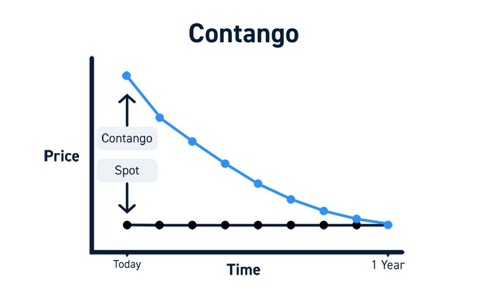

## Table of Contents

## What is forwardation in commodity markets?

Forwardation, also known as contango, is a situation in commodity markets where the future price of a commodity is higher than its current spot price. This means that if you want to buy the commodity for delivery in the future, you will have to pay more than if you bought it right now. This often happens because of costs like storage and insurance that need to be paid until the commodity is delivered.

People who trade commodities pay attention to forwardation because it can affect their decisions. If the market is in forwardation, it might be a good time to store the commodity and sell it later at a higher price. However, it also means that the market expects the commodity to be more valuable in the future, which could be due to expected shortages or increased demand.

## How does forwardation differ from contango?

Forwardation and contango are actually the same thing. They both describe a situation in the commodity markets where the price of a commodity for future delivery is higher than the price you would pay for it right now. This means if you want to buy the commodity to be delivered later, you'll pay more than if you bought it today.

People sometimes use the word "forwardation" to talk about this situation, but "contango" is more common. Both terms show that the market expects the commodity to be worth more in the future, maybe because it will be harder to get or more people will want it. This can affect how traders and investors make their decisions, like choosing to store the commodity now and sell it later at a higher price.

## What causes forwardation in commodity markets?

Forwardation in commodity markets happens when the price of a commodity for future delivery is higher than its current price. This can be caused by several things. One main reason is the costs of holding onto the commodity until it's delivered, like storage and insurance. If it costs a lot to keep the commodity safe and stored, sellers will want to charge more for future delivery to cover these costs.

Another reason for forwardation is when people expect the commodity to be harder to get or more wanted in the future. If everyone thinks there will be less of the commodity available later, or if they think more people will want it, they'll be willing to pay more to get it delivered in the future. This expectation of higher future value pushes the future price up above the current price.

## Can you explain the basic mechanics of a forward contract?

A forward contract is an agreement between two people to buy or sell something at a set price on a specific future date. One person agrees to buy the item, and the other agrees to sell it. They decide on the price and the date ahead of time, so both know what to expect. This can be useful if you want to make sure you can buy or sell something at a certain price, even if the market changes later.

For example, a farmer might use a forward contract to sell their crops. They agree with a buyer to sell a certain amount of their crop at a set price, say, six months from now. This helps the farmer know how much money they will get, and it helps the buyer know they will get the crops they need at a price they can afford. If the market price goes up or down, it doesn't matter because they already agreed on the price.

## How does forwardation affect commodity pricing?

Forwardation affects commodity pricing by making the future price of a commodity higher than its current price. This happens because of costs like storage and insurance that people have to pay to keep the commodity until it's delivered. When these costs are high, sellers will charge more for future delivery to cover them. So, if you want to buy the commodity to be delivered later, you'll have to pay more than if you bought it right now.

Forwardation also shows that people expect the commodity to be more valuable in the future. This could be because they think there will be less of the commodity available later, or because they think more people will want it. When everyone expects the commodity to be worth more later, they're willing to pay more for it to be delivered in the future. This expectation pushes the future price up above the current price, affecting how traders and investors make their decisions.

## What are the implications of forwardation for commodity producers?

Forwardation means that commodity producers can see a chance to make more money. If the price for their commodity is higher in the future than it is now, they might decide to store what they produce and sell it later. This way, they can get a better price and make more money. But, they need to think about the costs of keeping their commodity safe and stored until they sell it. If these costs are too high, it might not be worth waiting to sell.

Producers also need to think about what forwardation means for the future. If prices are higher later, it might mean that people expect there will be less of the commodity available, or that more people will want it. This can help producers plan how much to produce and when to sell. But, if the market changes and forwardation goes away, the prices might not be as high as expected, which could affect their plans.

## How can investors take advantage of forwardation?

Investors can take advantage of forwardation by buying commodities now and storing them to sell later at a higher price. If the market is in forwardation, it means the price of the commodity will be higher in the future. So, if investors can cover the costs of storage and insurance, they can make a profit by buying the commodity at today's lower price and selling it when the price goes up. This strategy works well if the expected increase in price is more than the costs of holding onto the commodity.

Another way investors can benefit from forwardation is by using futures contracts. They can buy futures contracts for commodities that are in forwardation, which means they agree to buy the commodity at a set price in the future. If the market stays in forwardation, the value of these contracts will go up over time. Investors can then sell these contracts for a profit before the commodity is delivered, without ever having to store the commodity themselves. This can be a smart way to make money if they think forwardation will continue.

## What are the risks associated with trading in a forwardation market?

Trading in a forwardation market can be risky because the future price might not stay higher than the current price. If something changes and the market goes from forwardation to backwardation, where future prices are lower than current prices, investors could lose money. They might have bought the commodity or a futures contract expecting to sell it later at a higher price, but if the price goes down, they'll have to sell it for less than they paid.

Another risk is the cost of holding onto the commodity. If investors buy the commodity to store and sell later, they have to pay for storage and insurance. If these costs are too high, it might not be worth waiting to sell, even if the price goes up. Also, if the commodity gets damaged or lost while it's being stored, investors could lose money that way too. So, they need to think carefully about these costs and risks before deciding to trade in a forwardation market.

## How does forwardation impact the storage and inventory decisions of commodity traders?

Forwardation can make commodity traders decide to store more of the commodity. If the price is going to be higher in the future, traders might buy the commodity now and keep it until later when they can sell it for more money. This can help them make a bigger profit. But, they have to think about the costs of keeping the commodity safe and stored, like paying for storage space and insurance. If these costs are too high, it might not be worth storing the commodity, even if the price goes up later.

Traders also need to think about what forwardation means for the future. If prices are expected to be higher, it might mean there will be less of the commodity available or more people will want it. This can help traders decide how much to store and when to sell. But, if the market changes and forwardation goes away, the prices might not go up as much as expected. This could make it hard for traders who stored a lot of the commodity, because they might not make as much money as they hoped.

## Can you provide historical examples where forwardation significantly influenced commodity markets?

In the early 2000s, the oil market showed a clear example of forwardation. At that time, oil prices were going up because people thought there would be less oil available in the future. This made the price for future delivery of oil much higher than the price you could buy it for right now. Many traders and investors bought oil and stored it, hoping to sell it later at a higher price. But, they had to pay a lot for storage and insurance, and if the market changed, they could lose money. This situation showed how forwardation can affect what traders do and how they make money.

Another time forwardation influenced commodity markets was during the global financial crisis in 2008. Many commodities, like metals and grains, went into forwardation because people were worried about the economy. They thought that prices would go up in the future, so they were willing to pay more to get these commodities delivered later. This made traders think about storing these commodities to sell them when prices went up. But, the crisis made everything uncertain, and if the market changed quickly, traders could lose money. This showed how forwardation can make traders take risks, hoping to make more money later.

## How do macroeconomic factors influence the occurrence of forwardation?

Macroeconomic factors can make forwardation happen in commodity markets. Things like inflation, interest rates, and how strong the economy is can change what people think about the future. If people think prices will go up because of inflation, they might be willing to pay more for commodities to be delivered later. Also, if interest rates are high, it can cost more to borrow money to buy and store commodities, which can affect forwardation. When the economy is doing well, people might expect more demand for commodities, making future prices higher than current prices.

Another way macroeconomic factors can influence forwardation is through supply and demand. If there's a big event like a war or a natural disaster, it can make people think there will be less of a commodity available in the future. This can push future prices up, causing forwardation. Also, if a country's currency gets weaker, it can make commodities more expensive for people in that country, which can affect how much they're willing to pay for future delivery. All these big economic changes can make the market go into forwardation, where future prices are higher than current prices.

## What advanced strategies can traders use to hedge against forwardation in commodity markets?

Traders can use futures contracts to hedge against forwardation. They can sell futures contracts for the commodity they have, agreeing to sell it at a set price in the future. This way, if the market stays in forwardation and prices go up, they can still sell their commodity for the price they agreed on, even if it's lower than the market price. This helps them make sure they don't lose money if prices change a lot. But, they need to think about the costs of trading futures and make sure the price they agree on is good enough to cover these costs.

Another strategy is to use options contracts. Traders can buy put options, which give them the right to sell their commodity at a set price in the future. If the market goes into forwardation and prices go up, they can choose to sell their commodity at the higher market price instead of using the option. But, if prices go down, they can use the put option to sell at the agreed price, which helps them not lose as much money. This gives them more choices and can protect them from big price changes, but they need to pay for the options, so they have to make sure it's worth the cost.

## References & Further Reading

[1]: [Hull, J. C. (2018). "Options, Futures, and Other Derivatives."](https://www.semanticscholar.org/paper/Options%2C-Futures%2C-and-Other-Derivatives-Hull/89bdee500c8623864fc9eb7a471546aa713acc44) Pearson.

[2]: Geman, H. (2005). ["Commodities and Commodity Derivatives: Modeling and Pricing for Agriculturals, Metals, and Energy."](https://download.e-bookshelf.de/download/0000/5675/90/L-G-0000567590-0015270354.pdf) Wiley.

[3]: ["Automated Trading with R: Quantitative Research and Platform Development"](https://link.springer.com/book/10.1007/978-1-4842-2178-5) by Chris Conlan

[4]: ["Algorithmic and High-Frequency Trading"](https://www.amazon.com/Algorithmic-High-Frequency-Trading-Mathematics-Finance/dp/1107091144) by Alvaro Cartea, Sebastian Jaimungal, and José Penalva

[5]: Domowitz, I., & El-Gamal, M. A. (1996). ["A Systems Approach to Equilibrium in the Algorithmic Trading of Public Securities."](https://papers.ssrn.com/sol3/papers.cfm?abstract_id=179950) Computational Economics, 9(4), 295-319.