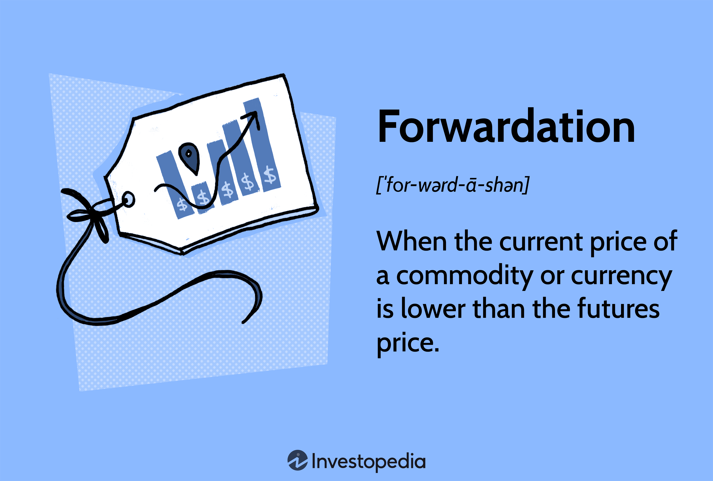

The commodity market is an essential component of global trade, providing investors with avenues to diversify their portfolios and mitigate risks associated with market volatility. Within this dynamic market, forwardation and algorithmic trading have emerged as foundational elements in contemporary trading strategies. Forwardation, often referred to as contango, is a situation where the futures price of a commodity is higher than its current spot price. This occurs due to the costs associated with holding onto commodities over time, such as storage and insurance, resulting in an upward-sloping forward curve that significantly impacts futures contract pricing.

Algorithmic trading, commonly known as algo trading, has gained traction in commodity markets owing to its ability to enhance trading speed and precision. By using computer algorithms to execute trades based on pre-established criteria, algo trading minimizes the impact of human emotions like fear and greed on trading decisions. This automation not only facilitates cost efficiency by reducing transaction expenses but also improves market liquidity. The integration of these strategies is crucial for traders aspiring to leverage advanced methodologies in the management of commodity investments.

This article aims to explore the complexities of forwardation pricing within the context of commodity markets and the pivotal role of algorithmic trading in boosting market efficiency. By examining the fundamentals of forwardation and its influence on market pricing, alongside the benefits and challenges posed by algo trading, traders can gain valuable insights. This knowledge is imperative for those seeking to optimize their trading strategies and effectively hedge against the inherent volatility of commodity markets. Understanding these key concepts can provide traders and investors a competitive advantage, enabling them to navigate and capitalize on the evolving landscape of global commodity trading.

## Table of Contents

## Understanding Forwardation in Commodity Markets

Forwardation, commonly referred to as contango, is a critical concept in commodity markets where futures prices exceed the current spot prices. This market condition fundamentally arises due to the costs associated with holding or carrying a commodity over time. Such costs typically include storage, insurance, and financing costs, which collectively contribute to the disparity between spot and futures prices.

In a market exhibiting forwardation, the forward curve demonstrates an upward slope, reflecting the premium investors are willing to pay to secure a commodity at a future date rather than purchasing it at the current spot price. For example, if the spot price of oil is $70 per barrel, a futures contract for delivery in six months might be priced at $75 per barrel, incorporating expected carrying costs.

The degree of forwardation is significantly influenced by several key factors. Supply-demand dynamics play a crucial role; if demand is anticipated to increase or if supply chains are disrupted, futures prices may rise relative to spot prices. Geopolitical events, such as conflicts or trade disputes, can also trigger fluctuations in these prices by affecting commodity availability. In addition, economic indicators—such as interest rates, inflation expectations, and macroeconomic forecasts—can impact carrying costs and thus influence the structure of the forward curve.

Traders strategically engage with forwardation through futures contracts to manage price [volatility](/wiki/volatility-trading-strategies) and hedge against potential adverse price movements. By locking in a price now for future delivery, businesses can stabilize their cost structures and mitigate the financial risks posed by volatile commodity prices. This hedging capability is particularly valuable for companies heavily reliant on commodities as input goods in their production processes.

Understanding forwardation is crucial for traders and investors aiming to navigate the complexities of the commodity markets effectively. By grasping the underlying factors that drive this market scenario and leveraging futures contracts appropriately, market participants can better anticipate price movements and optimize their trading strategies.

## Role of Algo Trading in Commodity Markets

Algorithmic trading, commonly referred to as algo trading, constitutes a cornerstone of modern financial markets, including commodities. This trading methodology uses pre-programmed algorithms to execute trades at speeds and frequencies that would be impossible for a human trader. Typically, the algorithms are designed to monitor market conditions, analyze large volumes of market data, and execute trade orders based on defined criteria without manual intervention.

One of the primary advantages of [algorithmic trading](/wiki/algorithmic-trading) is the substantial increase in speed and accuracy it offers. Computers can process complex calculations and analyze market data faster than human traders, allowing for quicker execution of trades. This speed advantage enables traders to capitalize on minuscule price differences that exist only for fractions of a second.

Moreover, algo trading significantly reduces the influence of human emotions such as fear, greed, and bias, which can lead to irrational trading decisions. The decision-making process in algo trading is data-driven and systematic, which enhances the consistency of trading outcomes. By removing the emotional component, traders can adhere more strictly to trading strategies and risk management rules.

Another key benefit of algo trading is cost efficiency. Automation reduces the need for continuous human oversight, thereby decreasing labor costs. Additionally, algorithms can execute trades at the most favorable prices, utilize optimal timing, and manage orders to cut down on transaction costs. By increasing the execution speed and precision, market [liquidity](/wiki/liquidity-risk-premium) is often enhanced, which further contributes to cost reductions.

Scalability is yet another strength of algorithmic trading. It allows traders to manage and implement multiple strategies simultaneously. This is particularly beneficial in the global commodity markets, which operate across different time zones and require constant monitoring. Algo trading systems can run complex analyses and portfolios 24/7, adapting swiftly to new information or market changes, which is critical for maintaining competitive edge in fast-paced trading environments.

In sum, algorithmic trading serves as a powerful tool in commodity markets, harnessing technology to facilitate highly efficient, emotionless, and cost-effective trading. Its widespread adoption reflects its ability to offer substantial operational benefits and opportunities for profit in an increasingly competitive financial landscape.

## Benefits of Algo Trading in Commodity Markets

Algorithmic trading, commonly known as algo trading, continues to redefine the commodity markets by offering substantial improvements in speed, precision, and efficiency. These advancements are crucial in a domain characterized by volatility and rapid market shifts.

One of the most significant benefits of algo trading lies in its accelerated pace and accuracy. Algorithms have the capability to swiftly analyze vast amounts of market data and execute trades within microseconds. This speed transcends the limitations of manual trading, allowing for real-time responsiveness to market fluctuations. For example, by deploying Python libraries such as `pandas` for data manipulation and `numpy` for numerical analysis, algorithms can process and react to data far quicker than human traders.

Emotionless trading represents another pivotal advantage. Human emotions like fear and greed can often cloud judgment, leading to suboptimal trading decisions. Algorithms operate on predefined logic and data-driven insights, ensuring decisions remain unbiased and consistent, regardless of market sentiment. This reliability is crucial for maintaining discipline in trading strategies.

Cost efficiency is markedly enhanced through automation in algorithmic trading. By minimizing the need for manual oversight and intervention, enterprises can reduce operational costs. Automating trading processes diminishes human error and contributes to overall financial savings, promoting effective resource allocation.

Moreover, algo trading unlocks 24/7 trading opportunities, optimizing engagement across different time zones without interruption. Traders can capitalize on global market movements across various commodity exchanges, conducting trades round the clock. This continuous operation is especially beneficial given the asynchronous nature of global commodity markets.

Lastly, back-testing capabilities empower traders to rigorously evaluate and refine strategies before applying them to live markets. By harnessing historical data, algorithms can simulate past trading scenarios to assess strategy viability, highlight potential pitfalls, and determine optimal parameters. Python tools such as `Backtrader` allow for these back-testing processes, enabling fine-tuning and risk assessment with increased precision before live deployment.

In summary, the integration of algo trading into commodity markets enhances trading performance through increased speed and accuracy, emotion-free decision-making, cost savings, perpetual market access, and robust strategy development via back-testing. These attributes collectively propel traders towards more strategic and resilient market engagement.

## Challenges and Risks of Algo Trading

Algorithmic trading, while providing numerous advantages, is not devoid of challenges and risks that traders must manage diligently. One of the primary concerns is market risk. This arises from unexpected market changes that can impact the performance of algorithms. For instance, unforeseen geopolitical events or economic shifts can cause price instability, potentially leading to losses if the algorithm does not adapt rapidly to volatile conditions.

Technology risk poses another significant threat to algorithmic trading. The reliance on automated systems means that system failures, software bugs, or cyber-attacks can disrupt trading operations. Ensuring robust cybersecurity measures and disaster recovery plans is essential to mitigate these risks. For example, implementing redundant systems and regular software updates can help safeguard against potential threats.

Regulatory risk is a concern due to the ever-evolving legal framework governing financial markets. Changes in regulations can affect algorithmic trading practices, requiring traders to stay informed and compliant with all legal requirements. For instance, the implementation of stricter reporting standards or changes in market access rules can necessitate adjustments to existing algorithms.

Model risk refers to the potential errors in algorithm models, which can result in substantial trading losses. Algorithms are based on mathematical models and assumptions that might not always hold true under certain market conditions. Continuous model validation and stress testing can aid in identifying and rectifying errors before they lead to significant financial repercussions.

Liquidity risk emerges in volatile markets where liquidity can suddenly disappear, complicating the execution of trades. This can lead to unfavorable pricing or the inability to execute trades altogether. Algorithms should be designed to consider liquidity constraints, incorporating mechanisms to adjust trading strategies in response to changing liquidity conditions.

In summary, while algorithmic trading presents numerous opportunities for enhanced market engagement, traders must vigilantly address these inherent challenges and risks. Developing comprehensive risk management strategies and maintaining flexibility in algorithm designs will help in navigating the complexities associated with automated trading systems.

## Integrating Forwardation and Algo Trading

Combining forwardation insights with algorithmic trading strategies provides traders with potent tools for optimizing commodity investments. Forwardation, also known as contango, reflects a situation where futures prices exceed the current spot prices of a commodity, primarily due to the costs associated with storing and insuring the commodity over time. This phenomenon is characterized by an upward sloping forward curve, which can be leveraged to inform trading strategies.

Traders can develop sophisticated models that incorporate forward curves to enhance trading strategies. These models analyze the relationships between futures prices and spot prices, taking into account various factors such as storage costs, interest rates, and expected future price changes. By understanding and predicting forwardation trends, traders can better position themselves in the futures market, identifying optimal entry and [exit](/wiki/exit-strategy) points.

Algorithmic trading systems are integral to managing positions based on forwardation trends, offering the ability to process vast amounts of market data swiftly and execute trades with high precision. Algorithms can identify deviations from expected forwardation patterns, signaling potential trading opportunities. For instance, if a significant number of futures contracts are priced higher than anticipated given current and historical trends, an algorithm may trigger a short position to capitalize on an expected price correction.

The synergy between forwardation insights and algorithmic trading enables traders to swiftly and efficiently adapt to market changes. Forward curves offer predictive value, while algorithmic systems provide the executional capacity to act on those predictions in real-time. This combination reduces the latency between analysis and execution, increasing the probability of capturing favorable market movements.

Successful integration of forwardation and algo trading strategies hinges on robust risk management and continuous strategy development. Risk management strategies must account for the inherent uncertainties in forwardation predictions and the limitations of algorithmic models. This includes setting appropriate stop-loss levels, diversifying positions, and regularly updating models to reflect the latest market conditions and data.

Continuous strategy development is essential as market environments and technologies evolve. Back-testing strategies using historical data can help refine algorithms and forwardation models, ensuring they remain effective. Moreover, incorporating [machine learning](/wiki/machine-learning) techniques can enhance the adaptability and accuracy of both forwardation predictions and trading algorithms, allowing for automated adjustments to strategies as market conditions change.

Incorporating forwardation insights with algorithmic trading thus offers a comprehensive approach to managing commodity investments, ensuring traders can navigate fluctuating markets with greater confidence and efficiency.

## Conclusion

Forwardation and algorithmic trading offer distinct and significant advantages in the domain of commodity trading. Forwardation, commonly referred to as contango, provides traders with a mechanism to anticipate future price movements by analyzing the price difference between futures and spot markets. This allows for effective risk management and the potential to capitalize on price [carry](/wiki/carry-trading) costs, such as storage and insurance, inherent in commodity markets.

Algorithmic trading enhances these opportunities by automating trade execution with increased speed and accuracy, removing the influence of human emotion in decision-making, and providing opportunities for 24/7 trading across global markets. When both forwardation strategies and algorithmic trading are combined, they equip traders with a powerful competitive edge, fostering optimized trading strategies that can adeptly handle market volatilities.

Looking ahead, the continued evolution of technology suggests that these strategies will become increasingly central to commodity trading. Innovations in data analytics, machine learning, and trading platforms are likely to drive further adoption, enabling traders to refine their strategies and manage risk more effectively.

For traders and investors aiming to maximize gains in commodity markets, staying informed about market trends and technological advancements is crucial. By embracing both forwardation and algorithmic trading, traders can enhance their performance, effectively navigate complexities, and bolster their ability to make informed decisions amid the dynamic nature of global commodity markets.

## References & Further Reading

[1]: [Hull, J. C. (2018). "Options, Futures, and Other Derivatives."](https://www.semanticscholar.org/paper/Options%2C-Futures%2C-and-Other-Derivatives-Hull/89bdee500c8623864fc9eb7a471546aa713acc44) Pearson.

[2]: Geman, H. (2005). ["Commodities and Commodity Derivatives: Modeling and Pricing for Agriculturals, Metals, and Energy."](https://download.e-bookshelf.de/download/0000/5675/90/L-G-0000567590-0015270354.pdf) Wiley.

[3]: ["Automated Trading with R: Quantitative Research and Platform Development"](https://link.springer.com/book/10.1007/978-1-4842-2178-5) by Chris Conlan

[4]: ["Algorithmic and High-Frequency Trading"](https://www.amazon.com/Algorithmic-High-Frequency-Trading-Mathematics-Finance/dp/1107091144) by Alvaro Cartea, Sebastian Jaimungal, and José Penalva

[5]: Domowitz, I., & El-Gamal, M. A. (1996). ["A Systems Approach to Equilibrium in the Algorithmic Trading of Public Securities."](https://papers.ssrn.com/sol3/papers.cfm?abstract_id=179950) Computational Economics, 9(4), 295-319.