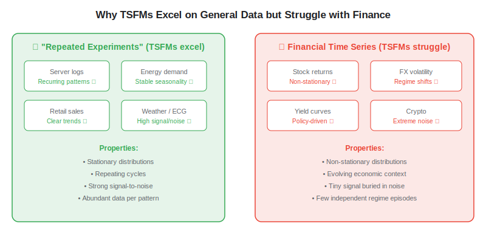
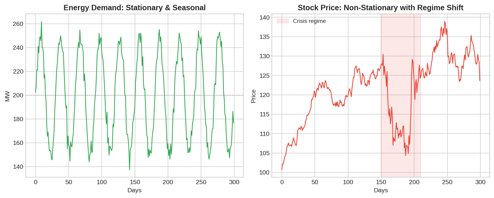

The promise of [time series foundation models](https://paperswithbacktest.com/wiki/time-series-foundation-models) (TSFMs) is compelling: pre-train once on billions of data points, then forecast anything zero-shot. And for many domains — energy demand, web traffic, retail sales — it works remarkably well. But when algo traders apply the same models to stock returns, FX volatility, or yield curves, performance disappoints. Off-the-shelf TSFMs routinely underperform specialist models trained from scratch on financial data. This is not a bug in the models — it is a fundamental mismatch between what TSFMs learn during pre-training and the statistical properties unique to financial markets. Understanding *why* they struggle is the first step toward making them useful.

## The Core Problem: Finance Is Not a "Repeated Experiment"

As Charles-Albert Lehalle argued in his 2026 Quant Calendar, the datasets TSFMs excel on — server logs, electricity demand, heartbeat signals, seasonal sales — are what he calls *"time series of repeated experiments."* They share crucial properties: the underlying process is roughly stationary, patterns recur cyclically, and you can collect millions of near-identical observations. A TSFM trained on these data learns to recognise seasons, daily cycles, and trend-following dynamics that generalise well across domains.

Financial time series violate all of these assumptions.

The economic context that generates financial data continuously evolves. A stock's price in March 2020 was shaped by pandemic lockdowns; in March 2022 by rate hikes; in March 2025 by AI-driven earnings revisions. Each period produces return distributions that look nothing like the others. The TSFM, having never seen these specific regimes during pre-training, has no basis for transfer.

## Five Specific Challenges

### 1. Non-Stationarity

Financial return distributions shift over time — means, variances, and correlations all change. A model pre-trained on data where distributions are stable (IoT sensor readings, weather cycles) has an implicit stationarity prior that actively hurts when applied to markets undergoing regime change.

### 2. Low Signal-to-Noise Ratio

Daily stock returns are dominated by noise. The predictable signal is tiny — often a fraction of a percent — buried under market microstructure effects, bid-ask bounces, and idiosyncratic shocks. Energy demand or web traffic have signal-to-noise ratios orders of magnitude higher, making pattern recognition far easier.

### 3. Regime Shifts

Markets alternate between qualitatively different states: bull/bear phases, high/low volatility, risk-on/risk-off. These transitions are abrupt and infrequent. A TSFM might see only 3–5 genuine bear markets in 30 years of daily data — far too few to learn the transition dynamics that domain experts encode manually.

### 4. Limited Effective Sample Size

While decades of daily price data exist (thousands of trading days), the number of *independent* economic episodes is small. Each bull market or crisis is, in effect, a single data point for learning regime behaviour. This is radically different from pre-training on millions of independent server-log sequences.

### 5. Reflexivity and Feedback Loops

Financial markets are reflexive: the act of trading on a pattern changes the pattern. If a TSFM identifies a predictable signal and many traders use it, the signal gets arbitraged away. This adversarial dynamic has no equivalent in weather forecasting or energy demand.

## What the Evidence Says

Marconi et al. (2025) provided one of the first rigorous evaluations: they tested Tiny Time Mixers (TTM) and Chronos on Treasury yields, FX volatility, and equity spreads. Off-the-shelf TSFMs beat naive baselines but traditional specialist models matched or exceeded their performance in two of three tasks. The critical finding: pre-trained TTM required 3–10 fewer years of data to reach comparable accuracy, demonstrating valuable sample efficiency — but not superior accuracy.

A comprehensive study across global equities using daily excess-return data reached the same conclusion: TSFMs pre-trained on generic data performed poorly, while models pre-trained *on financial data* delivered substantial gains. Finance-native pre-training, synthetic data augmentation, and careful hyperparameter tuning were all necessary to unlock competitive performance.

| Finding | Source |
|---|---|
| Off-the-shelf TSFMs beat naive baselines but lag specialists | Marconi et al. (2025) |
| Finance-native pre-training is essential for real gains | Global equities study (2025) |
| TSFMs need 3–10x less data when pre-trained (sample efficiency) | Marconi et al. (2025) |
| Generic pre-training does not transfer to financial domains | Multiple benchmarks |
| Data leakage inflates reported accuracy by 47–184% | TSFM benchmarking analysis (2026) |

## What Actually Works: Domain Adaptation

The path forward is not abandoning TSFMs — it is adapting them. The most effective strategies emerging from the literature are:

**Finance-native pre-training.** FinCast (Zhu et al., 2025) is the first TSFM pre-trained specifically on large-scale financial datasets. It achieves zero-shot performance that generic models cannot match, precisely because its pre-training distribution aligns with the downstream task.

**Few-shot fine-tuning.** Even a small amount of target-specific data (5–20% of available history) dramatically improves performance. The pre-trained weights provide a strong initialisation that converges faster and generalises better than training from scratch — especially for newly listed instruments or emerging markets with limited history.

**Ensemble with classical models.** The most practical approach for [systematic trading](https://paperswithbacktest.com/wiki/systematic-trading) is to use TSFM forecasts as one signal among many — combining them with momentum, mean-reversion, or fundamental signals from a strategy library. This hedges against the TSFM's weaknesses while capturing its strengths.

**Realistic evaluation.** Expanding-window backtests (not single train/test splits), explicit data-leakage checks, and economic metrics (Sharpe ratio, max drawdown) alongside statistical metrics (MAPE, CRPS) are all essential. Many published results look impressive because test data leaked into pre-training.

## Conclusion

Time series foundation models are a genuinely useful tool for financial forecasting — but only when used with eyes open about their limitations. Generic pre-training captures temporal patterns that transfer partially to finance, providing valuable sample efficiency for data-scarce situations. It does not, however, capture the non-stationarity, regime dynamics, and adversarial structure that define financial markets. The algo traders who will benefit most from TSFMs are those who treat them as a powerful initialisation — not a finished product — and invest in domain-specific fine-tuning, rigorous evaluation, and integration with proven quantitative signals. As [neural network approaches](https://paperswithbacktest.com/wiki/how-are-neural-networks-used-in-quantitative-trading) continue to evolve, the combination of foundation-model generality with finance-specific adaptation is where the real edge lies.

---

**Explore further on PapersWithBacktest:**
- Browse [backtested trading strategies](https://paperswithbacktest.com/strategies) with Python code and performance metrics
- Access [clean historical market data](https://paperswithbacktest.com/datasets) for equities, crypto, and futures — essential for TSFM fine-tuning
- Take the [algo trading course](https://paperswithbacktest.com/course) — 60+ video lessons and notebooks
- Related wiki pages: [Time Series Foundation Models Explained](https://paperswithbacktest.com/wiki/time-series-foundation-models) · [TimesFM vs Chronos vs MOIRAI](https://paperswithbacktest.com/wiki/timesfm-vs-chronos-vs-moirai)
