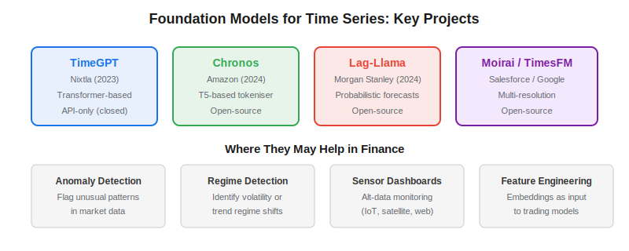
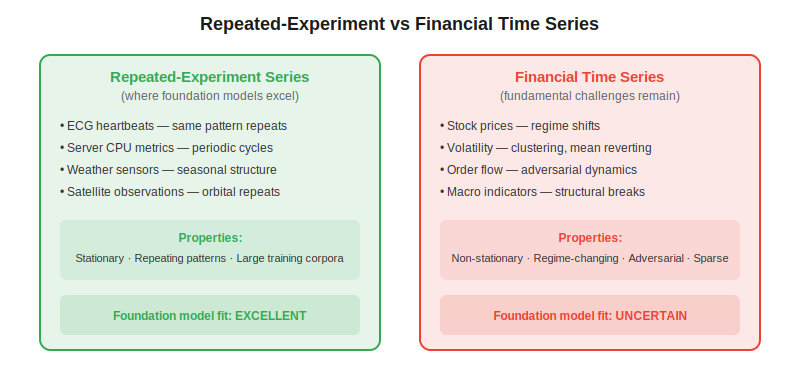

A **foundation model for time series** is a large pre-trained model — analogous to GPT for text — that learns general temporal patterns from massive and diverse time series corpora and can then be applied zero-shot or with minimal fine-tuning to new forecasting tasks. Models like TimeGPT, Chronos, Lag-Llama, and Moirai have demonstrated impressive results on benchmarks covering energy, weather, and server metrics. The critical question for algo traders is whether this success transfers to financial markets — and the honest answer, as of 2026, is "only partially, and with important caveats."

## What Are Foundation Models for Time Series?

Traditional time series forecasting fits a separate model (ARIMA, Prophet, LSTM) to each individual series. Foundation models invert this: they train a single large model on thousands of diverse series, learning universal temporal patterns — trends, seasonality, level shifts, correlations — that transfer across domains.

The architecture typically follows one of three approaches:

- **Transformer-based** — TimeGPT (Nixtla, 2023) and TimesFM (Google, 2024) use attention mechanisms adapted for continuous-valued time series rather than discrete tokens
- **Tokenised** — Chronos (Amazon, 2024) discretises real-valued time series into bins and trains a T5-style language model on the resulting token sequences
- **Probabilistic** — Lag-Llama (Morgan Stanley, 2024) outputs full probability distributions over future values, making uncertainty quantification native to the model



The core promise is **zero-shot forecasting**: upload a new time series the model has never seen, and it produces a reasonable forecast without any training. For domains with thousands of similar series (retail demand, server load, energy consumption), this works remarkably well.

## Why Financial Time Series Are Fundamentally Different

Foundation models achieve their best results on what Lehalle (2026) calls **repeated-experiment time series** — series where the same underlying process generates similar patterns over and over. An ECG repeats heartbeat waveforms. Server CPU metrics follow daily and weekly cycles. Satellite observations follow orbital periodicities.

Financial time series are not repeated experiments. They are the emergent output of millions of adversarial agents — traders, algorithms, market makers — who actively adapt to each other's strategies. This creates several properties that undermine the foundation model paradigm:



**Non-stationarity.** The statistical properties of financial returns shift over time. A model trained on 2015–2020 data may learn patterns that are meaningless in 2025 because market microstructure, regulation, and participant behaviour have changed.

**Regime changes.** Markets switch between regimes (trending, mean-reverting, crisis) with little warning. A foundation model that learned "typical" volatility patterns cannot anticipate a regime it has never seen in its training data.

**Adversarial dynamics.** In server monitoring, the data-generating process does not react to your forecast. In markets, other participants observe and respond to each other's signals. Any pattern that becomes widely known gets arbitraged away — the famous "where have all the stat arb profits gone?" problem. See [Where Have All the Stat Arb Profits Gone?](https://paperswithbacktest.com/wiki/where-have-all-the-stat-arb-profits-gone) for more on alpha decay.

**Low signal-to-noise ratio.** Financial returns are dominated by noise. The predictable component of daily stock returns is tiny relative to the variance, making it fundamentally harder to learn useful patterns than in physical or engineering time series.

## Where Foundation Models May Actually Help in Finance

Despite these challenges, there are specific use cases where foundation models add genuine value for algo traders:

**Anomaly detection.** A foundation model that has learned "normal" temporal patterns can flag deviations in market data, order flow, or alternative data streams. This is closer to the repeated-experiment use case: you are not predicting future prices, but identifying when current behaviour deviates from historical norms.

**Regime detection.** Foundation model embeddings — the internal representations learned during pre-training — can serve as features for regime classification. Changes in the embedding space may signal regime shifts before they are apparent in raw price data.

**Alternative data monitoring.** The strongest application aligns with Lehalle's suggestion of "plugging on a bunch of random sensors" and "building dashboards on the fly." Satellite imagery frequency, web traffic patterns, shipping data, credit card transaction volumes — these are closer to repeated-experiment series and can be meaningfully processed by foundation models, then fed as features into traditional [systematic trading strategies](https://paperswithbacktest.com/wiki/systematic-trading-strategies).

**Feature engineering.** Rather than using foundation models for direct price prediction, use their embeddings as features in a downstream trading model. The embeddings capture complex temporal patterns that hand-crafted features (moving averages, RSI) may miss.

## Python Example: Zero-Shot Forecasting with Chronos

```python
import torch
import pandas as pd
import matplotlib.pyplot as plt
from chronos import ChronosPipeline

# Load pre-trained Chronos model
pipeline = ChronosPipeline.from_pretrained(
    "amazon/chronos-t5-small",
    device_map="cpu",
    torch_dtype=torch.float32,
)

# Load financial data — e.g., daily closing prices
df = pd.read_csv("spy_daily.csv", parse_dates=["Date"], index_col="Date")
context = torch.tensor(df["Close"].values[-60:], dtype=torch.float32)

# Generate probabilistic forecast (next 10 days)
forecast = pipeline.predict(
    context=context.unsqueeze(0),
    prediction_length=10,
    num_samples=100,  # Monte Carlo samples for uncertainty
)

# Extract median and confidence intervals
median = forecast.median(dim=1).squeeze().numpy()
low = forecast.quantile(0.1, dim=1).squeeze().numpy()
high = forecast.quantile(0.9, dim=1).squeeze().numpy()

print(f"10-day forecast (median): {median}")
print(f"80% confidence interval: [{low[-1]:.2f}, {high[-1]:.2f}]")
```

Note: this produces a **probabilistic** forecast. The wide confidence intervals on financial data are a feature, not a bug — they honestly reflect the model's uncertainty. A model that gives narrow intervals on stock prices is likely overconfident.

## Comparison: Foundation Models vs Traditional Approaches

| Approach | Training | Financial Suitability | Strengths |
|---|---|---|---|
| ARIMA / Prophet | Per-series | Good for trending/seasonal | Interpretable, fast, well-understood |
| LSTM / GRU | Per-series or multi-series | Moderate | Captures nonlinear patterns |
| Chronos / TimeGPT | Zero-shot (pre-trained) | Limited for price prediction | No training needed, good for alt-data |
| Lag-Llama | Zero-shot + fine-tune | Better with fine-tuning | Probabilistic output, uncertainty-aware |
| Custom transformer | Trained on financial data | Highest potential, highest cost | Domain-specific, full control |

## Limitations and Risks

**Benchmark leakage.** Many time series benchmarks include data that foundation models saw during pre-training. Performance on held-out financial data is consistently lower than headline benchmark numbers suggest.

**Computational cost.** Running inference on a large foundation model for thousands of tickers at high frequency is expensive. For latency-sensitive strategies, traditional models remain more practical.

**Overfitting to structure.** Foundation models excel at capturing structural patterns (seasonality, trend). Financial alpha typically comes from subtle statistical edges, not structural patterns — and these edges are exactly what the models struggle with.

**Not a replacement for domain knowledge.** A foundation model cannot reason about why markets move; it can only extrapolate patterns. Combining its output with fundamental analysis — available through frameworks like [LLM trading agents](https://paperswithbacktest.com/wiki/llm-trading-agents) — yields better results than either approach alone.

## Conclusion

Foundation models for time series are a genuinely exciting development, but algo traders should approach them with calibrated expectations. They work best as **components** within a larger system — providing embeddings, anomaly flags, or alternative data processing — rather than as standalone price predictors. The fundamental challenge remains: financial markets are not repeated experiments, and any model that treats them as such will eventually be surprised by a regime it has never seen.

---

**Explore further on PapersWithBacktest:**
- Browse [backtested trading strategies](https://paperswithbacktest.com/strategies) with Python code and performance metrics
- Access [clean historical market data](https://paperswithbacktest.com/datasets) for equities, crypto, and futures
- Take the [algo trading course](https://paperswithbacktest.com/course) — 60+ video lessons and notebooks
- Related wiki pages: [How Are Neural Networks Used in Quantitative Trading](https://paperswithbacktest.com/wiki/how-are-neural-networks-used-in-quantitative-trading) · [LLM Trading Agents](https://paperswithbacktest.com/wiki/llm-trading-agents)
