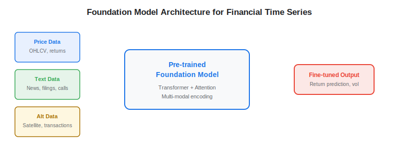
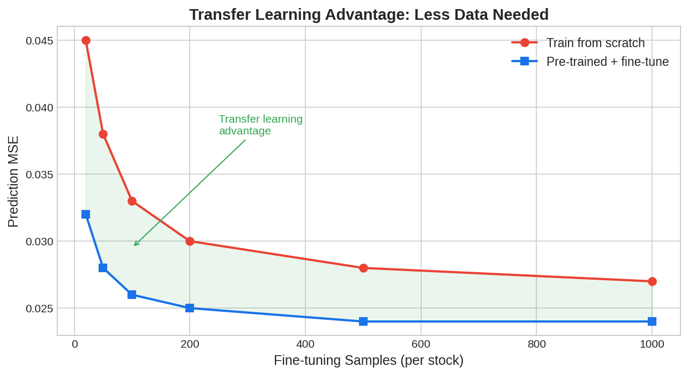

Foundation models — large neural networks pre-trained on massive datasets and then fine-tuned for specific tasks — are beginning to reshape quantitative finance. Originally developed for language (GPT, BERT) and vision (ViT), foundation models are now being adapted for financial time series forecasting, [alternative data](https://paperswithbacktest.com/wiki/best-alternative-data) processing, and multi-modal signal extraction. For algo traders, these models promise more accurate forecasts, better transfer learning from data-rich to data-poor domains, and unified architectures that process price data, text, and images simultaneously.

## What Are Foundation Models for Finance?

A foundation model is a large neural network pre-trained on broad data that can be adapted to downstream tasks through fine-tuning or prompting. In finance, this means models pre-trained on vast corpora of financial time series, earnings transcripts, SEC filings, and market data that can then be fine-tuned for specific tasks like return prediction, volatility forecasting, or [sentiment analysis](https://paperswithbacktest.com/wiki/nlp-sentiment-analysis-trading).

The key innovation over traditional quant models is **transfer learning**: knowledge gained from processing millions of financial time series transfers to improve forecasting on individual stocks, even with limited per-stock data. This is particularly valuable for [alternative data](https://paperswithbacktest.com/wiki/how-can-alternative-data-be-integrated-into-quantitative-trading) signals where history is short.

The motivation for foundation models in finance parallels the revolution in natural language processing. Before BERT and GPT, NLP models were trained from scratch for each task — sentiment analysis, translation, summarization — each requiring task-specific labeled data. Foundation models changed this by pre-training a single large model on vast amounts of unlabeled text, then fine-tuning on small task-specific datasets. The same paradigm applies to financial time series: rather than training a separate model for each stock or each signal, a foundation model learns general patterns across thousands of stocks and then adapts to specific prediction tasks with minimal additional data.

This matters enormously for quant trading because the fundamental constraint in finance is not compute or model complexity — it is **data scarcity**. A stock has at most ~60 years of daily data (15,000 points), and most [alternative data](https://paperswithbacktest.com/wiki/best-alternative-data) sources cover less than 10 years. Traditional models trained on this limited data are prone to [overfitting](https://paperswithbacktest.com/wiki/alternative-data-overfitting-pitfalls). Foundation models mitigate this by learning shared structure across the entire cross-section of assets, effectively increasing the effective sample size by orders of magnitude.

The field is moving rapidly. Google published a paper on TimesFM (Time Series Foundation Model) in 2024, trained on 100 billion time points from both public datasets and Google Trends data. Amazon has released Chronos, which tokenizes time series values and applies language model architectures. And multiple quant funds are known to be developing proprietary foundation models trained on their internal datasets — including alternative data features — though details remain closely guarded.

## Key Architectures

### Temporal Fusion Transformer (TFT)

Google's TFT combines recurrent layers for local temporal patterns with attention mechanisms for long-range dependencies. It handles multiple input types (static metadata, known future inputs, observed time-varying inputs) — making it naturally suited for [nowcasting](https://paperswithbacktest.com/wiki/nowcasting-alternative-data) where alternative data feeds arrive at different frequencies.

### TimeGPT and Time-Series Foundation Models

TimeGPT (Nixtla, 2023) is a GPT-style model pre-trained on 100+ billion time-series data points. It demonstrates that foundation model concepts transfer to time series: zero-shot forecasting (predicting without task-specific training) works surprisingly well on financial data.

### Multi-Modal Models

Emerging architectures combine price time series with text embeddings (from [NLP](https://paperswithbacktest.com/wiki/nlp-sentiment-analysis-trading)) and even image features (from [satellite data](https://paperswithbacktest.com/wiki/satellite-imagery-trading)) into a single model. The attention mechanism learns which modality is most informative at each time step.



## Python Implementation: Transfer Learning for Return Prediction

```python
import numpy as np
import pandas as pd

class SimpleTransferForecaster:
    """
    Demonstrates transfer learning concept for financial time series.
    Pre-trains on a broad universe, fine-tunes on target stock.
    """
    
    def __init__(self, n_features: int = 10, hidden_dim: int = 32):
        self.n_features = n_features
        self.hidden_dim = hidden_dim
        # Simplified: pre-trained weights (in practice, from a large model)
        np.random.seed(42)
        self.pretrained_W = np.random.randn(n_features, hidden_dim) * 0.1
        self.output_W = np.random.randn(hidden_dim) * 0.1
    
    def pretrain(self, universe_data: np.ndarray, universe_returns: np.ndarray,
                 n_epochs: int = 100, lr: float = 0.001):
        """Pre-train on broad universe of stocks."""
        for epoch in range(n_epochs):
            hidden = np.tanh(universe_data @ self.pretrained_W)
            pred = hidden @ self.output_W
            error = pred - universe_returns
            # Gradient update (simplified)
            grad_output = hidden.T @ error / len(error)
            self.output_W -= lr * grad_output
        return self
    
    def finetune(self, target_data: np.ndarray, target_returns: np.ndarray,
                 n_epochs: int = 20, lr: float = 0.0005):
        """Fine-tune on target stock with smaller learning rate."""
        for epoch in range(n_epochs):
            hidden = np.tanh(target_data @ self.pretrained_W)
            pred = hidden @ self.output_W
            error = pred - target_returns
            grad_output = hidden.T @ error / len(error)
            self.output_W -= lr * grad_output
        return self
    
    def predict(self, features: np.ndarray) -> np.ndarray:
        """Generate predictions."""
        hidden = np.tanh(features @ self.pretrained_W)
        return hidden @ self.output_W

# Example usage
np.random.seed(42)
n_stocks, n_days, n_feat = 500, 252, 10

# Pre-training data: broad universe
universe_X = np.random.randn(n_stocks * n_days, n_feat) * 0.5
universe_y = np.random.randn(n_stocks * n_days) * 0.02

# Fine-tuning data: single target stock (much smaller)
target_X = np.random.randn(60, n_feat) * 0.5
target_y = np.random.randn(60) * 0.02

model = SimpleTransferForecaster(n_features=n_feat)
model.pretrain(universe_X, universe_y)
model.finetune(target_X, target_y)

test_X = np.random.randn(20, n_feat) * 0.5
predictions = model.predict(test_X)
print(f"Predictions shape: {predictions.shape}")
print(f"Mean prediction: {predictions.mean():.6f}")
```



## Practical Considerations for Traders

**Data requirements**: Foundation models need substantially more data for pre-training than traditional models. However, the fine-tuning step can work with very small samples — exactly the regime where alternative data signals operate (limited history).

**Compute costs**: Pre-training is expensive (GPU clusters for days/weeks). Fine-tuning is cheap. For most quant teams, the practical approach is to use a pre-trained model from an open-source project and fine-tune in-house.

**Interpretability**: Foundation models are black boxes. For risk management and regulatory compliance, combining foundation model predictions with interpretable signals (e.g., factor exposures) is advisable.

## Limitations and Risks

**Non-stationarity**: Financial markets change over time. A model pre-trained on 2010–2020 data may perform poorly in 2025 if market dynamics have shifted. Regular re-training is essential.

**Overfitting risk**: With millions of parameters and limited financial data for validation, [overfitting](https://paperswithbacktest.com/wiki/alternative-data-overfitting-pitfalls) is a serious concern. Use strict out-of-sample testing.

**Benchmark skepticism**: Many academic papers on financial foundation models show results on benchmarks that do not account for transaction costs, slippage, or realistic trading constraints.

## Conclusion

Foundation models for financial time series represent the next frontier in quant trading technology. They are particularly powerful for alternative data applications where per-signal history is short — transfer learning compensates for limited samples. The field is young, and the alpha opportunity is real for teams that can deploy these models effectively.

---

**Explore further on PapersWithBacktest:**
- Browse [backtested ML-driven strategies](https://paperswithbacktest.com/strategies) with Python code and performance metrics
- Access [clean historical market data](https://paperswithbacktest.com/datasets) for equities, crypto, and futures
- Take the [algo trading course](https://paperswithbacktest.com/course) — 60+ video lessons and notebooks
- Related wiki pages: [NLP for Trading](https://paperswithbacktest.com/wiki/nlp-sentiment-analysis-trading) · [Synthetic Data Generation](https://paperswithbacktest.com/wiki/synthetic-data-generation-finance)
