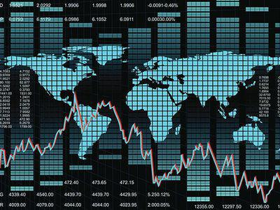

## Table of Contents

## What are the Four Asian Tigers?

The Four Asian Tigers are four countries in Asia that grew very fast economically from the 1960s to the 1990s. These countries are Hong Kong, Singapore, South Korea, and Taiwan. They are called "tigers" because they became strong and successful quickly, like tigers in the wild.

These countries started with very little money and resources but used smart strategies to grow their economies. They focused on making and selling things like electronics, cars, and clothes to other countries. By doing this, they became rich and developed quickly. Today, they are known for their high living standards and strong economies.

## Which countries are considered the Four Asian Tigers?

The Four Asian Tigers are Hong Kong, Singapore, South Korea, and Taiwan. These countries are called tigers because they grew very fast and became strong economically from the 1960s to the 1990s.

They started with little money but used smart ways to make their economies grow. They made and sold things like electronics, cars, and clothes to other countries. This helped them become rich and developed quickly.

## What are the main economic strengths of the Four Asian Tigers?

The Four Asian Tigers, which are Hong Kong, Singapore, South Korea, and Taiwan, have strong economies because they are good at making and selling things to other countries. They started making simple things like clothes and toys, but then they moved to making more complicated things like electronics and cars. This helped them earn a lot of money and grow their economies quickly. They also worked hard to make their workers skilled and educated, which helped them make even better products.

Another strength of these countries is their good location and ports. Hong Kong and Singapore are big ports where ships can easily come and go, making it easy to send products all over the world. South Korea and Taiwan also have good ports and are close to big markets like China and Japan. This location helps them trade easily and grow their businesses. They also have good governments that help businesses grow by making rules that are fair and helpful.

Overall, the Four Asian Tigers have strong economies because they make good products, have skilled workers, and are in good locations for trading. They started from little and grew a lot by working hard and using smart strategies.

## How did the Four Asian Tigers achieve their economic growth?

The Four Asian Tigers, which are Hong Kong, Singapore, South Korea, and Taiwan, grew their economies by making and selling things to other countries. They started by making simple things like clothes and toys. Over time, they learned to make more complicated things like electronics and cars. This helped them earn a lot of money because people all over the world wanted to buy these products. They also focused on educating their workers and making them skilled, which helped them make even better products.

Another important reason for their growth was their good location and ports. Hong Kong and Singapore are big ports where ships can easily come and go, making it easy to send products all over the world. South Korea and Taiwan also have good ports and are close to big markets like China and Japan. This location helps them trade easily and grow their businesses. Their governments also helped by making rules that were fair and helpful for businesses, which encouraged more companies to start and grow in these countries.

Overall, the Four Asian Tigers achieved their economic growth by making good products, having skilled workers, and being in good locations for trading. They started from little and grew a lot by working hard and using smart strategies.

## What role did government policies play in the economic development of the Four Asian Tigers?

The governments of the Four Asian Tigers, which are Hong Kong, Singapore, South Korea, and Taiwan, played a big role in their economic growth. They made rules that helped businesses start and grow. For example, they gave money to companies to help them make new products. They also made it easier for businesses to borrow money from banks. These rules encouraged more people to start companies and create jobs.

Another important thing the governments did was to focus on education. They built good schools and made sure that many people could go to school and learn skills. This helped create a smart and skilled workforce that could make good products. The governments also worked to keep their countries stable and safe, which made it easier for businesses to grow and for people to want to invest money in these countries.

Overall, the government policies in the Four Asian Tigers were key to their economic development. By helping businesses, improving education, and keeping the countries stable, the governments created the right environment for their economies to grow quickly and become strong.

## How have the Four Asian Tigers managed to maintain high levels of economic growth?

The Four Asian Tigers, which are Hong Kong, Singapore, South Korea, and Taiwan, have managed to keep their economies growing by continuing to make and sell good products to other countries. They started with simple things like clothes and toys, but now they make complicated things like electronics and cars. They keep improving their products and finding new ways to sell them. This has helped them earn a lot of money and keep their economies strong.

Another way they maintain growth is by focusing on education and skills. The governments in these countries have made sure that many people can go to school and learn new skills. This means they have a smart and skilled workforce that can make good products. They also keep their countries stable and safe, which makes it easier for businesses to grow and for people to want to invest money in these countries.

Overall, the Four Asian Tigers have kept their economies growing by making good products, having skilled workers, and being in good locations for trading. They started from little and grew a lot by working hard and using smart strategies. Their governments have played a big role by helping businesses, improving education, and keeping the countries stable.

## What are the key industries driving the economies of the Four Asian Tigers?

The Four Asian Tigers, which are Hong Kong, Singapore, South Korea, and Taiwan, have key industries that drive their economies. In Hong Kong, the main industries are finance and services. It's a big place for banks and businesses to do trading. Singapore also has a strong finance industry, but it's also known for its port and for making electronics. South Korea is famous for making cars and electronics, like Samsung phones and TVs. Taiwan is also strong in electronics, especially in making computer chips and other tech products.

These countries started by making simple things like clothes and toys, but they moved to making more complicated things like electronics and cars. This helped them earn a lot of money and grow their economies. They also focus on education and skills, so they have smart workers who can make good products. Their good locations and ports help them trade easily with other countries, which is important for their economies.

## How do the Four Asian Tigers compare economically with other developed nations?

The Four Asian Tigers, which are Hong Kong, Singapore, South Korea, and Taiwan, have economies that are very strong and are often compared to other developed nations like the United States, Japan, and countries in Europe. These countries have high living standards and strong economies, just like many developed nations. They make and sell a lot of electronics, cars, and other goods to other countries, which helps them earn a lot of money. Their workers are skilled and educated, which helps them make good products. They also have good ports and locations that make it easy to trade with other countries.

Compared to other developed nations, the Four Asian Tigers have grown very fast in a short time. While countries like the United States and Japan took longer to become rich, the Four Asian Tigers started with little and grew quickly by using smart strategies. They focused on making and selling things to other countries, and their governments helped by making rules that were good for businesses. Today, they are seen as some of the richest and most developed countries in the world, even though they started with less than many other developed nations.

## What challenges have the Four Asian Tigers faced in their economic development?

The Four Asian Tigers, which are Hong Kong, Singapore, South Korea, and Taiwan, have faced some challenges in their economic growth. One big challenge was competition from other countries. As they grew, other countries like China and Vietnam started making similar products, like electronics and clothes, but for cheaper prices. This made it harder for the Four Asian Tigers to sell their products and keep their prices high. They had to find new ways to stay ahead, like making even better products or moving into new industries.

Another challenge was dealing with changes in the world economy. Sometimes, the world economy would slow down, and people would buy fewer things. This affected the Four Asian Tigers because they rely a lot on selling things to other countries. They had to be smart and find ways to keep their economies growing even when things were tough. Their governments helped by making rules that supported businesses and helped them through hard times.

Overall, the Four Asian Tigers have faced challenges like competition from other countries and changes in the world economy. But they have managed to keep growing by being smart and finding new ways to stay ahead. Their governments have played a big role in helping them through these challenges by supporting businesses and making good rules.

## How have the Four Asian Tigers adapted to global economic changes?

The Four Asian Tigers, which are Hong Kong, Singapore, South Korea, and Taiwan, have had to adapt to many changes in the world economy. One big change was that other countries like China and Vietnam started making similar products, but for cheaper prices. This made it harder for the Four Asian Tigers to sell their products and keep their prices high. To stay ahead, they had to make even better products and move into new industries. For example, they focused on making more complicated things like high-tech electronics and cars, which are harder for other countries to copy.

Another way the Four Asian Tigers adapted was by changing their strategies when the world economy slowed down. Sometimes, people around the world would buy fewer things, which affected these countries because they rely a lot on selling things to other countries. Their governments helped by making rules that supported businesses and helped them through hard times. For example, they gave money to companies to help them make new products or made it easier for businesses to borrow money. This helped the Four Asian Tigers keep their economies growing even when things were tough.

## What future economic trends are predicted for the Four Asian Tigers?

The future economic trends for the Four Asian Tigers, which are Hong Kong, Singapore, South Korea, and Taiwan, look promising but also challenging. These countries are expected to keep growing by focusing on high-tech industries like electronics, cars, and new technologies like artificial intelligence and green energy. They will need to keep making better products and finding new ways to sell them to stay ahead of other countries. Their good education systems will help them have smart workers who can work in these new industries.

However, they will also face challenges. Competition from other countries, like China and Vietnam, will continue to be a big problem. These countries can make similar products for cheaper prices, which makes it hard for the Four Asian Tigers to keep their prices high. Also, changes in the world economy, like slowdowns or trade problems, could affect them because they rely a lot on selling things to other countries. To deal with these challenges, the Four Asian Tigers will need to keep being smart and finding new ways to stay ahead. Their governments will play a big role by making rules that help businesses grow and adapt to these changes.

## How do the economic strategies of the Four Asian Tigers influence global economic policies?

The economic strategies of the Four Asian Tigers, which are Hong Kong, Singapore, South Korea, and Taiwan, have shown the world how to grow an economy quickly. They started by making simple things like clothes and toys, but then they moved to making more complicated things like electronics and cars. This helped them earn a lot of money and grow their economies fast. Other countries have seen this and tried to copy their strategies. They focus on making and selling things to other countries, which is called exporting. They also work hard to make their workers skilled and educated, so they can make good products. This has shown other countries that focusing on education and making good products can help their economies grow.

The Four Asian Tigers also show how important it is for governments to help businesses. Their governments made rules that helped businesses start and grow. They gave money to companies to help them make new products and made it easier for businesses to borrow money from banks. This encouraged more people to start companies and create jobs. Other countries have seen this and tried to make similar rules to help their own businesses. The Four Asian Tigers also show how important it is to have good ports and be in a good location for trading. This has influenced other countries to focus on improving their ports and finding ways to trade more easily with other countries. Overall, the strategies of the Four Asian Tigers have shown the world how to grow an economy quickly and have influenced many global economic policies.

## References & Further Reading

[1]: ["The Four Asian Tigers: Economic Development & the Global Political Economy"](https://www.amazon.com/Four-Asian-Tigers-Development-Political/dp/0124074405) by Eun Mee Kim

[2]: Henderson, J. (2011). ["East Asian Transformation: On the Political Economy of Dynamism, Governance and Crisis."](https://www.taylorfrancis.com/books/edit/10.4324/9780203833131/east-asian-transformation-jeffrey-henderson) Politics & Society, 39(2), 193-218.

[3]: Aggarwal, R., Lucey, B. M., & Muckley, C. (2004). ["The Financial Integration of the Three Newest European Union Countries: Evidence from Stock Price Interactions."](http://129.234.8.16/view/departments/DDD2.html) Pacific-Basin Finance Journal, 12(3), 357-379.

[4]: Luk, V. (2006). ["The Roles of the Government in the Development of Hong Kong's Modern Economy."](https://history.laps.yorku.ca/files/2015/10/Luk_CV2015.pdf) Asian Studies Review, 30(2), 211-227.

[5]: Li, J., & Alexa, O. (2013). ["Algorithmic Trading and Information Dissemination."](https://www.cambridge.org/core/journals/journal-of-financial-and-quantitative-analysis/article/abs/algorithmic-trading-and-market-quality-international-evidence/4B96E916E3E13AFF1DF9B5FCC188F4E0) Academy of Management Perspectives, 27(3), 324-335.