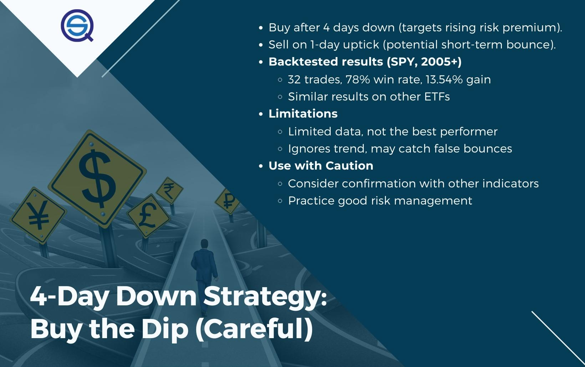

## Table of Contents

## What does 'Four Down Days and Up' mean in the context of stock market trading?

'Four Down Days and Up' is a term used in stock market trading to describe a pattern where a stock's price falls for four consecutive days and then rises on the fifth day. Traders and investors watch for this pattern because it can signal that the stock might be ready for a short-term recovery or a change in trend. When a stock goes down for four days in a row, it can create a sense of pessimism among investors, but if the price goes up on the fifth day, it might mean that the selling pressure is easing and buyers are stepping in.

This pattern is not a guaranteed predictor of future price movements, but it can be a useful tool for traders looking for entry points into a stock. For example, if a trader notices that a stock has been declining for four days and then sees it start to rise on the fifth day, they might decide to buy the stock, hoping to benefit from the potential upward momentum. However, it's important for traders to use this pattern along with other analysis methods and not rely on it alone, as stock market trends can be influenced by many factors.

## How do you identify a 'Four Down Days and Up' pattern on a stock chart?

To spot a 'Four Down Days and Up' pattern on a stock chart, you need to look at the daily price movements of the stock. Start by checking the closing price of the stock each day. If the stock's closing price is lower than the previous day's closing price for four days in a row, you have the 'Four Down Days' part of the pattern. It's important to focus on the closing prices because they show the final value of the stock at the end of each trading day.

After you see four days of lower closing prices, keep watching the stock on the fifth day. If the stock's closing price on this fifth day is higher than the fourth day's closing price, you have identified the 'Up' part of the pattern. This means the stock went down for four days and then went up on the fifth day. Remember, this pattern can help you see when a stock might be changing direction, but it's not a sure thing, so always use it with other ways of looking at the stock market.

## What are the basic principles behind the 'Four Down Days and Up' strategy?

The 'Four Down Days and Up' strategy is based on the idea that after a stock goes down for four days in a row, it might be ready to go up. Traders look for this pattern because it can show that the stock is getting tired of going down and might start going up instead. When a stock goes down for four days, it can make people feel worried and they might sell their shares. But if the stock goes up on the fifth day, it can mean that the worry is going away and people are starting to buy the stock again.

This strategy is not a sure way to make money, but it can help traders find good times to buy a stock. If a trader sees a stock go down for four days and then start to go up on the fifth day, they might decide to buy the stock, hoping it will keep going up. But traders need to be careful and use this pattern along with other ways to look at the stock market. The stock market can change because of many things, so it's important not to rely on just one pattern.

## Can you explain the significance of the fourth down day in this pattern?

The fourth down day in the 'Four Down Days and Up' pattern is important because it completes the part of the pattern where the stock goes down. When a stock goes down for four days in a row, it can make people feel worried about the stock. They might think the stock will keep going down, so they sell their shares. This worry can make the stock go down even more. But the fourth down day is special because it's the last day before the stock might start to go up again.

If the stock goes up on the fifth day after four down days, it can mean that the worry is starting to go away. People might see that the stock has gone down a lot and think it's a good time to buy it. This can make the stock start to go up again. So, the fourth down day is like a signal that tells traders to watch the stock closely on the next day, because it might be a good time to buy it if it starts to go up.

## What are the common entry points for traders using the 'Four Down Days and Up' strategy?

Traders using the 'Four Down Days and Up' strategy often look to enter the market on the fifth day. After watching a stock go down for four days in a row, they wait to see if it goes up on the fifth day. If the stock's price goes up on that fifth day, it can be a sign that the stock might keep going up. So, traders might buy the stock at the start of the fifth day, hoping to catch the upward movement.

Another common entry point is to wait until the end of the fifth day to see if the stock closes higher than it did on the fourth day. If it does, traders might feel more sure that the stock is turning around. They could buy the stock right before the market closes on the fifth day or at the start of trading on the sixth day, hoping to ride the new upward trend.

These entry points are not guaranteed to work every time, so traders need to be careful. They should use other ways to check the stock, like looking at the overall market or news that might affect the stock. By combining the 'Four Down Days and Up' pattern with other tools, traders can make smarter choices about when to buy.

## How does the 'Four Down Days and Up' pattern affect stock price volatility?

When a stock follows the 'Four Down Days and Up' pattern, it can make the stock's price move up and down more than usual. This is because after four days of the stock going down, people might start to feel worried. They might think the stock will keep going down, so they sell their shares. This can make the stock's price drop even more on those four days. But if the stock goes up on the fifth day, it can make people feel better. They might see it as a good time to buy the stock, which can make the price go up quickly. This back-and-forth between worry and hope can make the stock's price change a lot in a short time.

The 'Four Down Days and Up' pattern can also make traders pay more attention to the stock. When they see the stock go down for four days and then start to go up, they might want to buy it, hoping it will keep going up. This can make more people trade the stock, which can make its price move even more. But traders need to be careful because the stock market can change because of many things, and this pattern is not a sure way to know what will happen next. So, while the pattern can make the stock's price more exciting to watch, it can also make it harder to predict what will happen.

## What are the typical exit strategies when using the 'Four Down Days and Up' approach?

When traders use the 'Four Down Days and Up' approach, they often have a plan for when to sell the stock, which is called an [exit](/wiki/exit-strategy) strategy. One common exit strategy is to set a target price. After buying the stock on the fifth day when it goes up, traders might decide on a price they want the stock to reach. If the stock hits that price, they sell it to make a profit. This way, they can take their money out when the stock is doing well.

Another exit strategy is to use a stop-loss order. This means setting a price below the stock's current price where the trader will sell the stock if it starts to go down again. For example, if a trader buys the stock at $50, they might set a stop-loss at $48. If the stock drops to $48, it automatically sells, helping the trader avoid losing too much money. This can be a good way to protect against the stock going down after the fifth day.

Some traders also watch the stock's price movement closely after buying it. If the stock keeps going up for a few more days, they might decide to sell it to lock in their profits. But if the stock starts to go down again, they might sell it quickly to avoid losing money. This way, they can adjust their exit strategy based on what the stock is doing, making sure they get out at the right time.

## How does market sentiment influence the effectiveness of the 'Four Down Days and Up' pattern?

Market sentiment, which is how people feel about the stock market, can really change how well the 'Four Down Days and Up' pattern works. When people are feeling hopeful and think the market will go up, they might buy a stock more quickly after it goes down for four days. This can make the stock go up on the fifth day, making the pattern work better. But if people are feeling worried and think the market will keep going down, they might keep selling the stock even after four down days. This can stop the stock from going up on the fifth day, making the pattern less effective.

So, the 'Four Down Days and Up' pattern can be more successful when the overall market sentiment is positive. Traders need to pay attention to how people feel about the market and other news that might affect the stock. If the general mood is good, the pattern might work better because more people will be ready to buy the stock when it starts to go up. But if the mood is bad, the pattern might not work as well because people might not want to buy the stock, even if it goes up on the fifth day.

## What are some historical examples where the 'Four Down Days and Up' pattern led to significant market movements?

In early 2016, Apple Inc. experienced a 'Four Down Days and Up' pattern that led to significant market movements. The stock had been falling for four days straight, causing worry among investors. But on the fifth day, the stock price went up sharply. This happened because many investors saw the drop as a good chance to buy the stock at a lower price. The positive movement on the fifth day helped boost confidence in the market, and Apple's stock continued to rise in the following weeks.

Another example happened with Tesla in late 2018. After four days of falling prices, Tesla's stock went up on the fifth day. This pattern caught the attention of many traders who were watching the stock closely. The rise on the fifth day was strong enough to start a short-term upward trend. Many investors who bought the stock on that fifth day were able to make profits as the price kept going up for several more days. These examples show how the 'Four Down Days and Up' pattern can sometimes lead to big changes in stock prices.

## How can technical indicators enhance the accuracy of the 'Four Down Days and Up' strategy?

Technical indicators can make the 'Four Down Days and Up' strategy work better by giving traders more clues about what the stock might do next. One helpful indicator is the Relative Strength Index (RSI). The RSI measures how fast a stock's price is going up or down. If the RSI is low after four down days, it can mean the stock is oversold, which means it might be ready to go up. So, if traders see the RSI going up on the fifth day along with the stock price, they can feel more sure about buying the stock.

Another useful indicator is the Moving Average Convergence Divergence (MACD). The MACD helps traders see if the stock's trend might change. If the MACD line crosses above the signal line on the fifth day after four down days, it can be a sign that the stock is starting to go up. Traders can use this signal to decide when to buy the stock. By using these technical indicators with the 'Four Down Days and Up' pattern, traders can make smarter choices and improve their chances of making money.

## What are the risks and limitations of relying on the 'Four Down Days and Up' pattern for trading decisions?

Using the 'Four Down Days and Up' pattern to make trading decisions can be risky because it's not always right. The stock market can change because of many things, like news or what other people are doing. So, just because a stock goes down for four days and then up on the fifth day doesn't mean it will keep going up. Traders might buy the stock on the fifth day hoping it will go up more, but if it doesn't, they could lose money. Also, this pattern can make traders focus too much on one thing and miss other signs that the stock might not be a good buy.

Another problem with using this pattern is that it might not work well in all situations. If the whole market is feeling worried, the pattern might not help much. People might keep selling the stock even after four down days, so it won't go up on the fifth day. Traders need to look at other things, like how the whole market is doing or if there's any news that could change the stock's price. Relying only on the 'Four Down Days and Up' pattern can make traders miss these important clues and make bad choices.

## How can advanced traders modify the 'Four Down Days and Up' strategy to improve its performance in different market conditions?

Advanced traders can make the 'Four Down Days and Up' strategy work better by changing it a bit depending on what the market is doing. One way to do this is by looking at other signs in the market, like how the whole market is feeling or any big news that might affect the stock. If the market is feeling worried, traders might wait longer than just the fifth day to see if the stock really starts to go up. They might also use other tools, like the Relative Strength Index (RSI) or Moving Average Convergence Divergence (MACD), to see if the stock is really ready to go up. By combining these other signs with the 'Four Down Days and Up' pattern, traders can make smarter choices about when to buy the stock.

Another way to change the strategy is by setting different rules for when to buy and sell the stock. For example, instead of buying the stock right away on the fifth day, traders might wait to see if the stock keeps going up for a few more days. This can help them be more sure that the stock is starting a new upward trend. They can also set different prices for when to sell the stock, like a target price to take profits or a stop-loss price to avoid losing too much money. By adjusting these rules based on what the market is doing, traders can make the 'Four Down Days and Up' strategy work better in different situations.

## References & Further Reading

[1]: Bergstra, J., Bardenet, R., Bengio, Y., & Kégl, B. (2011). ["Algorithms for Hyper-Parameter Optimization."](https://papers.nips.cc/paper/4443-algorithms-for-hyper-parameter-optimization) Advances in Neural Information Processing Systems 24.

[2]: ["Advances in Financial Machine Learning"](https://www.amazon.com/Advances-Financial-Machine-Learning-Marcos/dp/1119482089) by Marcos Lopez de Prado

[3]: ["Evidence-Based Technical Analysis: Applying the Scientific Method and Statistical Inference to Trading Signals"](https://www.amazon.com/Evidence-Based-Technical-Analysis-Scientific-Statistical/dp/0470008741) by David Aronson

[4]: ["Machine Learning for Algorithmic Trading"](https://github.com/PacktPublishing/Machine-Learning-for-Algorithmic-Trading-Second-Edition) by Stefan Jansen

[5]: ["Quantitative Trading: How to Build Your Own Algorithmic Trading Business"](https://books.google.com/books/about/Quantitative_Trading.html?id=j70yEAAAQBAJ) by Ernest P. Chan