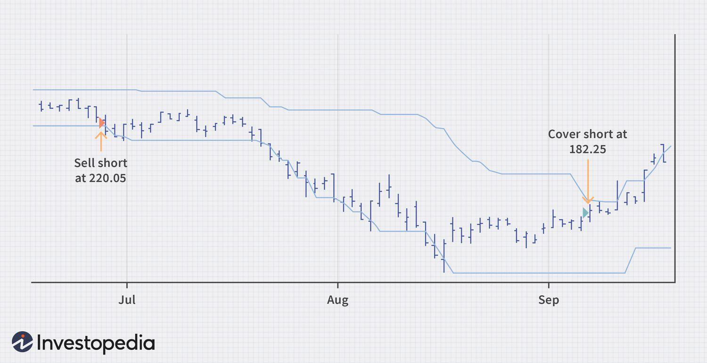

In today's dynamic financial markets, traders are in constant pursuit of strategies that provide a competitive edge. The four-week rule stands out as a notably effective tactic, gaining recognition for its simplicity and efficacy in capturing market trends. This strategy was pioneered by Richard Donchian, a pioneer in the field of technical analysis. The four-week rule is built on trend-following principles that utilize historical price data to identify trading opportunities. Specifically, it generates signals based on four-week price highs and lows, allowing traders to ride significant market movements.

The rise of algorithmic trading has further cemented the importance of such systematic strategies. Algo trading involves using computer programs to execute trades based on predefined instructions, ensuring speed and precision in execution. The simplicity of the four-week rule makes it particularly suitable for algorithmic implementation, allowing traders to automate their strategies and reduce the emotional biases that can affect decision-making.



As financial markets become increasingly complex and interconnected, strategies like the four-week rule are essential for automated systems seeking consistent results. This article will discuss the four-week rule, explore its integration into algorithmic trading, and assess the potential benefits it offers to investors seeking to optimize their trading strategies.

## Table of Contents

## Understanding the Four-Week Rule

The four-week rule functions as a trend-following trading system, primarily aiming to harness market momentum. This method generates a buy signal when the price of an asset attains a new four-week high. Conversely, it prompts a sell signal when the asset's price hits a new four-week low. The simplicity embedded in this strategy makes it an attractive choice for traders across different experience levels.

Originally formulated for commodities trading, the four-week rule has proven versatile across various asset classes, including stocks, bonds, and foreign exchange markets. Its foundational principle revolves around identifying significant trends based on historical price movements without the need for complex indicators or charts.

The practicality of the four-week rule lies in its uncomplicated nature, allowing traders to swiftly adapt it to differing asset classes and trading styles. By focusing on price extremes within a four-week timeframe, this strategy eliminates noise and emphasizes substantial market movements. Its straightforward, rule-based approach reduces ambiguity, providing traders clear entry and exit points, thus promoting decisive trading actions.

Historically, the four-week rule has demonstrated an ability to capture major market trends effectively. Despite its apparent simplicity, it capitalizes on sustained trends, which can result in substantial returns over time. Notable market movements, such as persistent uptrends or downtrends, often result in profitable trades for those adhering to this rule.

However, it is essential to acknowledge that while the strategy can be effective during pronounced market trends, it may not always perform optimally in environments characterized by low [volatility](/wiki/volatility-trading-strategies) or sideways markets. Nevertheless, when integrated with complementary trading tools and risk management techniques, the four-week rule remains a robust component of a trader's strategic arsenal.

## The Role of Algorithmic Trading

Algorithmic trading, also known as algo trading, is the use of computer algorithms to execute trade orders automatically. These algorithms are based on pre-defined criteria, enabling traders to efficiently and consistently enter and [exit](/wiki/exit-strategy) trades without the influence of emotion or human error. This is particularly beneficial when applying the four-week rule, which involves buying when an asset hits a new four-week high and selling when it reaches a new four-week low. The simplicity of this rule makes it an ideal candidate for algorithmic implementation.

One of the primary advantages of [algorithmic trading](/wiki/algorithmic-trading) is its speed and precision. Computers can process and execute trades much faster than a human could manually, which is especially beneficial when dealing with high-frequency data or large datasets. For example, the four-week rule requires continual monitoring of price data to determine the current four-week high or low. Automating this process through algorithmic trading allows for immediate execution upon meeting the specified conditions, reducing the risk of delays that might occur with manual trading.

To implement the four-week rule using algorithmic trading, traders often employ programming languages like Python to develop scripts that can identify and act on trading signals. Python libraries such as Pandas are particularly useful for handling time-series data, allowing traders to efficiently compute rolling four-week windows of highs and lows. Here is a simple example of how one might calculate a four-week high using Pandas:

```python
import pandas as pd

# Assume df is a DataFrame containing 'Date' and 'Close' columns
df['4Week_High'] = df['Close'].rolling(window=20).max()
```

In this script, `rolling(window=20).max()` calculates the maximum closing price over a period of 20 days (approximately four weeks, depending on trading days), which can then be used as a potential buy signal.

Algo trading isn't just about speed and reducing emotion-based trading; it also allows for enhanced risk management and the achievement of specific investment goals. By incorporating risk parameters, traders can pre-define exit strategies and stop-loss orders to minimize potential losses. This is crucial in automated systems where trades are executed without real-time human oversight. Furthermore, the flexibility provided by technology means that algorithms can be tailored to meet individual risk tolerances and investment objectives, whether these are long-term growth or short-term profit gains.

In conclusion, the integration of algorithmic trading with the four-week rule not only simplifies execution but also optimizes performance by leveraging technological advancements. As traders seek more systematic approaches to the market, the role of algorithmic trading continues to grow, offering robust solutions that blend speed, accuracy, and strategic rigor.

## Implementing the Four-Week Rule in Algo Trading

To implement the four-week rule using algorithmic trading, traders often turn to programming languages such as Python, renowned for its robust ecosystem of libraries and ease of use. The Python library `pandas` is particularly beneficial due to its data manipulation capabilities, which facilitate the calculation of four-week highs and lows for various financial assets. Traders can create algorithms that automate the buying or selling of an asset when it surpasses these thresholds.

A basic script might involve importing historical price data into a `pandas` DataFrame and using rolling window functions to calculate the moving four-week highs and lows. Here is a simple example in Python:

```python
import pandas as pd

# Load historical price data
data = pd.read_csv('price_data.csv')
data['Date'] = pd.to_datetime(data['Date'])
data.set_index('Date', inplace=True)

# Calculate rolling four-week high and low
data['Four_Week_High'] = data['Close'].rolling(window=20).max()
data['Four_Week_Low'] = data['Close'].rolling(window=20).min()

# Generating buy/sell signals
data['Buy_Signal'] = (data['Close'] > data['Four_Week_High'].shift(1)).astype(int)
data['Sell_Signal'] = (data['Close'] < data['Four_Week_Low'].shift(1)).astype(int)
```

Backtesting is crucial for evaluating how well the four-week rule would have performed historically. By analyzing past performance, traders can identify potential drawdowns and assess profitability. Libraries like `Backtrader` or `Zipline` in Python provide frameworks for running these tests, enabling a thorough examination of different scenarios.

Risk management is an essential component of implementing the four-week rule. By integrating stop-loss orders, traders can limit losses during false breakouts. A stop-loss order automatically triggers a sell action when the asset's price falls to a predefined level, offering protection against sudden market reversals.

For enhanced accuracy in entry and exit points, this strategy can be combined with other technical indicators. For instance, incorporating moving averages or the Relative Strength Index (RSI) can help confirm trends or identify overbought or oversold conditions. By doing so, traders can refine their strategies to better align with market conditions, potentially optimizing their results.

A full algorithmic approach allows traders to minimize emotional decision-making and execute trades systematically. As technology continues to advance, the capacity to adapt the four-week rule to complex datasets and various market conditions enhances its utility and relevance in modern trading.

## Benefits and Drawbacks

The four-week rule offers a straightforward approach to trading, making it highly accessible, especially for novice traders. Its simplicity lies in the basic premise of the strategy—triggering buy signals at new four-week highs and sell signals at new four-week lows. This clear methodology allows traders to easily understand and implement the strategy without requiring extensive knowledge of complex trading systems.

As a trend-following strategy, the four-week rule is designed to capitalize on significant market movements. It seeks to exploit the [momentum](/wiki/momentum) when asset prices are trending, potentially leading to substantial gains. This characteristic makes it particularly appealing in markets where strong directional trends are present, as it allows traders to ride the momentum until it signals a reversal.

However, the strategy is not without its limitations. One of the primary drawbacks is its susceptibility to whipsaws in sideways or choppy markets. In these conditions, the price of an asset might frequently reach short-term highs and lows, triggering false entry and exit signals. This can lead to a series of rapid trades with minimal gains or even losses—injecting uncertainty and potential financial disadvantage.

Moreover, the four-week rule's reliance on historical price data introduces a limitation in its predictive power. Since the strategy bases its signals on past highs and lows, it may not adequately anticipate future market conditions, particularly during sudden or unexpected market events. Ideally, supplementary analysis or additional technical indicators should be integrated to enhance the accuracy of the predictions.

For sustained long-term success, it's crucial for traders to incorporate robust risk management practices. This includes setting predefined stop-loss orders to limit potential losses and preserve capital during periods of erratic market behavior. Traders should also continually assess broader market conditions, adapting their strategies to account for macroeconomic factors or changes in market sentiment that might render the four-week rule less effective.

By combining the four-week rule with comprehensive risk management and being mindful of current market dynamics, traders can maximize the strategy’s benefits while mitigating its inherent drawbacks. This prudent approach helps ensure that traders do not overly rely on a single method, thereby fostering greater resilience and adaptability in their trading activities.

## Case Studies and Practical Examples

Historical data provides valuable insights into the application of the four-week rule in real trading scenarios. Stocks such as Google (now Alphabet Inc.) and Goldman Sachs have been examined to demonstrate both the profitability and the challenges posed by this strategy. For instance, an analysis of Google revealed an 18% profit over a 10-week period when adhering to the four-week rule, underscoring its potential for capturing significant price movements. 

These case studies, however, also emphasize the challenges, including the risk of giving back gains before a sell signal is generated. For instance, in a trending market, traders utilizing the four-week rule may enjoy substantial profits, but during periods of market consolidation, the strategy might generate false signals. This can occur when prices reach new highs or lows without continuing in the anticipated direction, resulting in whipsaws and potential losses.

The adaptability of the four-week rule across various market conditions is another notable aspect. When applied to different asset classes beyond stocks, such as commodities or [forex](/wiki/forex-system), the rule can capture trends effective for profit maximization. This adaptability demonstrates the rule's versatility, as traders can adjust the strategy to align with their specific trading approach and risk tolerance.

To illustrate the practical application, consider implementing the strategy using Python. The following is a basic illustration using the pandas library to calculate four-week highs and lows for a given stock:

```python
import pandas as pd

# Sample data frame with historical stock prices
data = {
    'Date': pd.date_range(start='2023-01-01', periods=50, freq='D'),
    'Close': [value for value in range(100, 150)]  # Hypothetical close prices
}
df = pd.DataFrame(data)

# Calculate four-week highs and lows
df['4_Week_High'] = df['Close'].rolling(window=20).max()
df['4_Week_Low'] = df['Close'].rolling(window=20).min()

# Generate buy and sell signals
df['Buy_Signal'] = (df['Close'] == df['4_Week_High'])
df['Sell_Signal'] = (df['Close'] == df['4_Week_Low'])

print(df[['Date', 'Close', '4_Week_High', '4_Week_Low', 'Buy_Signal', 'Sell_Signal']].dropna())
```

This code snippet outlines the process of calculating the necessary indicators for the four-week rule, demonstrating how traders can identify buy and sell signals with efficiency and precision. Traders can also enhance the system by incorporating other technical indicators or risk management practices, such as adjusting the rolling window for different market conditions or using stop-loss orders to minimize downside risk.

Ultimately, these case studies and examples underscore the importance of tailoring the four-week rule to align with individual trading styles and market dynamics. While the strategy offers substantial benefits, particularly in trending markets, traders must remain vigilant regarding the inherent risks, especially during volatile or non-trending periods. Through careful adjustment and monitoring, the four-week rule can be an integral part of a comprehensive trading system.

## Conclusion

The four-week rule remains a valuable tool for traders and investors, offering a straightforward approach to identify market trends. Its simplicity, coupled with the precision of algorithmic trading, provides an edge in investment decision-making. By automating the strategy, traders eliminate emotional biases, which can often cloud judgment in manual trading scenarios.

Despite its advantages, it is important to apply the four-week rule judiciously, acknowledging its limitations. The strategy can be particularly vulnerable to false signals during periods where the market exhibits sideways movement, resulting in potential losses. To enhance its effectiveness, traders may incorporate additional technical indicators and employ robust risk management strategies. This can involve setting adaptive stop-loss levels, based on the asset's volatility, or using complementary metrics like moving averages to refine entry and exit points.

Success with the four-week rule hinges on understanding market dynamics and persistently refining the strategy. As financial markets evolve, the ability to adapt is crucial. By combining the four-week rule with comprehensive technical analysis and vigilant risk management, traders can optimize their chances of capturing meaningful market trends while mitigating exposure to undesirable risks.

## References & Further Reading

[1]: Donchian, Richard. [The Donchian Channel: Using Richard Donchian's Four-Week Rule To Find Market Trends](https://alchemymarkets.com/education/indicators/donchian-channel/) Investopedia.

[2]: Lopez de Prado, Marcos. ["Advances in Financial Machine Learning"](https://www.amazon.com/Advances-Financial-Machine-Learning-Marcos/dp/1119482089) Wiley.

[3]: Chan, Ernest P. ["Quantitative Trading: How to Build Your Own Algorithmic Trading Business"](https://github.com/ftvision/quant_trading_echan_book) Wiley.

[4]: Jansen, Stefan. ["Machine Learning for Algorithmic Trading"](https://github.com/stefan-jansen/machine-learning-for-trading)

[5]: Aronson, David. ["Evidence-Based Technical Analysis: Applying the Scientific Method and Statistical Inference to Trading Signals"](https://www.amazon.com/Evidence-Based-Technical-Analysis-Scientific-Statistical/dp/0470008741) Wiley.