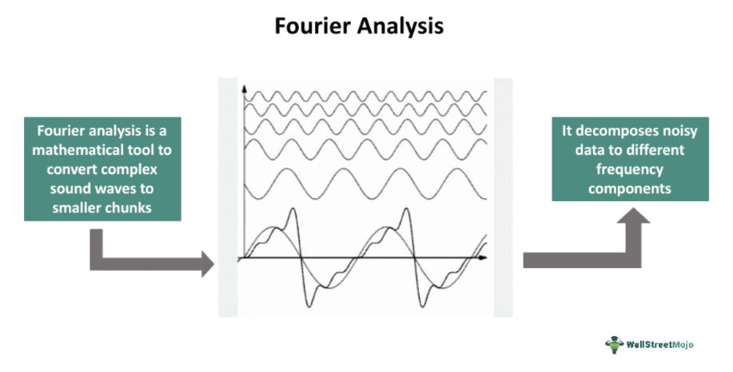

Fourier analysis is a powerful mathematical tool that decomposes complex signals into simpler sinusoidal components. This process, named after the French mathematician Jean-Baptiste Joseph Fourier, provides essential insights into signal characteristics, revealing patterns that are not immediately apparent. The fundamental principles of Fourier analysis—such as Fourier series and the Fourier transform—enable the transformation of signals from the time domain to the frequency domain, thus offering a clearer perspective on the signal's behavior.

The application of mathematical techniques in financial markets is crucial due to the complex and dynamic nature of these environments. Advanced mathematics aids in the development of models and algorithms that can forecast trends, identify patterns, and make informed trading decisions. Among the array of mathematical approaches utilized, Fourier analysis plays a prominent role by allowing traders and analysts to filter noise, detect cycles, and optimize trading strategies based on market dynamics.



In the modern era, the relevance of Fourier analysis extends well beyond its initial applications in heat conduction and acoustics. Signal processing has become one of its prominent areas, where Fourier analysis is used extensively to enhance audio quality, compress data, and improve telecommunications systems. Similarly, in the domain of algorithmic trading, Fourier analysis assists in the examination of price movements and volatility, assisting traders in optimizing their strategies.

This article will provide an overview of Fourier analysis, exploring its mathematical foundations and historical development. We will examine its applications in signal processing, where it serves as a cornerstone of audio and image processing, and its crucial role in algorithmic trading, highlighting how financial signals can be analyzed to extract meaningful insights. Readers can anticipate a detailed exploration of these concepts, complemented by case studies that illustrate real-world applications and successes. Additionally, the article will discuss the challenges faced in these fields and explore future directions, emphasizing how emerging technologies could shape the future use of Fourier analysis in both digital and financial contexts.

By understanding Fourier analysis and its widespread applications, readers will gain insight into its transformative impact on technologies and markets. This knowledge underscores the importance of mathematical literacy and continuous learning to adapt to ongoing technological advancements and evolving market needs.

## Table of Contents

## Understanding Fourier Analysis

Fourier analysis is a mathematical procedure that decomposes complex signals into simpler, sinusoidal components. Fundamentally, it leverages the orthogonality of sine and cosine functions to represent periodic signals as a sum of simple oscillating functions. This process is integral to understanding and manipulating time-domain signals through frequency-domain techniques.

Historically, Fourier analysis is named after Jean-Baptiste Joseph Fourier, a French mathematician who studied heat transfer in the early 19th century. His work laid the groundwork for the development of what we now call the Fourier series, as presented in his seminal work, "Théorie analytique de la chaleur" (The Analytical Theory of Heat) published in 1822. His methodology has since expanded to various scientific domains, pioneering advancements in signal processing, acoustics, and more.

The Fourier series is a way to represent a periodic function as a sum of sine and cosine terms, known as harmonics. Mathematically, if $f(t)$ is a periodic function with period $T$, it can be expressed as:

$$
f(t) = a_0 + \sum_{n=1}^{\infty} \left[ a_n \cos\left(\frac{2\pi nt}{T}\right) + b_n \sin\left(\frac{2\pi nt}{T}\right) \right]
$$

where:
- $a_0$ is the average (or DC component) of the function over one period.
- $a_n$ and $b_n$ are the Fourier coefficients calculated as:

$$
a_n = \frac{2}{T} \int_0^T f(t) \cos\left(\frac{2\pi nt}{T}\right) dt
$$

$$
b_n = \frac{2}{T} \int_0^T f(t) \sin\left(\frac{2\pi nt}{T}\right) dt
$$

For non-periodic functions, the Fourier transform provides a means of extending the Fourier series to continuous time signals, translating them into their constituent frequencies. The Fourier transform of a continuous time signal $x(t)$ is given by:

$$
X(f) = \int_{-\infty}^{\infty} x(t) e^{-j 2\pi f t} dt
$$

where $X(f)$ represents the frequency domain representation of $x(t)$.

Fourier analysis is crucial in simplifying complex signals by breaking them into basic sinusoids, aiding in problem-solving and analysis across various fields, particularly in signal processing and communications. It permits the isolation of critical frequency components, the examination of periodic behaviors, and the filtering of different signal types. 

Mathematical tools such as the Fast Fourier Transform (FFT) efficiently compute the Fourier transform and inverse Fourier transform, making them essential in digital signal processing applications. The FFT reduces computational complexity from $O(N^2)$ for a discrete Fourier transform to $O(N \log N)$, where $N$ is the number of sample points.

In summary, Fourier analysis serves as a fundamental component in mathematically dissecting and reconstructing signals, facilitating advancements in numerous scientific and technological arenas.

## Applications in Signal Processing

Fourier analysis plays a crucial role in signal processing by transforming complex signals in the time domain into simpler representations in the frequency domain. This process is fundamental to many practical applications, as it allows for the efficient analysis, modification, and synthesis of signals.

### Transforming Time-Domain Signals to Frequency-Domain

The transformation from the time domain to the frequency domain is achieved using the Fourier Transform, a mathematical tool that decomposes a function (or signal) into its constituent frequencies. The most commonly used form is the Discrete Fourier Transform (DFT), computed using the Fast Fourier Transform (FFT) algorithm, which is widely implemented in various computational tools due to its efficiency. The basic formula for the DFT of a sequence $x_n$ of length $N$ is:

$$
X_k = \sum_{n=0}^{N-1} x_n \cdot e^{-i 2 \pi k n / N}
$$

where $X_k$ represents the frequency component at index $k$, and $i$ is the imaginary unit. This transformation enables signal processing engineers to analyze the spectral content of signals and perform various operations like filtering and compression.

### Real-World Applications

In audio processing, Fourier analysis is used to analyze and synthesize sounds. It helps in noise reduction, equalization, and even music production by allowing the manipulation of specific frequency components of an audio signal. For instance, in noise-cancelling headphones, Fourier techniques are used to identify and suppress unwanted noise frequencies.

In image processing, Fourier transform methods facilitate the compression and enhancement of images. By transforming image data to the frequency domain, one can easily perform operations such as filtering to sharpen or blur images, and compress data by reducing less significant frequency components, as seen in the JPEG compression algorithm.

Telecommunications benefit significantly from Fourier analysis through its application in modulating and demodulating signals for transmission over various media. It aids in frequency hopping, spread spectrum techniques, and channel equalization, which are vital for transmitting data efficiently and reducing error rates in communication systems.

In biomedical engineering, Fourier analysis assists in the analysis of biomedical signals like Electrocardiograms (ECGs) and Electroencephalograms (EEGs). It enables the extraction of meaningful features from complex biomedical data, improving diagnosis and monitoring of health conditions.

### Advantages in Filtering, Compression, and Noise Reduction

The frequency domain representation of signals allows for straightforward filtering processes. Filters can be designed to attenuate undesirable frequencies (e.g., noise) while preserving or enhancing desired ones (e.g., speech or music). Compression becomes more effective as the transform identifies and discards redundant frequencies, thus minimizing data size without significant loss of quality. Noise reduction techniques, pivotal in both audio and image signals, benefit from Fourier transforms by distinguishing between high-amplitude noise and the main signal components.

### Examples of Signal Processing Problems Solved

Common signal processing challenges resolved with Fourier techniques include the separation of mixed signals, echolocation in sonar and radar systems, and feature extraction from noisy data. An example is the problem of de-blurring images taken with a moving camera. Using Fourier analysis, one can apply a deconvolution filter in the frequency domain to counteract the blur effect and restore image sharpness.

Overall, Fourier analysis remains indispensable in signal processing, providing essential tools for transforming and optimizing signals across various domains and technologies.

## Role in Algorithmic Trading

Fourier analysis is a powerful mathematical tool applied in [algorithmic trading](/wiki/algorithmic-trading) to analyze financial signals, identify patterns, and develop trading strategies. In the financial markets, price movements can be viewed as complex signals composed of different frequencies. Fourier analysis enables the decomposition of these signals, transforming them from the time domain into the frequency domain. This transformation helps identify underlying periodicities and trends that might not be visible in the time domain.

### Analyzing Financial Signals with Fourier Techniques

In the context of algorithmic trading, financial signals such as stock prices, exchange rates, or commodity prices can be analyzed using Fourier transform techniques. By converting these signals into the frequency domain, it is possible to detect cyclical patterns and dominant frequencies that might indicate trend patterns or predict future movements. For example, using the Fast Fourier Transform (FFT), traders can quickly analyze large datasets to identify repeating cycles and adjust their trading strategies accordingly.

$$
F(k) = \sum_{n=0}^{N-1} x(n) e^{-i 2 \pi k n / N}
$$

This FFT equation efficiently calculates the Discrete Fourier Transform (DFT) of a sequence, enabling traders to focus on significant frequency components while filtering out noise.

### Development of Quantitative Trading Strategies

Fourier analysis plays a crucial role in developing [quantitative trading](/wiki/quantitative-trading) strategies. By understanding the frequency components of financial signals, traders can construct models that take advantage of detected cycles or periodicities. These models can include mean-reversion strategies, [momentum](/wiki/momentum) strategies, or filtering techniques that enhance signal processing for decision-making. Quantitative models can utilize Fourier-based indicators such as the spectral density to refine entry and [exit](/wiki/exit-strategy) points in trading algorithms. 

### Challenges and Limitations

Despite its advantages, using Fourier analysis in financial contexts presents several challenges. Financial markets are influenced by numerous factors, resulting in noise and non-stationary signals, which can complicate the detection of meaningful patterns. Overfitting is a significant risk, as traders might construct models that fit historic data perfectly but fail in predicting future trends. Furthermore, markets may exhibit non-linear and chaotic behaviors that Fourier analysis, focused on linear and stationary processes, cannot capture comprehensively.

Moreover, the assumption that financial signals have a strong periodic component might not always hold true, leading to misguided strategies if not carefully validated with robust statistical methods. Computational constraints can also arise with real-time analysis in high-frequency trading environments, requiring optimization techniques to ensure efficiency and accuracy.

### Examples of Algorithmic Trading Systems

There are several algorithmic trading systems that leverage Fourier analysis to achieve their objectives. Some trading models incorporate Fourier transforms to filter out short-term noise in price movements and highlight significant trends, while others might use spectral analysis to detect recurring cycles in market data. For instance, Fourier-based moving averages can be implemented to smooth data, enhancing trend detection over various periods.

Traders often combine Fourier analysis with other methods like [machine learning](/wiki/machine-learning) to increase robustness and adaptability. Hybrid models often provide better performance by accounting for the limitations of purely frequency-based approaches.

In summary, Fourier analysis offers a method to understand and capitalize on the cyclical nature of financial markets through its ability to decompose and analyze complex signals. However, traders must navigate its challenges with sophisticated techniques and comprehensive strategies to ensure its effective application in algorithmic trading.

## Case Studies

Fourier analysis has been instrumental in transforming various domains through its ability to decompose signals into frequencies, providing critical insights and facilitating advanced calculations. In this section, we explore several case studies demonstrating its successful application in signal processing and algorithmic trading.

### Signal Processing

One notable example of Fourier analysis in signal processing is its use in Magnetic Resonance Imaging (MRI). Fourier transforms are employed to convert raw data collected in the MRI scans into images that can be interpreted by medical professionals. This transformation is crucial for reconstructing high-resolution images from the frequency data obtained through the scanning process. The Fourier transform helps distinguish between different tissue types by separating complex signals into their constituent frequencies, thereby enhancing image clarity and diagnostic accuracy.

#### Example: Audio Signal Filtering

In audio processing, Fourier analysis assists in filtering noise from audio recordings. By transforming a time-domain audio signal into its frequency-domain representation, specific frequencies associated with noise can be identified and attenuated. Consider the following Python code snippet using the Fast Fourier Transform (FFT) to filter out noise from an audio signal:

```python
import numpy as np
from scipy.fft import fft, ifft

# Simulated audio signal with noise
time = np.linspace(0, 1, 1000)
audio_signal = np.sin(2 * np.pi * 60 * time) + np.random.normal(0, 0.5, time.shape)

# Perform Fourier Transform
fourier_transform = fft(audio_signal)

# Set threshold and filter noise
threshold = 10
fourier_transform[np.abs(fourier_transform) < threshold] = 0

# Perform Inverse Fourier Transform
filtered_signal = np.real(ifft(fourier_transform))
```

This code demonstrates the capacity of Fourier transforms to filter noise by zeroing out frequencies that fall below a certain threshold, thereby enhancing the signal quality.

### Algorithmic Trading

In financial markets, Fourier analysis is applied to identify cycles and trends within financial time series data, informing trading strategies. By analyzing historical price data through Fourier techniques, traders can detect periodic patterns that might indicate future price movements.

#### Example: Cycle Detection in Stock Prices

A study in the stock market might involve using Fourier analysis to identify cyclical behavior in stock prices. By applying a Fourier transform to historical stock data, traders can extrapolate significant frequency components, suggesting potential buy or sell signals. Below is a conceptual Python implementation of this technique:

```python
import yfinance as yf  # For more datasets, visit: https://paperswithbacktest.com/datasets

# Fetching historical price data
stock_data = yf.download('AAPL', start='2022-01-01', end='2023-01-01')['Close']
time = np.arange(len(stock_data))

# Perform Fourier Transform
stock_fft = fft(stock_data)

# Identify dominant frequencies
dominant_frequencies = np.argsort(np.abs(stock_fft))[-5:]  # Top 5 frequencies

print("Dominant frequencies: ", dominant_frequencies)
```

This example highlights how identifying dominant frequencies can aid in predicting cyclical trends, crucial for algorithmic trading strategies.

### Insights and Best Practices

The studies highlighted above underscore the diverse applications and significant impact of Fourier analysis across different domains. Key insights include:

1. **Precision in Filtering**: Fourier transforms enable precise filtering of unwanted components from signals, crucial in both medical imaging and audio processing.
2. **Cycle Identification in Financial Markets**: Detecting cycles using Fourier analysis allows traders to forecast market conditions more accurately, thus enhancing decision-making processes.
3. **Algorithm Efficiency**: Implementing Fast Fourier Transform (FFT) significantly reduces computational costs, making real-time applications feasible.

From these cases, a few best practices emerge:
- Ensure a deep understanding of signal characteristics before applying Fourier techniques to achieve the desired outcomes.
- Leverage computational tools to perform efficient Fourier transformations, especially in large datasets typical of financial contexts.
- Regularly update models and techniques to adapt to newly available data and evolving market conditions.

These applications demonstrate Fourier analysis's pivotal role in enhancing technology and financial systems, providing a foundation for future innovations in these fields.

## Challenges and Future Directions

The application of Fourier analysis in both signal processing and algorithmic trading encounters several challenges that can impact its effectiveness and expandability. One major challenge is the increasing complexity and [volume](/wiki/volume-trading-strategy) of data. In signal processing, for instance, dealing with large datasets such as high-resolution images or real-time video streams can pose computational difficulties. Similarly, in algorithmic trading, the proliferation of financial data and the need for real-time analysis can strain existing Fourier-based systems.

Another challenge in signal processing is the non-stationary nature of many real-world signals, such as economic data or natural sounds, which can limit the applicability of traditional Fourier methods designed for stationary signals. While Fourier analysis excels in transforming stationary signals from the time domain to the frequency domain, it may not be as effective for non-stationary signal analysis without adaptations or complementing methods.

Emerging trends and innovations are paving the way for more sophisticated applications of Fourier analysis. One trend is the integration with machine learning algorithms, where Fourier transform features can enhance model performance. In digital technologies, Fourier analysis is increasingly used alongside wavelet transforms to better handle non-stationary signals, offering a multi-resolution analysis that can adapt to changing signal characteristics.

Looking to the future, developments in hardware, such as quantum computing and neuromorphic engineering, may further extend the capabilities of Fourier analysis. Quantum computing, with its superior parallel processing power, could potentially mitigate the computational limitations currently facing Fourier methods in data-intensive applications.

The integration of Fourier analysis with other mathematical models represents a promising area of exploration. Coupling Fourier analysis with statistical methods or stochastic models could enhance its efficacy in algorithmic trading, enabling more robust pattern recognition in financial markets. Hybrid models that combine Fourier analysis with other analytical techniques like Principal Component Analysis (PCA) or Kalman filters are also being explored to address complex, multi-dimensional problems.

The evolving landscape of these industries places a premium on advanced mathematics. As the fields of signal processing and algorithmic trading continue to intersect with emerging technologies, such as blockchain and the Internet of Things (IoT), the role of mathematical frameworks like Fourier analysis will become even more critical. Its ability to transform and simplify data will be crucial for extracting actionable insights from increasingly integrated technological ecosystems.

In conclusion, while challenges exist in the contemporary applications of Fourier analysis, ongoing innovations and integrative approaches are creating new opportunities for its advancement. The continued evolution of computational methods and the integration with other disciplines will likely see Fourier analysis maintaining its foundational status in both digital signal processing and financial analytics.

## Conclusion

Fourier analysis has emerged as a pivotal mathematical technique, profoundly impacting both signal processing and algorithmic trading. Its ability to decompose complex signals into simpler, constituent frequency components has enabled significant advancements across various domains. In signal processing, Fourier analysis facilitates efficient filtering, compression, and noise reduction, critical in audio processing, telecommunications, and biomedical engineering. These transformations from time-domain to frequency-domain representations allow for enhanced data handling and interpretation, illustrating its transformative effects.

In the financial sector, Fourier analysis has optimized algorithmic trading by enabling the identification of patterns and trends within financial signals. This capability has been crucial for developing sophisticated quantitative trading strategies, providing traders with a competitive edge in a fast-paced financial environment. Despite facing challenges such as adapting to non-stationary market data, Fourier methods have proven beneficial when integrated with comprehensive trading systems.

Continuous learning and adaptation are essential elements for leveraging Fourier analysis effectively in these rapidly evolving fields. The progress and innovations witnessed today will serve as the foundation for future breakthroughs, highlighting the necessity for ongoing research and exploration of Fourier analysis applications. As technology and financial markets evolve, the integration of mathematical models, such as Fourier analysis, with emerging technologies will likely lead to further enhancements in these domains.

In summary, Fourier analysis stands at the forefront of both technological and financial advancements, demonstrating the profound impact of mathematical tools on modern solutions. Encouraging further study will undoubtedly lead to novel applications and improvements, ensuring that mathematics continues to play a crucial role in shaping future technological and financial landscapes.

## References & Further Reading

[1]: Bourg, D. M. (2002). ["Physics for Game Developers."](https://archive.org/details/physicsforgamede0000bour) O'Reilly Media.

[2]: van den Berg, R., & McDonald, J. (2006). ["Fourier Series and Their Applications."](https://www.cambridge.org/core/books/abs/fourier-and-laplace-transforms/applications-of-fourier-series/2F836BD2A1310C04A611070113283429) Mathematical Gazette.

[3]: Mallat, S. (2008). ["A Wavelet Tour of Signal Processing: The Sparse Way."](https://www.sciencedirect.com/book/9780123743701/a-wavelet-tour-of-signal-processing) Academic Press.

[4]: Oppenheim, A. V., & Schafer, R. W. (2009). ["Discrete-Time Signal Processing."](https://edisciplinas.usp.br/pluginfile.php/7572736/mod_resource/content/1/Oppenheim%20-%20Discrete-Time%20Signal%20Processing.pdf) Prentice Hall.

[5]: Priestly, M. B. (1981). ["Spectral Analysis and Time Series."](https://archive.org/details/spectralanalysis0000prie) Academic Press. 

[6]: Stoica, P., & Moses, R. L. (2005). ["Spectral Analysis of Signals."](https://user.it.uu.se/~ps/SAS-new.pdf) Prentice Hall.

[7]: Mallat, S., Zhang, Z. (1993). ["Matching Pursuits with Time-Frequency Dictionaries."](https://ieeexplore.ieee.org/document/258082) IEEE Transactions on Signal Processing.

[8]: Cooley, J. W., & Tukey, J. W. (1965). ["An Algorithm for the Machine Calculation of Complex Fourier Series."](https://www.ams.org/journals/mcom/1965-19-090/S0025-5718-1965-0178586-1/S0025-5718-1965-0178586-1.pdf) Mathematics of Computation.

[9]: Pinsky, M. A. (2002). ["Introduction to Fourier Analysis and Wavelets."](https://bookstore.ams.org/view?ProductCode=GSM/102) American Mathematical Society.