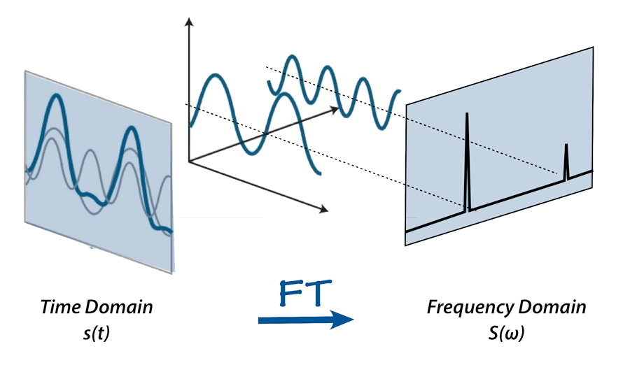

## Table of Contents

## What is a Fourier Transform and why is it important in machine learning?

A Fourier Transform is a mathematical tool that helps us understand how a signal, like a sound or an image, can be broken down into different frequencies. Imagine you have a piece of music; the Fourier Transform can tell you which notes (frequencies) are playing and how strong each note is. It does this by converting the signal from its original form (like time or space) into a representation of the frequencies that make it up. The formula for a continuous Fourier Transform is $$F(\omega) = \int_{-\infty}^{\infty} f(t)e^{-i\omega t} dt$$, where \(f(t)\) is the original signal, and \(F(\omega)\) is the signal in the frequency domain.

In machine learning, the Fourier Transform is important because it helps us analyze and process data more effectively. For example, in image processing, we can use it to remove noise or enhance certain features of an image by working in the frequency domain. This is useful in tasks like image recognition, where clearer images lead to better performance. Additionally, in time series analysis, the Fourier Transform can help identify patterns and trends that are not obvious in the time domain. By transforming data into the frequency domain, machine learning algorithms can better understand and model complex data, leading to more accurate predictions and insights.

## How does the Discrete Cosine Transform (DCT) differ from the Fourier Transform?

The Discrete Cosine Transform (DCT) and the Fourier Transform are both used to convert data from its original form into a representation of its frequency components, but they do so in slightly different ways. The Fourier Transform, particularly the Discrete Fourier Transform (DFT), is used for both real and complex data and can represent both the magnitude and phase of the frequencies. In contrast, the DCT is specifically designed for real data and focuses only on the magnitude of the frequencies, which makes it more efficient for certain applications like image and audio compression.

One key difference between the DCT and the Fourier Transform is how they handle the data at the boundaries. The DCT assumes the signal is symmetric and periodic, which helps in reducing the "edge effects" that can occur in the Fourier Transform. This makes the DCT particularly useful in image compression, where it is used in formats like JPEG. The DCT can be expressed as $$Y_k = \sum_{n=0}^{N-1} x_n \cos \left[ \frac{\pi}{N} \left( n + \frac{1}{2} \right) k \right]$$ for \(k = 0, 1, ..., N-1\), where \(x_n\) is the input sequence and \(Y_k\) is the DCT output. This formula shows how the DCT transforms the data into a sum of cosine functions, which is different from the complex exponentials used in the Fourier Transform.

## Can you explain the concept of Characteristic Functions in the context of Fourier Transforms?

Characteristic functions are a special kind of Fourier Transform used in probability and statistics. They help us understand the behavior of random variables by transforming their probability distributions into the frequency domain. Imagine you have a set of data points representing how likely different outcomes are. The characteristic function takes this data and converts it into a form that tells you about the underlying patterns or properties of the data, like its mean or variance, without directly showing you the data itself.

The formula for a characteristic function is similar to the Fourier Transform but uses a slightly different approach. For a random variable \(X\), the characteristic function \(\phi_X(t)\) is defined as $$\phi_X(t) = E[e^{itX}] = \int_{-\infty}^{\infty} e^{itx} f_X(x) \, dx$$, where \(E\) is the expected value, \(i\) is the imaginary unit, and \(f_X(x)\) is the probability density function of \(X\). This formula shows how the characteristic function captures the essence of the random variable's distribution in a way that's easy to work with mathematically, making it a powerful tool for analyzing and understanding data in statistics and machine learning.

## What is the MCKERNEL transform and how is it applied in machine learning?

The MCKERNEL transform is a way to look at data in machine learning by changing it into a different form that can be easier to understand or work with. It's kind of like the Fourier Transform, but instead of looking at the frequencies in the data, it looks at how the data changes over time or space in a way that's useful for machine learning tasks. The MCKERNEL transform helps to see patterns in the data that might not be obvious at first, and it does this by using special functions called kernels. These kernels help to smooth out the data and highlight important features that can be used to make better predictions or understand the data better.

In machine learning, the MCKERNEL transform is used to improve how models work with data. For example, if you're trying to predict something based on a lot of data points, the MCKERNEL transform can help by turning those data points into a form that's easier for the model to understand. This can make the model more accurate because it can see the important parts of the data more clearly. The transform is especially useful in tasks like time series analysis or image processing, where understanding how data changes over time or space is important. By using the MCKERNEL transform, machine learning models can be more effective at finding patterns and making predictions.

## How does the timecausgabor transform work and what are its applications in signal processing?

The timecausgabor transform is a way to look at signals that change over time, like sounds or vibrations. It's special because it keeps track of when things happen, which is important for understanding how signals behave in real life. Imagine you're listening to a piece of music. The timecausgabor transform can tell you not just what notes are playing, but also when each note starts and stops. It does this by using something called a Gabor function, which is a type of wave that can be moved around in time and stretched or squeezed to match the signal. This helps to see both the frequency of the signal and when those frequencies happen, making it easier to analyze and work with the signal.

In signal processing, the timecausgabor transform is really useful for things like speech recognition and music analysis. For example, if you want to turn spoken words into text, you need to know not just what sounds are being made, but also when they happen. The timecausgabor transform can help by breaking down the speech into pieces that show both the sounds and their timing. This makes it easier for computers to understand and process the speech accurately. It's also used in music processing to analyze different instruments or notes in a piece of music, helping to separate and study them individually. By understanding the timing and frequency of signals, the timecausgabor transform helps make signal processing more effective and accurate.

## What are the advantages of using the discgabor transform over traditional Fourier methods?

The discgabor transform is a special way to look at signals that's different from traditional Fourier methods. It's good at showing both the frequency and the time of a signal at the same time. Imagine you're listening to a song and want to know not just what notes are playing, but also when they start and stop. The discgabor transform can do that by using something called a Gabor function, which is like a wave that can be moved around and changed to fit the signal. This helps to see how the signal changes over time, which is something that traditional Fourier methods can't do as well. Traditional Fourier methods are great at telling you what frequencies are in a signal, but they don't tell you when those frequencies happen. So, if you need to know both, the discgabor transform is better.

In practical terms, the discgabor transform is really helpful in things like speech recognition and music analysis. For example, if you're trying to turn spoken words into text, you need to know not just what sounds are being made, but also when they happen. The discgabor transform can break down the speech into pieces that show both the sounds and their timing, making it easier for computers to understand and process the speech accurately. It's also used in music processing to analyze different instruments or notes in a piece of music, helping to separate and study them individually. By understanding the timing and frequency of signals, the discgabor transform makes signal processing more effective and accurate, which is something traditional Fourier methods can't do as well.

## How can Fourier-related transforms be used to improve the performance of neural networks?

Fourier-related transforms can help neural networks work better by changing the data they use into a form that's easier to understand. These transforms, like the Fourier Transform, take the original data and turn it into a representation of its frequencies. This can help the neural network see patterns in the data that might be hard to spot otherwise. For example, if you're using a neural network to recognize images, the Fourier Transform can help by breaking down the image into different frequencies, which can make it easier for the network to pick out important features like edges or textures. By working with the data in the frequency domain, the neural network can learn more effectively and make better predictions.

In addition to the Fourier Transform, other transforms like the Discrete Cosine Transform (DCT) or the Gabor transform can also be used to improve neural network performance. The DCT, for instance, is great for compressing data, which can make it easier and faster for the neural network to process. The formula for the DCT is $$Y_k = \sum_{n=0}^{N-1} x_n \cos \left[ \frac{\pi}{N} \left( n + \frac{1}{2} \right) k \right]$$, which shows how it turns the data into a sum of cosine functions. The Gabor transform, on the other hand, is useful for looking at how signals change over time, which can be important for tasks like speech recognition. By using these transforms, neural networks can handle complex data more efficiently, leading to better performance and more accurate results.

## What are the computational complexities of different Fourier-related transforms and how do they impact their use in machine learning?

The computational complexity of Fourier-related transforms like the Fourier Transform, Discrete Cosine Transform (DCT), and Gabor transform can affect how they are used in machine learning. For example, the Fast Fourier Transform (FFT), which is a quick way to do the Fourier Transform, has a complexity of $$O(n \log n)$$. This means it can handle big sets of data pretty quickly, making it useful for tasks like image processing where you need to look at a lot of data points. The DCT, which is often used for data compression, also has a complexity of $$O(n \log n)$$ when using a fast algorithm. This makes it good for tasks where you want to make the data smaller before feeding it into a machine learning model. The Gabor transform, which is great for looking at how signals change over time, has a higher complexity because it needs to do more calculations to keep track of both time and frequency. This can make it slower but still useful for tasks like speech recognition where timing is important.

In machine learning, these complexities matter because they affect how fast and how well a model can work with data. If a transform is too slow, it might not be practical for big datasets or for real-time applications where speed is important. For example, the FFT's $$O(n \log n)$$ complexity makes it a good choice for many machine learning tasks because it's fast enough to handle large amounts of data without slowing down the model too much. On the other hand, the higher complexity of the Gabor transform might make it less suitable for tasks where speed is critical, but it can still be valuable for applications where understanding the timing of signals is more important than speed. By choosing the right transform based on its computational complexity, machine learning models can be more efficient and effective at analyzing and working with data.

## Can you discuss any recent advancements in Fourier-related transforms that have impacted machine learning?

Recent advancements in Fourier-related transforms have significantly impacted machine learning, particularly in the realm of deep learning. One notable advancement is the development of the Fast Fourier Convolution (FFC), which combines traditional convolution operations with Fourier transforms to enhance the performance of neural networks. FFC uses the Fourier Transform to process the data in the frequency domain, which allows the network to capture global information more effectively. This is particularly useful in tasks like image recognition, where understanding the overall structure of an image can lead to better results. The FFC approach has shown to improve the accuracy of models while also reducing the number of parameters needed, making it an efficient choice for many applications.

Another significant advancement is the use of the Discrete Fourier Transform (DFT) in the context of Graph Neural Networks (GNNs). GNNs are designed to work with graph-structured data, which can be challenging to process due to their irregular nature. By applying the DFT to the graph's adjacency matrix, researchers have been able to transform the data into a form that's easier for the GNN to understand. This has led to improvements in tasks like node classification and graph classification, where understanding the relationships between nodes is crucial. The use of DFT in GNNs not only enhances their performance but also opens up new possibilities for analyzing complex network structures in fields like social network analysis and molecular chemistry.

## How do Fourier-related transforms help in feature extraction and dimensionality reduction in machine learning models?

Fourier-related transforms like the Fourier Transform and Discrete Cosine Transform (DCT) help in feature extraction by turning data into a form that shows its frequencies. Imagine you have a picture. The Fourier Transform can break it down into different frequencies, which can highlight important parts like edges or textures. This makes it easier for machine learning models to pick out these features and use them to learn and make predictions. For example, in image recognition, the Fourier Transform can help a model focus on the parts of an image that are most important for identifying what's in the picture. By doing this, the model can learn faster and make better guesses about new images it sees.

These transforms also help with dimensionality reduction, which means making the data smaller and easier to work with. When you use a transform like the DCT, it can compress the data by focusing on the most important frequencies and ignoring the less important ones. The formula for the DCT is $$Y_k = \sum_{n=0}^{N-1} x_n \cos \left[ \frac{\pi}{N} \left( n + \frac{1}{2} \right) k \right]$$, which shows how it turns the data into a sum of cosine functions. This compression can make the data smaller without losing too much important information, which is helpful for machine learning models. Smaller data means the models can process it faster and need less memory, making them more efficient. This is especially useful in tasks like image or audio processing, where the original data can be very large and complex.

## What are the limitations of using Fourier-related transforms in machine learning applications?

Fourier-related transforms like the Fourier Transform and Discrete Cosine Transform (DCT) can be really helpful in machine learning, but they also have some limitations. One big problem is that they don't work well with data that changes a lot over time or space. For example, if you're looking at a video or a piece of music that changes quickly, the Fourier Transform might not be able to keep up with all the changes. It's better at showing you the overall frequencies in the data, but it might miss the details that change from moment to moment. This can make it hard for machine learning models to understand and work with data that's always changing.

Another limitation is that Fourier-related transforms can be slow for big sets of data. Even though the Fast Fourier Transform (FFT) is pretty quick with a complexity of $$O(n \log n)$$, it can still take a lot of time and computer power when you're dealing with huge amounts of data. This can be a problem in machine learning, where you often need to process a lot of information quickly. If the transform takes too long, it might not be practical for real-time applications or for working with very large datasets. So, while Fourier-related transforms are useful, you need to think about these limitations when choosing how to process your data in machine learning projects.

## How can one implement a custom Fourier-related transform in a machine learning pipeline?

To implement a custom Fourier-related transform in a machine learning pipeline, you first need to understand what kind of data you're working with and what specific features you want to extract. Let's say you're working with images and want to use a custom transform to highlight certain frequencies. You could start by defining your transform using a mathematical formula, like the Fourier Transform $$F(\omega) = \int_{-\infty}^{\infty} f(t)e^{-i\omega t} dt$$ or the Discrete Cosine Transform (DCT) $$Y_k = \sum_{n=0}^{N-1} x_n \cos \left[ \frac{\pi}{N} \left( n + \frac{1}{2} \right) k \right]$$. Then, you would write a function in your programming language of choice to apply this transform to your data. For example, in Python, you might use libraries like NumPy or SciPy to perform these calculations efficiently.

Once you have your custom transform function, you can integrate it into your machine learning pipeline. This usually involves preprocessing your data with the transform before feeding it into your model. For instance, if you're using a neural network for image classification, you could apply your custom Fourier-related transform to the images before passing them through the network. This can help the model focus on the important features you've highlighted with your transform. To do this, you might write a preprocessing step in your code that applies the transform and then feeds the transformed data into the model for training and prediction. This way, you can leverage the power of Fourier-related transforms to enhance the performance of your machine learning models.