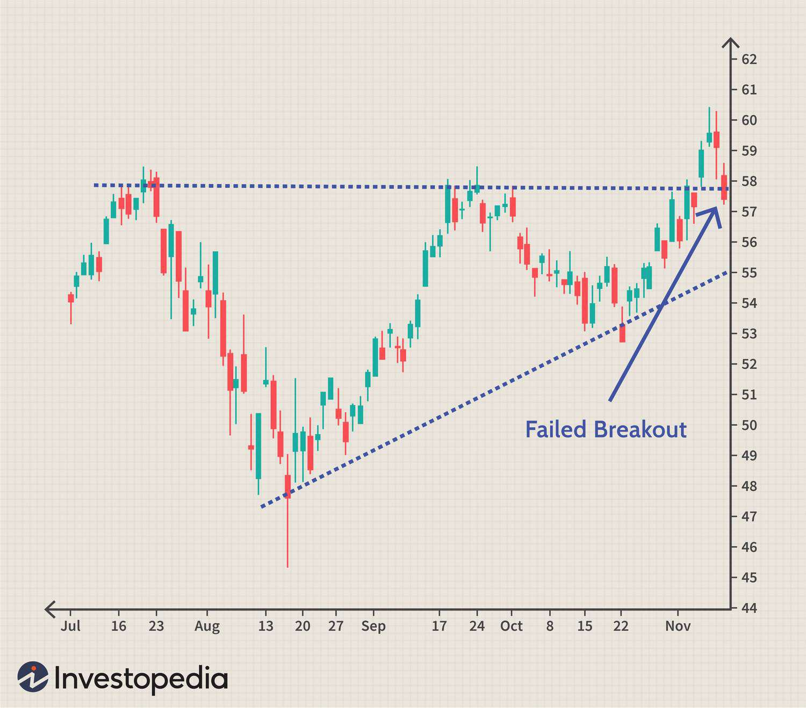

The landscape of financial markets is continuously evolving with the advancement of technology and trading mechanisms. As an integral part of institutional trading, the Fourth Market represents a dynamic shift away from traditional exchanges, emphasizing direct trading between private institutions. This less-known segment offers a notable alternative to conventional trading venues, providing benefits like reduced transaction costs and enhanced privacy.

The concept of the Fourth Market is essential for understanding modern financial ecosystems, particularly for institutional investors who require liquidity for large trades without disruptive market impacts. As financial markets have complexified, the need for such private networks has become pronounced, creating a niche that the Fourth Market effectively fills.



Algorithmic trading, integral to the functioning of the Fourth Market, further enhances its role by employing computer programs that execute trades based on predefined criteria. This approach optimizes execution speed, minimizes costs, and improves market liquidity, aligning with the need for efficiency in large-scale transactions. The intersection of the Fourth Market with algorithmic trading trends signifies a transformative development, impacting the broader financial environment.

This article explores the nuances of the Fourth Market, investigating its implications for institutional investors and the financial ecosystem. The relationship between the Fourth Market and algorithmic trading will also be examined, delivering insights into its future trajectory and potential regulatory challenges. The analysis of these facets is crucial for financial professionals navigating this evolving landscape.

## Table of Contents

## Understanding the Fourth Market

The Fourth Market is a distinctive domain within financial trading, providing a platform for direct transactions between private institutions without the intermediary services of traditional exchanges. This marketplace operates over-the-counter (OTC), signifying trades conducted directly between parties without centralized exchange supervision. A defining characteristic of the Fourth Market is the absence of brokers, which results in a high degree of privacy for the participating entities. This structure caters mostly to institutional investors seeking efficiencies in executing large transactions.

One of the primary benefits of the Fourth Market is the enhanced trading anonymity it offers. By allowing institutions to trade directly with each other, the identities of the parties involved and the details of significant trades can remain confidential. This anonymity is crucial for institutions looking to avoid signaling their strategic moves to the broader market, which could otherwise impact market prices.

Additionally, the Fourth Market is advantageous due to reduced transaction costs. Since these trades do not involve intermediary brokers, institutions can save on fees typically associated with traditional exchange transactions. This cost efficiency is particularly beneficial for high-[volume](/wiki/volume-trading-strategy) transactions, where broker fees could substantially impact profitability.

Another critical advantage of the Fourth Market is its capacity to execute large trades without causing significant market impact. In traditional markets, executing large orders can lead to price fluctuations as the market responds to changes in supply and demand. However, the private nature of the Fourth Market allows institutions to complete such transactions inconspicuously, mitigating potential adverse effects on pricing.

Contrary to the more public-facing primary and secondary markets, the Fourth Market remains inaccessible to retail investors. This exclusivity leads to reduced transparency when compared to more traditional marketplaces. The limited transparency poses both an advantage in maintaining confidentiality and a challenge in offering visibility into market dynamics for non-participating entities. Thus, while the Fourth Market provides significant benefits for institutional traders, it also represents a complex segment of the financial landscape requiring careful navigation.

## Algorithmic Trading in the Fourth Market

Algorithmic trading represents a transformative approach in the Fourth Market, primarily using sophisticated computer algorithms to execute trading orders at speeds and frequencies that surpass human capability. This trading method is particularly critical in an environment like the Fourth Market, where large volumes of securities are exchanged between institutional investors without the mediation of traditional exchanges. 

In the Fourth Market, [algorithmic trading](/wiki/algorithmic-trading) is indispensable due to its efficiency in handling substantial order sizes and its capacity to maintain trading anonymity. These algorithms are designed to optimize various aspects of trade execution, thereby decreasing the time it takes to complete transactions, minimizing transaction costs, and boosting overall market [liquidity](/wiki/liquidity-risk-premium). The use of these algorithms enables institutions to execute large trades with minimal risk of market impact, meaning the trades do not significantly alter the security's price in the market. 

At the core of algorithmic trading in the Fourth Market is the application of mathematical models and formulas. These models determine optimal trading parameters, such as timing, price, and volume. For example, a basic algorithm might be constructed to trade a stock by dividing a large order into smaller blocks, executing these smaller trades incrementally over a set period to reduce market impact and lower transaction costs.

High-frequency trading ([HFT](/wiki/high-frequency-trading-strategies)), a specialized form of algorithmic trading, is highly prevalent in the Fourth Market. HFT algorithms capitalize on small price discrepancies by executing trades within fractions of a second, thereby [earning](/wiki/earning-announcement) profits on slight differences in buying and selling prices. This rapid trading technique is advantageous in capturing [arbitrage](/wiki/arbitrage) opportunities that arise from minimal price differences across various electronic trading platforms. 

The implementation of high-frequency trading necessitates a robust technological infrastructure. Firms engaged in HFT must invest in cutting-edge technology and data feeds to ensure minimal latency and maximal computational efficiency. Such infrastructure empowers them to process massive volumes of trade-related data within milliseconds, ultimately facilitating high-speed decision-making processes that are integral to profitable algorithmic strategies.

Despite its advantages, the adoption of algorithmic and high-frequency trading in the Fourth Market does present challenges, including regulatory concerns over fair market practices and the potential exacerbation of market [volatility](/wiki/volatility-trading-strategies). However, when appropriately managed, these algorithmic methods significantly contribute to a more efficient and liquid Fourth Market, thereby serving the interests of institutional traders seeking discretion and cost-effectiveness in their trading activities.

## Benefits and Challenges

The Fourth Market presents several advantages and challenges that characterize its role in institutional trading. One of the primary benefits of Fourth Market trading is confidentiality. Transactions conducted in this market occur directly between private institutions without the intermediation of brokers, allowing for privacy and discretion. This anonymity is particularly beneficial when executing large block trades, as it prevents revealing trading intentions to the broader market, thereby minimizing the likelihood of adverse price movements.

Cost savings represent another significant advantage. By bypassing the services of traditional brokerage firms and exchanges, participants in the Fourth Market can reduce transaction costs. The absence of brokerage fees, along with lower market impact costs due to large, discreet trades, results in overall financial efficiencies for institutional investors.

Market stability is enhanced for large transactions within the Fourth Market, as trades can be executed without the spillage and volatility often associated with sizeable orders in more public markets. The ability to transfer large volumes without disturbing prevailing market prices aids in maintaining equilibrium and preventing abrupt fluctuations.

However, the Fourth Market also presents notable challenges. Regulatory scrutiny is a persistent concern, as this market’s opaque nature can obscure activities and potentially foster conditions conducive to market manipulation. With regulators increasingly focused on transparency and fairness, Fourth Market practices are under consistent evaluation to ensure compliance and integrity.

Liquidity challenges may arise due to the exclusivity of participants and the limited interaction with broader market forces. This seclusion can result in reduced liquidity, potentially hindering the efficient conversion of assets and causing difficulty in entering or exiting significant positions.

A reliance on sophisticated technology is another challenge inherent to Fourth Market trading. Institutions must employ advanced algorithms and robust IT infrastructure to effectively navigate and compete in this environment. The complexity of the technology required necessitates substantial investment and expertise to ensure optimal performance and security.

Dark pools, a subset of the Fourth Market, exacerbate transparency concerns. These private trading venues allow for the anonymous execution of large orders but often lack the visible order [books](/wiki/algo-trading-books) of traditional exchanges. Consequently, while they provide additional liquidity and anonymity, they also contribute to opacity in the overall market structure, raising apprehensions about fair access and price discovery.

In summary, while the Fourth Market offers significant advantages in terms of confidentiality, cost reductions, and market stability, it also faces challenges related to regulatory pressures, liquidity constraints, and technological demands. Moreover, dark pools within this market enhance its depth but pose ongoing concerns regarding transparency and market integrity.

## Regulatory Environment and Implications

The Fourth Market operates with minimal regulatory oversight compared to traditional public exchanges. Its primary focus is on maintaining privacy and exclusivity for participating institutional investors. This market, often characterized by dark pools and over-the-counter (OTC) trading, allows for transactions that are less visible to the public eye, which can shield participants from the price impacts common in more transparent environments.

Despite its private nature, there is an increasing regulatory interest aimed at enhancing transparency and preventing potential market manipulation within the Fourth Market. For regulators, the challenge lies in striking a balance between implementing controls that ensure market integrity and avoiding excessive regulation that could hinder the market's efficiency and appeal. A critical aspect of this balance involves preventing practices that might compromise fairness, such as insider trading or manipulative tactics, while still preserving the core advantages of the Fourth Market, including cost savings and large transaction handling.

The move towards more regulation is partly driven by past incidents and concerns about transparency and fairness that have prompted calls for greater oversight. Regulatory bodies like the U.S. Securities and Exchange Commission (SEC) and the European Securities and Markets Authority (ESMA) are pushing for reforms to improve accountability and reduce the potential for illicit activities in these less-regulated trading environments. Efforts such as monitoring trade reporting requirements and scrutinizing the operation of dark pools are measures aimed at ensuring these markets function properly without significantly compromising their fundamental benefits.

However, it is crucial that regulatory measures are carefully calibrated to avoid stifling innovation and the operational advantages inherent in the Fourth Market. Over-regulation could lead to reduced market efficiency, as the rigidity of stringent rules may impede the rapid execution and cost-effectiveness that these markets provide. Consequently, future regulatory frameworks may focus on leveraging technology, including blockchain and advanced algorithms, to enhance transparent auditing and compliance without overtly disclosing sensitive trading intentions. 

The regulatory landscape surrounding the Fourth Market is poised to evolve, with a focus on creating rules that enhance transparency and fairness without undermining the intrinsic values of privacy and efficiency that make this market appealing to institutional traders. As such, regulators will need to continuously adapt their strategies to stay ahead of evolving market practices and technological innovations.

## Future Trends

The Fourth Market is anticipated to undergo significant evolution, driven primarily by technological advancements and an increased demand for efficient large-scale trading. As institutions seek faster and more secure methods for executing substantial transactions, innovations such as blockchain technology and [artificial intelligence](/wiki/ai-artificial-intelligence) (AI) are poised to play transformative roles.

Blockchain technology, with its decentralized nature, offers potential improvements in transaction security and transparency within the Fourth Market. By employing distributed ledger systems, blockchain can simplify processes by providing immutable records of trades while eliminating the dependency on a central authority. The inherent transparency of blockchain could mitigate concerns regarding the opaque nature of private trading platforms, thus fostering greater trust among participating institutions.

The proliferation of AI-driven algorithms is set to further enhance Fourth Market trading capabilities. AI can analyze vast datasets rapidly, enabling the development of sophisticated trading strategies that adapt to market conditions in real time. Machine learning models, particularly those employing [reinforcement learning](/wiki/reinforcement-learning), can continuously improve trading efficiency by learning from interactions with the market environment. Here is a simple example of a Python implementation of a reinforcement learning approach for optimizing trade execution:

```python
import numpy as np

class TradingAgent:
    def __init__(self, action_space):
        self.action_space = action_space  # Possible actions
        self.q_table = np.zeros(action_space)  # Initialize Q-table

    def choose_action(self, state):
        return np.argmax(self.q_table[state])  # Choose the action with highest Q-value

    def update_q_table(self, state, action, reward, next_state, learning_rate=0.1, discount_factor=0.9):
        # Update Q-value using the Q-learning formula
        best_next_action = np.argmax(self.q_table[next_state])
        q_update = reward + discount_factor * self.q_table[next_state, best_next_action]
        self.q_table[state, action] = (1 - learning_rate) * self.q_table[state, action] + learning_rate * q_update

# Example usage
agent = TradingAgent(action_space=(10, 3))  # Assume 10 states and 3 possible actions per state
current_state = 0
action = agent.choose_action(current_state)
# Simulate receiving a reward and transitioning to a new state
reward, next_state = 1, 1
agent.update_q_table(current_state, action, reward, next_state)
```

This example demonstrates how a simple AI trading agent uses reinforcement learning to choose actions based on previous experiences and continuously update its strategy. Such advancements facilitate the rapid execution of large and complex trades with minimal market impact.

The intersection of these technological innovations with the Fourth Market presents opportunities for even greater efficiency and cost-effectiveness in institutional trading. However, these advancements also necessitate diligent management of potential risks, such as cybersecurity threats and algorithmic biases. As we look to the future, the successful integration of these technologies will likely define the competitive landscape of the Fourth Market and influence broader financial markets.

## Conclusion

The Fourth Market occupies a significant position within institutional trading by facilitating substantial transactions with efficiency and discretion. It allows private institutions to engage in direct trades without the intermediation of brokers, creating an environment where large trades can occur without prompting market fluctuations. This efficiency is powered by the advent of algorithmic trading, which leverages technology to optimize trade execution concerning speed, cost, and liquidity. Moreover, high-frequency trading further enhances the possibilities by capitalizing on minute price variances.

However, the Fourth Market presents specific challenges, notably in regulatory and transparency aspects. Its inherent nature of reducing accessibility to retail investors can lead to issues of opacity. With minimal regulatory oversight compared to public markets, there's an ongoing tension between the need for privacy and the demands for greater market transparency. Regulatory bodies increasingly focus on ensuring that these markets operate fairly and do not facilitate market manipulation, though striking the right balance between regulation and innovation remains complex.

For stakeholders in the financial ecosystem, comprehending the intricacies of the Fourth Market, especially in conjunction with algorithmic trading, is crucial. As markets evolve, the intersection of technology and trading will continue to shape the strategies and operational frameworks within this space. Navigating this environment requires a detailed understanding of the Fourth Market's mechanics and the technological methodologies employed within it, ensuring that institutions can leverage these platforms effectively while managing potential risks and challenges.

## References & Further Reading

[1]: Harris, L. (2003). ["Trading and Exchanges: Market Microstructure for Practitioners,"](https://www.amazon.com/Trading-Exchanges-Market-Microstructure-Practitioners/dp/0195144708) Oxford University Press.

[2]: Fabozzi, F. J., Focardi, S., & Fabozzi, T. M. (2006). ["Trends in Quantitative Finance,"](https://www.amazon.com/Quantitative-Equity-Investing-Techniques-Strategies/dp/0470262478) Wiley.

[3]: Hendershott, T., Jones, C. M., & Menkveld, A. J. (2011). ["Does Algorithmic Trading Improve Liquidity?"](https://onlinelibrary.wiley.com/doi/full/10.1111/j.1540-6261.2010.01624.x) The Review of Financial Studies, 24(8), 2915–2950.

[4]: Hasbrouck, J. (2007). ["Empirical Market Microstructure: The Institutions, Economics, and Econometrics of Securities Trading,"](https://academic.oup.com/book/52241) Oxford University Press.

[5]: "Algorithmic and High-Frequency Trading" by Álvaro Cartea, Sébastien Jaimungal, and José Penalva.