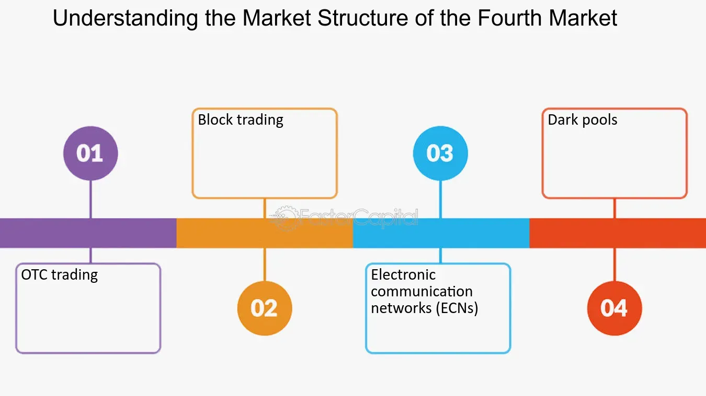

## Table of Contents

## What is the Fourth Market in financial trading?

The Fourth Market refers to the trading of securities directly between institutions without using a stock exchange or a broker. This type of trading happens privately and is often used by large investors, like pension funds or mutual funds, to buy and sell big amounts of stocks or bonds. By trading directly, these institutions can save money on fees and keep their trading plans secret.

This market is different from the other three markets. The First Market is trading on public stock exchanges, the Second Market involves brokers and dealers, and the Third Market is when institutions trade through brokers but not on an exchange. The Fourth Market is special because it cuts out the middleman completely, making it faster and more private. However, it requires both parties to trust each other and have the technology to handle these trades.

## How does the Fourth Market differ from other markets like the First, Second, and Third Markets?

The Fourth Market is different from the other markets because it's where big investors trade securities directly with each other, without using a stock exchange or a broker. This is called over-the-counter trading, and it's private. In the First Market, trading happens on public stock exchanges where everyone can see the trades. The Second Market involves brokers and dealers helping people buy and sell securities. The Third Market is when big investors use brokers to trade, but not on an exchange.

The main difference is that the Fourth Market cuts out the middleman, which can save money on fees and keep trades secret. This is good for big investors like pension funds or mutual funds who want to buy or sell a lot of stocks or bonds without everyone knowing about it. However, it requires trust between the trading parties and special technology to handle these trades directly. In the other markets, there's more transparency and sometimes more protection because there are more people involved in the process.

## Who are the typical participants in the Fourth Market?

The typical participants in the Fourth Market are big investors like pension funds, mutual funds, and other large financial institutions. These organizations have a lot of money to invest and often need to buy or sell large amounts of stocks or bonds. By trading directly with each other, they can avoid the fees that come with using a stock exchange or a broker.

These big investors choose the Fourth Market because it helps them keep their trading plans secret. When they trade on public exchanges, everyone can see what they're doing, which might affect the price of the securities they're interested in. By trading privately, they can make big moves without causing a stir in the market. However, this kind of trading requires trust between the parties and special technology to handle the transactions smoothly.

## What types of securities are commonly traded in the Fourth Market?

In the Fourth Market, big investors often trade stocks and bonds. Stocks are shares in a company, and bonds are like loans that companies or governments give to investors. These securities are the most common because they are what big investors usually have a lot of and need to buy or sell in large amounts.

The Fourth Market is perfect for these big trades because it lets investors do things privately. They can move a lot of money around without everyone knowing about it. This helps them keep their plans secret and not affect the market prices too much. But, to do this, they need to trust each other and use special computer systems to make the trades happen smoothly.

## What are the advantages of trading in the Fourth Market for institutional investors?

Trading in the Fourth Market helps big investors like pension funds and mutual funds save money. When they trade directly with each other, they don't have to pay fees to brokers or stock exchanges. This can make a big difference when they are buying or selling a lot of stocks or bonds. Plus, they can do these big trades faster because there's no middleman slowing things down.

Another big advantage is that trading in the Fourth Market keeps things private. Big investors don't want everyone to know what they're doing because it could change the prices of the securities they're interested in. By trading directly, they can keep their plans secret and move a lot of money around without causing a big stir in the market. However, they need to trust each other and use special computer systems to make these trades happen smoothly.

## How does technology facilitate trading in the Fourth Market?

Technology is really important for trading in the Fourth Market. It helps big investors trade directly with each other without using a stock exchange or a broker. They use special computer systems that can handle these big trades quickly and safely. These systems make sure that the trades happen correctly and that the information stays private. Without this technology, it would be hard for big investors to do these trades without everyone knowing about it.

These computer systems also help keep everything organized. They can match buyers and sellers, handle the money part of the trades, and keep records of everything that happens. This makes it easier for big investors to do a lot of trades without making mistakes or losing important information. So, technology not only makes trading in the Fourth Market possible, but it also makes it faster, safer, and more private.

## What are the regulatory considerations specific to the Fourth Market?

Trading in the Fourth Market has some special rules that big investors need to follow. Because these trades happen directly between institutions without using a stock exchange or a broker, they are not as closely watched by regulators as trades on public exchanges. However, big investors still need to make sure they are following the rules about reporting their trades and not doing anything that could be seen as unfair or illegal. This means they have to keep good records and be ready to show them to regulators if asked.

Even though the Fourth Market is more private, it's still important for big investors to be honest and fair. They need to make sure they are not using inside information or doing anything that could hurt other investors. Regulators might check on these trades to make sure everything is being done the right way. So, while the Fourth Market gives big investors more freedom and privacy, they still have to follow the rules to keep the market fair and safe for everyone.

## Can retail investors participate in the Fourth Market, and if so, how?

Retail investors usually don't participate in the Fourth Market because it's meant for big investors like pension funds and mutual funds. These big investors trade directly with each other without using a stock exchange or a broker. Retail investors, who are regular people with smaller amounts of money to invest, don't have the same need for privacy and large trades that the Fourth Market provides.

However, if a retail investor wants to get involved in the Fourth Market, they might be able to do so through a special type of investment platform or by joining a group of investors. Some platforms let smaller investors pool their money together to make bigger trades, kind of like how big investors do it. But this is not common, and it's still hard for most retail investors to take part in the Fourth Market because they don't have the same resources and technology that big investors use.

## What are the risks associated with trading in the Fourth Market?

Trading in the Fourth Market can be risky because it's not as closely watched by regulators as other markets. Since these trades happen directly between big investors without using a stock exchange or a broker, there's a chance that something could go wrong without anyone noticing right away. Big investors need to trust each other a lot, and if one side doesn't follow the rules or tries to do something unfair, it could cause problems. Also, because these trades are private, it's harder for regulators to check if everything is being done the right way.

Another risk is the technology used to make these trades happen. Big investors use special computer systems to handle these trades, and if something goes wrong with the technology, it could mess up the trades. This could lead to mistakes, lost money, or even security issues if the information gets into the wrong hands. So, while the Fourth Market can save money and keep things private, it also comes with risks that big investors need to be careful about.

## How has the Fourth Market evolved over the past decade?

Over the past decade, the Fourth Market has grown a lot because of new technology. Big investors can now use special computer systems to trade directly with each other more easily. These systems help them do big trades quickly and keep everything private. This has made the Fourth Market more popular because big investors like pension funds and mutual funds can save money on fees and keep their trading plans secret.

The Fourth Market has also become more important because more big investors are using it. They like that they can trade large amounts of stocks and bonds without everyone knowing about it. This helps them move money around without affecting the market prices too much. However, as the Fourth Market has grown, regulators are paying more attention to make sure everything is being done fairly and safely.

## What role do dark pools play in the Fourth Market?

Dark pools are private trading systems that are part of the Fourth Market. They let big investors trade large amounts of stocks or bonds without everyone knowing about it. This helps them keep their trading plans secret and avoid affecting the market prices. Big investors like pension funds and mutual funds use dark pools because they can save money on fees and do big trades quickly and privately.

Even though dark pools are part of the Fourth Market, they are still watched by regulators to make sure everything is fair and safe. Big investors need to trust each other and use special computer systems to handle these trades. Dark pools have become more important over the past decade because they help big investors trade more easily and privately.

## What future trends are expected to impact the Fourth Market?

In the future, technology will keep changing the Fourth Market. Big investors will use even better computer systems to trade directly with each other. These systems will be faster and safer, making it easier for big investors to do big trades without anyone knowing about it. Also, new types of technology like blockchain might be used to make trading even more private and secure. This could make the Fourth Market more popular because big investors will like the privacy and the ability to save money on fees.

Regulators will also play a bigger role in the Fourth Market. As more big investors use it, regulators will watch more closely to make sure everything is fair and safe. They might make new rules to protect investors and keep the market honest. This could change how big investors use the Fourth Market, but it will also help make it a safer place to trade. So, while technology will make the Fourth Market grow, regulators will make sure it stays fair for everyone.

## References & Further Reading

[1]: Harris, L. (2003). ["Trading and Exchanges: Market Microstructure for Practitioners,"](https://www.amazon.com/Trading-Exchanges-Market-Microstructure-Practitioners/dp/0195144708) Oxford University Press.

[2]: Fabozzi, F. J., Focardi, S., & Fabozzi, T. M. (2006). ["Trends in Quantitative Finance,"](https://www.amazon.com/Quantitative-Equity-Investing-Techniques-Strategies/dp/0470262478) Wiley.

[3]: Hendershott, T., Jones, C. M., & Menkveld, A. J. (2011). ["Does Algorithmic Trading Improve Liquidity?"](https://onlinelibrary.wiley.com/doi/full/10.1111/j.1540-6261.2010.01624.x) The Review of Financial Studies, 24(8), 2915–2950.

[4]: Hasbrouck, J. (2007). ["Empirical Market Microstructure: The Institutions, Economics, and Econometrics of Securities Trading,"](https://academic.oup.com/book/52241) Oxford University Press.

[5]: "Algorithmic and High-Frequency Trading" by Álvaro Cartea, Sébastien Jaimungal, and José Penalva.