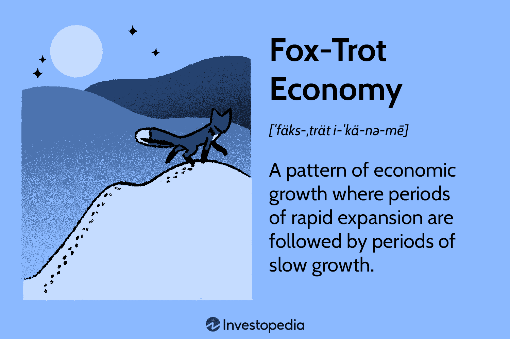

## Table of Contents

## What is the basic concept of the Fox-Trot Economy?

The Fox-Trot Economy is a simple idea about how the economy moves in a kind of dance, like the fox-trot. It goes back and forth between times of growth and times of slowing down. When the economy is growing, people feel good because they have jobs and money to spend. Businesses do well because people are buying things. But then, sometimes the economy slows down. People might lose their jobs or have less money, so they spend less. This can make businesses struggle because they are not selling as much.

This back-and-forth movement is normal and happens over and over again. It's important for people to understand this so they can be ready for the ups and downs. When the economy is doing well, it's a good time to save some money for the times when it might not be doing so well. And when the economy slows down, it's a chance to find new ways to make money or to spend more carefully. By knowing about the Fox-Trot Economy, people can plan better and feel more secure no matter what the economy is doing.

## How did the term 'Fox-Trot Economy' originate?

The term 'Fox-Trot Economy' comes from the idea that the economy moves in a way that is like the fox-trot dance. The fox-trot is a dance where you move forward and then backward in a smooth way. People started using this term to describe how the economy also moves forward with growth and then backward with slowdowns, in a regular pattern.

The term became popular because it helps people understand the economy in a simple way. It shows that the ups and downs of the economy are normal, just like the steps in a dance. By thinking of the economy as a fox-trot, people can see that it's important to be ready for both the good times and the tough times.

## What are the key characteristics of a Fox-Trot Economy?

The Fox-Trot Economy is all about the economy moving back and forth, just like the steps in a fox-trot dance. When the economy is growing, it's like taking a step forward. People have jobs, they earn money, and they spend more. This makes businesses happy because they sell more of their products and services. But then, the economy can slow down, which is like taking a step backward. People might lose their jobs or have less money, so they spend less. This can make it hard for businesses because they don't sell as much.

These ups and downs are a normal part of the Fox-Trot Economy. They happen over and over again, and it's important for people to know this. When the economy is doing well, it's a good time to save some money for when things might get tough. And when the economy is slowing down, it's a chance to be careful with spending and maybe look for new ways to make money. By understanding the Fox-Trot Economy, people can plan better and feel more secure no matter what's happening with the economy.

## Can you explain the phases of the Fox-Trot Economy?

The Fox-Trot Economy has two main phases that keep repeating. The first phase is when the economy is growing, like taking a step forward in the fox-trot dance. During this time, people have jobs and earn money, so they feel good and spend more. This makes businesses happy because they sell more of their products and services. Everyone feels confident and the economy is doing well.

The second phase is when the economy slows down, like taking a step backward in the dance. In this phase, people might lose their jobs or have less money, so they spend less. This can make it hard for businesses because they don't sell as much. But this slowdown is a normal part of the Fox-Trot Economy. It's important for people to know about these phases so they can save money during the good times and be careful with spending during the tough times. By understanding these phases, people can plan better and feel more secure no matter what's happening with the economy.

## How does the Fox-Trot Economy impact businesses?

The Fox-Trot Economy affects businesses a lot. When the economy is growing, businesses do well because people have money to spend. They buy more things, so businesses sell more products and services. This makes businesses happy and they might even hire more people to keep up with all the orders. It's a good time for businesses because they are making more money and growing.

But when the economy slows down, it can be tough for businesses. People don't have as much money, so they spend less. This means businesses sell fewer products and services. They might have to let some workers go or cut back on what they're doing to save money. It's a hard time for businesses because they are making less money and might even lose money. But knowing about the Fox-Trot Economy helps businesses plan for these ups and downs and be ready for both the good times and the tough times.

## What are the differences between a Fox-Trot Economy and other economic models?

The Fox-Trot Economy is different from other economic models because it's all about the back-and-forth movement of the economy, like a dance. Other models, like the business cycle model, also talk about ups and downs, but they might focus more on things like interest rates, inflation, and big economic events. The Fox-Trot Economy keeps it simple by saying the economy moves forward with growth and backward with slowdowns, just like the steps in a fox-trot dance. This makes it easier for people to understand and remember.

Another difference is that the Fox-Trot Economy doesn't go into all the details and reasons why the economy changes. Other models, like the Keynesian model, might talk a lot about government spending, taxes, and how they affect the economy. The Fox-Trot Economy just says that the ups and downs are normal and happen over and over again. It's more about helping people get ready for the good times and the tough times, rather than explaining all the reasons why the economy moves the way it does.

## What historical examples illustrate the Fox-Trot Economy in action?

One clear example of the Fox-Trot Economy happened in the United States during the late 1990s and early 2000s. In the late 1990s, the economy was growing fast. People had jobs and were spending money, which made businesses happy. This was like the forward step in the fox-trot. But then, around 2000, the economy started to slow down. The dot-com bubble burst, and people lost jobs and spent less money. This was like the backward step in the dance. The economy went through a tough time, but it showed how the Fox-Trot Economy works with its ups and downs.

Another example is the Great Recession that started in 2007. Before that, the economy was doing well. People were buying houses and spending money, and businesses were growing. This was the forward step. But then, the housing market crashed, and the economy slowed down a lot. People lost their jobs and had to spend less, which made it hard for businesses. This was the backward step. The Great Recession showed how the economy can go from good times to tough times, just like the Fox-Trot Economy says.

## How can policymakers respond effectively to a Fox-Trot Economy?

Policymakers can help during the good times of the Fox-Trot Economy by making sure the growth is steady and doesn't get out of control. They can do this by keeping an eye on things like interest rates and making sure they're not too low, which could make people borrow too much money. They can also make sure that businesses are not growing too fast, which could lead to problems later. By being careful, policymakers can help keep the economy strong and healthy during the good times.

When the economy slows down, policymakers can help by making it easier for people to spend money again. They can do this by lowering interest rates, so it's cheaper for people to borrow money. They can also help by giving money to people who need it, like through unemployment benefits, so they can keep spending even if they lose their job. By doing these things, policymakers can help the economy start growing again and get ready for the next forward step in the Fox-Trot Economy.

## What are the leading indicators of a Fox-Trot Economy?

Leading indicators of a Fox-Trot Economy are signs that help us know if the economy is about to take a step forward or backward. One important sign is how much people are spending. When people are buying a lot of things, it means the economy might be getting ready to grow. Another sign is the number of jobs. If more people are finding work, it's a good hint that the economy is doing well. Watching these signs can help us get ready for the good times.

On the other hand, if people start spending less money, it might mean the economy is about to slow down. If businesses start letting workers go, that's another sign that tough times might be coming. By keeping an eye on these signs, we can prepare for the times when the economy might take a step backward. Knowing these indicators helps us plan better and stay secure no matter what the economy is doing.

## How do global economic trends influence the Fox-Trot Economy?

Global economic trends can really affect the Fox-Trot Economy. When other countries are doing well, it can help our economy grow. For example, if people in other countries are buying a lot of our stuff, our businesses do better. This can make our economy take a step forward. But if other countries are having tough times, they might buy less from us. This can make our businesses struggle, and our economy might start to slow down, taking a step backward.

These global trends can also change how people feel about the economy. If everyone is talking about how other countries are growing fast, people here might feel more confident and spend more money. This can help our economy keep moving forward. But if there's news about problems in other countries, people might get worried and start spending less. This can make our economy slow down. So, what's happening around the world can make a big difference in how our Fox-Trot Economy dances.

## What advanced strategies can businesses employ to thrive in a Fox-Trot Economy?

Businesses can do well in a Fox-Trot Economy by being ready for both the good times and the tough times. When the economy is growing, businesses can use this time to save some money. They can also try to grow carefully, not too fast, so they don't get into trouble later. It's a good idea to keep an eye on how much they're spending and make sure they're not borrowing too much money. By being careful, businesses can make the most of the good times and be ready for when things might get hard.

When the economy slows down, businesses can still do okay by finding new ways to make money. They can look for new customers or sell new kinds of products. It's also a good time to be careful with spending and maybe even find ways to spend less. Businesses can help their workers by being understanding and maybe offering them new kinds of jobs within the company. By being ready for the ups and downs, businesses can keep going strong no matter what the economy is doing.

## What are the future predictions and potential evolutions of the Fox-Trot Economy?

The Fox-Trot Economy will likely keep going in the future, with the economy moving back and forth like a dance. But there might be some changes. One big thing that could change the Fox-Trot Economy is technology. New technology can make the economy grow faster, like when the internet came along and changed everything. But if technology changes too fast, it might also cause the economy to slow down if people can't keep up. So, businesses and people will need to be ready to adapt to new technology to keep the economy dancing smoothly.

Another thing that might change the Fox-Trot Economy is how the world works together more. Countries are doing more business with each other, and this can help the economy grow. But if something bad happens in one country, it can affect others too. So, the Fox-Trot Economy might start to move more because of what's happening around the world. People and businesses will need to watch what's going on in other countries and be ready for how it might change their own economy. By being ready for these changes, everyone can keep dancing along with the Fox-Trot Economy.

## What is the relationship between Economic Theory and the Role of Volatility?

Economic theories provide significant insight into how varying growth rates influence investment decisions and market confidence. In a fox-trot economy, where economic growth fluctuates between rapid and slow expansion, the concept of volatility becomes a central [factor](/wiki/factor-investing) affecting various financial metrics.

Volatility is a measure of the degree of variation in the price of a financial instrument over time. In the context of a fox-trot economy, it directly impacts asset returns, borrowing costs, and forecasts of corporate earnings. High volatility can lead to increased uncertainty among investors, causing shifts in investment choices as they seek to minimize risk and optimize returns. This uncertainty can lead to a rise in the cost of borrowing as lenders demand higher interest rates to compensate for the increased risk. Additionally, corporate earnings forecasts become less reliable in a highly volatile environment, complicating strategic planning and investment decisions for businesses.

Various economic theories underline the importance of adaptive investment strategies in such an unpredictable growth landscape. For instance, Modern Portfolio Theory (MPT) suggests that diversifying investments can reduce the overall risk of a portfolio. By spreading investments across various asset classes that respond differently to economic changes, investors can achieve a more stable return. The Efficient Market Hypothesis (EMH), on the other hand, proposes that asset prices reflect all available information, and thus, consistently outperforming the market through traditional stock-[picking](/wiki/asset-class-picking) is not feasible. In a volatile economy, this theory highlights the significance of leveraging market data and trends to inform investment strategies.

Additionally, the Capital Asset Pricing Model (CAPM) provides a framework for understanding the relationship between expected return and risk in a fox-trot economy. By evaluating the expected return of an asset, investors can better gauge the level of risk they are willing to undertake. The formula for CAPM is given as:

$$

E(R_i) = R_f + \beta_i(E(R_m) - R_f) 
$$

where $E(R_i)$ is the expected return on an investment, $R_f$ is the risk-free rate, $\beta_i$ is the sensitivity of the asset to overall market movements, and $E(R_m)$ is the expected market return.

To mitigate risks associated with unpredictable economic growth, investors are encouraged to adopt strategies that are both flexible and data-driven. This includes the use of [algorithmic trading](/wiki/algorithmic-trading), which employs sophisticated algorithms to analyze market data rapidly and identify potential trading opportunities. These algorithms can adjust to the dynamic shifts characteristic of a fox-trot economy, maintaining an edge in capturing value even during periods of high volatility.

In summary, economic theories emphasize the pivotal role of understanding and managing volatility to make informed investment decisions. By adapting strategies to the nuances of a fox-trot economy, investors can better navigate the uncertainties and potential rewards inherent in such an economic environment.

## References & Further Reading

[1]: Jeffrey Saut's conceptualizations on economic patterns, as discussed in financial analysis communities.

[2]: ["Advances in Financial Machine Learning"](https://www.amazon.com/Advances-Financial-Machine-Learning-Marcos/dp/1119482089) by Marcos Lopez de Prado

[3]: Markowitz, H. (1952). ["Portfolio Selection"](https://onlinelibrary.wiley.com/doi/abs/10.1111/j.1540-6261.1952.tb01525.x). The Journal of Finance, 7(1), 77-91.

[4]: ["Evidence-Based Technical Analysis: Applying the Scientific Method and Statistical Inference to Trading Signals"](https://www.amazon.com/Evidence-Based-Technical-Analysis-Scientific-Statistical/dp/0470008741) by David Aronson

[5]: Fama, Eugene F. (1970). ["Efficient Capital Markets: A Review of Theory and Empirical Work."](https://www.jstor.org/stable/2325486) The Journal of Finance, 25(2), 383-417.

[6]: ["Machine Learning for Algorithmic Trading"](https://github.com/stefan-jansen/machine-learning-for-trading) by Stefan Jansen

[7]: Sharpe, William F. (1964). ["Capital Asset Prices: A Theory of Market Equilibrium Under Conditions of Risk."](https://onlinelibrary.wiley.com/doi/full/10.1111/j.1540-6261.1964.tb02865.x) The Journal of Finance, 19(3), 425-442.

[8]: ["Quantitative Trading: How to Build Your Own Algorithmic Trading Business"](https://www.amazon.com/Quantitative-Trading-Build-Algorithmic-Business/dp/0470284889) by Ernest P. Chan