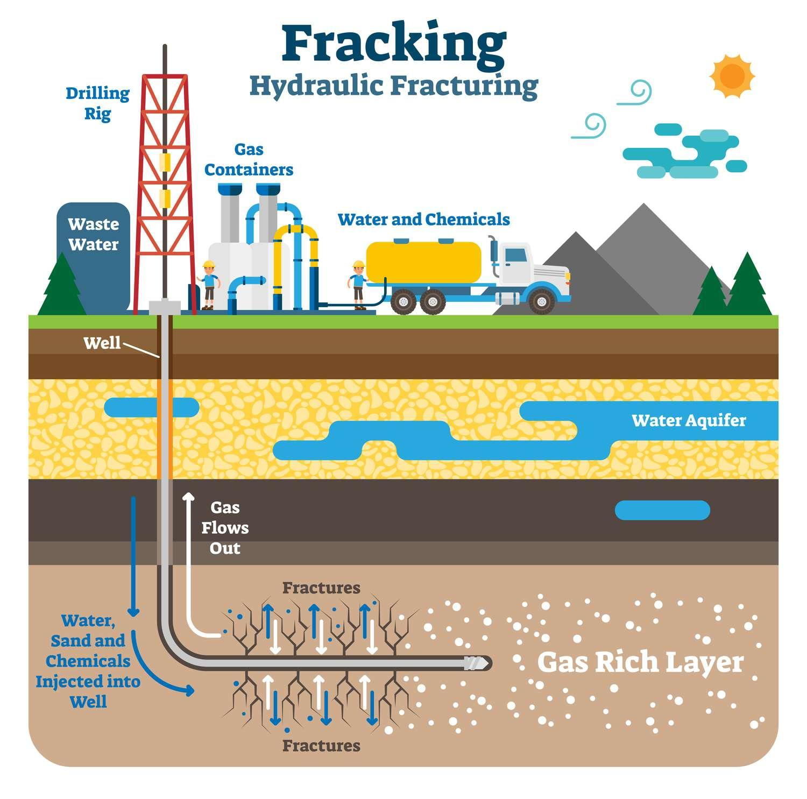

## Table of Contents

## What is fracking and how does it work?

Fracking, short for hydraulic fracturing, is a way to get oil and gas out of the ground. It involves drilling deep into the earth and then using a lot of water, sand, and chemicals to break open rocks underground. This helps release the oil and gas that is trapped inside the rocks.

The process starts with drilling a well deep into the earth, sometimes thousands of feet down. Once the well is drilled, a steel pipe is put into the hole. Then, a mixture of water, sand, and chemicals is pumped into the well at very high pressure. This high pressure causes the rock to crack, and the sand keeps the cracks open. The oil and gas can then flow out of the cracks and up to the surface through the well.

## What are the primary reasons for using fracking?

The main reason for using fracking is to get more oil and gas out of the ground. Many places have oil and gas trapped in rocks that are hard to reach with regular drilling. Fracking helps break these rocks and let the oil and gas flow out. This means we can use energy sources that were hard to get before.

Another reason for using fracking is that it can help countries be less dependent on oil and gas from other places. If a country can get more of its own oil and gas, it doesn't have to buy as much from other countries. This can make the country's energy supply more secure and might even save money.

## Where is fracking commonly practiced around the world?

Fracking is commonly used in the United States. Many states like Texas, Pennsylvania, and North Dakota use fracking to get oil and gas. The US has a lot of shale rock that holds oil and gas, so fracking helps them get more of it out of the ground. This has made the US one of the biggest producers of oil and gas in the world.

In other parts of the world, fracking is also used in places like Canada and Argentina. Canada has a lot of shale gas in areas like Alberta and British Columbia. Argentina is trying to use fracking to get more oil and gas from the Vaca Muerta shale formation. These countries see fracking as a way to use their own energy resources and not have to buy as much from other places.

Some countries in Europe and Asia are starting to use fracking too, but it's not as common there yet. Countries like China and the United Kingdom are looking into fracking to see if it can help them get more energy. But there are also a lot of rules and worries about the environment that can make it hard to start fracking in new places.

## What are the immediate environmental impacts of fracking?

Fracking can have a big impact on the environment right away. One of the biggest problems is that it uses a lot of water. The water mixed with chemicals is pumped into the ground, and this can pollute water sources nearby. If the chemicals leak into rivers or underground water, it can make the water unsafe to drink or use. Also, the process creates a lot of wastewater that has to be treated or stored, and if it's not done right, it can cause more pollution.

Another immediate impact is on the air. Fracking releases gases like methane into the air, which can make the air quality worse. People living near fracking sites might breathe in these gases, which can be bad for their health. The drilling and trucks moving in and out of the site also create noise and dust, which can bother people living nearby and affect their quality of life.

Fracking can also change the land where it happens. The drilling and building of wells can take up a lot of space, and this can harm wildlife and their habitats. The land might be cleared of trees and plants, which can lead to soil erosion. All these changes can have quick effects on the environment around fracking sites.

## How does fracking affect local water supplies?

Fracking can make local water supplies dirty. It uses a lot of water mixed with chemicals to break open rocks underground. If this mix leaks out of the well, it can get into rivers, lakes, or underground water. This can make the water unsafe to drink or use for farming. People living near fracking sites might find their wells or taps have water that smells bad or looks strange because of the chemicals.

Also, fracking creates a lot of wastewater. This wastewater has to be stored or treated, but if it's not done right, it can spill and pollute more water. Sometimes, the wastewater is put back into the ground through injection wells, but if these wells leak, they can also contaminate water supplies. So, fracking can have a big impact on the water that people and animals need to live.

## What are the potential health risks associated with fracking?

Fracking can make people sick because it releases harmful chemicals into the air and water. When fracking happens, it can let out gases like methane and other chemicals that people can breathe in. These gases can cause problems like headaches, dizziness, and breathing issues. If the air is really bad, it can even lead to more serious health problems over time, like heart disease or cancer.

The water near fracking sites can also become unsafe. The chemicals used in fracking can leak into rivers, lakes, or underground water. If people drink this water or use it for cooking and cleaning, it can make them sick. They might get stomach problems, skin rashes, or other health issues. It's important for people living near fracking sites to be careful with their water and to check if it's safe to use.

## How does fracking contribute to greenhouse gas emissions?

Fracking adds to greenhouse gas emissions in a few ways. One big way is by letting out methane, which is a strong greenhouse gas. When fracking happens, methane can escape from the wells and the equipment used. Methane traps heat in the air much more than carbon dioxide, so even small leaks can make a big difference in adding to climate change.

Another way fracking adds to greenhouse gas emissions is through the burning of the oil and gas it produces. When we use the oil and gas for energy, it makes carbon dioxide. Fracking helps us get more oil and gas out of the ground, so more of it gets burned, and more carbon dioxide goes into the air. This makes the problem of climate change even worse.

## What regulations are in place to manage fracking activities?

Different places have different rules to make sure fracking is done safely. In the United States, each state can set its own rules, but there are also some federal rules that everyone has to follow. These rules can say things like how far away fracking can happen from homes and water sources, what chemicals can be used, and how the wastewater has to be handled. The rules are there to help protect the environment and people's health.

In other countries, like Canada and Argentina, there are also rules to manage fracking. These rules can be about making sure the water stays clean, the air stays safe to breathe, and the land is not harmed too much. Sometimes, countries will do studies to see if fracking is safe before they let companies start doing it. The goal is to balance getting more energy with keeping the environment and people safe.

## What are the economic benefits of fracking for local communities?

Fracking can bring a lot of money to local communities. When companies start fracking, they need to hire people to work at the sites. This means more jobs for people who live nearby. These jobs can help people earn more money and spend it in local stores and restaurants, which helps the whole community. Also, the companies have to pay taxes and fees to the local government. This money can be used to fix roads, build schools, and make other improvements that make life better for everyone in the area.

But there are also some downsides to think about. While fracking can bring in a lot of money at first, it might not last forever. Once the oil and gas are gone, the jobs and money might go away too. This can leave the community in a tough spot if they were counting on that money to keep things going. So, while fracking can help the economy in the short term, communities need to plan for what will happen when the fracking stops.

## How does fracking impact seismic activity?

Fracking can cause more earthquakes. When companies pump wastewater back into the ground through injection wells, it can make the ground shake. The water makes the pressure underground go up, and this can cause the earth to move and create small earthquakes. These earthquakes are usually not very big, but they can still be felt by people living nearby.

Sometimes, fracking itself can also cause small earthquakes. When the mix of water, sand, and chemicals is pumped into the ground at high pressure, it can make the rocks move a little bit. This movement can cause small quakes. While these quakes are usually not dangerous, they can still worry people and make them feel unsafe.

## What are the long-term ecological consequences of fracking?

Fracking can change the environment in big ways over a long time. One problem is that it can hurt the land and the animals that live there. When companies drill and build wells, they often clear away trees and plants. This can make the soil wash away and harm the homes of animals. If this keeps happening in the same area for a long time, it can make it hard for plants and animals to come back.

Another long-term effect is on water. The chemicals used in fracking can leak into rivers and underground water over time. This can make the water dirty and unsafe for a long time. If the water stays polluted, it can hurt fish and other water animals. It can also make it hard for people to find clean water to drink and use. So, fracking can have big effects on the environment that last for many years.

## What alternatives to fracking are being researched or implemented?

One alternative to fracking that people are looking at is using renewable energy like wind and solar power. These ways of making energy don't use oil or gas, so they don't need fracking. Wind turbines and solar panels can make a lot of electricity without hurting the environment as much. More and more places are putting up wind farms and solar panels to get away from using oil and gas. This can help lower greenhouse gas emissions and keep the air and water clean.

Another option is to use new technology to get oil and gas out of the ground without fracking. Scientists are working on ways to do this that are less harmful to the environment. For example, some are trying to use heat to get oil and gas out of the ground instead of water and chemicals. This could be safer for the water and the land. But these new ways are still being tested, and it will take time to see if they work well and can be used everywhere.

Some places are also trying to use less oil and gas by making things more energy efficient. This means using less energy to do the same things, like heating homes or running factories. By using less energy, we don't need to get as much oil and gas out of the ground. This can help slow down fracking and protect the environment. It's important to keep looking for and trying out these new ways to meet our energy needs without hurting the planet.

## References & Further Reading

[1]: Osborn, S. G., Vengosh, A., Warner, N. R., & Jackson, R. B. (2011). ["Methane contamination of drinking water accompanying gas-well drilling and hydraulic fracturing."](https://pubmed.ncbi.nlm.nih.gov/21555547/) Proceedings of the National Academy of Sciences.

[2]: IPCC (2007). ["Climate Change 2007: The Physical Science Basis. Contribution of Working Group I to the Fourth Assessment Report of the Intergovernmental Panel on Climate Change."](https://www.ipcc.ch/report/ar4/wg1/) Cambridge University Press.

[3]: Scanlon, B. R., Reedy, R. C., Nicot, J.-P. (2014). ["Will Water Scarcity in Semiarid Regions Limit Hydraulic Fracturing of Shale Plays?"](https://iopscience.iop.org/article/10.1088/1748-9326/9/12/124011/pdf) Environmental Research Letters.

[4]: Ellsworth, W. L. (2013). ["Injection-Induced Earthquakes."](https://www.science.org/doi/10.1126/science.1225942) Science.

[5]: Aldridge, I. (2013). ["High-Frequency Trading: A Practical Guide to Algorithmic Strategies and Trading Systems."](https://www.amazon.com/High-Frequency-Trading-Practical-Algorithmic-Strategies/dp/1118343506) Wiley Trading Series.