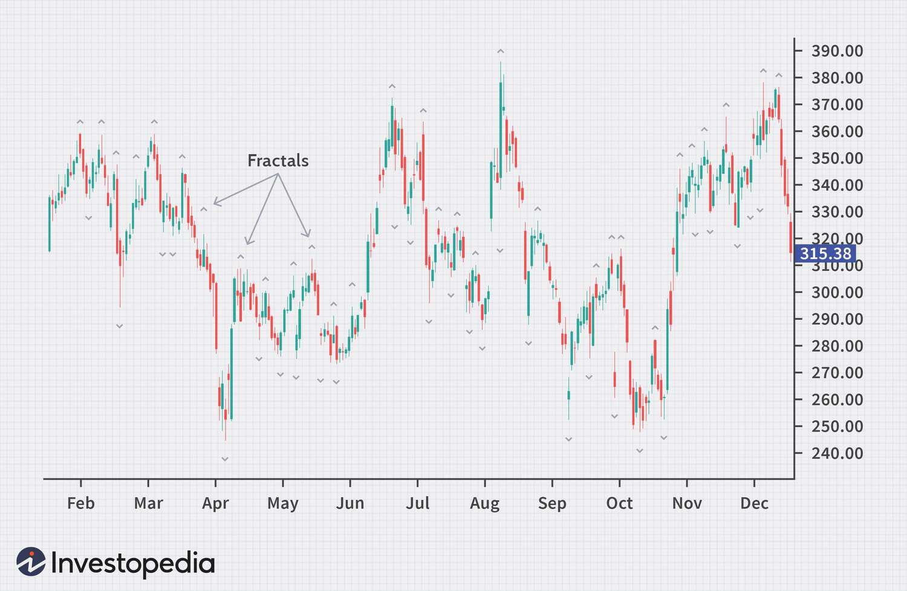

The financial markets are often perceived as complex and unpredictable. Traders continually seek innovative methods to decipher these markets, utilizing various technical tools to identify patterns and signals that can guide their trading strategies. One such tool is the fractal indicator, which is based on the mathematical concept of self-similarity. This concept involves patterns repeating at different scales, a phenomenon visible in nature, such as in the structure of snowflakes or coastlines, and is now applied in analyzing market charts.

The fractal indicator is adept at identifying potential reversals in price movements, offering traders an additional layer of market insight. It works by highlighting pivot points in the market, where the price trend could potentially shift. Recognizing these pivotal points allows traders to make more informed decisions, potentially enhancing the accuracy of their trade entries and exits.



Understanding how fractals function involves learning how they are calculated and how they should be interpreted within the broader context of market analysis. This knowledge aids traders in distinguishing between significant market shifts and minor fluctuations, offering strategic advantages when incorporated into trading strategies. Furthermore, the integration of fractals into algorithmic trading systems showcases their utility in automating trade decisions, reducing the influence of human emotion and error. 

Overall, the fractal indicator serves as a potent tool for traders aiming to refine their market analysis and improve their strategic approach to trading. Its application is not confined to isolated use but can be enhanced when combined with other analytical methodologies, providing a more comprehensive view of market dynamics.

## Table of Contents

## Understanding the Fractal Indicator

A fractal, within the context of financial markets, serves as a pivotal indicator for identifying potential reversals in price trends. It operates as a five-bar reversal pattern, wherein the central bar marks a significant pivot point. This concept was popularized by Bill Williams, a trader renowned for his contributions to market analysis through innovative technical indicators. The fractal indicator identifies potential reversals in market prices by examining patterns of high and low points that surround a central peak or trough, providing insights into potential changes in market direction.

The fractal pattern is characterized by its unique structure. For a bullish fractal, the middle bar in a sequence of five consecutive bars represents the lowest low, flanked by two bars on either side with progressively higher lows. Conversely, a bearish fractal is established when the middle bar exhibits the highest high, surrounded by two bars on each side with lower highs. By systematically identifying these patterns, traders can discern potential turning points in market movements, making fractals a crucial component of technical analysis. 

This method of identifying fractals incorporates analyzing price data to spot these five-bar formations, thereby equipping traders with a systematic approach to anticipate market reversals. Due to their objective framework, fractals provide traders with the ability to formulate strategies based on patterns that reflect underlying market psychology and behavior. As such, the [fractal](/wiki/fractal-indicators) indicator becomes an indispensable tool for traders, enhancing their capability to predict future price movements and refine their trading strategies.

## Calculating the Fractal Indicator

The process of calculating the fractal indicator involves identifying specific patterns within a sequence of five consecutive price bars on a chart. In technical analysis, these patterns are used to signal potential reversals in market trends.

To identify a bullish fractal, the central bar within the five-bar sequence must represent the lowest low compared to the two bars preceding and the two bars following it. In mathematical terms, if we represent the price of each bar as $P_n$, then the condition for a bullish fractal at bar $P_3$ in a sequence of five bars $(P_1, P_2, P_3, P_4, P_5)$ is:

$$
P_3 < P_1, P_3 < P_2, P_3 < P_4, P_3 < P_5
$$

Conversely, a bearish fractal is recognized when the middle bar registers the highest high in the sequence. The condition for a bearish fractal at bar $P_3$ is:

$$
P_3 > P_1, P_3 > P_2, P_3 > P_4, P_3 > P_5
$$

These formations provide traders with visual cues for identifying potential entry and [exit](/wiki/exit-strategy) points. Specifically, a bullish fractal suggests a possible upward reversal, signaling a potential buy opportunity, whereas a bearish fractal indicates a potential downward reversal, suggesting a possible sell opportunity.

For traders using computational tools, these fractals can be algorithmically calculated using programming languages such as Python. Below is a simple Python function to identify bullish and bearish fractals in a sequence of price data:

```python
def identify_fractals(price_data):
    bullish_fractals = []
    bearish_fractals = []

    for i in range(2, len(price_data) - 2):
        # Check for a bullish fractal
        if price_data[i] < price_data[i-1] and price_data[i] < price_data[i-2] and price_data[i] < price_data[i+1] and price_data[i] < price_data[i+2]:
            bullish_fractals.append(i)

        # Check for a bearish fractal
        if price_data[i] > price_data[i-1] and price_data[i] > price_data[i-2] and price_data[i] > price_data[i+1] and price_data[i] > price_data[i+2]:
            bearish_fractals.append(i)

    return bullish_fractals, bearish_fractals

# Example usage:
# price_data = [ ... ] # List of price data
# bullish, bearish = identify_fractals(price_data)
```

This function systematically checks each sequence of five consecutive bars in the price data to identify whether a bullish or bearish fractal is present, thereby aiding traders in recognizing potential market reversals. The visual cues provided by these fractals can be crucial in determining strategic moments for market entry and exit.

## Incorporating Fractals into Trading Strategies

Fractals are a vital component in developing robust trading strategies, particularly when they are integrated with other technical indicators. By combining fractals with moving averages, Fibonacci retracement levels, or the alligator indicator, traders can enhance the accuracy of their signals, allowing for better validation of potential reversals or ongoing trends. This integration helps to filter out noise, providing clearer insights into market dynamics.

A common approach involves using fractals in conjunction with moving averages. The moving average helps identify the direction of the trend, while fractals can indicate potential points of reversal within that trend. For instance, if a bullish fractal forms above a long-term moving average, it could signal a potential buy opportunity, anticipating a reversal to an upward trend.

Fibonacci retracement levels are another effective tool when paired with fractals. These levels indicate potential support and resistance zones based on the prior price movement's percentage retracements. When fractal patterns emerge around these key levels, it may strengthen the likelihood of a reversal. For example, a bearish fractal forming near a Fibonacci retracement level suggests a strong resistance point, potentially signaling a sell opportunity.

The alligator indicator, introduced by Bill Williams, is particularly complementary to fractals given their shared theoretical foundation. The alligator uses smoothed moving averages to identify whether the market is trending or consolidating. In a trending market, fractals can serve as entry or exit signals. For example, during an upward trend indicated by the alligator, the appearance of a bullish fractal aligns with potential trend continuance, encouraging a buy decision.

Traders also frequently observe fractal formations at significant support or resistance levels. These are key areas where price action has historically reversed, representing zones of high buying or selling interest. Spotting a fractal at these levels offers a warning that the market could bounce or break from these points, providing strategic entry or exit opportunities.

In incorporating fractals into trading strategies, traders often employ algorithms to efficiently process and analyze these indicators. An algorithm may systematically identify and execute trades based on conditions involving fractal formations and corroborating signals from other indicators. The blend of human intuition and algorithmic precision allows traders to navigate complex market landscapes more effectively.

## The Role of Fractals in Algorithmic Trading

In [algorithmic trading](/wiki/algorithmic-trading), fractals play a crucial role in enhancing automated trading strategies. These indicators, derived from the concept of self-similarity, can be seamlessly integrated into algorithmic systems to facilitate the identification of potential trading opportunities rooted in historical price patterns and trend reversals.

Fractals are typically identified through specific patterns in price data, highlighting potential pivot points in a market. These points are characterized by a series of bars, where a central bar is surrounded by bar patterns indicating a peak or trough. This distinctive pattern recognition makes fractals highly valuable for algorithmic applications, providing traders with automated tools to interpret historical data for future market movements.

Integrating fractals into algorithmic systems involves programming these patterns into trading algorithms. By doing so, the systems can autonomously recognize bullish or bearish fractals and execute trades based on predefined criteria. The automation of such processes serves to reduce human error, a [factor](/wiki/factor-investing) that often influences trading outcomes, and enhances decision-making efficiency across diverse market conditions.

To implement fractals into trading algorithms, traders can utilize platforms such as Python, which offers libraries like Pandas for data analysis and [backtesting](/wiki/backtesting). For instance, once the five-bar fractal pattern is defined within the system, the algorithm can be programmed to execute buy or sell orders when specific fractal patterns manifest in real-time market data.

Here's a basic example of how a fractal pattern might be identified in Python:

```python
import pandas as pd

def find_fractals(data):
    """
    Function to identify fractals in price data.
    A '1' will indicate a bullish fractal, while a '-1' indicates a bearish fractal.
    """
    fractals = []

    for i in range(2, len(data)-2):
        if data['High'][i-2] < data['High'][i] > data['High'][i+2]:
            fractals.append(-1)  # Bearish fractal
        elif data['Low'][i-2] > data['Low'][i] < data['Low'][i+2]:
            fractals.append(1)  # Bullish fractal
        else:
            fractals.append(0)  # No fractal

    return fractals

# Sample dataframe
data = pd.DataFrame({
    'High': [1, 2, 3, 4, 5, 4, 3, 2, 1],
    'Low': [1, 1.5, 2.5, 3.5, 4.5, 3.5, 2.5, 1.5, 1]
})

fractals = find_fractals(data)
print(fractals)
```

The objective is to systematically enhance the precision of trade execution through automation, taking advantage of the fractal indicator's ability to predict potential reversals. This method not only streamlines the trading process but also allows for the development of sophisticated strategies that can operate continuously, responding to market changes with minimal lag.

Despite the benefits, traders should be cautious of the limitations inherent to fractals, as they are lagging indicators reliant on historical data, which can sometimes lead to false signals, especially in highly volatile markets. Therefore, a comprehensive approach that combines fractals with other technical indicators is advisable to ensure robust trading algorithms.

## Advantages and Limitations of Using Fractals

Fractals provide traders with a systematic framework to identify potential reversals in market trends, thereby offering clarity in trend analysis. This clarity stems from the self-similar nature of fractals, which can manifest across various time frames. The consistent recurrence of fractal patterns makes them reliable signals for potential market pivot points. By identifying these patterns, traders can make informed decisions regarding entry and exit points, potentially enhancing their trading accuracy.

Despite these advantages, fractals come with inherent limitations. As a lagging indicator, fractals are based on historical price data. This reliance on past data means that while they can confirm a trend reversal after it has occurred, they are not predictive in nature. Consequently, fractals might generate false signals, particularly in highly volatile markets where price fluctuations are frequent and pronounced. The inherent delay in signal confirmation could result in missed opportunities or erroneous trade decisions.

To mitigate the limitations of fractals as stand-alone indicators, traders often use them in conjunction with other technical analysis tools. For instance, combining fractals with moving averages or Fibonacci retracement levels can enhance the precision of the signals. Such combinations help validate potential reversals and confirm ongoing trends, offering a more robust analytical framework. This multi-indicator approach allows traders to interpret market movements more holistically, leveraging the strengths of each tool while compensating for their individual weaknesses.

Overall, while fractals are valuable for identifying potential market reversals, their effectiveness is contingent upon their integration with complementary analytical techniques. Traders must remain vigilant to the possibility of false signals, particularly during volatile market conditions, and employ a diversified approach to technical analysis to enhance their strategic outcomes.

## Conclusion

The fractal indicator serves as a powerful tool for traders aiming to identify potential reversal points and refine their trading strategies. Its utility lies in its ability to highlight possible pivots in market price, providing traders with a systematic approach to analyzing trends. However, relying solely on the fractal indicator may not yield optimal results. Much like any technical analysis tool, its effectiveness is amplified when used in conjunction with other methods such as moving averages, Fibonacci retracement levels, or the alligator indicator.

By integrating the fractal indicator with additional analysis techniques, traders can significantly enhance their market insights. This integration helps validate signals, confirm ongoing trends, and identify critical support and resistance levels. Importantly, understanding both the capabilities and limitations of fractals is crucial for traders. As a lagging indicator, fractals depend on historical data and may yield false signals, particularly in volatile market conditions. Hence, a thoughtful and measured approach to their incorporation within a broader trading methodology is essential.

Traders should approach the fractal indicator as a complementary tool rather than a standalone solution. By weaving it into a comprehensive analysis framework, traders can unlock its full potential, improving the precision and robustness of their market evaluations and, ultimately, their trading outcomes.

## References & Further Reading

[1]: Williams, B. (1998). ["Trading Chaos: Maximize Profits with Proven Technical Techniques"](https://www.amazon.com/Trading-Chaos-Maximize-Technical-Techniques/dp/0471463086). John Wiley & Sons.

[2]: Mandelbrot, B. B. (1982). ["The Fractal Geometry of Nature"](https://archive.org/details/fractalgeometryo00beno). W. H. Freeman and Company.

[3]: Pring, M. J. (1991). ["Technical Analysis Explained"](https://archive.org/details/technicalanalysi00prin). McGraw-Hill Education.

[4]: Murphy, J. J. (1999). ["Technical Analysis of the Financial Markets: A Comprehensive Guide to Trading Methods and Applications"](https://archive.org/details/technicalanalysi0000murp). New York Institute of Finance.

[5]: Aronson, D. R. (2007). ["Evidence-Based Technical Analysis: Applying the Scientific Method and Statistical Inference to Trading Signals"](https://onlinelibrary.wiley.com/doi/book/10.1002/9781118268315). Wiley.