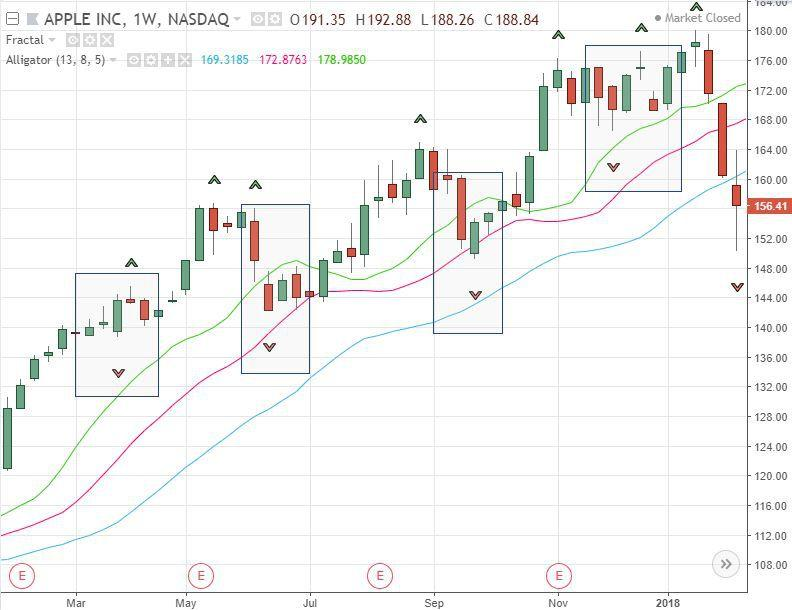

## Table of Contents

## What is the Fractal Indicator in trading?

The Fractal Indicator is a tool used in trading to help spot possible turning points in the price of a financial asset, like stocks or currencies. It was created by a famous trader named Bill Williams. The indicator looks for a pattern made up of five candles or bars on a chart. If the middle candle is higher than the two candles on either side of it, it's called a bullish fractal. If the middle candle is lower than the two candles on either side, it's called a bearish fractal. Traders use these fractals to try and predict where the price might go next.

When traders see a bullish fractal, they might think the price will start going up soon, so they could decide to buy. On the other hand, if they see a bearish fractal, they might think the price will start going down, so they could decide to sell. However, the Fractal Indicator is not perfect and should be used with other tools and analysis to make better trading decisions. It's important for traders to remember that no single indicator can predict the market perfectly, but using fractals can be a helpful part of a bigger trading strategy.

## How does the Fractal Indicator work?

The Fractal Indicator works by looking at the price chart to find a special pattern made of five candles or bars. This pattern is called a fractal. For a bullish fractal, the middle candle must be higher than the two candles on both sides of it. For a bearish fractal, the middle candle must be lower than the two candles on both sides. When the indicator finds these patterns, it puts a symbol on the chart to show traders where they are. This helps traders see possible places where the price might turn around.

Traders use these fractals to guess where the price might go next. If they see a bullish fractal, they might think the price will start to go up, so they could decide to buy. If they see a bearish fractal, they might think the price will start to go down, so they could decide to sell. But, the Fractal Indicator is not perfect. It's best to use it with other tools and information to make better trading choices. No single tool can predict the market perfectly, but the Fractal Indicator can be a helpful part of a trader's plan.

## What are the basic components of a fractal pattern?

A fractal pattern in trading is made up of five candles or bars on a price chart. For a bullish fractal, the middle candle must be higher than the two candles on each side of it. This means the middle candle is the highest point in the pattern. For a bearish fractal, the middle candle must be lower than the two candles on each side of it. This means the middle candle is the lowest point in the pattern.

Traders look for these patterns because they think they can show where the price might change direction. When they see a bullish fractal, they might think the price will start going up soon. When they see a bearish fractal, they might think the price will start going down. But, traders need to use other tools too because the fractal pattern alone is not always right.

## How can beginners identify fractals on a price chart?

Beginners can identify fractals on a price chart by looking for a special pattern made up of five candles or bars. For a bullish fractal, the middle candle needs to be higher than the two candles on both sides of it. Imagine the middle candle sticking up like a little mountain peak, with the candles around it being lower. This pattern suggests that the price might start going up soon. On the other hand, for a bearish fractal, the middle candle needs to be lower than the two candles on both sides of it. Picture the middle candle dipping down like a little valley, with the candles around it being higher. This pattern suggests that the price might start going down soon.

To make it easier, many trading platforms have tools that can automatically find and mark these fractals on the chart for you. These tools will put a symbol, like an arrow or a dot, right above the highest point of a bullish fractal or below the lowest point of a bearish fractal. This way, you don't have to search for the pattern yourself. Remember, while fractals can give you hints about where the price might go next, they're not always right. It's a good idea to use them along with other tools and information to make better trading decisions.

## What is the significance of fractals in technical analysis?

Fractals are important in technical analysis because they help traders spot possible turning points in the price of an asset. A fractal is a pattern made of five candles or bars on a chart. If the middle candle is higher than the two candles on each side, it's a bullish fractal, suggesting the price might start going up. If the middle candle is lower than the two candles on each side, it's a bearish fractal, hinting that the price might start going down. Traders use these patterns to make guesses about where the price will move next, helping them decide when to buy or sell.

While fractals can be useful, they're not perfect and shouldn't be the only tool traders use. It's important to combine fractals with other indicators and analysis to get a better picture of the market. No single tool can predict the market perfectly, but fractals can be a helpful part of a bigger trading strategy. By understanding and using fractals, beginners and experienced traders alike can improve their chances of making smart trading decisions.

## How can the Fractal Indicator be used to set stop-loss orders?

The Fractal Indicator can help traders set stop-loss orders by showing them where the price might turn around. A stop-loss order is like a safety net that tells your trading platform to sell your asset if the price drops to a certain level. When you see a bearish fractal, which means the middle candle is lower than the two candles on each side, you can set your stop-loss just above the highest point of that fractal. This way, if the price goes up instead of down like you expected, your stop-loss will kick in and help you avoid losing too much money.

On the other hand, if you see a bullish fractal, where the middle candle is higher than the two candles on each side, you can set your stop-loss just below the lowest point of that fractal. This helps protect your trade if the price starts to go down instead of up. By using fractals to set your stop-loss orders, you can manage your risk better and make sure you don't lose more money than you're comfortable with. Remember, though, fractals are just one tool, and it's good to use them along with other indicators to make the best trading decisions.

## What are the common strategies for trading with the Fractal Indicator?

One common strategy for trading with the Fractal Indicator is to use it to find entry points. When you see a bullish fractal, which means the middle candle is higher than the two candles on each side, you might want to buy the asset. You can wait for the price to go above the highest point of the fractal before you buy. This can help make sure the price is really starting to go up. On the other hand, if you see a bearish fractal, where the middle candle is lower than the two candles on each side, you might want to sell the asset. You can wait for the price to go below the lowest point of the fractal before you sell. This can help make sure the price is really starting to go down.

Another strategy is to use the Fractal Indicator along with other indicators to make better trading decisions. For example, you can use fractals with the Alligator Indicator, which was also created by Bill Williams. If you see a bullish fractal and the Alligator lines are moving apart, it can be a strong sign that the price will go up. If you see a bearish fractal and the Alligator lines are moving together, it can be a strong sign that the price will go down. By combining fractals with other tools, you can get a clearer picture of what the market might do next.

Remember, while the Fractal Indicator can be helpful, it's not perfect. It's important to use it as part of a bigger trading plan and not rely on it alone. No single tool can predict the market perfectly, but using fractals can help you make smarter trading choices.

## How can the Fractal Indicator be combined with other technical indicators for better results?

The Fractal Indicator can be combined with other technical indicators to give traders a clearer picture of the market and make better trading decisions. One popular combination is using fractals with the Alligator Indicator, also created by Bill Williams. When you see a bullish fractal and the Alligator lines are spreading apart, it's a strong sign that the price might start going up. On the other hand, if you see a bearish fractal and the Alligator lines are coming together, it's a strong sign that the price might start going down. By looking at both indicators together, you can feel more confident about when to buy or sell.

Another useful combination is using fractals with the Moving Average Convergence Divergence (MACD) indicator. If you see a bullish fractal and the MACD line crosses above the signal line, it can be a good time to buy because it suggests the price is likely to go up. If you see a bearish fractal and the MACD line crosses below the signal line, it can be a good time to sell because it suggests the price is likely to go down. Combining fractals with the MACD can help you spot trends and make smarter trading choices. Remember, no single indicator is perfect, but using them together can help you understand the market better and improve your trading strategy.

## What are the limitations and potential pitfalls of using the Fractal Indicator?

The Fractal Indicator can be helpful, but it has some limitations. One big problem is that fractals often show up after the price has already started to move. This means you might miss the best time to buy or sell because the fractal appears too late. Also, fractals can give you false signals. Sometimes, you might see a fractal that looks like the price will go up or down, but then the price does the opposite. This can lead to bad trading decisions and losses if you rely only on fractals.

Another issue is that fractals work best when used with other tools. If you only use the Fractal Indicator, you might not get a full picture of what the market is doing. It's important to combine fractals with other indicators like the Alligator or MACD to make better trading choices. Also, markets can be unpredictable, and no single tool can predict them perfectly. So, while fractals can be a useful part of your trading plan, they shouldn't be the only thing you use to make decisions.

## How can advanced traders optimize the Fractal Indicator settings for different markets?

Advanced traders can optimize the Fractal Indicator settings by adjusting the number of candles or bars used to identify fractals. In fast-moving markets like forex or cryptocurrencies, traders might want to use a smaller number of candles, like three or four, to spot fractals more quickly. This can help them catch trends earlier and make faster trading decisions. On the other hand, in slower-moving markets like stocks or commodities, traders might use the standard five candles or even more to make sure the fractals they see are strong and reliable. By changing the number of candles, traders can better fit the Fractal Indicator to the speed and nature of the market they're trading in.

Another way advanced traders can optimize the Fractal Indicator is by combining it with different time frames. For example, they might look for fractals on both a short-term chart, like a 15-minute chart, and a longer-term chart, like a daily chart. If they see a bullish fractal on both time frames, it can be a strong sign that the price will go up. This can give them more confidence in their trading decisions. By using the Fractal Indicator on different time frames, traders can get a better sense of the overall trend and make more informed choices about when to buy or sell.

## Can the Fractal Indicator be used effectively in automated trading systems?

The Fractal Indicator can be used in automated trading systems to help make trading decisions without a person having to watch the market all the time. In these systems, the computer can be set up to look for fractals on the price chart and then automatically buy or sell based on what it sees. For example, if the system spots a bullish fractal, it can be programmed to buy the asset right away or wait until the price goes above the highest point of the fractal. This can help traders catch trends and make trades even when they're not watching the market.

However, using the Fractal Indicator in automated trading systems has some challenges. Fractals often show up after the price has already started to move, which means the system might buy or sell too late. Also, fractals can give false signals, making the system trade when it shouldn't. To make the system work better, traders can combine the Fractal Indicator with other tools like the Alligator or MACD. This can help the system make smarter decisions and avoid some of the pitfalls of using fractals alone.

## What are some real-world examples of successful trades using the Fractal Indicator strategy?

One real-world example of a successful trade using the Fractal Indicator happened in the forex market. A trader was watching the EUR/USD pair and saw a bullish fractal form on the daily chart. The middle candle of the fractal was higher than the two candles on each side. The trader decided to wait for the price to move above the highest point of the fractal before buying. A few days later, the price did move up, and the trader made a profit when they sold the EUR/USD pair at a higher price.

Another example comes from the stock market. A trader was looking at the chart for a tech company's stock and noticed a bearish fractal. The middle candle was lower than the two candles on each side, suggesting the price might go down. The trader waited for the price to drop below the lowest point of the fractal before selling the stock. As expected, the price fell over the next few days, and the trader was able to buy back the stock at a lower price, making a profit on the trade.

## References & Further Reading

[1]: Bergstra, J., Bardenet, R., Bengio, Y., & Kégl, B. (2011). ["Algorithms for Hyper-Parameter Optimization."](https://dl.acm.org/doi/10.5555/2986459.2986743) Advances in Neural Information Processing Systems 24.

[2]: ["Advances in Financial Machine Learning"](https://www.amazon.com/Advances-Financial-Machine-Learning-Marcos/dp/1119482089) by Marcos Lopez de Prado

[3]: ["Evidence-Based Technical Analysis: Applying the Scientific Method and Statistical Inference to Trading Signals"](https://www.amazon.com/Evidence-Based-Technical-Analysis-Scientific-Statistical/dp/0470008741) by David Aronson

[4]: Williams, B. (1998). ["Trading Chaos: Maximize Profits with Proven Technical Techniques."](https://www.amazon.com/Trading-Chaos-Maximize-Technical-Techniques/dp/0471463086) Wiley.

[5]: Mandelbrot, B. B. (1983). ["The Fractal Geometry of Nature."](https://pubs.aip.org/aapt/ajp/article/51/3/286/1052155/The-Fractal-Geometry-of-Nature) W. H. Freeman and Company.

[6]: ["Machine Learning for Algorithmic Trading"](https://github.com/stefan-jansen/machine-learning-for-trading) by Stefan Jansen

[7]: ["Quantitative Trading: How to Build Your Own Algorithmic Trading Business"](https://books.google.com/books/about/Quantitative_Trading.html?id=j70yEAAAQBAJ) by Ernest P. Chan

[8]: Pring, M. J. (2002). ["Technical Analysis Explained."](https://www.amazon.com/Technical-Analysis-Explained-Fifth-Successful/dp/0071825177) McGraw-Hill Education.