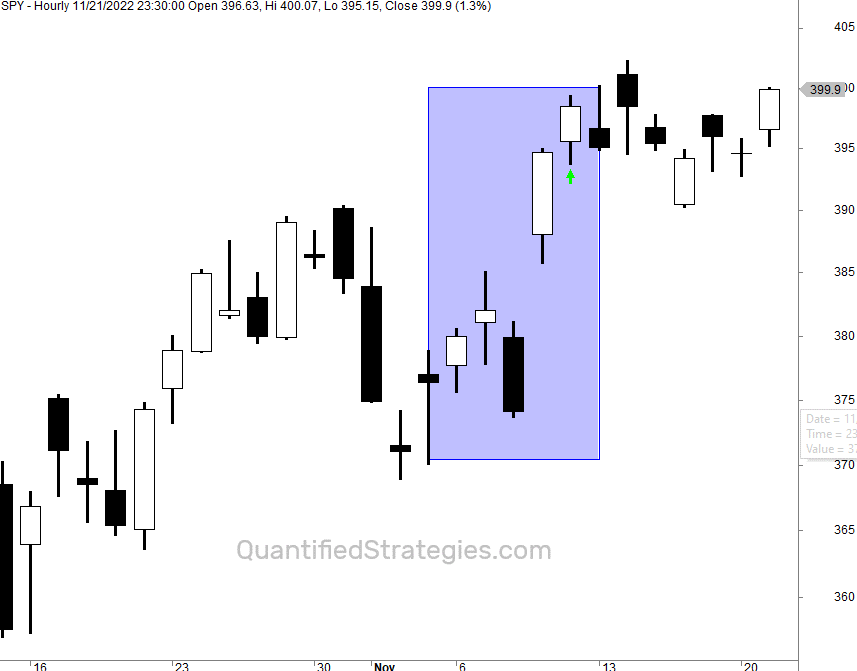

Algorithmic trading, often referred to as algo trading, is a method where complex algorithms execute trades in financial markets based on various technical indicators. This automated approach is designed to enhance trading efficiency and decision-making by systematically analyzing market data and executing trades at optimal times. One of the technical indicators that has gained considerable traction among traders is the fractals indicator, which plays a critical role in identifying potential turning points in the market.

The fractals indicator helps traders to recognize potential market reversals by analyzing patterns within price movements. It is based on the identification of peaks and troughs in price data, serving as a visual aid for spotting market trends. This indicator stands out not only due to its simplicity but also because of its adaptability across different market conditions and timeframes, making it a versatile tool in a trader's toolkit.

This article will focus on the integration and significance of the fractals indicator in algorithmic trading tactics. By examining its core principles and applications, traders can effectively harness its potential within their trading strategies. This includes understanding how fractals can be synchronized with other technical indicators and how their systematic use can refine trading algorithms. Practical insights and suggestions will also be discussed for enhancing the use of fractals in algo trading.

## Table of Contents

## Understanding the Fractals Indicator

The fractals indicator is designed to identify potential turning points in the financial markets. At its core, it involves a specific pattern formation consisting of five consecutive bars or candlesticks. To identify a bullish fractal, where a market reversal to the upside is anticipated, the formation requires the first and last two bars to have lower highs than the central, third bar, which marks the highest point. Conversely, a bearish fractal, suggesting a market reversal to the downside, is identified by the first and last two bars having higher lows than the middle third bar, which represents the lowest point.

The concept of fractals in trading is borrowed from the mathematical field, where fractals are understood as structures exhibiting self-similarity across different scales. This aligns with the notion that financial markets display fractal characteristics, producing similar patterns on various timeframes. Fractals in nature and mathematics are described by recursive patterns that are infinitely complex; however, in trading, the focus is on recognizing these repetitive but simplified formations to predict potential market shifts.

Due to their repeating nature, fractals provide a way to navigate the perceived chaos of market behavior. The detection of fractals aims to reveal underlying patterns that might not be immediately apparent in price movements. This approach can be advantageous for traders as it offers a way to perceive market structure systematically, helping them distinguish between random noise and actionable signals. While the identification of these patterns may seem straightforward, their application requires consideration of the broader market context and often, integrating them with additional indicators or analysis techniques to validate potential signals.

## Application of Fractals in Algorithmic Trading

Algorithmic trading, or algo trading, incorporates the fractals indicator to detect market trends and autonomously execute trades based on predefined criteria. The fractals indicator identifies potential turning points in the market by highlighting patterns of peaks and troughs in price movements. When integrated into trading algorithms, fractals can offer valuable insights into market trends, supporting more informed decision-making.

Traders often enhance the effectiveness of fractals by combining them with other technical indicators, such as moving averages. Moving averages help smooth out price data to identify the prevailing trend direction. When used together with fractals, moving averages can confirm potential trend reversals or continuations, thereby creating a more robust trading algorithm. For instance, if a [fractal](/wiki/fractal-indicators) pattern indicates a bullish reversal and is supported by a moving average crossover, the algorithm may trigger a buy order.

Automation in trading strategies using fractal patterns minimizes the influence of human emotions such as fear and greed, which often lead to inconsistent decision-making. By enforcing discipline and consistency, automated systems driven by fractal signals maintain a systematic approach to trading, potentially increasing the probability of successful trades.

Backtesting fractal-based algorithms is a critical step in developing and refining trading strategies. This involves applying fractal-based trading algorithms on historical market data to assess how these strategies would have performed in the past. Through [backtesting](/wiki/backtesting), traders can evaluate the accuracy of fractal indicators in predicting market movements, identify potential weaknesses, and make necessary adjustments. The results from backtesting inform traders whether the algorithm can be expected to yield profitable outcomes under various market conditions.

By efficiently integrating fractals into algo trading, traders can potentially increase the success rate of their trades. However, like all technical indicators, fractals are not infallible and should be used in conjunction with other analysis tools. As trading technologies advance, incorporating [machine learning](/wiki/machine-learning) techniques could further enhance the capability of fractal-based algorithms to adapt to ever-changing market dynamics.

## Combining Fractals with Other Indicators

Fractals often serve as a confirming indicator rather than a standalone tool in trading systems. By integrating fractals with other technical indicators, traders can enhance signal accuracy and strengthen their trading algorithms. One common combination is the use of fractals with the Alligator indicator, developed by Bill Williams. The Alligator indicator, consisting of three smoothed moving averages, helps identify the absence of a trend, the formation of a trend, and the direction and strength of that trend. When fractals are used alongside the Alligator indicator, traders can verify potential reversal points indicated by fractals with the trend information provided by the Alligator.

Another effective combination involves using fractals with Fibonacci retracement levels, a popular tool for identifying potential support and resistance levels in financial markets. Fibonacci retracement levels are calculated by taking two extreme points on a chart and dividing the vertical distance by key Fibonacci ratios, commonly 23.6%, 38.2%, 50%, 61.8%, and 100%. By aligning fractal signals with these levels, traders can gain additional confirmation for potential reversals, thus enhancing the accuracy of their trading decisions.

Moreover, combining fractals with [momentum](/wiki/momentum) oscillators, such as the Relative Strength Index (RSI) or the Moving Average Convergence Divergence (MACD), and [volume](/wiki/volume-trading-strategy) analysis can provide deeper insights into market condition dynamics. Momentum oscillators measure the speed and change of price movements, while volume analysis helps determine the strength of a price movement. By analyzing these indicators together with fractals, traders can further validate reversal signals and improve the timing of their entry and [exit](/wiki/exit-strategy) points, thus increasing the reliability of trading decisions.

The synergy achieved by integrating fractals with these supplementary indicators can lead to more precise entry and exit decisions, significantly boosting the robustness and profitability of [algorithmic trading](/wiki/algorithmic-trading) systems. This multi-faceted approach ensures that each trading signal is supported by a comprehensive analysis, reducing the likelihood of false positives and improving overall decision-making in volatile and unpredictable markets.

## Advantages and Limitations of Using Fractals

The fractals indicator stands out in technical analysis due to its visual simplicity, facilitating the identification of potential market reversals. It offers a straightforward method for traders to recognize changes in market direction, represented by peaks and troughs in the price chart. This simplicity makes it an accessible tool for both novice and experienced traders.

One significant advantage of the fractals indicator is its broad applicability. It can be used effectively across various markets, including equities, [forex](/wiki/forex-system), and commodities, as well as across different time frames. This versatility allows traders to integrate fractals into diverse trading strategies, enhancing their decision-making processes. By applying the fractals indicator in multiple contexts, traders can better adapt their strategies to suit specific market conditions or trading styles.

Despite its advantages, the fractals indicator is a lagging indicator, which is one of its notable limitations. It identifies a pattern only after the completion of five bars, confirming a pattern with a delay of two additional bars beyond the identified fractal. This delay can lead to late signals, as the market might already have moved significantly by the time a fractal is confirmed. Consequently, traders might miss optimal entry or exit points, impacting their trading performance.

Furthermore, due to the frequent appearance of fractal-like patterns in market data, the indicator may occasionally generate false positives. This can lead traders to make potentially erroneous trades based on incorrect signals. To mitigate this limitation, it is advisable to use the fractals indicator in conjunction with other technical indicators, such as moving averages or momentum oscillators, to provide additional market context and confirm trading signals.

By incorporating the fractals indicator into a broader analytical framework, traders can increase the reliability of their trading decisions. This approach helps not only to minimize the shortcomings inherent in using fractals alone but also to maximize their strengths, contributing to more successful trading outcomes.

## Practical Tips for Implementing Fractals

To effectively implement the fractals indicator in algorithmic trading, traders must regularly review and adjust their strategies to adapt to the ever-evolving market conditions. Market environments constantly shift due to various factors, including economic data releases, geopolitical events, and changes in investor sentiment, necessitating updates to trading algorithms. Monitoring these changes and integrating them into trading strategies ensures that the algorithms remain effective and responsive to new patterns.

Relying solely on fractals for trading decisions is not advisable because fractals are lagging indicators and may produce false positives. They should be used in conjunction with other technical indicators such as moving averages, momentum oscillators, or Fibonacci retracements to perform a more comprehensive analysis of market trends and signals. This combination helps create a robust trading system that can provide more reliable entry and exit points, minimizing the risks associated with using a single indicator.

Keeping abreast of technological advancements is crucial, as innovations like machine learning can significantly enhance fractal-based algorithms. Machine learning models can analyze vast amounts of data and identify complex patterns that might not be evident through traditional technical analysis. By incorporating machine learning techniques, traders can refine fractal signals, optimize parameter settings, and potentially improve the accuracy and efficacy of their trading strategies. For instance, Python libraries such as TensorFlow or scikit-learn can be implemented to build and test machine learning models for such purposes.

Engaging with trading communities and educational resources further aids in developing a deeper understanding and more effective application of the fractals indicator. Online forums, webinars, and articles can offer insights from other traders' experiences and strategies. This interaction facilitates knowledge sharing and helps traders stay updated with the latest trends and methods. Participation in these communities can also provide support, keep traders motivated, and inspire new ideas to integrate into their algorithmic trading strategies.

## Conclusion

The fractals indicator is a valuable tool for algorithmic traders, providing insights into potential market reversals that can enhance trading strategies. By understanding its role and leveraging its strengths with other technical indicators, traders can incorporate the fractals indicator into their trading algorithms to develop more robust strategies. Python, for instance, offers libraries like Pandas and NumPy, which can be used to implement the fractals indicator alongside other technical tools to automate trading systems efficiently.

Despite its advantages, the fractals indicator has limitations, primarily as a lagging indicator that can confirm patterns only after two additional bars. This inherent delay can result in late signals, necessitating its combination with other indicators to improve accuracy. Using complementary tools mitigates false positives, providing more reliable decision-making in trading situations.

Algorithmic trading is an evolving domain where continual learning and adaptation are essential. As technology and market dynamics progress, traders must stay informed and integrate advancements, such as machine learning, to refine their strategies further. Engaging with trading communities and utilizing educational resources can aid traders in enhancing their understanding and application of the fractals indicator, ensuring its effective integration into modern algorithmic trading methodologies. Overall, while the fractals indicator is not without its challenges, its proper application in algo trading can significantly impact traders' decision-making processes and contribute to overall trading success.

## References & Further Reading

[1]: Bergstra, J., Bardenet, R., Bengio, Y., & Kégl, B. (2011). ["Algorithms for Hyper-Parameter Optimization."](https://dl.acm.org/doi/10.5555/2986459.2986743) Advances in Neural Information Processing Systems 24.

[2]: ["Advances in Financial Machine Learning"](https://www.amazon.com/Advances-Financial-Machine-Learning-Marcos/dp/1119482089) by Marcos Lopez de Prado

[3]: ["Evidence-Based Technical Analysis: Applying the Scientific Method and Statistical Inference to Trading Signals"](https://www.amazon.com/Evidence-Based-Technical-Analysis-Scientific-Statistical/dp/0470008741) by David Aronson

[4]: Williams, B. (1998). ["Trading Chaos: Maximize Profits with Proven Technical Techniques."](https://www.amazon.com/Trading-Chaos-Maximize-Technical-Techniques/dp/0471463086) Wiley.

[5]: Mandelbrot, B. B. (1983). ["The Fractal Geometry of Nature."](https://pubs.aip.org/aapt/ajp/article/51/3/286/1052155/The-Fractal-Geometry-of-Nature) W. H. Freeman and Company.

[6]: ["Machine Learning for Algorithmic Trading"](https://github.com/stefan-jansen/machine-learning-for-trading) by Stefan Jansen

[7]: ["Quantitative Trading: How to Build Your Own Algorithmic Trading Business"](https://books.google.com/books/about/Quantitative_Trading.html?id=j70yEAAAQBAJ) by Ernest P. Chan

[8]: Pring, M. J. (2002). ["Technical Analysis Explained."](https://www.amazon.com/Technical-Analysis-Explained-Fifth-Successful/dp/0071825177) McGraw-Hill Education.