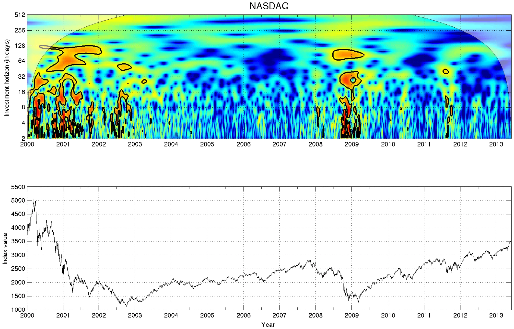

The Fractal Market Hypothesis (FMH) is a conceptual advance in understanding financial markets, especially through the lens of algorithmic trading. Originating from the principles of fractal geometry, FMH offers an innovative approach to deciphering the complexities inherent in financial time series analysis. As opposed to traditional linear models, which often fail to capture the intricate dynamics of markets, FMH posits that market behaviors are characterized by self-affine structures and scaling laws. This perspective allows for a more nuanced analysis of market data, reflecting the complexity and self-organizing characteristics of financial markets.

The application of FMH in algorithmic trading is particularly notable for its potential to enhance market price prediction and risk management strategies. In contrast to the Efficient Market Hypothesis (EMH), which assumes that all known information is already reflected in market prices, FMH acknowledges that markets exhibit memory and patterns that can be analyzed and predicted. This makes FMH a powerful tool for developing predictive models that are better suited to the volatile and ever-changing nature of global markets.



The integration of FMH with other financial hypotheses, such as the EMH, provides a more robust framework for analyzing market dynamics. While EMH suggests markets are inherently unpredictable due to their efficiency, FMH argues that markets do exhibit predictable patterns, often observable through fractal patterns. This blend of insights from different hypotheses allows for a comprehensive understanding of market behaviors and enhances the precision of trading algorithms. 

Overall, this introduction sets the stage for an in-depth exploration of the theoretical underpinnings of FMH and its practical implications in algorithmic trading. By embracing the fractal nature of markets, FMH not only improves market prediction accuracy but also contributes significantly to effective risk assessment, ultimately advancing the field of financial analysis.

## Table of Contents

## Understanding Fractal Market Hypothesis

The Fractal Market Hypothesis (FMH) is a theoretical framework that describes financial markets through the lens of fractal geometry. It posits that markets exhibit self-affine structures, implying that patterns repeat across different scales and that this self-similarity can be harnessed to understand market behaviors more accurately than traditional models. The hypothesis suggests that financial time series are not random but instead possess intrinsic geometrical properties that can be modeled using the principles of fractals.

Self-affinity is a key concept within FMH, where structures are replicated in a similar fashion at various timescales. This contrasts with the Efficient Market Hypothesis (EMH), which assumes that all available information is already reflected in asset prices, rendering them inherently unpredictable and memoryless. In contrast, FMH assumes that market prices contain underlying patterns and structures due to temporal dependencies, suggesting that financial markets have a memory. This means past market behaviors can influence future movements, a notion driven by the fractal nature of market data.

FMH emerged as a response to older models like EMH and the Random Walk Hypothesis, which failed to account for the complex, non-linear dynamics evident in empirical market data. Traditional models typically characterize price movements as random processes, akin to a random walk where the future path is independent of its history. However, real-world data frequently exhibit phenomena such as long-range dependence, [volatility](/wiki/volatility-trading-strategies) clustering, and high kurtosis, indicative of the kind of self-organization and complexity that [fractal](/wiki/fractal-indicators) models are designed to capture.

The FMH framework considers financial time series as expressions of fractal processes, described mathematically by properties such as the Hurst exponent, which quantifies the degree of long-term memory within a time series. A Hurst exponent value above 0.5 suggests a trend-reinforcing or persistent behavior, while a value below 0.5 indicates a mean-reverting or anti-persistent behavior. This aligns with the conceptual foundation of FMH, offering a tool for predicting market dynamics through fractal analysis.

In summary, FMH provides a nuanced view of financial markets by integrating the concept of fractals, highlighting self-affine patterns in financial data, and challenging the notion of market unpredictability championed by models like the Efficient Market Hypothesis. This perspective not only contributes to a richer understanding of market behavior but also presents opportunities for developing more sophisticated models to analyze and predict market trends based on the memory of financial markets.

## Algorithmic Trading and FMH

Algorithmic trading has become a cornerstone of modern financial markets, where speed, precision, and adaptability are vital. The integration of the Fractal Market Hypothesis (FMH) into these trading systems offers potential enhancements by leveraging the complexity and self-affine nature of financial markets. FMH aids in understanding the underlying structures of market data, providing a framework to develop quantitative and technical strategies that are adaptive to dynamic market conditions.

The application of FMH in [algorithmic trading](/wiki/algorithmic-trading) involves utilizing its principles to construct models that reflect the fractal characteristics of market prices. Unlike traditional trading models that rely on the assumption of normal distribution and independent price movements, FMH-based strategies consider market memory and the scalability of patterns over time. This can be mathematically expressed using concepts like self-affinity, where a financial series $X(t)$ exhibits scaling attributes across different time frames.

One of the significant advantages of incorporating FMH into algorithmic systems is enhancing predictive accuracy. The hypothesis suggests that market prices display fractal properties, which means similar patterns repeat at various scales. Therefore, trading algorithms can be designed to recognize these patterns using fractal dimensions and scaling laws, increasing the models' capability to predict price movements in erratic markets. The models adapt to changes in market behavior more swiftly than traditional models, which are often static.

For instance, a Python-based algorithm might utilize FMH principles by estimating the Hurst exponent, a measure of market memory, from time series data. The code snippet below demonstrates a simple method to calculate the Hurst exponent:

```python
import numpy as np

def calculate_hurst_exponent(series, max_lag=20):
    lags = range(2, max_lag)
    tau = [np.std(np.subtract(series[lag:], series[:-lag])) for lag in lags]
    poly_fit = np.polyfit(np.log(lags), np.log(tau), 1)
    hurst_exponent = poly_fit[0] * 2.0
    return hurst_exponent

# Example usage with a financial time series
price_series = np.random.randn(1000)  # Replace with actual financial data
hurst_exp = calculate_hurst_exponent(price_series)
print("Hurst Exponent:", hurst_exp)
```

In practical applications, FMH has demonstrated success in improving trading strategies. Case studies include its deployment in risk management systems, where FMH's predictive capability has been harnessed to foresee market disruptions and price anomalies. By employing fractal-based indicators, algorithmic trading platforms can adjust their strategies in real-time, effectively managing volatility and enhancing returns.

Overall, the synergy between FMH and algorithmic trading provides a robust structure to handle the complexities and irregularities inherent in financial markets. The use of advanced mathematical models rooted in FMH principles accommodates the non-linear nature of market data, creating a frontier for developing sophisticated trading algorithms capable of outperforming traditional methods.

## Mathematical Framework of FMH

The Fractal Market Hypothesis (FMH) is grounded in mathematical principles that illuminate the complexities inherent in financial market dynamics. A cornerstone of FMH is the concept of self-affinity, which refers to the property of a structure being invariant under different magnifications. This self-affinity is observed in financial time series, where patterns repeat at different scales, a hallmark of fractal geometry. In contrast to linear models, FMH uses fractal dimensions to capture the complexity of financial data and scaling laws to describe how certain quantities change with scale. 

Fractal dimensions provide a quantitative measure of market complexity by describing how the detail in a pattern changes with scale. In financial markets, the fractal dimension can be used to quantify the roughness of a price series. For instance, a higher fractal dimension indicates a more volatile market with price paths that are less predictable. 

Scaling laws are used to describe the relationship between the time scales of market movements and the magnitudes of those movements. In FMH, scaling laws characterize the statistical properties of financial returns over different time frames. This is essential for modeling financial time series as they exhibit heavy tails and volatility clustering, which traditional Gaussian-based models struggle to accommodate.

Key to quantifying market risks within FMH is the Lyapunov Exponent, which measures the sensitivity of a system to initial conditions. A positive Lyapunov Exponent in financial markets suggests chaotic behavior where small changes can lead to significant and unpredictable impacts on market prices. This exponent is crucial for assessing the stability and forecasting potential disruptions in financial markets.

Another vital component is the Lévy Index, which describes the distribution of returns and is instrumental in modeling the probability of extreme price movements. Unlike normal distributions, Lévy distributions can accommodate the fat tails commonly observed in financial data, making them suitable for predicting risk and potential extreme price fluctuations.

In conclusion, the mathematical framework of FMH leverages these complex concepts to model financial markets more accurately than traditional approaches. Through self-affinity, fractal dimensions, scaling laws, the Lyapunov Exponent, and the Lévy Index, FMH provides a robust toolkit for analyzing and predicting market behavior amidst inherent uncertainties.

## Comparative Analysis with Other Market Hypotheses

The Fractal Market Hypothesis (FMH) stands as a significant alternative to traditional financial market models, particularly the Efficient Market Hypothesis (EMH) and the Random Walk Hypothesis (RWH). Unlike these models, which often presuppose that markets are perfectly efficient or follow a stochastic process, FMH incorporates the complexity of market dynamics, driven by self-affinity and fractal structures.

The Efficient Market Hypothesis posits that asset prices reflect all available information, and hence, consistent excess returns are unattainable. However, EMH has faced criticism for its inability to account for observed market anomalies, such as bubbles and crashes, which suggest deviations from pure efficiency. Similarly, the Random Walk Hypothesis asserts that price changes are independent and identically distributed, leading to the unpredictability of future price movements based on past data. This model, however, overlooks the inherent structure and order observed in financial time series data.

FMH addresses these shortcomings by acknowledging that financial markets are characterized by long-range dependencies and memory, contrary to the independence assumption of RWH. This hypothesis suggests that prices exhibit self-affine properties, where market patterns are similar across different time scales—a characteristic inherently connected to fractal geometry. By incorporating concepts such as fractal dimensions and scaling laws, FMH offers a framework that captures the irregular yet structured pattern of market fluctuations.

Moreover, FMH's ability to better account for market anomalies and disruptions emanates from its consideration of multiple time horizons of market participants, their varying investment strategies, and the market's adaptive nature. Market disruptions are not dismissed as mere statistical outliers but are integrated into the market's natural dynamics, allowing for a more robust analysis of risk and volatility.

In conclusion, while traditional hypotheses provide essential foundations for financial theory, FMH extends beyond their limitations by incorporating the intricacies of market dynamics, self-similarity, and non-linear patterns. This positions FMH as a more comprehensive tool for understanding the inherent complexities of financial markets.

## Applications and Case Studies

The Fractal Market Hypothesis (FMH) presents valuable insights and practical applications in financial markets, particularly in the context of risk management and price prediction. FMH asserts that financial markets exhibit self-similar patterns over time and can be better understood and predicted using fractal geometry. This insight has led to innovative approaches in algorithmic trading, where FMH is applied to create more accurate and adaptable trading strategies.

### Practical Applications

One primary application of FMH is in risk management. By recognizing that market prices display fractal properties, financial analysts can better gauge market risks and anticipate potential volatility. The fractal dimension, a key metric in FMH, provides a quantitative measure of market complexity. For instance, in environments where the fractal dimension increases, markets may be experiencing higher levels of noise and potential instability, guiding traders to adopt more conservative positions or hedge their investments accordingly.

For price prediction, FMH offers tools to enhance forecasting models. Traditional models often assume market prices follow a normal distribution, whereas FMH utilizes scaling laws and the concept of self-affinity to capture the heavy tails and irregular fluctuations observed in financial data. This approach allows traders to develop algorithms that can predict significant market shifts more reliably.

### Case Studies

There are several case studies where FMH has been successfully implemented. One example is in the development of adaptive algorithmic trading systems, where [machine learning](/wiki/machine-learning) techniques are integrated with FMH principles. These systems continuously refine their predictive models by analyzing the fractal nature of market data. By doing so, they can adjust trading strategies in response to evolving market conditions, thereby optimizing performance and managing risk more effectively.

Python is often used in these implementations due to its robust libraries and frameworks for data analysis and machine learning. For instance, traders might use Python to calculate the Hurst Exponent, a critical measure in FMH that quantifies the degree of market memory and predictability. Here is a simple Python function to calculate the Hurst Exponent using the rescaled range method:

```python
import numpy as np

def hurst_exponent(time_series):
    N = len(time_series)
    T = np.arange(1, N+1)
    Y = np.cumsum(time_series - np.mean(time_series))
    R = np.maximum.accumulate(Y) - np.minimum.accumulate(Y)
    S = np.std(time_series)
    R_S = R / S
    H = np.polyfit(np.log(T), np.log(R_S), 1)[0]
    return H

# Example usage:
data = np.random.randn(1000)
H = hurst_exponent(data)
print(f'Hurst Exponent: {H}')
```

### Evolution of Trading Strategies

FMH has significantly influenced the evolution of trading strategies by incorporating adaptive techniques that align with the unpredictable nature of financial markets. Machine learning models, such as neural networks and [reinforcement learning](/wiki/reinforcement-learning) [agents](/wiki/agents), have been employed to process vast amounts of market data, identifying fractal patterns and detecting potential shifts in market regimes. These advancements have facilitated the creation of sophisticated algorithms that dynamically adjust to market changes, ensuring that trading decisions are based on real-time insights.

In summary, the application of the Fractal Market Hypothesis in financial markets has proven to be a transformative approach, enhancing risk management and price prediction capabilities. By leveraging the self-similar and fractal characteristics of market data, traders and analysts can develop more effective trading strategies that are resilient to the complexities and uncertainties inherent in financial markets.

## Challenges and Future Directions

The implementation of the Fractal Market Hypothesis (FMH) in financial markets presents a variety of challenges. One of the primary issues is the complexity inherent in modeling market behaviors with fractal geometry. While FMH provides a framework for recognizing self-affine structures in market data, capturing these patterns in real-time poses computational and analytical hurdles. The intricate nature of financial time series data, coupled with the dynamic environment of the markets, means that creating accurate predictive models requires substantial computational power and sophisticated algorithms. 

Additionally, the availability and quality of market data present a significant limitation. Accurate fractal models depend on comprehensive and high-resolution datasets that can effectively highlight the self-similar properties FMH aims to capture. However, obtaining such data is often expensive, and it is frequently subject to privacy constraints and market regulations, limiting researchers' ability to understate FMH thoroughly.

Another challenge lies in the adaptation of existing FMH models, which are often theoretical, to practical applications in live trading environments. Many fractal models assume ideal market conditions, which rarely exist in practice. These models might not adequately account for external factors such as economic events, policy changes, or irrational market behaviors, which can significantly impact market dynamics.

Addressing these challenges, future research directions could explore integrating FMH with advanced machine learning techniques and adaptive algorithms. Machine learning provides the capability to analyze vast datasets and identify complex patterns that traditional analytical methods might overlook. For example, [deep learning](/wiki/deep-learning) models, such as recurrent neural networks (RNNs) and convolutional neural networks (CNNs), could be employed to enhance the pattern recognition capabilities of FMH-based models. Utilizing these tools, researchers could build more robust models that accommodate the ever-changing nature of financial markets.

Furthermore, improving data collection methods is crucial for advancing FMH applications. Innovations in big data analytics and real-time data processing could provide researchers with the comprehensive datasets needed for more precise fractal modeling. Developing collaborative platforms for data sharing across institutions could also contribute to this goal, allowing for a broader understanding and validation of FMH models.

Finally, future work might focus on the integration of FMH with other financial theories, exploring synergies that could yield more comprehensive models of market dynamics. By combining FMH with other hypotheses, such as behavioral finance models, researchers may develop hybrid approaches that better capture the complex and multifaceted nature of financial markets, leading to improved risk management and trading strategies.

## Conclusion

The Fractal Market Hypothesis (FMH) presents a significant advancement over traditional market hypotheses in financial analysis. By incorporating the principles of fractal geometry, FMH offers a nuanced understanding of financial markets as complex, self-organizing systems where price patterns exhibit self-affine structures. This model stands in contrast to the Efficient Market Hypothesis (EMH), which assumes market efficiency and random walk behavior. FMH recognizes the existence of market memory and the layered nature of market participants, providing a more robust framework for interpreting price movements and market fluctuations.

In the context of algorithmic trading, FMH holds considerable potential to enhance the predictive accuracy of trading systems. Its ability to identify self-similar patterns in financial time series allows for a more dynamic response to market changes, effectively addressing anomalies and disruptions that traditional models might overlook. By applying FMH, algorithmic trading strategies can better adapt to varying market conditions, improving risk management and price prediction capabilities.

The integration of FMH into quantitative models has already demonstrated success in various case studies, suggesting a promising avenue for future research and development. Continued exploration of FMH could unlock further insights into market dynamics and contribute to the evolution of more sophisticated trading algorithms. Advancements in computational power and machine learning techniques offer fertile ground for testing and refining FMH-based strategies, potentially transforming the landscape of financial analysis and trading.

In summary, the FMH stands as a pivotal tool in modern financial analysis, offering superior insights into market behavior compared to traditional hypotheses. Its application in algorithmic trading promises to enhance market understanding and strategy development, warranting ongoing research and refinement to fully exploit its potential in advancing financial technologies.

## References & Further Reading

[1]: Peters, Edgar E. ["Fractal Market Analysis: Applying Chaos Theory to Investment and Economics."](https://archive.org/details/fractalmarketana0000pete) John Wiley & Sons, 1994.

[2]: Mandelbrot, Benoit B. ["The (Mis)Behavior of Markets: A Fractal View of Risk, Ruin, and Reward."](https://archive.org/details/misbehaviorofmar00beno) Basic Books, 2004.

[3]: Peters, Edgar E. ["Chaos and Order in the Capital Markets: A New View of Cycles, Prices, and Market Volatility."](https://www.amazon.com/Chaos-Order-Capital-Markets-Volatility/dp/0471139386) John Wiley & Sons, 1996.

[4]: L'Ecuyer, Pierre. ["Efficient and Portable Combined Random Number Generators."](https://dl.acm.org/doi/10.1145/62959.62969) Communications of the ACM, 1988.

[5]: Mantegna, Rosario N., and H. Eugene Stanley. ["An Introduction to Econophysics: Correlations and Complexity in Finance."](https://assets.cambridge.org/052162/0082/sample/0521620082WS.pdf) Cambridge University Press, 1999.

[6]: Fama, Eugene. ["Efficient Capital Markets: A Review of Theory and Empirical Work."](https://www.jstor.org/stable/2325486) The Journal of Finance, 1970.